# Query 성능 분석

이전장에서는 쿼리 성능 데이터 수집하는 방법을 설명했다.  

이번에는 수집한 데이터에서 문제되는 쿼리(장기간 실행되거나 자주 호출되는 쿼리)를 찾아내는 방법을 설명할 것이다. 우리는 SSMS에 내장된 도구를 이용하여 쿼리가 실행되는 방법을 이해할 수 있을 것이다. 이번 장 대부분의 시간동안  실행계획에 설명할 것이며 이는 쿼리 옵티마이저에 의해 만들어지는 최상의 계획이다.

다음과 같은 것을 설명한다.

    - SQL 쿼리의 비용 처리 전략을 SSMS를 이용하여 분석하는 방법
    - 쿼리 옵티마이저가 SQL 쿼리를 분석한 방법을 분석하기
    - T-SQL 명령어를 사용하여 SQL 쿼리의 비용을 측정하는 방법

## <font color='dodgerblue' size="6">9.1 고비용 쿼리</font>

여태까지 우리는 쿼리 성능데이터를 수집하기 위해 두가지 다른 방법을 사용해 왔으니 이제는 데이터가 나타내는 내용을 살펴볼것이다. 고 비용 쿼리같은.

SQL Server의 성능은 언제 나빠질까? 몇가지 경우가 가장 빈번하게 발생한다.

    - 첫째, 어떤 쿼리들은 시스템 리소스에 큰 스트레스를 생성한다. 
      이런 쿼리들은 서버가 감당할수 없을 정도의 부하를 주게되어 전체 시스템의 성능에 영향을 미친다.

    - 둘째, 고비용 쿼리는 같은 데이터베이스 자원을 요청하는 다른 쿼리들을 블로킹하기도 하여 이런 쿼리들의 성능을 저하시킨다. 
      고비용 쿼리들을 최적화하면 자기 스스로도 빨라지지만 데이터베이스 블로킹을 줄여주고 SQL Server 리소스 압박도 감소시킨다.

    - 쿼리에게 전달되는 데이터나 값의 변화는 쿼리의 활동 변화를 발생시키며 성능을 저하시킬수 있다.

    - 마지막으로 그 자체로 비용이 많이 들지 않는 쿼리는 1분에 수천 번 호출될 수 있으며, 
      이는 단순히 최적 코드 미만의 누적으로 인해 주요 리소스 병목 현상으로 이어질 수 있습니다.

가장 비용이 많이 소모되는 쿼리를 결정하려면 지금까지 설명한 것들을 사용해야 한다.  

    - 첫번째는 쿼리가 캐시에 있을 경우, DMO를 사용하여 조사하고 그중 가장 비용이 많이 드는 쿼리를 결정하는 것이다.

    - 두번째는 확장 이벤트를 사용하여 쿼리를 캡처하고 가장 비용이 많이 소모되는 쿼리를 알아내는 것이다.

    - 마지막 세번째로는 SQL Server 2016에서 새롭게 소개된 쿼리 저장소이며 뒤의 다른장에서 자세히 메카니즘을 소개할 것이다.

여기서는 확장 이벤트부터 시작할 것이다.  

쿼리데이터를 캡처하기위한 가장쉽고 직접적인 방법은 현재 캐시에 있는 쿼리를 DMO를 통해서 알아내는 것이지만 불행하게도 이것은 집계된 데이터이고 완전하게 캐시안에 있는 데이터에 의존한다. 뒷장에서 캐시에 대해 얘기할 것이다. 그래서 계층적 레코드를 가지지 않고 저장 프로시저의 각각의 실행 데이터와 그에 따른 파라메터를 얻지 못한다. 쿼리 데이터를 조사하는 다른 쉽고 직접적인 방법은 쿼리 저장소를 이용하는 것인데 DMO보다 보다 완전한 기록을 제공한다. 그러나 집계된 형태는 동일하기 때문에 우리는 세가지 모두를 살펴볼것이지만 그 중 정확도를 위해 확장 이벤트부터 시작할 것이다.

확장 이벤트에서 하나의 작은 주의사항이 있는데 파일로 수집할 경우 수집완료후 테이블로 수집 데이터를 로드할 필요가 있다는 것이다. 시스템 함수를 사용하여 쿼리를 함으로써 확장이벤트 결과 파일에서 바로 읽을 수있는데 이를 통해 별도로 테이블로 데이터를 저정해야 한다.

```sql
SELECT module_guid,
    package_guid,
    object_name,
    event_data,
    file_name,
    file_offset,
    timestamp_utc
FROM sys.fn_xe_file_target_read_file('C:\Sessions\QueryPerformanceMetrics*.xel',
    NULL, NULL, NULL);
```

 함수의 첫번째 파라메터는 확장이벤트결과파일(.xel)의 경로이다. *를 통해 여러개의 파일을 한번에 로드할 수 있다. 두번째 파라메터는 2008R2까지는 사용되었지만 그 이후 버전에서는 사용되지 않는다. 세번째 파라메터는 초기파일명이다. NULL일 경우 경로에 있는 모든 파일을 읽는다. 마지막 파라메터는 오프셋이며 유일한 숫자값이다. 이전에 읽은 마지막 파일의 오프셋이다. 이 값이 지정되면 그 이후번째의 파일부터 읽는다.

 쿼리는 각각의 이벤트를 한개의 로우로 리턴한다. 이벤트에 대한 데이터는 event_data란 XML 컬럼에 저장되는데 XQuery를 이용하여 바로 데이터를 읽을 수 있다. 일단 한번 실행하면 조회하거나 정렬 또는 집계할 수 있다. 이제부터 완전한 예제를 보여줄 것이다.

- ### a. 고비용 쿼리 식별

    SQL Server의 목적은 가장 짧은시간에 결과셋을 리턴하는 것이다. 이렇게 하기 위해서는 SQL Server는 쿼리 최적화기(옵티마이저)라고 불리우는 비용기반 최적화기가 내장되어 있어 쿼리실행계획이라 부르는 비용효율 전략을 생성한다. 옵티마이저는 쿼리를 실행하는 데 필요한 CPU, 메모리 및 디스크 I/O 사용량을 포함하여(이에 국한되지는 않음) 많은 요인에 가중치를 둔다. 이런 모든 요소들은 인덱스에 의해 유지되는 데이터 또는 실시간으로 생성되는 통계, 데이터의 제약조건, 몇가지 시스템의 지식등에 대한 통계와 같은 다양한 소스들로부터 유발되는데 다중CPU와 대량의 메모리와 같은 상황에서 실행된다. 이런 모든 요소들을 고려하여 옵티마이저는 보다 비용 효율적인 실행계획을 만든다.

    세션에서 리턴되는 데이터에서 cpu_time과 logical_reads, physical_reads 필드는 역시 쿼리의 어느부분에서 비용이 발생하는지 보여준다. cpu_time필드는 쿼리를 실행하기 위해서 사용되는 CPU시간을 대표한다. logical_reads와 physical_reads 필드들은 페이지(8KB크기)의 숫자를 나타내는데 쿼리에의해 발생하는 메모리 I/O 스트레스의 양을 지칭한다.  

    그것들은 역시 디스크 스트레스를 지칭하는데 실행중인 쿼리의 경우 메모리 페이지를 백업하거나 첫번째 데이터 접근이 필요할 경우 디스크에서 메모리로 데이터가 채워지는 경우가 생기며 반대로 메모리 병목동안에는 디스크로 옮겨져야 하므로 이 값들은 디스크 스트레스를 나타낸다. 쿼리의 논리적 읽기가 많아질수록 디스크의 스트레스가 더 높아질수 있다. 과도한 수의 논리적 페이지들은 CPU가 관리하는 비용도 증가시키기 때문에 CPU로드도 증가시킨다. 이것은 절대적인 상관관계가 아니지만 대부분 서로 영향을 끼친다.  
    가장 많이 읽기가 발생하는 쿼리가 항상은 가장 큰 문제를 일으키지는 않지만 대부분의 경우 첫번째 목표로 삼을 만 하다. I/O의 수를 최소화시키는것이 비용효율계획의 필요조건은 아니지만 I/O연산은 비용이 많이 드는 작업이기 때문에 가장 적은 비용의 실행계획이 가장 적은 I/O를 가지는 경우가 많다.

    대량의 논리적 읽기를 유발하는 쿼리들은 항상 대량의 데이터 셋때문에 많은 잠금을 보유하게 된다. 읽기 연산은 데이터에 공유잠금을 얻지만 격리레벨에 따라 달라진다. 이런 쿼리들은 데이터를 수정하는 쿼리들을 차단하는 블로킹을 자주 유발한다. 또한 고비용의 장기간 실행쿼리가 되기에 오랜 시간동안 다른 쿼리들을 차단하곤 한다. 차단되는 쿼리들 또한 다른 쿼리들을 차단하는 대상이 될수 있는데 뒤에서 여러단계의 블로킹 체인에 대해 소개할 것이다.

    결과적으로 비용이 많이 드는 쿼리를 식별하고 먼저 최적화하여 문제를 해결하는 것이 합리적이다.

        * 고비용 쿼리의 성능을 향상시키기
        * 시스템 자원에서 모든 스트레스 줄이기
        * 데이터베이스 블로킹 줄이기

    고비용 쿼리는 아래의 두가지 타입으로 분류할 수 있다.

        * 단일 실행 : 각각의 실행이 고비용일 경우
        * 다중 실행 : 각각의 쿼리는 고비용이 아니지만 해당 쿼리의 반복적인 실행이 결국 시스템 자원에 압박을 유발할 때

    우리는 서로 다른 접근 방식으로 이 두가지 패턴의 고비용 쿼리를 식별해 낼수 있다.

- ### b. 단일 실행에서 고비용 쿼리

    확장이벤트 세션의 결과파일과 쿼리 저장소 또는 sys.dm_exec_query_stats을 분석하여 고비용 쿼리를 식별해 낼수 있다. 예를 들면 대량의 논리적 읽기를 유발하는 쿼리를 식별해려면 logical_reads 순으로 정렬하여 알수 있다. 또한 duration이나 CPU 또는 이런 요소들을 결합하여 사용할 수도 있다. 다음 단계로 세션 정보에 접근할 수 있다.

    1. 워크로드 포함한 세션 캡처
    2. 파일로 세션결과 저장
    3. .xel파일을 SSMS로 열기
    4. 또는 logical_reads 순으로 정렬하기

    ```sql
    WITH xEvents
    AS
    (
        SELECT object_name AS xEventName,
            CAST(event_data AS XML) AS xEventData
        FROM sys.fn_xe_file_target_read_file('C:\Sessions\QueryPerformanceMetrics*.xel',NULL, NULL, NULL)
    )
    SELECT xEventName,
        xEventData.value('(/event/data[@name="duration"]/value)[1]',    'bigint') Duration,
        xEventData.value('(/event/data[@name="physical_reads"]/value)[1]', 'bigint') PhysicalReads,
        xEventData.value('(/event/data[@name="logical_reads"]/value)[1]', 'bigint') LogicalReads,
        xEventData.value('(/event/data[@name="cpu_time"]/value)[1]', 'bigint') CpuTime,
        CASE xEventName
            WHEN 'sql_batch_completed'  THEN xEventData.value('(/event/data[@name="batch_text"]/value)[1]', 'varchar(max)')
            WHEN 'rpc_completed'        THEN xEventData.value('(/event/data[@name="statement"]/value)[1]', 'varchar(max)')
        END AS SQLText,
        xEventData.value('(/event/data[@name="query_hash"]/value)[1]', 'binary(8)') QueryHash
    INTO Session_Table
    FROM xEvents;
    SELECT st.xEventName,
        st.Duration,
        st.PhysicalReads,
        st.LogicalReads,
        st.CpuTime,
        st.SQLText,
        st.QueryHash
    FROM Session_Table AS st
    ORDER BY st.LogicalReads DESC;
    ```

    위에서부터 살펴보자.  

    첫째로 CTE로 xevent파일에서 결과를 추출해 내어 event_data라는 XML 타입의 컬럼으로 변환했다. 그다음 CTE결과를 XQuery를 이용해 좀더 직관적이게 다듬었다.  
    CTE를 만들때 xel파일 경로에 * 를 사용하여 해당 위치에 해당하는 모든 파일을 읽도록 하였다. 그 이후 논리적 읽기가 많은 쿼리 순으로 정렬하여 테이블 Session_Table에 저장하였다.

    xel파일을 읽어대는 변환 작업은 수집된 양에 따라 다르지만 거의 cpu 100%를 차지하는 작업이기 때문에 프로덕션서버에서 하면 안되며 별도의 여분 서버에서 진행해야 한다. 또한 xel파일을 매번 읽고 변환하려면 큰 인내심을 가져야 한다. 그런 경우 sys.fn_xe_file_target_read_file의 결과를 원본그대로 테이블로 저장해 놓은 후에 추후 가공하면 좀더 효율적으로 조회를 할 수 있다. 결과테이블에 인덱스를 걸수도 있고 다양한 T-SQL 함수를 적용할 수도 있기 때문이다.

    CPU에 큰 스트레스를 주는 쿼리도 볼수 있는데 이런 종류의 작업은 저장프로시저 재컴파일, 집계함수, 데이터 정렬, 해시조인등에서 나타난다. 그런 경우 cpu_time 필드로 정렬하여 cpu에 문제가 있는 쿼리를 식별해 낼수 있다.

- ### c. 다중 실행에서 고비용 쿼리

    이전에 언급한것처럼 때때로 1개의 쿼리 자체는 고비용 쿼리가 아니지만 같은 쿼리가 여러번 자주 실행됨으로써 누적상황으로 보면 시스템 자원에 대한 압박이 될수 있다. 이런 경우 logical_reads필드순으로 정렬하는것은 전혀 도움이 안된다. 대신에 해당 쿼리가 여러번 실행될때의 누적 CPU 시간 또는 duration으로 판단해야 한다.

        * 확장이벤트 세션 결과에서 쿼리와 관련있는 몇몇 값들을 그룹핑
        * 쿼리 저장소안의 정보 쿼리하기
        * 프로덕션 서버에서 정보를 얻기위해 sys.dm_exec_query_stats DMO 사용하기. 이것은 이 데이터가 현재 프로시저 캐시에
          있는 것이므로 최근에 발생한 문제를 다루고 있다고 가정한다.

    만약 정확한 데이터의 기록 보기를 찾고 있다면 확장이벤트 수집 데이터를 보거나 또는 쿼리저장소를 이용해야 한다. 쿼리 저장소는 집계된 데이터이기 때문에 이런 경우에 사용할 수 있다. 그러나 순수하게 집계된 데이터이기 때문에 쿼리 각각의 실행에 대해서는 확장이벤트를 살펴봐야 한다.

    일단 xevent 수집데이터를 테이블로 저장하면 SELECT 쿼리를 통해 같은 쿼리가 여러번 실행된 총 읽기 수를 알수 있다.

    ```sql
    SELECT COUNT(*) AS TotalExecutions,
        st.xEventName,
        st.SQLText,
        SUM(st.Duration) AS DurationTotal,
        SUM(st.CpuTime) AS CpuTotal,
        SUM(st.LogicalReads) AS LogicalReadTotal,
        SUM(st.PhysicalReads) AS PhysicalReadTotal
    FROM Session_Table AS st
    GROUP BY st.xEventName, st.SQLText
    ORDER BY LogicalReadTotal DESC;
    ```

    TotalExecutions 컬럼은 실행횟수이다. LogicalReadTotal 컬럼은 쿼리가 여러번 실행된 총 누적 reads수이다.

    이런 방법으로 식별한 고비용 쿼리는 단일실행에서 고비용 쿼리보다 전체 워크로드 관점으로 보면 더 좋은 정보이다. 예를 들면 50읽기가 필요한 쿼리가 1000번 실행될 경우 각각의 실행은 매우 부담없다. 그러나 전체 읽기수 입장으로 보면 저렴하지 않을 수 있다. 읽기수를 줄이기 위해 이런 쿼리를 10만큼 줄이면 10 x 1000 = 10,000만큼 줄인게 되므로 단일 쿼리에서 5,000 reads를 줄이는 것보다 효율적이다.

    이 접근 방식의 문제는 대부분의 쿼리가 WHERE 절에 다양한 기준 세트를 갖거나 프로시저 호출에 매번 다른 값이 전달된다는 것입니다. 이는 파라메터를 가지는 쿼리나 프로시저 기준으로 간단한 그룹핑도 불가능하다. 다양한 방법을 통해 이문제를 해결할 수 있다. 확장이벤트를 사용하기 때문에 실제로 작동할 수 있다. 예를 들면 rpc_completed 이벤트는 프로시저명을 필드로 캡처할 수 있기에 이 컬럼 기준으로 그룹핑하면 된다. 배치에서는 query_hash 필드를 항상 리턴하므로 그 기준으로 그룹핑하면 된다.  
    (2014, 2017기준으로는 그렇지 않다. query_hash, query_plan_hash가 항상 0x0000000000000000로 일정)  

    다른 방법은 파라메터를 제거하는것과 같은 방법(Microsoft Developers Network : <http://bit.ly/1e1I38f>)으로 데이터를 정제하는것이다. 비록 원래는 SQL Server 2005에서 작성되었지만 기본 컨셉은 최신 SQL Server에서도 잘 작동할 것이다.

    ```sql
    SELECT s.TotalExecutionCount,
        t.text,
        s.TotalExecutionCount,
        s.TotalElapsedTime,
        s.TotalLogicalReads,
        s.TotalPhysicalReads
    FROM
    (
        SELECT deqs.plan_handle,
        SUM(deqs.execution_count) AS TotalExecutionCount,
        SUM(deqs.total_elapsed_time) AS TotalElapsedTime,
        SUM(deqs.total_logical_reads) AS TotalLogicalReads,
        SUM(deqs.total_physical_reads) AS TotalPhysicalReads
        FROM sys.dm_exec_query_stats AS deqs
        GROUP BY deqs.plan_handle
    ) AS s
        CROSS APPLY sys.dm_exec_sql_text(s.plan_handle) AS t
    ORDER BY s.TotalLogicalReads DESC;
    ```

    DMO 실행으로부터 가능한 이점의 다른 방법은 집계된 메카니즘으로써 query_hash 와 query_plan_hash를 사용하는 것이다. 저장프로시저나 파라메터화된 쿼리가 다른 값이 전달되지만 query_hash와 query_plan_hash는 대부분의 시간동안 유일하다. 즉, 해시 값에 대해 집계하여 다른 방법으로는 볼 수 없는 일반적인 계획 또는 일반적인 쿼리 패턴을 식별할 수 있습니다. 아래 쿼리는 이전 쿼리를 살짝 수정한것이다.

    ```sql
    SELECT s.TotalExecutionCount,
        t.text,
        s.TotalExecutionCount,
        s.TotalElapsedTime,
        s.TotalLogicalReads,
        s.TotalPhysicalReads
    FROM
    (
        SELECT deqs.query_plan_hash,
            SUM(deqs.execution_count) AS TotalExecutionCount,
            SUM(deqs.total_elapsed_time) AS TotalElapsedTime,
            SUM(deqs.total_logical_reads) AS TotalLogicalReads,
            SUM(deqs.total_physical_reads) AS TotalPhysicalReads
        FROM sys.dm_exec_query_stats AS deqs
        GROUP BY deqs.query_plan_hash
    ) AS s
        CROSS APPLY
        (
            SELECT plan_handle
            FROM sys.dm_exec_query_stats AS deqs
            WHERE s.query_plan_hash = deqs.query_plan_hash
        ) AS p
        CROSS APPLY sys.dm_exec_sql_text(p.plan_handle) AS t
    ORDER BY TotalLogicalReads DESC;        
    ```

    이것은 세션 데이터를 수집하는 데 필요한 모든 작업보다 훨씬 쉬워서 왜 확장 이벤트를 계속 사용했었는지 의문이 들정도로 쉽다. 주된 이유는 이번장의 시작부분에서 언급한 것처럼 정확도 때문이다. sys.dm_exec_query_stats이나 sys.dm_exec_procedure_stats 뷰는 해당 플랜이 메모리상에 존재하는 동안만의 집계데이터이다.반면에 확장이벤트 세션은 그것을 사용했던 시간동안의 각쿼리의 실행 추적 기록이다. 확장이벤트 결과를 데이터베이스에 테이블로 저장할 수도 있다. 특정시점이 아닌 일정 기간동안 이벤트의 기록을 생성할수도 있다. 
    
    그러나 성능 문제의 많은 문제 해결은 최근 서버에서 발생한 일에 초점을 맞추고 있고 sys.dm_exec_query_stats는 캐시를 기반으로 하고 있다. DMV는 일반적으로 시스템의 최근 그림을 나타내므로 sys.dm_exec_query_stats는 매우 중요하다. 그러나 지금 실행 속도가 느린 훨씬 더 전술적인 상황을 다루고 있다면 sys.dm_exec_requests를 사용할 것입니다.

    확장이벤트(일정기간동안 데이터를 수집)  --> sys.dm_exec_query_stats(최근 몇시간동안의 집계데이터)  --> sys.dm_exec_requests(now 쿼리)  
    이 셋중에 잘 골라서 선택

    쿼리 저장소는 사용 편의성에서는 DMO와 동일합니다. 그러나 그 안에 있는 정보는 캐시에 종속되지 않으므로 DMO 데이터보다 유용할 수 있습니다. 그러나 DMO와 마찬가지로 쿼리 저장소에는 확장 이벤트 세션에 대한 자세한 기록이 없습니다.

- ### d. 느린 쿼리 식별

    사용자 경험은 요청의 응답 시간에 크게 영향을 받기 때문에 들어오는 SQL 쿼리의 실행 시간을 정기적으로 모니터링하고 느리게 실행되는 쿼리의 응답 시간을 찾아 쿼리 성능 기준을 생성해야 합니다. 느리게 실행되는 쿼리의 응답 시간(또는 지속 시간)이 허용할 수 없게 되면 성능 저하의 원인을 분석해야 합니다. 그러나 성능이 느린 모든 쿼리가 리소스 문제로 인해 발생하는 것은 아닙니다.  차단과 같은 다른 문제로 인해 쿼리 성능이 저하될 수도 있습니다. 차단은 12장에서 자세히 다룹니다.

    느리게 실행되는 쿼리를 식별하려면 다음과 같이 세션 데이터에 대한 쿼리를 변경하여 주문 대상을 변경하십시오.

    ```sql
    WITH xEvents
    AS  (   
            SELECT object_name AS xEventName,
                CAST(event_data AS XML) AS xEventData
            FROM sys.fn_xe_file_target_read_file('Q:\Sessions\QueryPerformanceMetrics*.xel', NULL, NULL, NULL)
        )
    SELECT xEventName,
        xEventData.value('(/event/data[@name="duration"]/value)[1]', 'bigint') Duration,
        xEventData.value('(/event/data[@name="physical_reads"]/value)[1]', 'bigint') PhysicalReads,
        xEventData.value('(/event/data[@name="logical_reads"]/value)[1]', 'bigint') LogicalReads,
        xEventData.value('(/event/data[@name="cpu_time"]/value)[1]', 'bigint') CpuTime,
        xEventData.value('(/event/data[@name="batch_text"]/value)[1]', 'varchar(max)') BatchText,
        xEventData.value('(/event/data[@name="statement"]/value)[1]', 'varchar(max)') StatementText,
        xEventData.value('(/event/data[@name="query_plan_hash"]/value)[1]', 'binary(8)') QueryPlanHash
    FROM xEvents
    ORDER BY Duration DESC;
    ```

    느리게 실행되는 시스템의 경우 최적화 프로세스 전후에 느리게 실행되는 쿼리의 기간을 기록해야 합니다. 최적화 기술을 적용한 후에는 시스템에 대한 전반적인 영향을 계산해야 합니다. 최적화 단계가 다른 쿼리에 부정적인 영향을 주어 쿼리를 느리게 만들 수 있습니다.

## <font color='dodgerblue' size="6">9.2 실행 계획</font>
    
고비용 쿼리를 식별해냈다면 쿼리의 비용이 높은 이유도 알아 내야 한다. 확장이벤트, 쿼리 저장소, sys.dm_exec_query_stats(adhoc 쿼리), sys.dm_exec_procedure_stats(프로시저)등을 이용해 고비용 쿼리나 프로시저를 식별할 수도 있으며 SSMS에서도 실행하여 옵티마이저가 사용하는 실행계획을 얻을수도 있다. 실행계획은 옵티마이저가 쿼리를 실행하기 위해 사용하는 실행전략을 보여준다.

실행계획을 생성하기 위해 쿼리 옵티마이저는 다양한 인덱스, 통계, 제약조건, 조인 전략등을 평가한다. 이때문에 다양한 경우의 잠재적인 계획들이 존재할 수 있다. 그 중에서도 가장 비용 효율적인 실행계획을 만드는 것이 최적의 선택이지만 이 과정에 오히려 더 시간이 소요될 수도 있다. 실행계획의 과도한 최적화를 피하기 위해서 최적화과정은 다중 단계로 쪼개지는데 각단계는 다양한 데이터베이스 정보와 세팅상황을 평가하는 여러가지 규칙 세트이다. 이는 완벽하진 않지만 충분히 좋을 정도의 계획을 찾기 위한 과정이다. "충분히 좋은"과 "완벽한"의 차이는 부정확한 실행계획때문에 나쁜 성능이 발생할 가능성이 조금이지만 존재할 수도 있다 라는 것이다. 쿼리 옵티마이저는 현재 가장 적은 비용의 실행계획을 사용하기 전에 제한된 수의 최적화만 시도한다. (이는 타임아웃이라고도 알려짐)

각 단계를 통과한 후 쿼리 옵티마이저는 실행계획이 측정된 비용을 조사한다. 플랜 비용이 충분히 좋을 정도로 작다면 남아있는 최적화 단계를 사용하지 않고 그냥 이 계획을 사용한다. 그렇지 않다면 다음 단계로 넘어간다. 뒷장에서 좀더 자세히 설명.

SQL Server는 다양한 형태로 실행계획을 보여준다. SQL Server 2017에서 가장 일반적으로 사용되는 형태는 그래픽 실행계획과 XML 실행계획이다. 실제적으로 그래픽 실행계획은 XML실행계획을 파싱하여 그래픽적으로 간단하게 보여주는 것이다. 이런 두가지 실행계획 형태는 예상계획과 실제 계획이 있다. 예상 계획은 쿼리 옵티마이저가 예측하는 결과를 말하는 것이고 실제 계획은 예상 계획에 몇가지 실행단계에서 측정한 데이터를 더한 것이다. 예상계획의 좋은 점은 실제로 실행되지 않아도 된다는것이다. 하지만 실행중에 스테이트먼트 수준 재컴파일이 발생할 경우에는 두가지 형태의 계획은 다를수도 있다. 대부분 양측의 계획은 동일한데 주요 차이점이라면 실제 계획에는 몇가지 실행시의 통계가 포함된다는 것이다.

그래픽 실행계획은 쿼리의 처리전략을 표시하기 위해 아이콘을 사용한다. 그래픽 예상실행계획을 얻기위해서는 SSMS에서  쿼리 / 예상 실행계획 표시(Ctrl + L)를 누르면된다. XML 실행계획은 그래픽 계획에 포함된 것과 같은 정보를 담지만 프로그래밍적으로 접근이 가능한 포맷이다. 게다가 SQL Server의 XQuery 기능과 함께라면 XML 실행계획에서도 테이블처럼 쿼리를 할수 있다.  
XML 실행계획을 만들기 위해서는 예상실행계획은 SET SHOWPLAN_XML의 구문으로, 실제 실행계획은 SET STATISTICS XML 구문으로 생성할 수있다. 그래픽 실행계획에서 오른클릭하고 "실행계획 XML표시" 하면 XML로도 볼수있다. 또한 DMO sys.dm_exec_query_plan을 사용해서 플랜캐시으로부터 플랜을 뽑을 수도 있다. 캐시에 저장된 플랜은 어떤 실행시 정보도 가지고 있지 않기에 기술적으로는 예상실행계획이라 할수 있다. 쿼리 저장소에 저장된 플랜들도 동일하다.

```note
SQL Server 2017에서 정확한 데이터를 얻기 위해서는 데이터베이스 호환 모드가 140이어야 한다. 
```

다음은 XML 실행계획을 얻는 방법이다.

```sql
USE AdventureWorks2017;
GO

SET SHOWPLAN_XML ON;
GO
SELECT soh.AccountNumber,
    sod.LineTotal,
    sod.OrderQty,
    sod.UnitPrice,
    p.Name
FROM Sales.SalesOrderHeader soh
    JOIN Sales.SalesOrderDetail sod
        ON soh.SalesOrderID = sod.SalesOrderID
    JOIN Production.Product p
        ON sod.ProductID = p.ProductID
WHERE sod.LineTotal > 20000;
GO
SET SHOWPLAN_XML OFF;
GO
```


- ### a. 쿼리 실행계획 분석

    쿼리를 선택하고 Ctrl + L 을 누르면 예상실행계획이 나온다.
      
    그림 9-2 쿼리 실행계획

    위 실행계획은 두개의 다른 정보의 흐름을 보여준다.  
    왼쪽방향에서 부터 읽을땐 SELECT 연산자로 시작하여 각각의 실행단계를 보여주는 논리적 흐름을, 반대로 오른쪽에서부터 읽을때는 클러스터드 인덱스 스캔 연산자에서 데이터를 끌어오는 등의 각각 하위단계 진행 과정의 물리적 흐름을 알수 있다. 대부분의 경우 데이터의 물리적 흐름 방향으로 읽는 것이 실행 계획에서 발생하는 상황을 이해하는 데 더 적합하지만 또 항상 그런 것은 아니다.
    
    각 노드는 쿼리의 물리적 연산자를 나타낸다. 실행계획의 한가지 중요한 점은 비용을 표시하는 두가지 기준이다.  
    1. 예상비율(%)  
        해당쿼리의 전체대비 몇 %인지 예상되는 비율을 표시한다. 위의 실행계획에서도 볼 수 있다. 가장 왼쪽의 SELECT 연산은 비용이 0%이다. 그리고 가장 오른쪽 클러스터드 인덱스 스캔은 31%이다. 전체가 100%대비 31%라면 이 쿼리에서는 제일 비용이 많이 소모되는 단계임을 알 수 있다.
        
    2. 비용 수치
        또한 각 단계를 마우스를 가져다 대면 나오는 팝업창에서 예상 비용(Estimated Operatotr Cost)및 예상하위단계 비용(Estimated Subtree Cost)을 볼수 있는데 실제 측정한 측정한 수치는 아니다. 옵티마이저가 예측한 값이다. 하지만 이 수치는 사람인 우리에게 친숙한 단위가 아니다. 그냥 비용 단위이다. 보통 단위 없이 그냥 0.2코스트라고 부른다.
        
        OLTP에서는  대충 0.2보다 클때는 느리더라. (경험상 10년전에 기준) 0.2가 뭘 의미하는지 사람에게는 정말로 친숙하지 않는 수치이고 컴퓨팅 측면에서 보아야 한다. 튜닝을 하는 우리는 이해해야 하지만 일반 개발자등은 100명중 1명 이해할까 말까하더라. 
    
        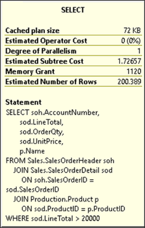  
        
    
    다음은 실행 계획의 특징을 설명한다.

    1. 하나의 쿼리가 다중 쿼리(스테이트먼트)의 묶음(배치)으로 구성되었을 경우 각각의 쿼리 실행 계획은 실행순서대로 나열된다.
      전체 배치의 비용을 100%로 치고 각각 스테이트먼트의 실행 계획은 그에 대한 상대적 비용으로 표시된다.

    2. 실행 계획의 모든 아이콘은 연산자를 나타낸다. 각각의 아이콘은 하나의 노드이며 실행 계획에 있는 모든 노드의 총 비용(100%)의 상대적 예상 비용 비율이 표시된다.
      (통계의 부정확성 또는 SQL Server의 버그로 인해 비용이 100% 이상 발생하는 상황이 발생할 수 있지만 이러한 상황은 대부분 이전 버전의 SQL Server에서 볼 수 있다.)
    
    3. 일반적으로 실행의 첫 번째 물리 연산자(그래픽 실행계획에서 첫번째 우상단)는 데이터베이스 개체(테이블 또는 인덱스)에서 데이터 검색 메커니즘을 나타낸다.
        예를 들어 위 그림의 실행 계획에서 3개의 시작점은 SalesOrderHeader, SalesOrderDetail 및 Product 테이블의 검색을 나타낸다.
    
    4. 데이터 검색은 일반적으로 테이블 또는 인덱스에서의 검색 작업이다.
       예를 들어 위 그림의 실행 계획에서 세 가지 데이터 검색 단계는 모두 인덱스 단계의 작업입니다.

        인덱스에 대한 데이터 검색은 인덱스 스캔(Index Scan) 또는 인덱스 검색(Index Seek)입니다.
        예를 들어 위 그림에서 클러스터드 인덱스 스캔, 클러스터드 인덱스 검색 및 인덱스 스캔을 볼 수 있다

        인덱스를 검색하는 연산의 명명 규칙은 [Table Name].[Index Name] 형태이다.
    
    5. 계획의 논리적 흐름은 영어로 된 책을 읽는 것처럼 왼쪽에서 오른쪽입니다.
        데이터는 연산자 사이에서 오른쪽에서 왼쪽으로 흐르고 연산자 사이의 연결 화살표로 표시된다.

    6. 연산자 사이의 연결 화살표의 두께는 전송된 행이 많을수록 굵게 적을 수록 얇게 표현된다.
        마우스로 화살표 위에 가져다 대면 건수도 보인다.
    
    7. 동일한 열에 있는 두 연산자 간의 조인 메커니즘은 중첩 루프 조인, 해시 일치 조인, 병합 조인 
        또는 적응 조인(SQL Server 2017 및 Azure SQL Database에 추가됨)이다. 
        예를 들어 위그림에 표시된 실행 계획에는 2개의 병합조인(머지조인)이 보인다.
    
    8. 연산자 아이콘에 마우스를 대면 세부 정보가 보이는 팝업창이 뜬다.

          

        팝업창만으로도 많은 상세 정보를 볼수 있지만 모든 정보가 보이지는 않는다.
        그때는 마우스 오른쪽 누르고 속성을 누르면 SSMS에서 속성창이 따로 뜨면서 모든 정보를 살펴 볼수 있다.
        
    9. 연산자 세부 정보는 상단에 물리적 및 논리적 작업 유형을 모두 보여준다. 물리적 작업은 스토리지 엔진에서
        실제로 사용되는 작업을 나타내고 논리적 작업은 옵티마이저가 예상 실행 계획을 작성하는 데 사용하는 구성이다.
        논리적 작업과 물리적 작업이 동일한 경우 물리적 작업만 표시됩니다.
        또한 행 수, I/O 비용, CPU 비용 등등..
    
    10. 해당 쿼리를 조정하는 방법을 더 잘 알고 SQL Server 내에서 쿼리가 실행되는 방식을 이해하려면
          많은 연산자의 속성을 읽어야 할 수 있다.

        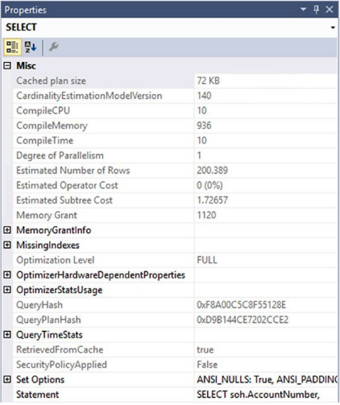  
        그림 9-4 Select연산자 속성

    SQL Server 2017 Management Studio에서 생성된 실제 실행 계획에서는 쿼리에 대한 실행 시간 통계 데이터도 추가로 볼 수도 있다. 
    위그림에서 QueryTimeStats 섹션으로 볼 수 있다. 이는 쿼리 성능을 측정하기 위한 추가 메커니즘을 제공한다. 
    해당 통계가 1ms를 초과하면 실행 계획 내에서 대기 통계를 볼 수도 있다. 그보다 적은 대기 시간은 실행 계획에 표시되지 않는다.

- ### b. 실행계획에서 고비용 단계를 식별하기
    실행 계획에서 가장 효율적인 접근 방식은 상대적으로 비용이 많이 드는 단계를 찾는 것이다. 이 단계는 쿼리 최적화의 시작이며 아래의 기술을 사용하여 시작 단계를 선택할 수 있다.

    1. 실행 계획에서 비용이 가장 높은 노드를 먼저 조사해야 하며 그림 9-2의 실행 계획의 경우에는 예상 비용이 31%인 단계가 바로 그것이다.
       이는 전체(100%) 중 31%나 차지하는 가장 고비용 단계임을 알수 있다.

    2. 하나의 배치에 포함된 여러 스테이트먼트의 경우에는 실행계획이 함께 나온다. 그 중에서 가장 비용이 많이 드는 예상
        스테이트먼트를 찾아야 한다. 그림 9-2에서 계획 상단에 '쿼리 1'이라는 텍스트가 표시됩니다.
        배치 상황에서는 여러 스테이트먼트에 대한 각각의 계획이 있으며 배치 내의 순서대로 번호가 지정된다.

    3. 노드 사이의 연결 화살표의 두께가 두꺼울수록 해당 노드 간에 많은 수의 행이 전송되고 있음을 나타낸다. 
        화살표 왼쪽에 있는 노드를 분석하여 왜 그렇게 많은 행이 필요한지 이해하자. 화살표의 속성도 확인.
        예상 행과 실제 행이 다를 때는 무엇보다도 오래된 통계로 인해 발생할 수 있다. 
        중요: 실제 실행계획에서는 예상행수/실제행수(일치 비율)로 오래된 통계로 인하여 차이점이 생기는 실제 수치를 보여준다.
               
        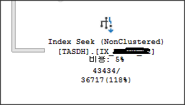  
        실제행수는 43,434인데 예상 행수는 36,717이며 일치율은 118%(거의 비슷하게 일치. 100%는 완전 일치)

        계획의 많은 부분에 굵은 화살표가 표시되고 끝에서 가는 화살표가 표시되면 쿼리 또는 인덱스를 수정하여 계획의 초기에 필터링을 수행할 수 있다.

    4. 해시 조인 작업을 찾는다. 작은 결과 집합의 경우 일반적으로 중첩 루프 조인이 선호되는 조인 기술이다. 
        작은 결과집합을 찾는 OLTP성 작업의 경우 중첩루프조인이 대체적으로 좋으며 그렇지 않고 대량의 데이터를 검색하여 결과를 만들어 내는
        OLAP성 작업에는 해시조인이 대체로 좋은 방법이 된다. 이 장의 뒷부분에서 중첩 루프 조인과 비교한 해시 조인에 대해 자세히 알아볼 것이다.        

    5. 키 조회(Key lookup) 작업을 찾는다. 큰 결과 집합에 대한 조회 작업으로 인해 많은 수의 임의 읽기가 발생할 수 있습니다. 
        키 조회에 대해서는 11장에서 더 자세히 다루겠습니다.
    
    6. 연산자 중 하나에게 느낌표로 표시된 경고가 있을 수 있으며 이는 즉각적인 우려 사항입니다. 이는 조인 기준이 없는 조인이나
        통계가 누락된 인덱스 또는 테이블을 포함하여 다양한 문제로 인해 발생할 수 있습니다.
        일반적으로 경고 상황을 해결하면 성능에 도움이 됩니다.

    7. 정렬 작업을 수행하는 단계를 찾습니다. 이는 데이터가 올바른 정렬 순서로 검색되지 않았음을 나타냅니다.
        다시 말하지만 이것은 문제가아닐 수 있지만 잠재적인 문제의 지표이며 누락되거나 잘못된 인덱스가 있을 수 있습니다.
        ORDER BY를 사용하여 데이터가 지정된 방식으로 정렬되었는지 확인하는 것이 성능이 저하될 수 있습니다.
        
    8. 테이블 스풀과 같이 시스템에 추가 부하를 가할 수 있는 작업자를 주의. 쿼리 작업에 필요할 수도 있고 부적절하게 작성된 쿼리
        또는 잘못 설계된 인덱스를 나타낼 수도 있습니다.
        
    9. 병렬 쿼리 실행에 대한 기본 비용 임계값은 5코스트이며 매우 낮다. 보증되지 않는 병렬 작업에 주의하십시오.
        예상 비용은 CPU 및 I/O의 수학적 모델을 나타내는 옵티마이저에서 예측한 숫자이지 실제 측정값이 아님을 기억하자.
        SQL Server의 설정값중 "Cost Threshold for Parallelism" 이 기본값 5이며 이 값을 조금씩 올려서 변경 할 수도 있다.
        

- ### c. 인덱스 효율성 분석
    실행 계획에서 비용이 많이 드는 단계를 더 조사하려면 관련 테이블 또는 인덱스에 대한 데이터 검색 메커니즘을 분석해야 한다.  
    먼저 인덱스 작업이 검색(seek)인지 스캔(scan)인지 확인해야 하며 일반적으로 최상의 성능을 얻으려면 테이블에서 가능한 한 적은 수의 행을 검색해야 한다. 인덱스 검색(Index Seek)은 종종 적은 수의 행에 액세스하는 가장 효율적인 방법이다. 스캔 작업은 일반적으로 더 많은 수의 행이 액세스함을 나타낸다. 따라서 일반적으로 스캔보다 검색이 좋다. 그러나 이것이 본질적으로 검색이 좋고 스캔이 나쁘다는 것을 의미하지는 않는다. 데이터 검색 메커니즘은 쿼리 요구 사항을 정확하게 반영해야 하며 테이블에서 모든 행을 검색하는 분석 쿼리(OLAP성작업) 같은 경우 스캔이 보다 효율적일 수 있다. 여기서 핵심은 옵티마이저가 선택을 한 이유를 이해하기 위해 연산자의 속성을 검사하여 작업의 세부 사항을 이해하는 것이다. 
    
    다음으로 인덱싱 메커니즘이 제대로 설정되었는지 확인하려고 합니다. 쿼리 최적화 프로그램은 사용 가능한 인덱스를 평가하여 가장 효율적인 방법으로 테이블에서 데이터를 검색할 인덱스를 찾는다. 원하는 인덱스를 사용할 수 없는 경우 옵티마이저는 차선책 인덱스를 사용하기 때문에 최상의 성능을 위해서는 데이터 검색 작업에서 항상 최상의 인덱스가 사용되는지 확인해야 한다.  
    다음에 대한 노드 세부 정보의 인수 섹션을 분석하여 인덱스 효율성(최상의 인덱스 사용 여부)을 판단할 수 있다.

        * 데이터 검색 작업
        * 조인 연산자

    예상 실행 계획에서 SalesOrderHeader 테이블에 대한 데이터 검색 메커니즘을 살펴보겠다. 그림 9-5는 연산자 속성을 보여줍니다.  

    
    그림 9-5 속성보기에서 Seek Predicates

    SalesOrderHeader 테이블의 연산자 속성에서 Object 속성은 사용된 인덱스 PK_SalesOrderHeader_SalesOrderID를 지정합니다.  
    다음 명명 규칙을 사용한다. [데이터베이스].[소유자].[테이블 이름].[인덱스 이름].  
    
    Seek Predicates 속성은 인덱스에서 키를 찾는 데 사용되는 열을 지정한다.  
    SalesOrderHeader 테이블은 SalesOrderDetail 테이블의 SalesOrderld 열과  조인된다. SEEK는 조인 기준인 SalesOrderld가 클러스터형 인덱스와 기본 키인 PK_SalesOrderHeader의 선행 에지라는 사실에서 작동한다.  
    때때로 다른 데이터 검색 메커니즘이 있을 수 있다. 그림 9-5에서 본 Seek Predicates 속성 대신 그림 9-6은 데이터 검색을 위한 완전히 다른 메커니즘을 보여준다.
    
    그림 9-6 속성보기에서 Predicate

    그림 9-6의 속성에는 검색 조건자(Seek Predicate)가 없다. 컬럼, ISNULL, CONVERT_IMPLICIT에 대해 수행되는 기능 때문에 전체 테이블에서 Predicate 값이 존재하는지 확인해야 한다.

    ```
    isnull(CONVERT_IMPLICIT(numeric(19,4),[AdventureWorks2017].[Sales].[SalesOrderDetail].[UnitPrice] 
        as [sod].[UnitPrice],0)*((1.0)-CONVERT_IMPLICIT(numeric(19,4)
            ,[AdventureWorks2017].[Sales].[SalesOrderDetail].[UnitPriceDiscount]
        as [sod].[UnitPriceDiscount],0))*CONVERT_IMPLICIT(numeric(5,0)
            ,[AdventureWorks2017].[Sales].[SalesOrderDetail].[OrderQty]
        as [sod].[OrderQty],0),(0.000000))>(20000.000000)
    ```

    데이터에 대해 사전 계산을 하기 때문에 단순히 인덱스에 대한 정보를 조회하는 대신 모든 데이터를 스캔하고 계산을 수행한 다음 데이터는 우리가 찾고 있는 값과 일치하는지 확인한다.

- ### d. 조인 효율성 분석
    인덱스 사용 분석에 덧붙여 옵티마이저가 결정하는 조인 전략의 효율성을 조사해야만 한다. SQL Server는 4가지 종류의 조인이 있다.
    
    * 해시조인
    * 머지 조인
    * 중첩 루프 조인
    * 적응형 조인
    

    작은 행 집합을 구하는 많은 간단한 쿼리에서는 중첩 루프 조인이 해시 및 병합 조인보다 훨씬 좋다. 조인이 더 복잡해지면 필요할 경우 다른 조인 유형이 사용된다. 어떤 조인 유형도 정의상 나쁘거나 잘못된 것은 아니다. 주로 옵티마이저가 보유한 데이터와 호환되지 않는 유형을 선택한 경우를 찾아야 한다. 이것은 일반적으로 옵티마이저가 사용할 유형을 결정할 때 사용할 수 있는 통계의 불일치로 인해 발생한다.

    - **d_1. 해시 조인(Hash Join)**  
        SQL Server의 해시 조인 전략을 이해하려면 다음과 같은 간단한 쿼리를 생각해보자.

        ```sql
        SELECT
            p.Name AS ProductName,
            pc.Name AS ProductCategoryName
        FROM Production.Product p
            JOIN Production.ProductCategory pc
                ON p.ProductSubcategoryID = pc.ProductCategoryID
        ```
        표 9-1 두 테이블의 인덱스와 로우수를 보여준다.

        ```
        Table명             Index                                   로우수
        ------------------  --------------------------------------- ------------------------
        Product             Clustered index on ProductID            504
        ProductCategory     Clustered index on ProductCategoryld    4        
        ```    
  
        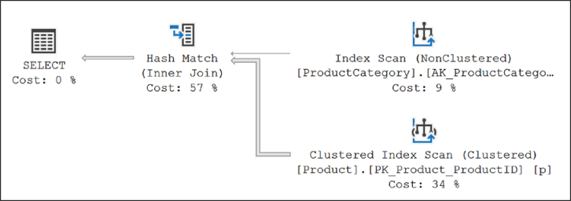  
        그림 9-7 해시조인 실행계획

        옵티마이저가 두 테이블 사이에 해시 조인을 사용했음을 알 수 있다.

        해시 조인은 두 개의 조인 입력을 "빌드 입력" 및 "프로브 입력"으로 사용한다.
        빌드 입력은 실행 계획의 상단 입력이고 프로브 입력은 하단 입력이다. 일반적으로 두 입력 중 더 작은 것이 시스템에 저장되어 빌드 입력으로 사용되기 때문에 옵티마이저는 사용된 메모리를 최소화하려고 시도한다.

        해시 조인은 처리작업을 두 단계로 나누어 수행한다. : 빌드 단계와 프로브 단계  

        가장 일반적으로 사용되는 해시 조인 형식인 "메모리 내 해시 조인"의 경우 전체 빌드 입력을 스캔하거나 계산한 결과인 해시 테이블을 메모리에 만든다.  
        외부 입력의 각 행은 해시 키로 계산된 해시 값(같음 술어의 열 집합)에 따라 해시 버킷에 삽입된다.
        해시는 문제의 값에 대해 실행되고 비교 목적으로 사용되는 수학적 구성일 뿐이다.
        
        이 빌드 단계 다음에는 프로브 단계가 수행된다. 전체 프로브 입력은 한 번에 한 행씩 스캔되거나 계산되며 각 프로브 행에 대해 해시 키 값이 계산된다.
        해당 해시 버킷에서 프로브 입력의 해시 키 값이 검색되고 일치 항목이 생성된다. 그림 9-8은 메모리 내 해시 조인 프로세스를 보여준다.

        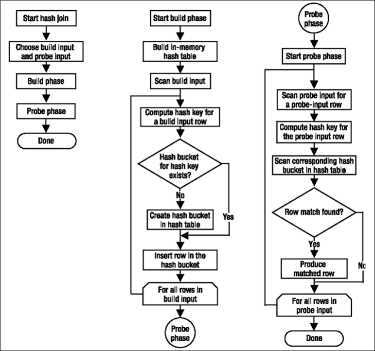  
        그림 9-8 인메모리 해시조인 워크플로우
        
        쿼리 옵티마이저는 대량의 정렬되지 않은 형태의 넌클러스터드 입력값을 효율적으로 계산하기 위해서 해시 조인을 사용한다. 

    - **d_2. 병합 조인(Merge Join)**  
        해시 조인의 경우 Product 테이블의 건수가 더 크고 ProductCategory 테이블과 조인하기 위해 사용된 조인 열(ProductCategorylD)에 인덱스가 없었다.  
        다음의 간단한 쿼리를 사용하여 다른 동작을 볼 수 있다.

        ```sql
        SELECT pm.Name AS ProductModelName,
            pmpd.CultureID
        FROM Production.ProductModel pm
            JOIN Production.ProductModelProductDescriptionCulture pmpd
                ON pm.ProductModelID = pmpd.ProductModelID;
        ```

        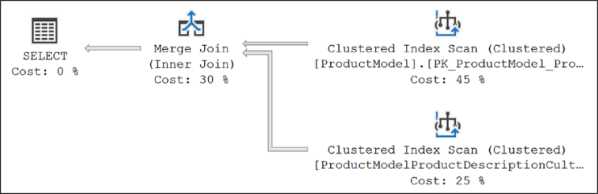  
        이 쿼리의 경우 옵티마이저는 두 테이블 간의 병합 조인을 사용했다.  
        병합 조인에서는 조인 기준에 정의된 대로 병합 열에서 두 조인 입력을 모두 사전 정렬되어야 한다. 두 조인 열에서 인덱스를 사용할 수 있는 경우 조인 입력은 인덱스를 기준으로 정렬된다. 각 조인 입력이 정렬되기 때문에 병합 조인은 각 입력에서 행을 가져와 동일한지 비교하고 일치하면 생성된다.
        이 프로세스는 모든 행이 처리될 때까지 반복된다.
        데이터가 인덱스에 의해 정렬되는 상황에서 병합 조인은 가장 빠른 조인 작업 중 하나가 될 수 있다. 하지만 데이터가 정렬되지 않은 상태인데 옵티마이저가 여전히 병합 조인을 수행하도록 선택하는 경우라면 데이터는 사전 정렬되어야 한다. 정렬같은 추가 작업으로 인해 메모리 및 I/O 리소스 면에서 병합 조인이 느려지고 비용이 더 많이 들 수도 있다.
        메모리 할당이 정확하지 않고 정렬이 tempdb의 디스크로 유출되는 경우 상황이 더욱 악화될 수도 있다.

        이번 경우 옵티마이저는 조인 입력이 조인 열에서 모두 정렬(또는 인덱싱)되었음을 발견했다. 그림 9-10과 같이 Index Scanoperators의 속성에서 이를 확인할 수 있다.  
        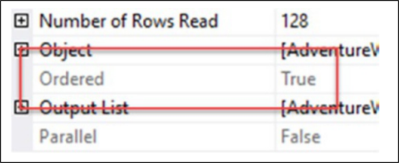  
        그림 9-10 클러스터드 인덱스 스캔 속성에서 데이터가 정렬됨

        사용 중인 인덱스별로 데이터를 정렬한 결과 이 상황에서 다른 어떤 조인보다 빠른 조인 전략으로 병합 조인이 선택되었음을 알 수 있다.

    - **d_3. 중첩 루프 조인(Nested Loop Join)**      
        더 나은 성능을 얻기 위해서는 항상 테이블에서 적은 양의 행에 접근하려고 노력해야 한다.
        더 작은 결과 집합을 얻기 위한 효과를 이해하려면 다음과 같이 쿼리의 조인 입력을 제한해야 한다.

        ```sql
        SELECT pm.Name AS ProductName,
            pmpd.CultureID
        FROM Production.ProductModel pm
            JOIN Production.ProductModelProductDescriptionCulture pmpd
                ON pm.ProductModelID = pmpd.ProductModelID
        WHERE pm.Name = 'HL Mountain Front Wheel';
        ```
        
        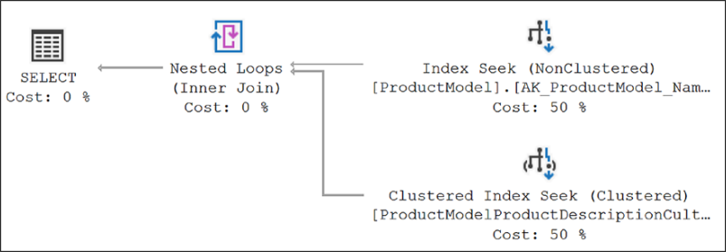  
        그림 9-11 중첩 루프 조인 실행계획

        보시다시피 옵티마이저는 두 테이블 사이에 중첩 루프 조인을 사용했다.

        중첩 루프 조인은 하나의 조인 입력을 외부 입력 테이블로 사용하고 다른 하나는 내부 입력 테이블로 사용합니다.  
        외부 입력 테이블은 실행 계획에서 상위 입력으로 표시되고 내부 입력 테이블은 하위 입력 테이블로 표시됩니다. 외부 루프는 외부 입력 테이블을 행 단위로 루핑하여 읽어온다. 각 외부 행에 대해서 실행되는 내부 루프는 내부 ​​입력 테이블에서 일치하는 행을 검색한다.

        중첩 루프 조인은 외부 입력이 매우 작고 내부 입력은 조금 더 크더라도 인덱싱된 경우 매우 효과적이다. 작은 행 집합을 처리하는 단순 쿼리에서는 중첩 루프 조인이 해시 및 병합 조인보다 훨씬 우수하다.
        
        -----------------------------------------

        중첩 루프 조인은 메모리를 사용하여 작은 데이터 세트를 가져와 두 번째 데이터 세트와 비교하기 때문에 매우 빠를 수 있다. 병합 조인도 작은 메모리를 사용하지만 추가적으로 약간의 tempdb를 사용하여 정렬된 비교를 수행한다. 이에 반해 해시 조인은 메모리와 tempdb를 사용하여 조인에 대한 해시 테이블을 작성하기 때문에 대량의 공간을 차지 할 수 있다.  

        루프 조인은 작은 데이터 세트에서 더 빠를 수 있지만 데이터 세트가 커지거나 데이터 검색을 지원하는 인덱스가 없으면 속도가 느려질 수 있다. 그런 경우 SQL Server에는 다른 조인 메커니즘을 사용하려고 시도한다.

        이전 쿼리와 같이 작은 내부 조인 입력의 경우에도 조인 열에 인덱스가 있어야 한다. 앞의 실행 계획에서 보았듯이 작은 행 집합의 경우 조인 열의 인덱스를 사용하면 옵티마이저에서 중첩 루프 조인 전략을 고려하려 한다. 내부 입력 테이블(아래 쪽 테이블)의 조인 열에서 인덱스가 누락될 경우 쿼리 최적화 프로그램이 대신 해시 조인을 사용하도록 한다.

        ```
        조인 종류        조인 컬럼에서 인덱스                           조인 테이블의 유용한 크기   사전정렬 조인절
        --------------- --------------------------------------------- ------------------------  ------- -----
        Hash            내부 테이블 : 인덱스 없음                       Any                       No      Equi-join
                        외부 테이블 : 옵션
                        최적 조건 : 작은 외부 테이블, 큰 내부 테이블
        Merge           양쪽 테이블 : 필수                             대량                       Yes     Equi-join
                        최적 조건 : 양쪽에서 클러스터드 또는
                                    커버드 인덱스 
        Nested Loop     내부테이블 : 필수                              소량                       선택적  전체
                        외부 테이블 : 있으면좋고
        ```  

        ```note
        해시나 중척 루프조인의 외부 테이블은 두개의 조인 테이블중 항상 작은쪽이다.
        ```

        다음장에서 클러스터드와 커버드 인덱스를 설명할 것이다.

    - **d_4. 적응형 조인(Adaptive Join)**     
        적응형 조인은 Azure SQL Database 및 SQL Server 2017에 도입되었습니다. 이는 중첩 루프 조인 또는 해시 조인 중에서 실시간으로 선택할 수 있는 새로운 조인 유형입니다. 이 글을 쓰는 시점에서는 columnstore 인덱스에만 적용되지만 향후 변경될 수 있습니다. 이 작업을 확인하기 위해 클러스터형 columnstore 인덱스가 있는 테이블을 생성하겠습니다.

        ```sql
        SELECT *
            INTO dbo.TransactionHistory
        FROM Production.TransactionHistory AS th;

        CREATE CLUSTERED COLUMNSTORE INDEX ClusteredColumnStoreTest
            ON dbo.TransactionHistory;
        ```

        이 테이블과 인덱스가 제자리에 있고 호환성 모드가 올바르게 설정되어 있으면 클러스터형 columnstore 인덱스를 활용하는 간단한 쿼리를 실행할 수 있습니다.

        ```sql
        SELECT p.Name,
            th.Quantity
        FROM dbo.TransactionHistory AS th
            JOIN Production.Product AS p    ON p.ProductID = th.ProductID
        WHERE th.Quantity > 550;
        ```

         그림 9-12에서 보여지는 실제 실행계획 캡처


        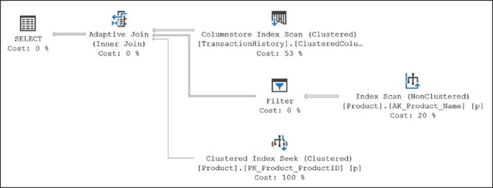  
        그림 9-12 적응형 조인 실행계획

        해시 조인 또는 중첩 루프 조인은 이전에 정의된 것과 정확히 일치하는 적응형 조인 함수에서 사용됩니다. 차이점은 적응형 조인이 주어진 상황에서 어떤 조인 유형이 더 효율적인지 결정할 수 있다는 것입니다. 작동 방식은 숨겨진 적응형 버퍼 구축을 시작한다는 것입니다. 행 임계값을 초과하면 행이 일반 해시 테이블로 이동합니다. 나머지 행은 설명된 대로 프로브 프로세스를 위해 준비된 해시 테이블에 로드됩니다. 모든 행이 적응형 버퍼에 로드되고 해당 숫자가 행 임계값 아래로 떨어지면 해당 버퍼가 중첩 루프 조인의 외부 참조로 사용됩니다. 그림 7-12에서 볼 수 있듯이 각 조인은 적응형 조인 연산자 아래에 별도의 분기로 표시됩니다. 적응형 조인 아래의 첫 번째 분기는 해시 조인용입니다. 이 경우 인덱스 스캔 연산자와 필터 연산자는 해시 조인을 사용해야 하는 쿼리의 요구 사항을 충족합니다. 적응형 조인 아래의 두 번째 분기는 중첩 루프 조인용입니다. 여기에서 Clustered Index Seek 작업이 됩니다.

        계획은 두 가지 가능한 분기와 함께 생성되어 캐시에 저장됩니다. 그런 다음 쿼리 엔진은 문제의 결과 집합에 따라 작업할 분기를 결정합니다. 그림 7-13과 같이 Adaptive Join 연산자의 속성을 보면 선택 사항을 확인할 수 있습니다.

        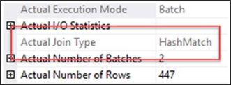  
        그림 9-13 실제 조인종류를 보여주는 적응형 조인 속성

        이 조인이 해시 일치와 중첩 루프 간에 전환되는 임계값은 계획이 컴파일될 때 계산됩니다. 이는 AdaptiveThresholdRows로 속성의 계획과 함께 저장됩니다. 쿼리가 실행되고 임계값을 충족, 초과 또는 충족하지 않은 것으로 확인되면 적응형 조인의 올바른 분기로 처리가 계속됩니다. 이를 위해 계획 재컴파일이 필요하지 않습니다. 재컴파일에 대해서는 16장에서 자세히 설명합니다. 데이터 집합이 중첩 루프가 해시 일치를 크게 능가하는 것과 같을 때 적응형 조인은 성능을 상당히 향상시킵니다. 빌드 후 해시 일치를 사용하지 않는 것과 관련된 비용이 있지만 더 작은 데이터 세트에 대한 중첩 루프 조인의 향상된 성능으로 인해 상쇄됩니다. 데이터 세트가 클 때 이 프로세스는 어떤 식으로든 해시 조인 작업에 부정적인 영향을 미치지 않습니다. 기술적으로 이것은 근본적으로 새로운 유형의 조인을 나타내지 않지만 내 생각에 두 가지 핵심 유형인 중첩 루프와 해시 일치 간에 동적으로 전환하는 동작은 이를 효과적으로 새로운 조인 유형으로 만듭니다. 여기에 새로운 연산자인 적응형 조인 연산자가 있으며 중첩 루프나 해시 일치가 표시되지 않으며 확실히 새로운 조인 유형처럼 보입니다.

- ### e. 실제 또는 예상 실행계획
    실행계획에는 예상 또는 실제 실행 계획이 있다. 어느 정도 비슷한 정보를 가지고 있지만 실제 계획에는 예상계획에는 없는 쿼리 실행 정보, 특히 영향을 받는 실제 행 수 및 예상 계획에서 사용할 수 없는 기타 정보가 포함된다. 이 정보는 특히 통계 추정치를 이해하려고 할 때 매우 유용할 수 있다. 이러한 이유로 쿼리를 튜닝할 때는 실제 실행 계획을 선호합니다.
    
    안타깝게도 실제 실행계획은 항상 사용할 수는 없다. 프로덕션 환경과 같이 쿼리를 실행하지 못할 수도 있기 때문이다. 더구나 insert나 delete같은 경우는 아예 불가능하다. 런타임 정보가 포함되지 않은 캐시에 존재하는 계획에만 액세스할 수 있다. 따라서 예상 실행계획으로만 작업해야 하는 상황이 있다. 그러나 일반적으로 수집된 런타임 메트릭 정보가 포함되어 있는 실제 계획을 얻는 것이 항상 더 좋다.  
    예상 계획이 전혀 작동하지 않는 상황이 존재한다. 다음은 예제 저장 프로시저입니다.

    ```sql
    CREATE OR ALTER PROC p1
    AS
        CREATE TABLE t1 (c1 INT);

        INSERT INTO t1
        SELECT ProductID
        FROM Production.Product;

        SELECT *
        FROM t1;
        DROP TABLE t1;
    GO
    ```

    다음과 같이 SHOWPLAN_XML을 사용하여 쿼리에 대한 예상 XML 실행 계획을 얻을 수 있습니다.
    ```sql
    SET SHOWPLAN_XML ON;
    GO

    EXEC p1 ;
    GO

    SET SHOWPLAN_XML OFF;
    GO
    ```
    하지만 아래 에러때문에 실패한다.  
    *Msg 208, Level 16, State 1, Procedure p1, Line 249 Invalid object name 't1'.*

    SHOWPLAN_XML은 실제로 쿼리를 실행하지 않는다. 쿼리 최적화 프로그램은 쿼리가 실행될 때 존재하지 않는 테이블(t1)에 대한 INSERT 및 SELECT 문에 대한 실행 계획을 생성할 수 없기에 대신 다음과 같이 STATISTICS XML을 사용할 수 있다.

    ```sql
    SET STATISTICS XML ON;
    GO

    EXEC p1;
    GO

    SET STATISTICS XML OFF;
    GO
    ```
    STATISTICS XML은 쿼리를 실행하기 때문에 쿼리 내에서 테이블이 생성되고 액세스되며, 이는 모두 실행 계획에 의해 캡처됩니다. 그림 9-14는 쿼리 결과와 STATISTICS XML에서 제공하는 프로시저 내 두 명령문에 대한 두 가지 계획을 보여줍니다.
    
    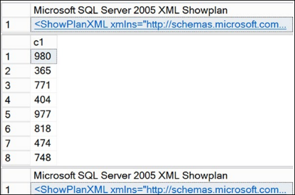  
    그림 9-14 Statistics xml 출력값

- ### f. 실행계획 캐시
    실행 계획에 액세스하는 또 다른 방법은 실행 계획이 저장된 메모리 공간인 플랜 캐시에서 직접 읽는 것입니다. 이 데이터에 액세스하기 위해 SQL Server에서 동적 관리 뷰 및 기능이 제공됩니다. 캐시에 저장된 모든 계획은 예상 계획입니다. 캐시의 실행 계획 목록을 보려면 다음 쿼리를 실행합니다.

    ```sql
    SELECT p.query_plan,
        t.text
    FROM sys.dm_exec_cached_plans r
        CROSS APPLY sys.dm_exec_query_plan(r.plan_handle) p
        CROSS APPLY sys.dm_exec_sql_text(r.plan_handle) t;
    ```

    쿼리는 XML 실행 계획 링크 목록을 반환한다. 그 중 하나를 열면 실행 계획이 표시되는데 이러한 실행 계획은 컴파일된 계획이지만 실행 메트릭은 포함하지 않는다. 동적 관리 뷰를 통해 사용 가능한 열을 추가로 사용하면 특정 절차나 실행 계획을 검색할 수 있다. 런타임 데이터가 없다는 것은 다소 제한적이지만 쿼리가 실행되는 동안에도 실행 계획에 액세스할 수 있다는 것은 성능 튜닝을 하는 사람에게는 매우 귀중한 리소스이다. 앞서 언급했듯이 프로덕션 환경에서는 쿼리를 실행하지 못할 수 있으므로 실행계획을 얻는것은 매우 유용하다. 11장에서 다루테지만 쿼리 저장소에서 계획을 검색할 수도 있다. 캐시에 저장된 계획과 마찬가지로 모두 예상 계획입니다.

- ### g. 실행 계획 도구
    실행 계획이 실행되는 것을 살펴보기 시작했지만 이러한 계획이 어떻게 작동하는지 이해하는 데 사용할 수 있는 것 중 일부만 보았을 뿐이다. SSMS는 XML과 그래픽 실행계획 외에도 쿼리 성능에 대해 실행 계획이 표시하는 내용을 이해하기 위해 알 가치가 있는 몇 가지 추가 실행계획 기능을 제공한다.

    - **g_1. 노드 찾기**  
        먼저 계획의 연산자 내에서 실제로 검색하여 속성 내에서 특정 값을 찾을 수 있다. 챕터를 시작한 원래 쿼리를 사용하여 계획을 생성해 보겠습니다. 쿼리는 다음과 같습니다.

        ```sql
        SELECT soh.AccountNumber,
            sod.LineTotal,
            sod.OrderQty,
            sod.UnitPrice,
            p.Name
        FROM Sales.SalesOrderHeader soh
            JOIN Sales.SalesOrderDetail sod
                ON soh.SalesOrderID = sod.SalesOrderID
            JOIN Production.Product p
                ON sod.ProductID = p.ProductID
        WHERE sod.LineTotal > 20000;
        ```

        실행 계획을 생성한 후 원하는 수단을 사용하여 실행 계획 내에서 마우스 오른쪽 버튼을 클릭하면 컨텍스트 메뉴에는 그림 9-15와 같이 계획을 제어하기 위한 흥미로운 리소스가 많이 표시된다.

        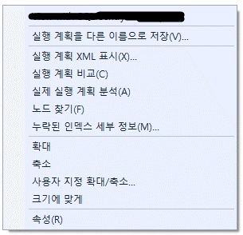  
        그림 9-15 실행계획 컨텍스트 메뉴

        노드 찾기 메뉴 항목을 선택하면 그림 7-16과 같이 실행 계획의 오른쪽 상단 모서리에 새 인터페이스가 나타난다.

        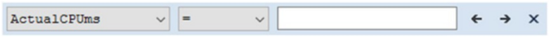  
        그림 9-16 노드찾기
        
        왼쪽에는 모든 연산자에 대한 전체 속성이 있으며 검색하려는 속성을 선택할 수 있다. 그런 다음 연산자를 선택할 수 있는데 그림 9-16에 표시된 기본값은 등호 연산자이다. 등호대신 포함 연산자도 선택할수 있다. 마지막으로 값을 입력하고 왼쪽 또는 오른쪽 화살표를 클릭하면 기준과 일치하는 연산자를 찾을 수 있다. 화살표를 한번 더 클릭하면 다음 연산자(있는 경우)로 이동하므로 각 연산자의 속성을 직접 시각적으로 검색할 필요 없이 크고 복잡한 실행 계획을 통해 작업할 수 있다. 예를 들어 그림 9-17과 같이 Product 스키마를 참조하는 모든 연산자를 찾을 수 있다.

          
        그림 9-17 Product 스키마를 포함하는 모든 연산자 찾기

        오른쪽 화살표를 클릭하면 Product 스키마를 참조하는 첫 번째 연산자로 이동한다. 이 예에서는 먼저 SELECT 연산자로 이동한 다음 병합 조인 연산자,클러스터드 인덱스 스캔 연산자로 이동한다. (실제 각자의 컴퓨터에서는 다를수 있다.)

        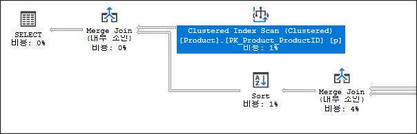  
        그림 9-17-1 다음노드 찾기
        
        
    - **g_2. 계획 비교**  
        때로는 그래픽 계획 내에서 쉽게 볼 수 없을 때 두 실행 계획의 차이점이 무엇인지 궁금할 수 있습니다. 다음 쿼리를 실행하면 계획은 본질적으로 동일하게 보일 것입니다.

        ```sql
        SELECT p.Name,
            th.Quantity
        FROM Production.TransactionHistory AS th        
            JOIN Production.Product AS p
                ON p.ProductID = th.ProductID
        WHERE th.Quantity > 550;

        SELECT p.Name,
            th.Quantity
        FROM Production.TransactionHistory AS th
            JOIN Production.Product AS p
                ON p.ProductID = th.ProductID
        WHERE th.Quantity > 35000;
        ```

        이 계획에는 실제로 몇 가지 뚜렷한 차이점이 있지만 유사해 보이기도 합니다. 차이점이 무엇인지 정확히 판별하기 위해 눈을 사용하여 비교하는 것은 많은 실수로 이어질 수 있다. 대신 실행계획 중 하나를 마우스 오른쪽 버튼으로 클릭하고 그림 9-15에서 컨텍스트 메뉴를 불러온다. 계획 중 하나를 파일에 저장하려면 "실행 계획을 다른 이름으로 저장"을 클릭하여 저장한다. 그런 다음 다른 계획 내에서 마우스 오른쪽 버튼을 클릭하여 상황에 맞는 메뉴를 다시 가져옵니다. "실행 계획 비교"를 눌러 먼저 저장한 실행계획을 선택하면 그림 9-18과 매우 유사한 화면이  SSMS 에서 열린다.

        
        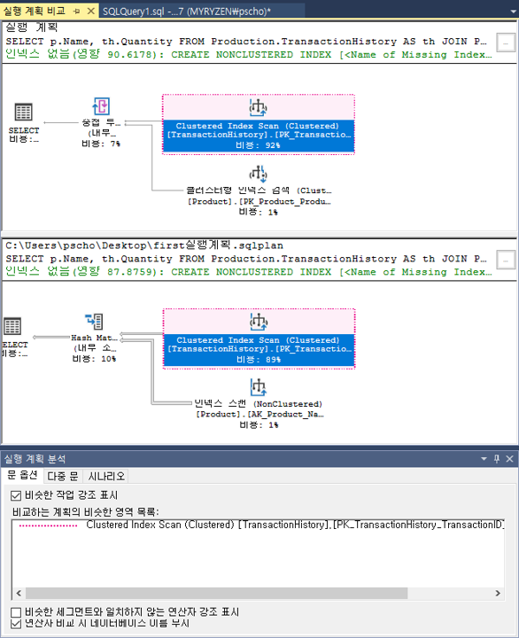  
        그림 9-18 SSMS에서 실행계획 비교

        비슷하지만 뚜렷한 차이점이 있는 계획이다. 분홍색으로 강조 표시된 부분은 비슷한 작업이며 강조 표시되지 않은 실행계획 영역(이 경우 SELECT 연산자)이 더 큰 차이점이다. 화면 하단의 명령문 옵션을 사용하여 강조 표시를 제어할 수도  있다. 또한 연산자의 속성을 탐색할 수 있는데 SELECT 연산자를 마우스 오른쪽 클릭하고 속성 메뉴를 선택하면 그림 7-19와 같은 창이 열린다.

        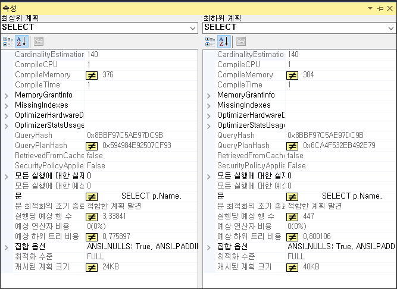  
        그림 9-19 두 계획에서 SELECT연산자 속성 차이점

        일치하지 않는 속성에는 밝은 노란색 "같지 않음" 기호가 있는 것을 볼 수 있다. 이를 통해 두 실행 계획 간의 차이점을 쉽게 찾고 확인할 수 있다.
        
    - **g_3. 시나리오**          
        마지막으로, 새로운 도구 중 하나는 실행 계획을 분석하고 계획에서 발생할 수 있는 문제를 지적하는 Management Studio의 기능이다. 이를 시나리오라고 하며 그림 9-18에 표시된 화면 하단에 나열된다. 이 기능이 작동하는지 확인하기 위해 그림 9-20은 선택된 탭과 선택된 연산자 중 하나를 보여준다.

        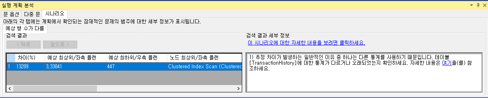  
        그림 9-20 시나리오에서 차이점 설명

        현재 Microsoft는 단일 시나리오만 제공하지만 이 책을 읽을 즈음에는 더 많은 시나리오를 사용할 수도 있다.  
        현재 강조한 시나리오는 다른 예상 행이다. 이는 열 및 인덱스에 대한 통계가 누락되거나 정확하지 않거나 오래된 통계와 관련된 일반적인 문제와 직접적인 관련이 있습니다. 이는 일반적인 문제이며 이 책의 여러 장, 특히 13장에서 다룰 것입니다. 추정된 행 수와 실제 행 수 사이에 불일치가 있을 때 생성된 계획이 실제 데이터에 대해 정확하지 않습니다. 
        
        화면 왼쪽에는 추정된 행과 실제 행 사이에 차이가 있을 수 있는 연산자가 있습니다. 오른쪽에는 이러한 격차가 강조 표시된 이유에 대한 설명이 나와 있습니다. 이 책의 뒷부분에서 더 자세히 살펴보겠습니다. XML STATISTICS를 사용하여 계획을 캡처하거나 단순히 계획이 포함된 파일을 열 때 분석 화면으로 이동할 수도 있습니다. 현재 SSMS 내에서 계획을 캡처하고 실행 계획 분석 화면으로 직접 이동할 수 없습니다.

    - **g_4. 활성 실행 계획**  
        공식 이름은 Live Query Statistics이지만 실제로 보게 되는 것은 실시간 실행 계획이다. SQL Server 2014에 도입된 DMV sys.dm_exec_query_profiles를 사용하면 실제로 실행 계획 작업을 실시간으로 확인하고 각 작업에서 처리되는 행 수를 실시간으로 관찰할 수 있다. 그러나 SQL Server 2014 및 이전 버전에서는 기본적으로 이것이 작동하려면 실제 실행 계획을 캡처해야 한다. 또한 쿼리가 작동하는지 확인하려면 쿼리가 다소 오래 실행되어야 합니다. 다음은 오래걸리지만 별 의미없는 예제 쿼리이다.

        ```sql
        SELECT *
        FROM sys.columns AS c,
            sys.syscolumns AS s;
        ```
        이 쿼리를 쿼리 창에 넣고 실행한다. 실제 실행 계획을 캡처위해서 두 번째 쿼리 창에서 다음 쿼리를 실행합니다.

        ```sql
        SELECT deqp.physical_operator_name,
            deqp.node_id,
            deqp.thread_id,
            deqp.row_count,
            deqp.rewind_count,
            deqp.rebind_count
        FROM sys.dm_exec_query_profiles AS deqp;
        ```

        아래 그림과 같은 데이터를 볼것이다.
        
        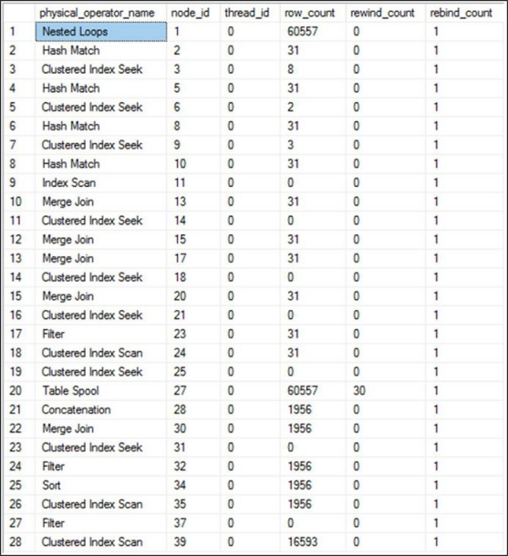  
        그림 9-21 라이브 쿼리 실행중에 연산자별 로우 카운트 

        문제가 있는 쿼리가 실행되는 동안 sys.dm_exec_query_profiles에 대해 쿼리를 계속해서 실행합니다. 다양한 행 수가 계속 증가하는 것을 볼 수 있습니다. 이 접근 방식을 사용하면 활발하게 실행되는 쿼리에 대한 메트릭을 수집할 수 있습니다. SQL Server Management Studio 2016부터 이 작업을 확인하는 더 쉬운 방법이 있습니다. DMV를 쿼리하는 대신 문제가 있는 쿼리가 포함된 쿼리 창에서 라이브 쿼리 통계 포함 버튼을 클릭하기만 하면 됩니다. 그런 다음 쿼리를 실행할 때 보기가 실행 계획으로 변경되지만 연산자 간에 이동할 때 행 수를 적극적으로 표시합니다. 그림 7-22는 계획의 섹션을 보여줍니다.

        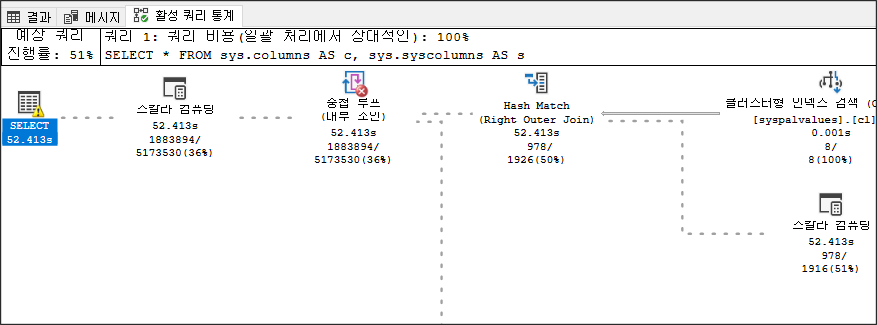  
        그림 9-22 실시간으로 실행계획이 변경

        연산자 간의 데이터 흐름을 보여주는 일반적인 화살표 대신 점선이 움직인다(책에서는 볼 수 없음). 작업이 완료되면 점선이 일반 실행 계획에서 작동하는 것처럼 실선으로 변경됩니다. 이것은 장기 실행 쿼리에서 무슨 일이 일어나고 있는지 이해하는 데 유용한 장치이지만 쿼리가 이미 프로덕션 서버에서 실행 중인 경우 라이브 실행 계획을 캡처해야 하는 요구 사항은 편리하지 않습니다. 또한 실시간 실행 계획을 캡처하는 것은 유용하기는 하지만 비용이 무료가 아닙니다. 따라서 SQL Server 2016 SP1에 도입되고 다른 모든 SQL Server 버전에서 사용할 수 있는 새로운 traceflag 7412가 도입되었습니다. 이 traceflag를 설정하면 요청 시 라이브 쿼리 통계(라이브 실행 계획)를 볼 수 있습니다. 확장 이벤트 세션을 생성하고 query_thread_profile 이벤트를 사용할 수도 있습니다(자세한 내용은 다음 섹션 참조). 실행 중이거나 traceflag가 활성화되어 있는 동안 sys.dm_exec_query_profiles에서 정보를 얻거나 언제든지 쿼리에 대한 실시간 실행 계획을 볼 수 있습니다. 이것이 실제로 작동하는지 확인하려면 먼저 시스템에서 traceflag를 활성화해 보겠습니다.

        ```
        DBCC TRACEON(7412);
        ```

        활성화되면 문제가 있는 쿼리를 다시 실행합니다. 내가 자주 사용하지 않지만 이 추가로 훨씬 더 매력적이 되는 도구는 활동 모니터입니다. 시스템의 활동을 보는 방법입니다. 개체 탐색기 창에서 서버를 마우스 오른쪽 버튼으로 클릭하고 상황에 맞는 메뉴에서 활동 모니터를 선택하여 액세스합니다. traceflag를 활성화하고 문제가 있는 쿼리를 실행하면 내 시스템의 Activity Monitor는 그림 7-23과 같습니다.

        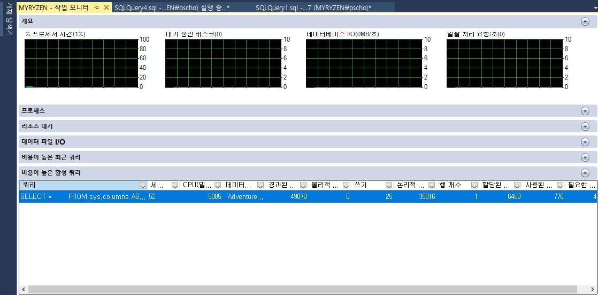  
        그림 9-23 비용이 높은 활성 쿼리 보기 작업 모니터 

        실행 중인 쿼리를 보려면 활성 비싼 쿼리를 클릭해야 합니다. 그런 다음 쿼리를 마우스 오른쪽 단추로 클릭하고 쿼리가 활발하게 실행 중인 경우 라이브 실행 계획 표시를 선택할 수 있습니다.
        
        불행히도, 이 모든 것에 대한 명명은 다소 일관성이 없습니다. 원래 DMV는 쿼리 프로필을 참조하는 반면 SSMS의 쿼리 창은 쿼리 통계를 사용하고 DMV는 스레드 프로필을 사용하고 Activity Monitor는 라이브 실행 계획에 대해 이야기합니다. 그것들은 모두 기본적으로 같은 것을 의미합니다. 즉, 능동적으로 실행되는 쿼리 내에서 작업의 동작을 관찰하는 방법입니다. 먼저 실행 계획을 적극적으로 포착하지 않고도 이 정보에 즉시 액세스할 수 있는 새로운 기능으로 흥미롭고 참신했던 것이 매우 유용한 도구가 되었습니다. 장기 실행 쿼리를 느리게 하는 작업을 정확하게 볼 수 있습니다.

    - **g_5. 쿼리 쓰레드 프로파일**          
        앞에서 언급했듯이 새로운 확장 이벤트 query_thread_profile은 시스템에 새로운 기능을 추가합니다. 이 이벤트는 디버그 이벤트입니다. 6장에서 언급했듯이 디버그 이벤트는 드물게 사용해야 합니다. 그러나 Microsoft는 이 이벤트의 사용을 지지합니다. 실행하면 장기 실행 쿼리에 대한 실시간 실행 계획을 볼 수 있습니다. 그러나 그 이상을 수행합니다. 또한 해당 계획 실행이 끝날 때 실행 계획 내의 모든 연산자에 대한 행 및 스레드 수를 캡처합니다. 특히 라이브 실행 계획에서 활성 행 수를 실제로 볼 수 없는 빠르게 실행되는 쿼리에서 매우 저렴한 비용으로 이러한 메트릭을 쉽게 캡처할 수 있습니다. 이것은 실행 계획으로 얻을 수 있는 데이터이지만 계획을 캡처하는 것보다 훨씬 저렴한 비용입니다. 다음은 쿼리 스레드 프로필과 핵심 쿼리 메트릭을 캡처하는 세션을 만들기 위한 스크립트입니다.

        ```sql
        CREATE EVENT SESSION QueryThreadProfile
        ON SERVER
            ADD EVENT sqlserver.query_thread_profile
            (WHERE (sqlserver.database_name = N'AdventureWorks2017')),
            ADD EVENT sqlserver.sql_batch_completed
            (WHERE (sqlserver.database_name = N'AdventureWorks2017'))
            WITH (TRACK_CAUSALITY = ON)
        GO
        ```

        이 세션이 실행 중인 상태에서 "실행 계획 도구" 섹션의 시작 부분에서 사용한 것과 같은 작은 쿼리를 실행하면 출력은 그림 9-24와 같습니다.

        
        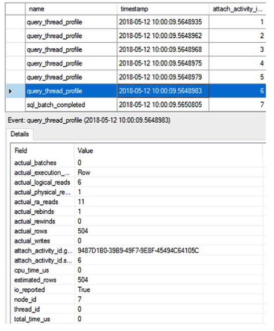  
        그림 9-24 qurey_thread_profile을 보여주는 확장 이벤트 세션

        통계 및 인덱스 사용 평가의 일환으로 우리가 자주 실행 계획에 참조하는 추정 행, 실제 행 및 기타 많은 정보를 포함하여 이벤트의 세부 정보를 볼 수 있습니다. 이제 실행 계획을 캡처하는 더 많은 비용이 드는 프로세스를 거치지 않고도 쿼리에 대해 이 정보를 즉시 캡처할 수 있습니다. 이것은 비용이 들지 않는 작업이 아님을 기억하십시오. 비용이 적게 드는 작업일 뿐입니다. 계획은 스레드, 기간 및 행 수보다 훨씬 더 많은 것을 보여주기 때문에 실행 계획의 모든 사용을 대체하지 않을 것입니다.

## <font color='dodgerblue' size="6">9.3 쿼리 리소스 비용</font>        
쿼리에 대한 실행 계획은 세부적인 처리 전략과 관련된 개별 단계의 예상 상대적 비용을 제공한다.  
하지만 예상 실행계획일 경우 디스크 또는 쿼리 실행중의 CPU 사용량, 읽기/쓰기 측면에서 쿼리의 실제 비용을 제공하지 않는다.

쿼리를 최적화하는 동안 인덱스를 추가하여 단계의 상대적 비용을 줄일 수는 있지만 이는 실행 계획의 종속 단계에 부정적인 영향을 미치거나 때로는 실행 계획 자체를 수정할 수도 있다. 따라서 예상 실행 계획만 보면 실행 계획의 한 단계가 아니라 쿼리 최적화가 쿼리 전체에 이점이 있다고 확신할 수 없다. 쿼리의 전체 비용을 다양한 방식으로 분석할 수 있다.

쿼리를 최적화하는 동안 쿼리의 전체 비용을 모니터링해야 하는데 이전에 설명한 대로 확장 이벤트를 사용하여 쿼리에 대한 소요시간, CPU, 읽기 및 쓰기 정보를 모니터링할 수 있다. 확장 이벤트는 메트릭 수집을 위한 매우 효율적인 메커니즘이며 이 사실을 이용하여 쿼리 성능 메트릭을 수집할 계획을 세워야 한다. 이 정보를 수집하면 시스템 내에서 유지 관리할 위치를 찾아야 하는 많은 양의 데이터가 생성된다는 점을 이해하자.    

확장 이벤트보다 더 즉각적이고 쉽게 액세스할 수 있는 성능 데이터를 수집하는 다른 방법이 있다. 다음의 DMO들이 있다.

    - adhoc 쿼리와 프로시저의 실행 집계 정보
        sys.dm_exec_query_stats 및 sys.dm_exec_procedure_stats        

    - 쿼리 저장소 시스템 보기 및 보고서 (sql server 2016 이상)
        sys.query_store_runtime_stats 및 sys.query_store_wait_stats

- ### 9.3.1 실행 계획 도구
    클라이언트 통계는 클라이언트인 컴퓨터의 관점에서 실행 정보를 캡처한다. 즉, 기록된 모든 시간에는 SQL Server 시스템에 관련된 시간뿐만 아니라 네트워크를 통해 데이터를 전송하는 데 걸리는 시간도 포함된다.  
    이를 사용하려면 SSMS에서 쿼리 ➤ 클라이언트 통계 포함을 선택하기만 하면 됩니다. 이제 쿼리를 실행할 때마다 실행 시간, 영향을 받는 행 수, 서버로의 왕복 등을 포함하여 제한된 데이터 집합이 수집됩니다. 또한 쿼리의 각 실행은 클라이언트 통계 탭에 별도로 표시되고 여러 실행을 집계하는 열에는 수집된 데이터의 평균이 표시됩니다. 또한 통계는 시간이나 횟수가 한 실행에서 다음 실행으로 변경되었는지 여부를 보여주며 그림 7-13과 같이 화살표로 표시됩니다. 예를 들어 다음 쿼리를 고려하십시오.    
    
    ```sql
    SELECT TOP 100
        p.Name,
        p.ProductNumber
    FROM Production.Product p;
    ```
    클라이언트 통계 정보가 아래 그림처럼 보여진다.

    
    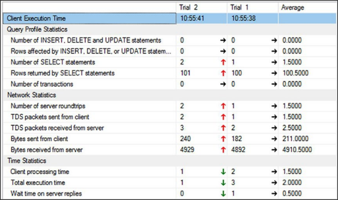  
    그림 9-25 클라이언트 통계

    클라이언트 통계를 캡처하는 것은 데이터를 수집하는 데 유용한 방법일 수 있지만 첫번째 실행 결과가 다른 실행과 어떻게 다른지 보여주기에는 적은 정보만을 담고 있다. 첫번째와 두번째를 완전히 다른 쿼리로 실행해도 같이 보여주어 평균을 쓸모없게 만들 수 있다.  
    필요한 경우 클라이언트 통계를 재설정할 수 있는데 쿼리 메뉴 / 클라이언트 통계 재설정 메뉴 항목을 선택.

- ### 9.3.2 실행 시간    
    Duration과 CPU는 모두 쿼리의 시간 요소를 나타냅니다. 쿼리를 구문 분석, 컴파일 및 실행하는 데 필요한 시간(밀리초)에 대한 자세한 정보를 얻으려면 다음과 같이 SET STATISTICS TIME을 사용하십시오.

    ```sql
    SET STATISTICS TIME ON;
    GO

    SELECT soh.AccountNumber,
        sod.LineTotal,
        sod.OrderQty,
        sod.UnitPrice,
        p.Name
    FROM Sales.SalesOrderHeader soh
        JOIN Sales.SalesOrderDetail sod
            ON soh.SalesOrderID = sod.SalesOrderID
        JOIN Production.Product p
            ON sod.ProductID = p.ProductID
    WHERE sod.LineTotal > 1000;
    GO

    SET STATISTICS TIME OFF;
    GO

    SQL Server parse and compile time:
        CPU time = 0 ms, elapsed time = 9 ms.
        (32101 row(s) affected)
    SQL Server Execution Times:
        CPU time = 156 ms, elapsed time = 400 ms.
    SQL Server parse and compile time:
        CPU time = 0 ms, elapsed time = 0 ms.
    ```
    **The CPU time = 156 ms** 부분은 확장이벤트가 제공하는 CPU값을 표시한다.  
    마찬가지로 **elapsed time = 400 ms**도 다른 메커니즘에서 제공하는 Duration 값을 의미한다.

    0ms 구문 파싱 및 9ms 컴파일 시간은 최적화 프로그램이 구문에 대해 먼저 쿼리를 구문 분석한 다음 컴파일하여 실행 계획을 생성해야 함을 의미합니다.

- ### 9.3.3 STATISTICS IO
    이 장의 앞부분에 있는 "고비용 쿼리 식별" 섹션에서 설명한 것처럼 읽기 열의 읽기 수는 지속 시간, CPU, 읽기 및 쓰기 중에서 가장 중요한 비용 요소인 경우가 많다.  
    쿼리에 의해 수행된 총 읽기 수는 쿼리와 관련된 모든 테이블에서 수행된 읽기 수의 합계이다. 개별 테이블에서 수행되는 읽기는 개별 테이블에서 요청한 결과 집합의 크기와 사용 가능한 인덱스에 따라 크게 다를 수 있다.  
    총 읽기 수를 줄이려면 쿼리에서 액세스한 모든 테이블과 해당 읽기 수를 찾는 것이 유용하다. 이 정보를 이용해 읽기 수가 많은 테이블에서 데이터 액세스를 최적화하는데 도움이 된다.  
    테이블당 읽기 수는 쿼리에서 참조되는 다른 테이블에 대한 최적화 단계(한 테이블에 대해 구현됨)의 영향을 평가하는 데도 도움이 됩니다. 단순 쿼리에서는 쿼리를 자세히 살펴봄으로써 액세스되는 개별 테이블을 결정합니다. 
    
    이것은 쿼리가 복잡할수록 점점 더 어려워지며 저장 프로시저, 데이터베이스 뷰 또는 함수가 쿼리에 많이 포함될수록 옵티마이저가 실제로 액세스하는 모든 테이블을 식별하기가 더 어려워진다. 인간도 어려워짐. 
    
    그렇기에 쿼리 복잡성에 관계없이 STATISTICS IO를 사용하여 이 정보를 얻을 수 있다.  
    STATISTICS IO를 켜려면 Management Studio에서 쿼리 / 쿼리 옵션 / 고급 / SET STATISTICS IO 를 체크하며 된다.  
    또는 다음과 같이 프로그래밍 방식으로 이 정보를 얻을 수도 있다.

    ```sql
    SET STATISTICS IO ON;
    GO

    SELECT soh.AccountNumber,
        sod.LineTotal,
        sod.OrderQty,
        sod.UnitPrice,
        p.Name
    FROM Sales.SalesOrderHeader soh
        JOIN Sales.SalesOrderDetail sod
            ON soh.SalesOrderID = sod.SalesOrderID
        JOIN Production.Product p
            ON sod.ProductID = p.ProductID
    WHERE sod.SalesOrderID = 71856;
    GO

    SET STATISTICS IO OFF;
    GO
    ```

    이 쿼리를 실행하고 실행 계획을 보면 2개의 루프 조인이 있는 3개의 클러스터형 인덱스 검색으로 구성되었음을 알수 있다. WHERE 절을 제거하고 쿼리를 다시 실행하면 일련의 스캔과 일부 해시 조인을 얻게 된다. 흥미로운 사실이지만 이것이 쿼리 I/O 사용에 어떤 영향을 미치는지 모른다. 앞에서 설명한 대로 SET STATISTICS IO를 사용하여 옵티마이저에서 사용하는 두 가지 처리 전략 간의 쿼리 비용(논리적 읽기 측면에서)을 비교할 수 있다.
    쿼리가 해시 조인을 사용할 때 다음 STATISTICS IO 출력을 얻습니다.

    ```
    (121317 row(s) affected)
    Table 'Workfile'. Scan count 0, logical reads 0...
    Table 'Worktable'. Scan count 0, logical reads 0...
    Table 'SalesOrderDetail'. Scan count 1, logical reads 1248...
    Table 'SalesOrderHeader'. Scan count 1, logical reads 689...
    Table 'Product'. Scan count 1, logical reads 6...
    (1 row(s) affected)
    ```
    
    이제 WHERE 절에 다시 추가하여 데이터를 적절하게 필터링하면 결과 STATISTICS IO 출력은 다음과 같습니다.

    ```
    (2 row(s) affected)
    Table 'Product'. Scan count 0, logical reads 4...
    Table 'SalesOrderDetail'. Scan count 1, logical reads 3...
    Table 'SalesOrderHeader'. Scan count 0, logical reads 3...
    (1 row(s) affected)
    ```

    SalesOrderDetail 테이블에 대한 논리적 읽기는 인덱스 검색 및 루프 조인으로 인해 1,248에서 3으로 줄었다. 하지만 Product 테이블의 데이터 검색 비용에는 큰 영향을 미치지 않았다.
    STATISTICS IO의 출력을 해석할 때 주로 논리적 읽기 수를 참조하며 메모리에서 데이터를 찾을 수 없는 경우 물리적 읽기 및 미리 읽기 읽기 수는 0이 아니지만 일단 데이터가 메모리에 채워지면 물리적 읽기 및 미리 읽기 읽기는 0이 되는 경향이 있다.  
    사용된 모든 테이블과 쿼리에 대한 해당 읽기를 알면 또 다른 이점이 있다. SQL Server 시스템에서 실행되는 필수 서비스 및 백그라운드 응용 프로그램이 관찰 중인 쿼리의 처리 시간에 영향을 미칠 수 있기 때문에 테이블 스키마(인덱스 포함) 또는 데이터를 변경하지 않고 동일한 쿼리를 다시 실행할 때 기간과 CPU 값이 크게 변동할 수 있습니다. 그러나 논리적 읽기가 항상 가장 정확한 측정은 아니라는 점을 잊지 마십시오. 기간과 CPU는 쿼리 튜닝에서 절대적으로 유용하고 중요한 부분입니다. 최적화 단계에서 참조로 변동이 없는 비용 수치가 필요합니다. 읽기(또는 논리적 읽기)는 고정 테이블 스키마와 데이터를 사용하여 쿼리를 여러 번 실행할 때마다 달라지지 않습니다. 예를 들어, 이전 SELECT 문을 10번 실행하면 지속 시간과 CPU에 대해 10가지 다른 수치를 얻을 수 있지만 읽기는 매번 동일하게 유지됩니다. 따라서 최적화 중에 개별 테이블에 대한 읽기 수를 참조하여 테이블의 데이터 액세스 비용을 실제로 줄였는지 확인할 수 있습니다. 그것이 유일한 측정값이거나 심지어 기본 측정값이라고 가정하지 마십시오. 이는 일정한 측정값일 뿐이므로 유용합니다. 확장 이벤트에서도 논리적 읽기 수를 얻을 수 있지만 STATISTICS IO를 사용하면 또 다른 이점을 얻을 수 있습니다. 쿼리와 함께 다른 SET 문(앞서 언급)을 사용하면 프로파일러 또는 서버 추적 옵션에 표시되는 쿼리에 대한 논리적 읽기 수가 증가합니다. 그러나 STATISTICS IO가 표시하는 논리적 읽기 수에는 쿼리와 함께 SET 문을 사용하기 때문에 액세스되는 추가 페이지는 포함되지 않습니다. 따라서 STATISTICS IO는 논리적 읽기 수에 대해 일관된 수치를 제공합니다.

- ### 9.3.4 실제 실행계획
    이 장의 앞부분에서 언급했듯이 실제 실행 계획은 이제 기존 메트릭과 함께 실행 계획 자체 내에서 일부 쿼리 성능 메트릭을 캡처하고 표시합니다. WHERE 절이 없는 이전 쿼리 및 계획에 대한 SELECT 연산자를 열면 그림 7-26에 QueryTimeStats 및 WaitStats 값이 모두 표시됩니다. (2016이상 버전에서는 에서만 보임. 그 이전 버전에는 안보임)
    
    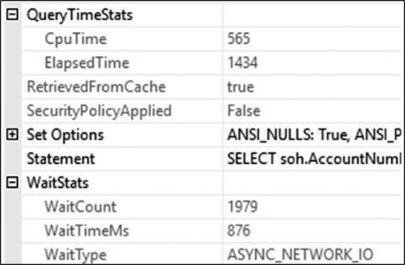  
    그림 9-26 실제 실행계획에 포함된 QueryTimeStats와 WaitStats 정보 

    이제 실제 실행 계획을 캡처하는 한 실행 계획 내에서 직접 쿼리에 대한 CpuTime 및 ElapsedTime을 볼 수 있습니다. 이 값은 밀리초 단위로 측정됩니다. 또한 조회를 기다리거나 대기하는 최상위를 볼 수 있습니다. 그림 9-26 예에서는 ASYNC_NETWORK_IO이며 네트워크에서 121,000행을 반환한다는 사실로 설명될 수 있습니다. (이상하다 캡처에는 보이지 않는데) 대기 통계는 1ms보다 긴 경우에만 표시됩니다. 이로 인해 실행 내에 표시되는 대기가 대기 캡처를 위한 다른 메커니즘만큼 정확하지 않습니다. 그러나 이것은 실행 계획 내에서 쿼리의 동작을 평가하는 데 도움이 되는 편리한 도구입니다.
    
    이것은 쿼리 성능을 확인하는 또 다른 빠르고 쉬운 방법을 제공합니다. 다른 연산자 중 하나를 보면 해당 연산자에 대한 I/O를 페이지 단위로 볼 수도 있습니다.

## <font color='dodgerblue' size="6">9.4 요약</font>      
이 장에서는 확장 이벤트를 사용하여 SQL 워크로드의 시스템 리소스에 많은 스트레스를 유발하는 쿼리를 식별할 수 있음을 확인했습니다. 세션 데이터 수집은 시스템 저장 프로시저를 사용하여 자동화될 수 있고 또 그래야 합니다. 실행 중인 쿼리에 대한 통계에 즉시 액세스하려면 DMV sys.dm_exec_query_stats(adhoc쿼리)와 sys.dm_exec_procedure_stats(프로시저)를 사용하십시오. Management Studio로 이러한 쿼리를 추가로 분석하여 쿼리 처리 전략에서 비용이 많이 드는 단계를 찾을 수 있습니다. 더 나은 성능을 위해서는 쿼리를 분석하는 동안 실행 계획에 사용되는 인덱스와 조인 메커니즘을 모두 고려하는 것이 중요합니다. SET STATISTICS IO**에서 제공하는 개별 테이블에 대한 데이터 검색(또는 읽기) 횟수는 가장 많이 읽은 테이블의 데이터 액세스 메커니즘에 집중하는 데 도움이 됩니다. 또한 CPU 비용과 가장 비용이 많이 드는 쿼리의 전체 시간에 집중해야 합니다. 비용이 많이 드는 쿼리를 식별하고 초기 분석을 마치면 다음 단계는 쿼리 성능을 최적화하는 것입니다. 인덱싱은 가장 일반적으로 사용되는 성능 조정 기술 중 하나이기 때문에 다음 장에서 설명합니다. SQL Server에서 사용할 수 있는 다양한 인덱싱 메커니즘에 대해 자세히 설명하겠습니다.