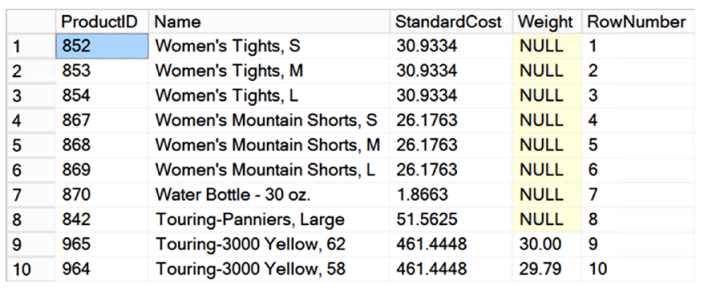
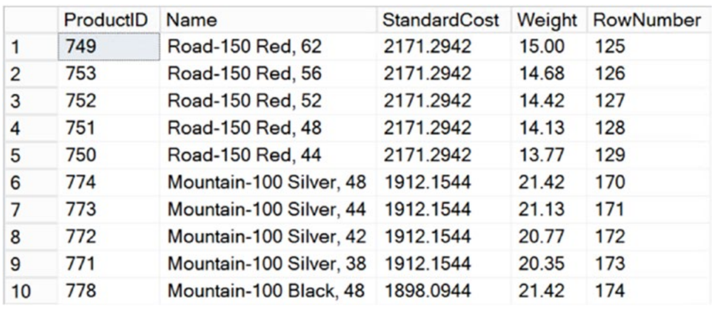

# 인덱스 아키텍처와 동작

정확한 열의 정확한 인덱스는 쿼리 튜닝 시작의 기본이다. 누락되거나 잘못된 열에 만들어진 인덱스는 모든 성능 문제의 원인이 될 수 있다. 이러한 이유로 DBA뿐 아니라 모든 사람이 데이터베이스 디자인을 최적화하는 데 사용할 수 있는 다양한 인덱싱 기술을 이해하는 것이 매우 중요하다.

이번 장에서는 다음 내용을 포함한다.

    - 인덱스란 무엇인가?
    - 인덱스의 이점과 그에 따른 오버헤드
    - 인덱스 디자인시 일반적인 권장사항
    - 클러스터드와 넌클러스터드 인덱스 비교와 동작
    - 클러스터드와 넌클러스터드 인덱스 권장사항

## <font color='dodgerblue' size="6">9.1 인덱스란 무엇인가?</font>

디스크 I/O를 줄이는 가장 좋은 방법 중 하나는 인덱스를 사용하는 것이다. 인덱스는 SQL Server가 전체 테이블 스캔하지 않고도 데이터를 찾을 수 있게 한다. 데이터베이스의 인덱스는 책의 색인과 유사하다. 예를 들어 이 책에서 "테이블 스캔" 이라는 구문을 찾고 싶다고 가정해 보자. 종이 책의 경우 책 뒷면에 색인이 없으면 필요한 텍스트를 찾기 위해 책 전체를 정독해야 한다. 인덱스를 사용하면 원하는 정보가 저장된 위치를 빠른 시간안에 정확히 찾을 수 있다.

성능을 위해 데이터베이스 튜닝을 하는 경우 쿼리 구문에 사용된 여러 컬럼들에 인덱스를 만들게 된다. 예를 들면 아래의 쿼리는 Production스키마를 사용한다.
```sql
SELECT TOP 10
    p.ProductID,
    p.[Name],
    p.StandardCost,
    p.[Weight],
    ROW_NUMBER() OVER (ORDER BY p.Name DESC) AS RowNumber
FROM Production.Product p
ORDER BY p.Name DESC;
```

  

    그림 10-1 샘플 Production.Product 테이블

앞의 쿼리는 WHERE 절이 없었기 때문에 전체 테이블을 스캔했다. StandardCost가 150보다 큰 모든 제품을 검색하기 위해 WHERE 절을 통해 필터를 추가해야 하는 경우 인덱스 없이 테이블을 계속 스캔해야 하며 각 행에서 StandardCost 값을 확인하여 값이 포함된 행을 확인해야 합니다. 150보다 큼. StandardCost 열의 인덱스는 행별 검사 대신 데이터에 대한 구조화된 검색을 허용하는 메커니즘을 제공하여 이 프로세스 속도를 높일 수 있습니다. 이 인덱스를 생성하기 위해 두 가지 서로 다른 근본적인 접근 방식을 사용할 수 있습니다.

    - 사전과 같이 : 마찬가지로 사전은 단어를 알파벳 순서로 나열한 별개의 목록입니다. 인덱스도 비슷한 방식으로 저장할 수 있습니다. 데이터는 순서대로 정렬되어 있지만 여전히 중복된 데이터가 있습니다. 이름 대신 StandardCost DESC를 기준으로 정렬된 처음 10개 행은 그림 8-2에 표시된 데이터와 같습니다. RowNumber 열은 이름별로 정렬할 때 행의 원래 위치를 표시합니다.

  

    그림 10-2 StandardCost로 정렬된 Product 테이블

    - 책의 인덱스 구조와 같이 : 따라서 이제 StandardCost가 150보다 큰 행의 모든 데이터를 찾으려면 인덱스를 사용하면 150보다 큰 첫 번째 값으로 이동하여 즉시 찾을 수 있습니다. 저장된 데이터에 순서를 적용하는 인덱스 인덱스 키 순서를 기반으로 하는 인덱스를 클러스터형 인덱스라고 합니다. SQL Server가 데이터를 저장하는 방식으로 인해 이는 데이터베이스 디자인에서 가장 중요한 인덱스 중 하나입니다. 이에 대해서는 이 장의 뒷부분에서 자세히 설명합니다.

    책의 색인 아키텍처와 유사: 책의 색인이 생성되는 방식과 유사하게 테이블의 레이아웃을 변경하지 않고 정렬된 목록을 생성할 수 있습니다. 책의 키워드 색인이 책의 주요 내용을 참조하기 위해 페이지 번호와 함께 별도의 섹션에 키워드를 나열하는 것처럼 StandardCost 값 목록은 별도의 구조로 생성되어 Product 테이블의 해당 행을 참조합니다. 포인터를 통해. 예를 들어 RowNumber를 포인터로 사용하겠습니다. 표 8-1은 제조업체 지수의 구조를 보여줍니다.

```
StandardCost    RowNumber
--------------- --------------------------
2171.2942       125
2171.2942       126
2171.2942       127
2171.2942       128
2171.2942       129
1912.1544       170                
```

    표 10-1 Manufacturer 인덱스의 구조