# 쿼리 저장소

쿼리 저장소는 원래 2015년에 Azure SQL Database에 처음 소개되었으며 SQL Server에는 2016버전에 도입되었다.

쿼리 저장소는 세 가지 주요한 기능.  

    1. 쿼리의 성능수치와 실행 계획 등을 데이터베이스의 별도 저장공간에 영구적으로 저장한 후 다양한 방법으로 쉽게 성능 정보 확인.  
    2. 쿼리 저장소는 실행 계획 동작을 직접 제어할수 있는데 쉽게 가능하도록.  
    3. 쿼리 저장소는 데이터베이스 업그레이드 시 시스템을 보호할 수 있는 위한 새로운 안전하며 보고기능이 있는 방식을 사용하여 쉽게 파악할 수 있도록 한다.  

이번 장에서는 다음과 같은 것을 설명할 예정이다.

    - 쿼리 저장소의 작동 방식 및 수집하는 정보 
    - 쿼리 저장소 동작에 대해 Management Studio를 통해 노출되는 보고서 및 메커니즘 
    - 실행계획 강제 적용과 같은 SQL Server 및 Azure SQL 데이터베이스에서 사용되는 실행 계획을 제어하는 방법
    - 시스템 활동을 보호하기 위한 업그레이드 방법

이전에는 쿼리의 세부문제까지 조사하기 위한 확장 이벤트라는 매우 좋은 수단이 있었지만 많은 지식이 필요했다. 이에 비해 쿼리 저장소는 대략적이지만 쿼리 성능정보를 쉽게 파악할 수 있기 때문에 우선적으로 사용하는 것이 좋다. 

## <font color='dodgerblue' size="6">13.1 쿼리 저장소 함수와 디자인</font>

쿼리 저장소는 시스템에 미치는 영향 측면에서는 아마도 가장 가벼운 메커니즘일 것이며 시스템의 쿼리 성능을 제대로 이해하는 데 필요한 핵심 정보를 제공한다. 또한 쿼리 저장소에 대한 모든 작업은 시스템 뷰를 이용해 수행되기 때문에 T-SQL을 사용하여 우리가 직접 쿼리할수 있다. 쿼리 에 대한 성능수치를 모니터링하기 위한 메커니즘으로 DMO, 추적 이벤트 및 어느 정도 확장 이벤트를 사용하는 것은 쿼리 저장소의 도입으로 인해 구식으로 간주될 수 있다.

- ### a. 쿼리 저장소 활동
쿼리 저장소는 두 가지 정보를 수집하는데 첫째로는 시스템에서 각 쿼리 동작의 집계된 정보를 수집한다. 둘째, 쿼리 저장소는 기본적으로 쿼리당 최대 계획 수(기본적으로 200개)까지 시스템에서 생성된 모든 실행 계획을 캡처하며 데이터베이스별로 쿼리 저장소를 켜고 끌 수 있다. 켜져 있으면 쿼리 저장소가 그림 13-1과 같이 작동합니다.

    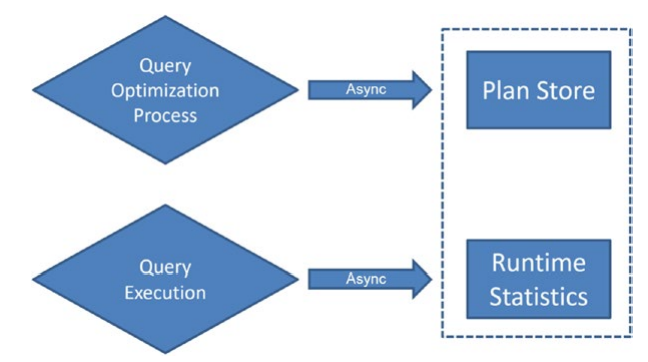  

    그림 13-1 데이터를 수집하는 쿼리 저장소 활동

쿼리 최적화 프로세스는 일반적으로 수행된다. 쿼리가 일단 시스템에 제출되면 실행 계획이 생성되고(자세한 내용은 15장 참조) 계획 캐시에 저장된다.(16장 참조). 이러한 프로세스가 완료되면 쿼리 저장소는 계획 캐시에서 실행 계획을 캡처하는 비동기적 작업을 수행한다. 처음에는 이러한 계획을 임시 저장을 위해 별도의 메모리에 기록한다. 그러면 다른 비동기 프로세스가 이러한 실행 계획을 데이터베이스의 쿼리 저장소에 기록한다. 이 모든 것은 시스템 내의 다른 프로세스에 미치는 영향이 0은 아니지만 최소화되도록 하는 비동기식 프로세스이며 이 프로세스의 흐름에 대한 유일한 예외는 이 장의 뒷부분에서 다룰 계획 강요입니다.    

그런 다음 다른 쿼리와 마찬가지로 쿼리 실행이 발생합니다. 쿼리 실행이 완료되면 읽기 수, 쓰기 수, 쿼리 기간 및 대기 통계와 같은 쿼리 런타임 메트릭이 다시 비동기식으로 별도의 메모리 공간에 기록됩니다. 나중에 다른 비동기 프로세스가 해당 정보를 디스크에 기록합니다. 수집되어 디스크에 기록된 정보가 집계됩니다. 기본 집계 시간은 60분 간격입니다. 쿼리 저장소 시스템 테이블 내에 저장된 모든 정보는 쿼리 저장소가 활성화된 데이터베이스에 영구적으로 기록됩니다. 쿼리 메트릭과 쿼리에 대한 실행 계획은 데이터베이스에 보관됩니다. 데이터베이스와 함께 백업되고 데이터베이스와 함께 복원됩니다. 시스템이 오프라인 상태가 되거나 장애 조치되는 경우 아직 메모리에 있고 아직 디스크에 기록되지 않은 일부 쿼리 저장소 정보가 손실될 수 있습니다. 디스크에 쓰는 기본 간격은 15분입니다. 이것이 집계 데이터라는 점을 고려하면 프로덕션 수준 데이터로 간주되지 않아야 하는 일부 쿼리 저장소 데이터 손실 가능성에 대해 나쁜 간격이 아닙니다. 쿼리 저장소에서 정보를 쿼리하면 메모리 데이터와 디스크에 기록된 데이터가 모두 결합됩니다. 해당 정보에 액세스하기 위해 추가 작업을 수행할 필요가 없습니다. 이 장의 나머지 부분을 계속하기 전에 일부 코드 및 처리를 따라하려면 데이터베이스 중 하나에서 쿼리 저장소를 활성화해야 합니다. 이 명령은 다음을 수행합니다.

```sql
ALTER DATABASE AdventureWorks2017 SET QUERY_STORE = ON;
```

따라갈 때 쿼리 저장소에 쿼리가 있는지 확인하기 위해 이 저장 프로시저를 사용해 보겠습니다.

```sql
CREATE OR ALTER PROC dbo.ProductTransactionHistoryByReference (
    @ReferenceOrderID int
)
AS
BEGIN
    SELECT p.Name,
        p.ProductNumber,
        th.ReferenceOrderID
    FROM Production.Product AS p
        JOIN Production.TransactionHistory AS th
            ON th.ProductID = p.ProductID
    WHERE th.ReferenceOrderID = @ReferenceOrderID;
END
```

이 세 가지 파라메터 값으로 저장 프로시저를 실행하고 매번 캐시에서 제거하면 실제로 세 가지 다른 실행 계획을 갖게 됩니다.

```sql
DECLARE @Planhandle VARBINARY(64);

EXEC dbo.ProductTransactionHistoryByReference @ReferenceOrderID = 0;

SELECT @Planhandle = deps.plan_handle
FROM sys.dm_exec_procedure_stats AS deps
WHERE deps.object_id = OBJECT_ID('dbo.ProductTransactionHistoryByReference');

IF @Planhandle IS NOT NULL
BEGIN
    DBCC FREEPROCCACHE(@Planhandle);
END

EXEC dbo.ProductTransactionHistoryByReference @ReferenceOrderID = 53465;

SELECT @Planhandle = deps.plan_handle
FROM sys.dm_exec_procedure_stats AS deps
WHERE deps.object_id = OBJECT_ID('dbo.ProductTransactionHistoryByReference');

IF @Planhandle IS NOT NULL
BEGIN
    DBCC FREEPROCCACHE(@Planhandle);
END

EXEC dbo.ProductTransactionHistoryByReference @ReferenceOrderID = 3849;
```

이로써 쿼리 저정소 안에 있는 정보를 얻을 수 있다는 것을 확인했다.

- ### b. 쿼리 저장소가 수집하는 정보
    쿼리 저장소는 상당히 좁지만 매우 풍부한 데이터 집합을 수집합니다. 그림 13-2는 시스템 테이블과 그 관계를 나타냅니다.

      

    그림 13-2 쿼리 저장소의 시스템 뷰

    쿼리 저장소에 저장된 정보는 두 가지 기본 집합으로 나뉩니다. 쿼리 텍스트, 실행 계획 및 쿼리 컨텍스트 설정을 포함하여 쿼리 자체에 대한 정보가 있습니다. 그런 다음 런타임 간격, 대기 통계 및 쿼리 런타임 통계로 구성된 런타임 정보가 있습니다. 쿼리에 대한 정보부터 시작하여 정보의 각 섹션에 개별적으로 접근할 것입니다.

    1. 쿼리 정보
        쿼리 저장소의 핵심 데이터는 쿼리 자체입니다. 쿼리는 저장 프로시저 또는 일괄 처리의 일부일 수 있지만 독립적입니다. 기본 쿼리 텍스트와 주어진 쿼리를 식별할 수 있는 query_hash 값(쿼리 텍스트의 해시)으로 귀결됩니다. 그런 다음 이 데이터는 쿼리 계획 및 실제 쿼리 텍스트와 결합됩니다. 그림 11-3은 기본 구조와 일부 데이터를 보여줍니다.

        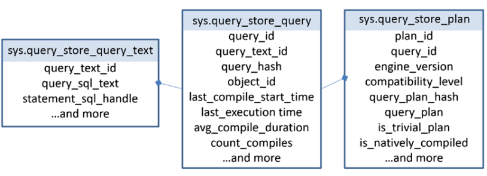  

        그림 13-3 쿼리저장소에 저장되는 정보

        쿼리 저장소가 활성화된 데이터베이스의 기본 파일 그룹에 저장된 시스템 테이블입니다. Management Studio 인터페이스에 내장된 우수한 보고서가 있지만 고유한 쿼리를 작성하여 쿼리 저장소의 정보에 액세스할 수 있습니다. 예를 들어 이 쿼리는 실행 계획과 함께 지정된 저장 프로시저에 대한 모든 쿼리 문을 검색할 수 있습니다.

        ```sql
        SELECT qsq.query_id,
            qsq.object_id,
            qsqt.query_sql_text,
            CAST(qsp.query_plan AS XML) AS QueryPlan
        FROM sys.query_store_query AS qsq
            JOIN sys.query_store_query_text AS qsqt
                ON qsq.query_text_id = qsqt.query_text_id
            JOIN sys.query_store_plan AS qsp
                ON qsp.query_id = qsq.query_id
        WHERE qsq.object_id = OBJECT_ID('dbo.ProductTransactionHistoryByReference');
        ```

        각각의 개별 쿼리 문이 쿼리 저장소 내에 저장되는 동안 object_id도 가져오므로 내가 정보를 검색하기 위해 수행한 것처럼 OBJECT_ID()와 같은 함수를 사용할 수 있습니다. 또한 query_plan 열에서 CAST 명령을 사용해야 했습니다. 이는 쿼리 저장소가 이 열을 XML이 아닌 텍스트로 올바르게 저장하기 때문입니다. SQL Server의 XML 데이터 형식에는 두 개의 열이 필요한 중첩 제한이 있습니다. 요구 사항을 충족하는 열은 XML이고 그렇지 않은 열은 NVARCHAR(MAX)입니다. 쿼리 저장소를 구축할 때 설계상 해당 문제를 해결했습니다. 실행 계획을 보기 위해 그림 11-4와 유사하게 결과를 클릭할 수 있으려면 이전에 했던 것처럼 CAST를 사용해야 합니다.

        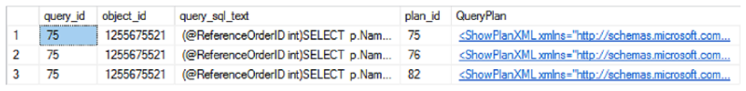  

        그림 13-4 T-SQL을 이용해 쿼리 저장소의 정보 알아내기

        이 경우 단일 쿼리인 query_id = 75는 단일 문 저장 프로시저이며 세 가지 다른 plan_id 값으로 식별되는 세 가지 실행 계획이 있습니다. 이 계획은 잠시 후에 살펴보겠습니다. 쿼리 저장소의 결과에서 주목해야 할 또 다른 사항은 텍스트가 저장되는 방식입니다. 이 문은 매개 변수가 있는 저장 프로시저의 일부이므로 T-SQL 텍스트에 사용되는 매개 변수 값이 정의됩니다. 다음은 쿼리 저장소 내에서 명령문의 모습입니다(형식은 그대로 유지).

        ```sql
        (@ReferenceOrderID int)SELECT p.Name,       p.ProductNumber,
                    th.ReferenceOrderID FROM Production.Product
        AS p    JOIN Production.TransactionHistory AS
        th          ON th.ProductID = p.ProductID   WHERE
        th.ReferenceOrderID = @ReferenceOrderID
        ```

        문의 시작 부분에 있는 매개변수 정의에 유의하십시오. 앞에서 언급한 대로 실제 저장 프로시저 정의는 다음과 같습니다.

        ```sql
        CREATE OR ALTER PROC dbo.ProductTransactionHistoryByReference (
        @ReferenceOrderID int
        )
        AS
        BEGIN
            SELECT p.Name,
                    p.ProductNumber,
                    th.ReferenceOrderID
            FROM Production.Product AS p
            JOIN Production.TransactionHistory AS th
                ON th.ProductID = p.ProductID
            WHERE th.ReferenceOrderID = @ReferenceOrderID;
        END
        ```

        프로시저 내의 문과 쿼리 저장소에 저장된 문은 다릅니다. 이로 인해 쿼리 저장소 내에서 특정 쿼리를 찾으려고 시도할 때 몇 가지 문제가 발생할 수 있습니다. 다음과 같은 다른 예를 살펴보겠습니다.

        ```sql
        SELECT a.AddressID,
            a.AddressLine1
        FROM Person.Address AS a
        WHERE a.AddressID = 72;
        ```

        저장 프로시저가 아닌 일괄 처리입니다. 이것을 처음 실행하면 앞에서 설명한 프로세스를 사용하여 쿼리 저장소에 로드됩니다. 다음과 같이 이 명령문에 대한 정보를 검색하기 위해 일부 T-SQL을 실행하면 아무 것도 반환되지 않습니다.

        ```sql
        SELECT qsq.query_id,
        qsq.query_hash,
        qsqt.query_sql_text
        FROM sys.query_store_query AS qsq
        JOIN sys.query_store_query_text AS qsqt
        ON qsqt.query_text_id = qsq.query_text_id
        WHERE qsqt.query_sql_text = 'SELECT a.AddressID,
        a.AddressLine1
        FROM Person.Address AS a
        WHERE a.AddressID = 72;';
        ```

        이 명령문은 매우 단순했기 때문에 옵티마이저는 단순 매개변수화라는 프로세스를 수행할 수 있었습니다. 다행히 쿼리 저장소에는 자동 매개 변수화를 처리하는 기능인 sys.fn_stmt_sql_handle_from_sql_stmt가 있습니다. 이 기능을 사용하면 다음과 같이 쿼리에서 정보를 찾을 수 있습니다.

        ```sql
        SELECT qsq.query_id,
        qsq.query_hash,
        qsqt.query_sql_text,
        qsq.query_parameterization_type
        FROM sys.query_store_query_text AS qsqt
        JOIN sys.query_store_query AS qsq
        ON qsq.query_text_id = qsqt.query_text_id
        JOIN sys.fn_stmt_sql_handle_from_sql_stmt(
        'SELECT a.AddressID,
        a.AddressLine1
        FROM Person.Address AS a
        WHERE a.AddressID = 72;',
        2) AS fsshfss
        ON fsshfss.statement_sql_handle = qsqt.statement_sql_handle;
        ```

        이것이 작동하려면 형식과 공백이 모두 동일해야 합니다. 하드 코딩된 값은 변경될 수 있지만 나머지는 모두 동일해야 합니다. 쿼리를 실행하면 그림 11-5와 같이 표시됩니다.

        

        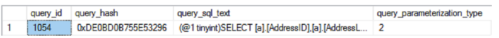  

        그림 13-5 간단한 파라메터화 결과

        단순 매개변수화를 위한 매개변수 값이 저장 프로시저와 마찬가지로 텍스트에 추가된 query_sql_text 열에서 볼 수 있습니다. 나쁜 소식은 sy.fn_stmt_sql_handl_from_sql_stmt가 현재 자동 매개변수화에서만 작동한다는 것입니다. 다른 소스에서 매개변수화된 명령문을 찾는 데 도움이 되지 않습니다. 해당 정보를 검색하려면 LIKE 명령을 사용하여 텍스트를 검색하거나 이전에 했던 것처럼 저장 프로시저에서 쿼리에 object_id를 사용해야 합니다.

    2. 쿼리 런타임 데이터
        쿼리 및 계획에 대한 정보를 검색한 후 다음으로 원하는 것은 런타임 메트릭을 보는 것입니다. 런타임 메트릭을 이해하는 데는 두 가지 핵심이 있습니다. 첫째, 메트릭은 쿼리가 아닌 계획에 다시 연결됩니다. 각 계획은 서로 다른 조인 유형 및 나머지 모든 인덱스에 대해 서로 다른 작업으로 다르게 작동할 수 있으므로 런타임 데이터 및 대기 통계를 캡처한다는 것은 다시 계획에 연결된다는 것을 의미합니다. 둘째, 런타임 및 대기 통계가 집계되지만 런타임 간격으로 집계됩니다. 런타임 간격의 기본값은 60분입니다. 즉, 각 런타임 간격에 대한 각 계획에 대해 서로 다른 메트릭 집합을 갖게 됩니다.

        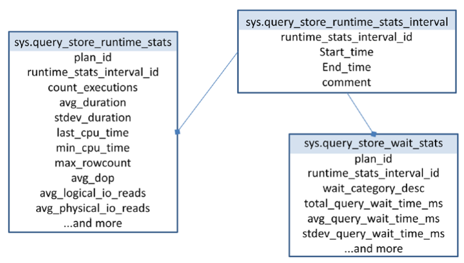  
        그림 13-6 런타임과 대기 통계를 담고 있는 시스템 테이블

        런타임 메트릭을 쿼리하기 시작하면 쿼리 자체에 대한 정보와 쉽게 결합할 수 있습니다. 간격을 처리해야 하며 간격을 처리하는 가장 좋은 방법은 간격을 그룹화하고 집계하고 평균의 평균을 구하는 것입니다. 고통스러워 보일 수 있지만 정보가 왜 그런 식으로 분해되는지 이해해야 합니다. 쿼리 성능을 볼 때 현재 성능, 기대 성능, 변경 후 향후 성능과 같은 여러 수치가 필요합니다. 비교할 수 있는 이러한 수치가 없으면 무언가가 느린지 또는 개선되었는지 알 수 없습니다. 쿼리 저장소의 정보도 마찬가지입니다. 모든 것을 간격으로 나누면 오늘과 어제, 한 순간을 다른 순간과 비교할 수 있습니다. 이를 통해 성능이 진정으로 저하(또는 개선)되었는지, 어제 더 빠르게/느리게 실행되었는지 등을 알 수 있습니다. 평균만 있고 시간 경과에 따른 평균이 없으면 시간이 지남에 따라 행동이 어떻게 변하는지 알 수 없습니다. 시간 간격을 사용하면 캐시 쿼리의 사용 편의성과 결합된 확장 이벤트를 사용하여 메트릭을 직접 캡처하는 세분성을 얻을 수 있습니다.

        특정 시점의 성능 메트릭을 검색하는 쿼리는 다음과 같이 작성할 수 있습니다.
        ```sql
        DECLARE @CompareTime DATETIME = '2017-11-28 21:37';

        SELECT CAST(qsp.query_plan AS XML),
        qsrs.count_executions,
        qsrs.avg_duration,
        qsrs.stdev_duration,
        qsws.wait_category_desc,
        qsws.avg_query_wait_time_ms,
        qsws.stdev_query_wait_time_ms
        FROM sys.query_store_plan AS qsp
            JOIN sys.query_store_runtime_stats AS qsrs
                ON qsrs.plan_id = qsp.plan_id
            JOIN sys.query_store_runtime_stats_interval AS qsrsi
                ON qsrsi.runtime_stats_interval_id = qsrs.runtime_stats_interval_id
            JOIN sys.query_store_wait_stats AS qsws
                ON qsws.plan_id = qsrs.plan_id
                    AND qsws.execution_type = qsrs.execution_type
                    AND qsws.runtime_stats_interval_id = qsrs.runtime_stats_interval_id
        WHERE qsq.object_id = OBJECT_ID('dbo.ProductTransactionHistoryByReference')
            AND @CompareTime BETWEEN qsrsi.start_time
            AND qsrsi.end_time;
        ```

        
        이것을 분해합시다. sys.query_store_plan에서 이전 쿼리와 마찬가지로 쿼리 계획으로 시작하고 있음을 알 수 있습니다. 그런 다음 이를 평균 기간 및 기간의 표준 편차와 같은 모든 런타임 메트릭이 있는 테이블(sys.query_store_runtime_stats)과 결합합니다. 특정 시간을 기준으로 필터링하려고 하므로 해당 데이터가 저장된 sys.query_store_runtime_stats_interval 테이블에 조인해야 합니다. 그런 다음 sys.query_store_ wait_stats에 가입합니다. 거기에서 대기와 런타임 통계, plan_id, execution_type 및 runtime_stats_interval_id를 직접 연결하는 복합 키를 사용해야 합니다. 이 장 앞부분의 plan_id를 사용하고 있으며 특정 시간 범위를 반환하도록 데이터를 설정하고 있습니다. 그림 11-7은 결과 데이터를 보여줍니다.


        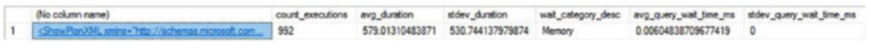  
        그림 13-7 한 시간 간격으로 한 쿼리에 대한 런타임 메트릭 및 대기 통계

        query_store_wait_stats 및 query_store_runtime_stats의 정보가 집계되는 방식을 이해하는 것이 중요합니다. 단순히 runtime_stats_interval_id 및 plan_id에 의한 것이 아닙니다. 주어진 쿼리에 오류가 있거나 취소될 수 있기 때문에 execution_type도 집계를 결정합니다. 이것은 쿼리가 동작하고 데이터가 수집되는 방식에 영향을 미치므로 한 동작 세트를 다른 동작 세트와 구별하기 위해 성능 메트릭에 포함됩니다. 다음 스크립트를 실행하여 확인해 보겠습니다.

        ```sql
        SELECT *
        FROM sys.columns AS c,
            sys.syscolumns AS s;
        ```

        이 스크립트는 카티젼 프로덕트 조인을 생성하고 내 시스템에서 실행하는 데 약 2분이 걸립니다. 쿼리가 한 번 실행되는 동안 취소하고 한 번 완료되면 쿼리 저장소에 무엇이 있는지 볼 수 있습니다.

        ```sql
        SELECT qsqt.query_sql_text,
            qsrs.execution_type,
            qsrs.avg_duration
        FROM sys.query_store_query AS qsq
            JOIN sys.query_store_query_text AS qsqt        ON qsqt.query_text_id = qsq.query_text_id
            JOIN sys.query_store_plan AS qsp        ON qsp.query_id = qsq.query_id
            JOIN sys.query_store_runtime_stats AS qsrs        ON qsrs.plan_id = qsp.plan_id
        WHERE qsqt.query_sql_text like '%FROM sys.columns AS c%';
        ```

        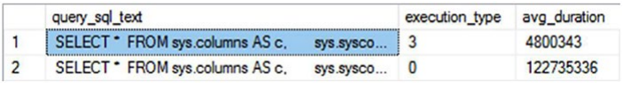  
        그림 13-8 다른 실행 유형으로 표시되는 중단된 실행

        중단된 쿼리와 다른 유형을 표시하는 오류가 있는 쿼리가 표시됩니다. 또한 런타임 메트릭 내의 기간, 대기 등은 별도로 저장됩니다. 각각의 두 테이블에서 적절한 대기 및 기간 측정 세트를 얻으려면 execution_type을 포함해야 합니다. 지정된 쿼리에 대한 모든 쿼리 메트릭에 관심이 있는 경우 다음과 같이 쿼리 저장소에서 정보를 검색할 수 있습니다.

        ```sql
        WITH QSAggregate
        AS (
            SELECT qsrs.plan_id,
            SUM(qsrs.count_executions) AS CountExecutions,
            AVG(qsrs.avg_duration) AS AvgDuration,
            AVG(qsrs.stdev_duration) AS StdDevDuration,
            qsws.wait_category_desc,
            AVG(qsws.avg_query_wait_time_ms) AS AvgWaitTime,
            AVG(qsws.stdev_query_wait_time_ms) AS StDevWaitTime
            FROM sys.query_store_runtime_stats AS qsrs
            JOIN sys.query_store_wait_stats AS qsws
            ON qsws.plan_id = qsrs.plan_id
            AND qsws.runtime_stats_interval_id = qsrs.runtime_stats_
            interval_id
            GROUP BY qsrs.plan_id,
            qsws.wait_category_desc
            )
        SELECT CAST(qsp.query_plan AS XML),
            qsa.*
        FROM sys.query_store_plan AS qsp
            JOIN QSAggregate AS qsa     ON qsa.plan_id = qsp.plan_id
        WHERE qsq.object_id = OBJECT_ID('dbo.ProductTransactionHistoryByReference');
        ```


        이 쿼리의 결과는 지정된 plan_id에 대한 쿼리 저장소 내에 현재 포함된 모든 정보입니다. 앞으로 필요한 방식으로 쿼리 저장소 내의 정보를 결합할 수 있습니다. 다음으로 쿼리 저장소를 제어해 보겠습니다.
- ### c. 쿼리 저장소 컨트롤하기
    데이터베이스에 대해 쿼리 저장소를 활성화하는 방법을 이미 살펴보았습니다. 쿼리 저장소를 비활성화하려면 유사한 작업이 작동합니다.

    ```sql
    ALTER DATABASE AdventureWorks2017 SET QUERY_STORE = OFF;
    ```

    이 명령은 쿼리 저장소를 비활성화하지만 쿼리 저장소 정보를 제거하지는 않습니다. 쿼리 저장소에서 수집하고 관리하는 해당 데이터는 다시 부팅, 장애 조치, 백업 및 데이터베이스가 오프라인 상태가 되어도 지속됩니다. 쿼리 저장소를 비활성화한 후에도 지속됩니다. 쿼리 저장소 데이터를 제거하려면 다음과 같이 직접 제어해야 합니다.

    ```sql
    ALTER DATABASE AdventureWorks2017 SET QUERY_STORE CLEAR;
    ```

    그러면 쿼리 저장소에서 모든 데이터가 제거됩니다. 원하는 경우 더 선택적으로 얻을 수 있습니다. 주어진 쿼리를 간단히 제거할 수 있습니다.
    ```sql
    EXEC sys.sp_query_store_remove_query @query_id = @queryid;
    ```

    특정한 쿼리 플랜을 제거할수 있다.
    ```sql
    EXEC sys.sp_query_store_remove_plan @plan_id = @PlanID;
    ```

    성능 수치를 리셋할수 있다.
    ```sql
    EXEC sys.sp_query_store_reset_exec_stats @plan_id = @PlanID;
    ```
    이 모든 것은 제어하려는 계획이나 쿼리를 추적하기만 하면 됩니다. 그러면 그렇게 할 수 있습니다. 캐시에 기록되었지만 아직 디스크에 기록되지 않은 쿼리 저장소의 데이터를 보존하려는 경우도 있습니다. 캐시를 강제로 플러시할 수 있습니다.
    ```sql
    EXEC sys.sp_query_store_flush_db;
    ```

    마지막으로 쿼리 저장소 내에서 기본 설정을 변경할 수 있습니다. 첫째, 해당 정보를 얻기 위해 어디로 가야 하는지 아는 것이 좋습니다. 다음을 실행하여 데이터베이스별로 쿼리 저장소의 현재 설정을 검색합니다.

    ```sql
    SELECT * FROM sys.database_query_store_options AS dqso;
    ```    

    쿼리 저장소의 다른 많은 측면과 마찬가지로 이러한 설정은 데이터베이스 수준에서 제어됩니다. 예를 들어, 다른 데이터베이스가 아닌 한 데이터베이스에서만 통계 집계 시간 간격을 변경할 수 있습니다. 쿼리 저장소 설정의 다양한 측면을 제어하는 것은 단순히 다음 쿼리를 실행하는 문제입니다.

    ```sql
    ALTER DATABASE AdventureWorks2017 SET QUERY_STORE (MAX_STORAGE_SIZE_MB = 200);
    ```

    이 명령은 쿼리 저장소의 기본 저장소 크기를 100MB에서 200MB로 변경하여 변경된 데이터베이스에 더 많은 공간을 허용합니다. 이러한 변경을 수행할 때 서버를 재부팅할 필요가 없습니다. 또한 계획 캐시에 있는 계획의 동작이나 수정 중인 데이터베이스 내 쿼리 처리의 다른 부분에 영향을 주지 않습니다. 기본 설정은 대부분의 상황에서 대부분의 사람들에게 적합해야 합니다. 상황에 따라 쿼리 저장소가 작동하는 방식을 수정할 수 있습니다. 이러한 변경 사항을 적용할 때 서버를 모니터링하여 서버에 부정적인 영향을 미치지 않았는지 확인하십시오.

    기본적으로 변경할 것을 제안하는 유일한 설정은 쿼리 저장소 캡처 모드입니다. 기본적으로 호출 빈도, 실행 시간 또는 기타 설정에 관계없이 모든 쿼리와 모든 쿼리 계획을 캡처합니다. 우리 중 많은 사람들에게 이 행동은 적절합니다. 그러나 Optimize for Ad Hoc을 사용하도록 시스템 설정을 변경한 경우 임시 쿼리가 많이 발생하고 메모리 사용을 관리하려고 하기 때문에 이렇게 한 것입니다(자세한 내용은 16장 참조). 이 설정은 모든 단일 계획을 캡처하는 데 덜 관심이 있음을 의미합니다. 거래량 때문에 모든 단일 쿼리 또는 계획을 캡처하고 싶지 않은 상황에 처할 수도 있습니다. 이러한 상황에서는 쿼리 저장소 캡처 모드 설정을 변경해야 할 수 있습니다. 다른 옵션은 없음 및 자동입니다. None은 쿼리 저장소가 쿼리 및 메트릭을 캡처하는 것을 중지하지만 쿼리에 대해 계획 강제 실행을 설정한 경우 여전히 계획 강제 실행을 허용합니다(이 장의 뒷부분에서 계획 강제 실행에 대한 세부 정보를 찾을 수 있음). 자동은 특정 시간 동안 실행되거나 특정 양의 리소스를 소비하거나 특정 횟수만큼 호출되는 쿼리만 캡처합니다. 이러한 값은 모두 Microsoft에서 변경될 수 있으며 쿼리 저장소 내에서 내부적으로 제어됩니다. 여기서는 값을 제어할 수 없으며 사용 여부만 제어할 수 있습니다. 대부분의 시스템에서 소음과 오버헤드를 줄이기 위해 모두에서 자동으로 변경하는 것이 좋습니다. 그러나 이것은 절대적으로 개인적인 결정이며 귀하의 상황에 따라 다를 수 있습니다.

    SQL Server Management Studio GUI를 사용하여 쿼리 저장소를 제어할 수도 있습니다. 개체 탐색기 창에서 데이터베이스를 마우스 오른쪽 단추로 클릭하고 상황에 맞는 메뉴에서 속성을 선택합니다. 속성 창이 열리면 쿼리 저장소 창을 클릭하면 그림 11-9와 유사한 내용이 표시됩니다.

    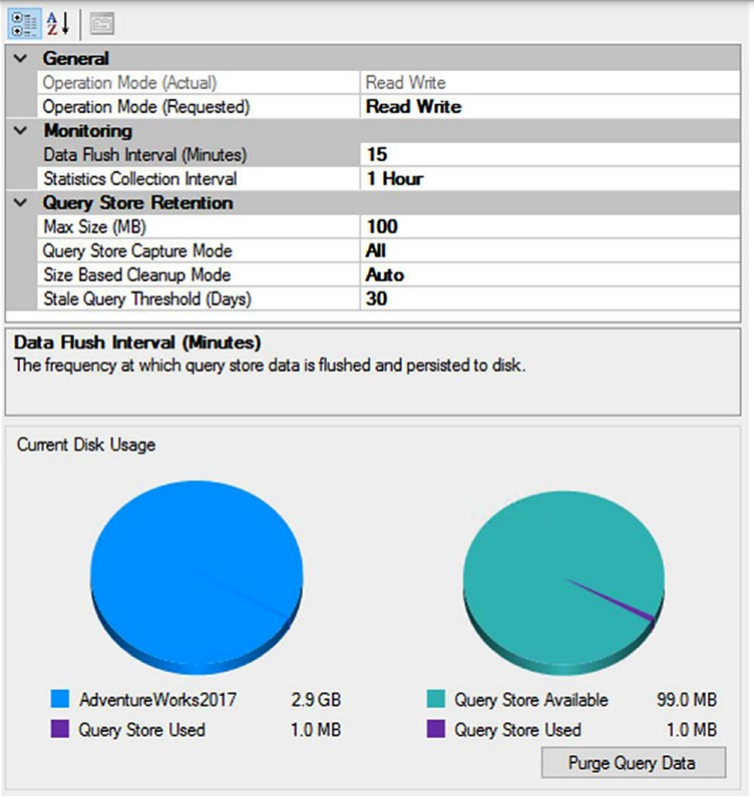  

    그림 13-09 쿼리 저장소 조절하는 SSMS GUI

    이 장의 쿼리 저장소 탐색에서 이미 다룬 일부 설정을 즉시 볼 수 있습니다. 또한 쿼리 저장소가 사용하는 데이터의 양과 할당된 공간에 남은 공간을 확인할 수 있습니다. 이전에 표시된 T-SQL 명령을 사용할 때와 마찬가지로 여기에서 수행한 모든 변경 사항은 쿼리 저장소 동작에 즉시 반영되며 어떤 종류의 시스템 재부팅도 필요하지 않습니다.


## <font color='dodgerblue' size="6">13.2 쿼리 저장소 리포팅</font>

일부 작업에서는 T-SQL을 사용하여 쿼리 저장소를 직접 제어하고 시스템 테이블을 사용하여 쿼리 저장소에 대한 데이터를 검색하는 것이 선호되는 접근 방식이 될 것입니다. 그러나 정상적인 작업 비율을 위해 쿼리 저장소로 작업할 때 기본 제공 보고서와 해당 동작을 활용할 수 있습니다. 이러한 보고서를 보려면 Management Studio의 개체 탐색기 창에서 데이터베이스를 확장하기만 하면 됩니다. 쿼리 저장소가 활성화된 모든 데이터베이스의 경우 그림 11-10과 같이 보고서가 표시되는 새 폴더가 있습니다.

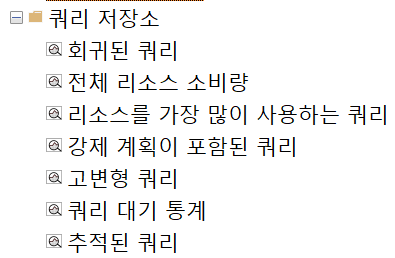  

그림 13-10 AdventureWorks2017 데이터베이스의 쿼리 저장소 보고서

이 리포트는 다음 정보를 포함한다.

    - 회귀된 쿼리: 시간이 지남에 따라 성능이 부정적인 방식으로 변경된 쿼리를 볼 수 있습니다.
    - 전체 리소스 소비량: 이 보고서는 정의된 기간 동안 다양한 쿼리의 리소스 소비를 보여줍니다. 기본값은 지난 달입니다.
    - 리소스를 가장 많이 사용하는 쿼리: 여기에서 기간에 관계없이 가장 많은 리소스를 사용하는 쿼리를 찾을 수 있습니다.
    - 강제 계획이 포함된 쿼리: 강제 계획이 있는 것으로 정의한 모든 쿼리가 이 보고서에 표시됩니다.
    - 고변형 쿼리: 이 보고서는 런타임 통계에서 변동이 심한 쿼리를 표시하며 실행 계획이 둘 이상인 경우가 많습니다.
    - 쿼리 대기 통계 :
    - 추적된 쿼리: 쿼리 저장소를 사용하면 관심 있는 쿼리를 정의할 수 있으며 다른 보고서에서 추적을 시도하는 대신 쿼리를 표시하고 여기에서 찾을 수 있습니다.
    
이러한 각 보고서는 고유하며 각기 다른 목적에 유용하지만 모든 보고서를 자세히 살펴볼 시간과 공간이 없습니다. 대신 리소스를 많이 사용하는 쿼리 중 하나의 동작에 초점을 맞추겠습니다. 이는 일반적으로 다른 모든 쿼리의 동작을 나타내고 상당히 자주 사용할 가능성이 높기 때문입니다. 보고서를 열면 그림 13-11과 유사한 내용이 표시됩니다.

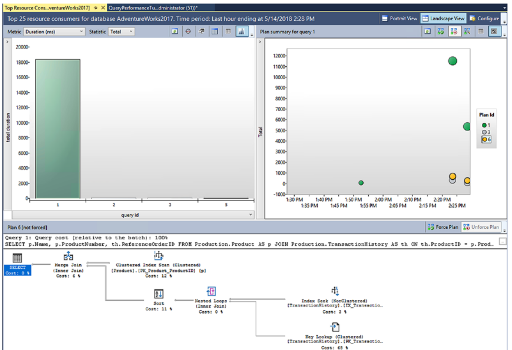  

그림 13-11 쿼리 저장소의 Top 25 리소스 소비자

보고서에는 세 개의 창이 있습니다. 왼쪽 상단의 첫 번째는 query_id 값으로 집계된 쿼리를 보여줍니다. 오른쪽의 두 번째 창에는 시간 경과에 따른 다양한 쿼리 동작과 해당 쿼리에 대한 다양한 계획이 표시됩니다. 첫 번째 창에서 강조 표시된 첫 번째 쿼리에 세 가지 다른 실행 계획이 있음을 알 수 있습니다. 이러한 계획 중 하나를 클릭하면 화면 하단의 세 번째 창에서 해당 계획이 열립니다. 기본 동작으로 제한되지 않습니다. 기본적으로 기간별로 집계된 쿼리를 표시하는 첫 번째 창은 다른 두 개를 구동합니다. 그림 13-12와 같이 화면 상단에 현재 13개의 선택 항목을 제공하는 드롭다운이 있습니다.

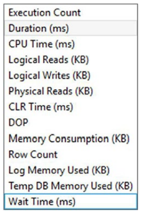  

그림 13-12 Top 25 리소스 소비자 리포트의 다른 집계 기준

그 중 하나를 선택하면 보고서에 대해 집계되는 값이 변경됩니다. 다른 드롭다운을 사용하여 보고서가 집계되는 방식을 변경할 수도 있습니다. 이 목록에는 평균, 최소값, 최대값, 총계 및 표준 편차가 포함됩니다. 첫 번째 창의 추가 기능에는 그리드 형식으로 변경하고, 나중에 추적할 쿼리를 표시하고(추적된 쿼리 보고서에서) 보고서를 새로 고치고 쿼리 텍스트를 보는 기능이 포함됩니다. 이 모든 것은 성능 문제를 확인하기 위해 작업할 때 시간을 할애할 쿼리를 식별하는 데 유용합니다.

다음 창에는 첫 번째 창에서 선택한 항목의 성능 메트릭이 표시됩니다. 각 점은 특정 시점과 특정 실행 계획을 모두 나타냅니다. 그림 11-13의 정보는 오전 8시 45분부터 오전 9시 45분까지 쿼리 성능이 어떻게 변했는지, 그리고 해당 시간 프레임 동안 쿼리의 성능 및 실행 계획이 어떻게 변경되었는지 보여줍니다.

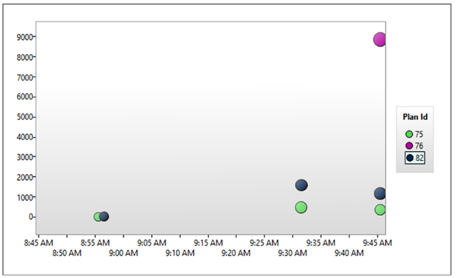  

그림 13-13 하나의 쿼리가 다른 성능과 다른 실행계획을 가지는 경우

각 점의 크기는 주어진 시간 프레임 내에서 주어진 계획의 실행 횟수에 해당합니다. 주어진 점 위로 마우스를 가져가면 해당 시점에 대한 추가 정보가 표시됩니다. 그림 11-14는 오전 9시 45분 시간대에 화면 상단에 있는 점 plan_id = 76에 대한 정보를 보여줍니다.

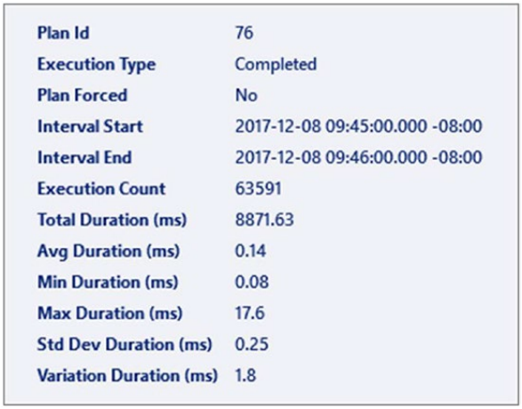  

그림 13-14 주어진 플랜에 대한 상세한 정보

해당 쿼리에 대한 특정 계획에 대한 실행 수 및 기타 메트릭을 볼 수 있습니다. 어떤 점을 클릭하든 최종 창에서 해당 점에 대한 실행 계획을 볼 수 있습니다. 표시된 실행 계획은 Management Studio 내의 다른 그래픽 계획과 마찬가지로 작동하므로 여기에서는 동작을 자세히 설명하지 않겠습니다. 여기에 표시되는 추가 기능 중 하나는 계획을 강제 실행하는 기능입니다. 그림 11-15와 같이 실행 계획 창의 오른쪽 상단에 두 개의 버튼이 표시됩니다.

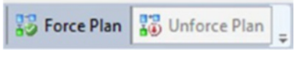  

그림 13-15 리포트로부터 계획 강제 적용 및 해제

보고서에서 직접 계획을 강제 적용하거나 강제 해제할 수 있습니다. 계획 강요에 대해서는 다음 섹션에서 자세히 다루겠습니다.

## <font color='dodgerblue' size="6">13.3 계획 강제 적용</font>
쿼리 저장소와 관련된 대부분의 기능은 쿼리 및 쿼리 계획의 동작을 수집하고 관찰하는 것과 관련이 있지만 한 가지 기능이 모든 것을 변경하는 계획 적용입니다. 강제 계획은 특정 계획을 SQL Server에서 사용할 계획으로 표시하는 곳입니다. 쿼리 저장소 내의 모든 항목은 데이터베이스에 기록되므로 재부팅, 백업 등을 유지하므로 지정된 계획이 항상 사용되도록 할 수 있습니다. 이 프로세스는 그림 11-16에 표시된 대로 쿼리 저장소가 최적화 프로세스 및 계획 캐시와 상호 작용하는 방식을 어느 정도 변경합니다.

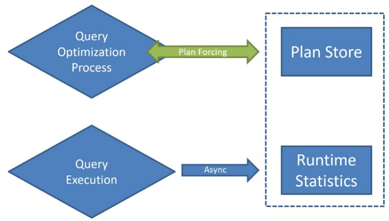  

그림 13-16 계획 강제적용이 추가된 쿼리 최적화 절차

이제 계획이 강제 실행된 것으로 표시된 경우 옵티마이저가 프로세스를 완료할 때 쿼리와 함께 사용하기 위해 계획을 캐시에 저장하기 전에 먼저 쿼리 저장소의 계획을 확인합니다. 이 쿼리에 강제 계획이 있는 경우 해당 계획이 항상 대신 사용됩니다. 이에 대한 유일한 예외는 해당 계획이 쿼리에 대해 유효하지 않은 계획이 되도록 시스템 내부에서 무언가가 변경된 경우입니다. 강제 계획의 기능은 실제로 매우 간단합니다. plan_id 및 query_id를 제공해야 하며 계획을 강제 실행할 수 있습니다. 예를 들어 내 시스템에는 구문, 쿼리 해시 및 쿼리 설정이 query_id 값 75와 일치하는 쿼리에 대해 세 가지 가능한 계획이 있습니다. 쿼리를 표시하기 위해 query_id를 사용하는 동안 이는 인공 키입니다. 쿼리의 식별 요소는 텍스트, 해시 및 컨텍스트 설정입니다. 계획을 강제하는 쿼리는 매우 간단합니다.

```sql
EXEC sys.sp_query_store_force_plan 75,82;
```

그것이 필요한 전부입니다. 이 시점부터 쿼리를 다시 컴파일하거나 캐시에서 제거하더라도 최적화 프로세스가 완료되면 plan_id 82에 해당하는 계획이 사용됩니다. 이를 통해 그림 11-17과 같이 강제 계획이 있는 쿼리 보고서를 보고 무엇이 표시되는지 확인할 수 있습니다.

  

그림 13-17 계획 강제적용이 쿼리 리포트

전반적으로 이 보고서는 상위 리소스 소비 쿼리 보고서와 동일하지만 차이점이 있음을 알 수 있습니다. 첫 번째 창의 쿼리 목록은 바로 쿼리 목록입니다. 두 번째 창은 그림 11-11 및 11-13에 표시된 이전 창과 거의 정확하게 일치합니다. 그러나 차이점은 강제로 표시된 계획에는 체크 표시가 있다는 것입니다. 최종 창은 한 가지 사소한 차이를 제외하고 동일합니다. 상단에서 Force Plan이 활성화되는 대신 Unforce Plan이 활성화됩니다. 해당 버튼을 클릭하여 여기에서 계획을 쉽게 강제 해제할 수 있습니다. 단일 명령으로 계획을 실행 취소할 수도 있습니다.

```sql
EXEC sys.sp_query_store_unforce_plan 214,248;
```

버튼을 클릭할 때와 마찬가지로 계획 적용이 중지됩니다. 이 시점부터 최적화 프로세스는 정상으로 돌아갑니다. 매개변수 스니핑에 대해 이야기하는 17장에 도달할 때까지 계획 강요에 대한 전체 데모를 저장하겠습니다. 잘못된 매개변수 스니핑을 처리할 때 계획 강제 적용이 매우 유용하다고 말하는 것으로 충분합니다. 또한 SQL Server의 변경 사항으로 인해 이전에 제대로 작동하던 쿼리가 갑자기 성능이 좋지 않은 실행 계획을 생성하는 상황인 회귀를 처리할 때 유용합니다. 호환성 모드가 테스트 없이 변경될 때 업그레이드 중에 가장 자주 발생합니다.

## <font color='dodgerblue' size="6">13.4 업그레이드를 위한 쿼리 저장소</font>

일반적인 쿼리 성능 모니터링 및 조정은 쿼리 저장소에 대한 일상적인 일반적인 용도일 수 있지만 이 도구의 가장 강력한 목적 중 하나는 SQL Server 업그레이드를 위한 안전망으로 사용하는 것입니다. SQL Server 2012에서 SQL Server 2017로 마이그레이션할 계획이라고 가정해 보겠습니다. 일반적으로 어딘가의 테스트 인스턴스에서 데이터베이스를 업그레이드한 다음 여러 테스트를 실행하여 제대로 작동하는지 확인합니다. 모든 문제를 파악하고 문서화하면 좋습니다. 안타깝게도 옵티마이저 또는 카디널리티 추정기의 일부 변경 사항으로 인해 일부 코드를 다시 작성해야 할 수 있습니다. 이로 인해 업그레이드가 지연되거나 기업에서 업그레이드를 완전히 피하기로 결정할 수도 있습니다(잘못된 경우 빈번한 선택). 그것은 당신이 문제를 포착한다고 가정합니다. 예상 행 수 또는 다른 항목의 변경으로 인해 특정 쿼리가 갑자기 잘못 작동하기 시작한 것을 놓칠 수 있습니다. 여기에서 쿼리 저장소가 업그레이드를 위한 안전망이 됩니다. 먼저 모든 테스트를 수행하고 표준 방법을 사용하여 문제를 해결해야 합니다. 그것은 변하지 않아야 합니다. 그러나 쿼리 저장소는 표준 메서드에 추가 기능을 추가합니다. 따라야 할 단계는 다음과 같습니다.

    1. 데이터베이스를 새 SQL Server 인스턴스로 복원하거나 인스턴스를 업그레이드한다. 이것은 생산 기계를 가정하지만 테스트 기계에서도
        이 작업을 수행할 수 있다. 
    2. 데이터베이스를 이전 호환성 모드로 둔다. 데이터를 캡처하기 전에 새 옵티마이저와 새 카디널리티 추정기를 모두 활성화하므로
        새 모드로 변경하면 안된다. 
    3. 쿼리 저장소를 활성화한다. 이전 호환성 모드에서 실행 중인 메트릭을 수집할 수 있다.
    4. 테스트를 실행하거나 시스템 내에서 대부분의 쿼리를 처리했는지 확인하는 기간 동안 시스템을 실행. 이 시간은 필요에 따라 달라짐. 
    5. 호환성 모드를 변경. 
    6. 회귀된 쿼리 보고서를 실행한다. 이 보고서는 이전보다 갑자기 실행 속도가 느려진 검색어를 찾는다. 
    7. 해당 쿼리를 조사한다. 쿼리 계획이 변경되었고 성능 변경의 원인이 분명한 경우 변경 이전의 계획을 선택하고 계획 적용을 사용하여 
        해당 계획을 SQL Server에서 사용하는 계획으로 만든다.
    8. 필요한 경우 시간을 들여 쿼리를 다시 작성하거나 시스템을 재구성하여 쿼리가 자체적으로 시스템과 잘 작동하는 계획을 컴파일할 수
        있도록 한다.

이 접근 방식은 모든 문제를 예방하지 못하기에 여전히 시스템을 테스트해야 한다. 하지만 쿼리 저장소를 사용하면 쿼리 계획과 그에 따른 성능에 영향을 미치는 SQL Server 내의 내부 변경 사항을 처리하기 위한 메커니즘이 제공된다. 누적 업데이트 또는 서비스 팩을 적용하기 위해 유사한 프로세스를 사용할 수도 있다. 또한 SQL Server 2016 SP1 이상에서 사용할 수 있는 데이터베이스 범위 구성 설정을 사용하여 회귀를 처리하여 LEGACY_CARDINALITY_ ESTIMATION을 활성화하거나 힌트로 추가할 수 있다. 이들은 계획 강제를 사용하는 대신 또는 추가로 사용할 수 있는 옵션이다. 이전 호환성 모드로 되돌릴 수도 있지만 많은 기능이 필요하지 않는다.

## <font color='dodgerblue' size="6">13.5 요약</font>
쿼리 저장소는 비전문가도 저성능 쿼리를 손쉽게 식별 할 수 있게 해준다.  

하지만 매우 훌륭한 기능에도 불구하고 기존에 익숙하게 사용하고 있던 도구들을 완전 대체하지는 못한다. 확장 이벤트만큼 세분화되지도 않았을 뿐더러 계획 캐시를 바로 쿼리하는 것도 불가능하다.

쿼리 저장소 주요 기능

    1. 값의 표준편차와 같은 추가 정보
    2. 제거/대체 된 실행계획들에 대한 정보들을 제공
    3. 다음과 같은 문제를 해결할 간단한 강제 실행 계획 적용 기능
        - 매개 변수 또는 기타 동작과 관련된 문제
        - Microsoft의 업그레이드로 인한 계획 회귀 문제

이 모든 기능들이 쿼리 저장소를 효과적인 쿼리 튜닝 도구 키트로 만들어 준다.

