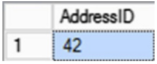
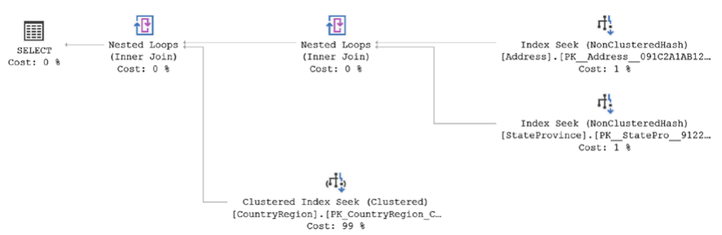
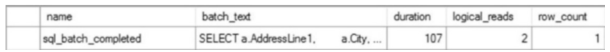

# 메모리 최적화 OLTP 테이블과 프로시저
OLTP 시스템의 주요 요구 사항 중 하나는 시스템 속도를 최대한 높이는 것이고 이를 염두에 두고 Microsoft는 메모리 내 OLTP 향상 기능을 도입했다. 이는 후속 릴리스에서 개선되어 Azure SQL Database에 추가되었습니다. 메모리 최적화 기술은 메모리 내 테이블과 고유하게 컴파일된 저장 프로시저로 구성됩니다. 이 기능 세트는 트랜잭션 중심의 고급 OLTP 중심 시스템을 위한 것입니다. SQL Server 2014에서는 SQL Server Enterprise 버전에서만 메모리 내 OLTP 기능에 액세스할 수 있었습니다. SQL Server 2016부터 모든 버전은 이 향상된 기능을 지원합니다. 메모리 최적화 기술은 쿼리 튜닝 도구 상자에 포함된 또 다른 도구이지만 특정 애플리케이션에만 적용할 수 있는 고도로 전문화된 도구입니다. 이 기술을 채택할 때는 주의하세요. 즉, 적절한 양의 메모리를 갖춘 올바른 시스템에서는 메모리 내 테이블과 기본 저장 프로시저를 통해 매우 빠른 속도를 얻을 수 있습니다.

이번 장에서는 다음과 같은 주제를 다룬다.

    * 인메모리 테이블 작동 방식의 기본 사항
    * 기본적으로 저장 프로시저를 컴파일하여 성능 향상
    * 기본적으로 컴파일된 프로시저와 인메모리 OLTP 테이블의 장점과 단점
    * 인메모리 OLTP 테이블 사용 시기에 대한 권장 사항

## <font color='dodgerblue' size="6">1) 인메모리 OLTP 기초</font>    
무엇보다 핵심은 놀라울 정도로 빠르게 실행되도록 쿼리를 조정할 수 있다는 것입니다. 그러나 아무리 빠르게 실행하더라도 최신 컴퓨터의 일부 아키텍처 문제와 SQL Server 동작의 기본으로 인해 어느 정도 제한됩니다. 일반적으로 하드웨어의 가장 큰 병목 현상은 스토리지 시스템입니다. 여전히 회전하는 플래터를 보고 있거나 SSD 또는 유사한 기술 유형으로 전환한 경우에도 디스크는 여전히 시스템에서 가장 느린 측면입니다. 즉, 읽거나 쓰려면 기다려야 합니다. 그러나 메모리는 빠르며 64비트 운영 체제에서는 메모리가 충분할 수 있습니다. 따라서 완전히 메모리로 이동할 수 있는 테이블이 있으면 속도를 획기적으로 향상시킬 수 있습니다. 이는 메모리 내 OLTP 테이블의 핵심 중 하나입니다. 즉, 읽기 및 쓰기 데이터 액세스를 메모리와 디스크 외부로 이동하는 것입니다. 그러나 Microsoft는 단순히 테이블을 메모리로 옮기는 것 이상의 일을 했습니다. 디스크 속도가 느린 반면 속도를 저하시키는 시스템의 또 다른 측면은 트랜잭션 시스템을 통해 데이터에 액세스하고 관리하는 방식이라는 점을 인식했습니다. 그래서 마이크로소프트는 거기에도 일련의 변화를 주었습니다. 가장 중요한 것은 거래에 대한 비관적인 접근 방식을 제거하는 것이었습니다. 기존 제품은 데이터 변경 사항이 디스크에 플러시되도록 허용하기 전에 모든 트랜잭션을 트랜잭션 로그에 강제로 기록합니다. 이로 인해 거래 처리에 병목 현상이 발생합니다. 따라서 Microsoft는 거래가 성공적으로 완료될지에 대한 비관적인 입장 대신 대부분의 경우 거래가 완료될 것이라는 낙관적인 접근 방식을 취했습니다. 또한 다음 트랜잭션이 데이터에 액세스하거나 업데이트하기 전에 하나의 트랜잭션이 데이터 업데이트를 완료해야 하는 차단 상황 대신 Microsoft는 데이터 버전을 관리했습니다. 이제 시스템 내의 주요 경합 지점을 제거하고 잠금을 제거했으며 이 모든 것이 메모리에 있으므로 훨씬 더 빠릅니다. Microsoft는 이 모든 것을 한 단계 더 발전시켰습니다. 둘 이상의 프로세스가 페이지에 쓰기 위해 액세스하는 것을 방지하는 메모리 래치에 대한 비관적 접근 방식 대신 Microsoft는 메모리 관리에 대한 낙관적 접근 방식을 확장했습니다. 이제 버전 관리를 통해 인메모리 테이블은 트랜잭션을 롤백하지만 한 트랜잭션을 다른 트랜잭션으로 차단하지 않는 충돌 해결 프로세스와 "결국" 일치하는 모델을 작동합니다. 이는 일부 데이터 손실로 이어질 가능성이 있지만 데이터 액세스 계층 내의 모든 것을 빠르게 만듭니다. 재부팅이나 유사한 상황에서 지속되기 위해 데이터가 디스크에 기록됩니다. 그러나 서버를 시작하거나 데이터베이스를 온라인으로 전환할 때를 제외하고는 디스크에서 아무것도 읽지 않습니다. 그런 다음 인메모리 테이블의 모든 데이터가 메모리에 로드되고 해당 데이터에 대해 디스크에 대한 읽기가 다시 발생하지 않습니다. 그러나 임시 데이터를 처리하는 경우 데이터가 디스크에 전혀 유지되지 않도록 정의하여 시작 시간까지 단축함으로써 이 기능을 단락시킬 수도 있습니다. 마지막으로, 책의 나머지 부분에서 살펴본 것처럼 쿼리 튜닝의 주요 부분은 쿼리 최적화 프로그램을 사용하여 좋은 실행 계획을 얻은 다음 해당 계획을 여러 번 재사용하는 방법을 파악하는 것입니다. 이는 또한 집중적이고 느린 과정일 수 있습니다. SQL Server 2014에는 고유하게 컴파일된 저장 프로시저라는 개념이 도입되었습니다. 이는 말 그대로 DLL로 컴파일되어 SQL Server OS의 일부가 된 T-SQL 코드입니다. 이 컴파일 프로세스는 비용이 많이 들기 때문에 이전 쿼리에만 사용해서는 안 됩니다. 주요 아이디어는 프로시저를 원시 코드로 컴파일하는 데 시간과 노력을 투자한 다음 근본적으로 향상된 속도로 해당 프로시저를 수백만 번 사용하는 것입니다. 이 모든 기술이 결합되어 단독으로 사용하거나 기존 테이블 구조 및 표준 T-SQL과 함께 사용할 수 있는 새로운 기능을 만듭니다. 실제로 일반 SQL Server 테이블을 처리하는 것과 거의 동일한 방식으로 메모리 내 테이블을 처리하면서도 일부 성능 향상을 실현할 수 있습니다. 하지만, 아무데서나 할 수는 없습니다. 메모리 내 OLTP 테이블 및 프로시저를 활용하기 위한 몇 가지 구체적인 요구 사항이 있습니다.


- ### a. 시스템 요구사항
    메모리 최적화 테이블이 가능한지 여부를 고려하기 전 먼저 몇 가지 표준 요구 사항을 충족해야 한다.
        * 모던 64bit 프로세스
        * 메모리에 넣으려는 데이터의 두배 디스크 공간
        * 당연하게도 많은 메모리
    
    분명히 대부분의 시스템에서 핵심은 많은 메모리입니다. 운영 체제와 SQL Server가 정상적으로 작동하려면 충분한 메모리가 필요합니다. 그런 다음에도 데이터 캐시를 포함하여 시스템의 메모리 최적화되지 않은 모든 요구 사항을 충족할 수 있는 메모리가 필요합니다. 마지막으로, 무엇보다도 메모리 최적화 테이블을 위한 메모리를 추가하게 됩니다. 최소 64GB 메모리를 갖춘 상당히 큰 시스템을 보고 있지 않다면 이 시스템을 옵션으로 고려하는 것조차 제안하지 않습니다. 더 작은 시스템은 시간과 노력을 들일 만큼 충분한 메모리 저장 공간을 제공하지 못합니다.
    
    SQL Server 2014에서만 SQL Server Enterprise 버전이 실행되고 있어야 합니다. 물론 SQL Server 2014에서도 Developer 에디션을 사용할 수 있지만 프로덕션 로드를 실행할 수는 없습니다. SQL Server 2014보다 최신 버전의 경우 Microsoft에서 게시한 버전에 따라 메모리 제한이 있습니다.    

- ### b. 기본 설정
    하드웨어 요구 사항 외에도 메모리 내 테이블을 활성화하려면 데이터베이스에 대한 추가 작업을 수행해야 합니다. 설명을 위해 새 데이터베이스부터 시작하겠습니다.

    ```sql    
    CREATE DATABASE InMemoryTest
    ON PRIMARY (NAME = N'InMemoryTest_Data',
                FILENAME = N'D:\Data\InMemoryTest_Data.mdf',
                SIZE = 5GB)
    LOG ON (NAME = N'InMemoryTest_Log',
        FILENAME = N'L:\Log\InMemoryTest_Log.ldf');
    GO
    ```

    인메모리 테이블이 내구성을 유지하려면 메모리는 물론 메모리에도 기록해야 합니다. 왜냐하면 메모리는 전원이 소모되기 때문입니다. 내구성(관계형 데이터세트의 ACID 속성의 일부)은 트랜잭션이 커밋되면 커밋된 상태를 유지한다는 의미입니다. 내구성이 있는 메모리 내 테이블이나 내구성이 없는 테이블을 가질 수 있습니다. 비영구 테이블을 사용하면 커밋된 트랜잭션이 있을 수 있지만 여전히 해당 데이터가 손실될 수 있습니다. 이는 SQL Server 내에서 표준 테이블이 작동하는 방식과 다릅니다. 내구성이 없는 데이터의 가장 일반적으로 알려진 용도는 세션 상태나 전자 장바구니와 같은 시간에 민감한 정보 등입니다. 어쨌든, 메모리 내 저장소는 표준 관계형 테이블 내의 일반적인 저장소와 동일하지 않습니다. 따라서 별도의 파일 그룹과 파일을 생성해야 합니다. 이렇게 하려면 다음과 같이 데이터베이스를 변경하면 됩니다.

    ```sql    
    ALTER DATABASE InMemoryTest
        ADD FILEGROUP InMemoryTest_InMemoryData
        CONTAINS MEMORY_OPTIMIZED_DATA
    GO        
    ALTER DATABASE InMemoryTest
        ADD FILE (NAME = 'InMemoryTest_InMemoryData',
        FILENAME = 'D:\Data\InMemoryTest_InMemoryData.ndf')
        TO FILEGROUP InMemoryTest_InMemoryData
    GO
    ```

    실험 중인 AdventureWorks2017 데이터베이스만 변경하면 되지만, 메모리 내 최적화 테이블에 대한 또 다른 고려 사항은 특수 파일 그룹이 생성되면 제거할 수 없다는 것입니다. 데이터베이스만 삭제할 수 있습니다. 그렇기 때문에 별도의 데이터베이스로 실험해 보겠습니다. 더 안전합니다. 이는 또한 인메모리 기술을 구현하는 방법과 위치에 대해 주의를 기울이게 만드는 원동력 중 하나입니다. 영구적으로 변경하지 않고는 프로덕션 서버에서 사용해 볼 수 없습니다.

    메모리 내 OLTP를 사용하는 데이터베이스에 사용할 수 있는 기능에는 몇 가지 제한 사항이 있습니다.

    * DBCC CHECKDB: 일관성 검사를 실행할 수 있지만 메모리 최적화 테이블은 건너뜁니다. DBCC CHECKTABLE을 실행하려고 하면 오류가 발생합니다. 
    * AUTO_CLOSE: 지원되지 않습니다. 
    * 데이터베이스 스냅샷: 지원되지 않습니다. 
    * ATTACH_REBUILD_LOG: 이 역시 지원되지 않습니다.
    * 데이터베이스 미러링: MEMORY_ OPTIMIZED_DATA 파일 그룹이 있는 데이터베이스를 미러링할 수 없습니다. 그러나 가용성 그룹은 원활한 환경을 제공하고 장애 조치 클러스터링은 메모리 내 테이블을 지원합니다(그러나 복구 시간에 영향을 미칩니다).

    이러한 수정이 완료되어야 시스템에서 메모리 내 테이블 생성을 시작할 수 있습니다.

- ### c. 테이블 생성
    데이터베이스 설정이 완료되면 앞서 설명한 대로 메모리 최적화 테이블을 생성할 수 있습니다. 실제 구문은 매우 간단합니다. AdventureWorks2017의 Person.Address 테이블을 최대한 복제하겠습니다.

    ```sql    
    USE InMemoryTest;
    GO
    CREATE TABLE dbo.Address
        (AddressID INT IDENTITY(1, 1) NOT NULL PRIMARY KEY NONCLUSTERED HASH
        WITH (BUCKET_COUNT = 50000),
        AddressLine1 NVARCHAR(60) NOT NULL,
        AddressLine2 NVARCHAR(60) NULL,
        City NVARCHAR(30) NOT NULL,
        StateProvinceID INT NOT NULL,
        PostalCode NVARCHAR(15) NOT NULL,
        --[SpatialLocation geography NULL,
        --rowguid uniqueidentifier ROWGUIDCOL NOT NULL CONSTRAINT DF_
        Address_rowguid DEFAULT (newid()),
        ModifiedDate DATETIME NOT NULL
        CONSTRAINT DF_Address_ModifiedDate
        DEFAULT (GETDATE()))
        WITH (MEMORY_OPTIMIZED = ON, DURABILITY = SCHEMA_AND_DATA);
    ```

    이렇게 하면 데이터의 내구성 있는 복사본을 유지하기 위해 정의한 디스크 공간을 사용하여 시스템 메모리에 내구성 있는 테이블이 생성되므로 정전 시 데이터가 손실되지 않습니다. 일반 SQL Server 테이블과 마찬가지로 IDENTITY 값인 기본 키가 있습니다. 그러나 SEQUENCE 대신 IDENTITY를 사용하려면 이 버전의 (1,1)을 제외한 다른 것으로 정의를 설정하는 기능을 포기해야 합니다. SQL 서버). 인덱스 정의는 클러스터링되지 않습니다. 대신 비클러스터형 해시입니다. 다음 섹션에서는 인덱싱 및 BUCKET_COUNT와 같은 항목에 대해 설명하겠습니다. 또한 SpatialLocation과 rowguid라는 두 개의 열을 주석 처리해야 했다는 점을 참고하세요. 이는 메모리 내 테이블에서 사용할 수 없는 데이터 유형을 사용하고 있습니다. 마지막으로 WITH 문은 MEMORY_ OPTIMIZED=ON을 정의하여 SQL Server가 이 테이블을 배치할 위치를 알 수 있도록 합니다. DURABILITY=SCHEMA_ONLY를 사용하도록 WITH 절을 수정하면 더욱 빠른 테이블을 만들 수 있습니다. 이렇게 하면 데이터가 손실될 수 있지만 디스크에 아무 것도 기록되지 않으므로 테이블이 더욱 빨라집니다. 인메모리 테이블을 활용하지 못하게 할 수 있는 지원되지 않는 데이터 유형이 많이 있습니다.

    * XML
    * ROWVERSION
    * SQL_VARIANT
    * HIERARCHYID
    * DATETIMEOFFSET
    * GEOGRAPHY/GEOMETRY
    * User-defined data types

    데이터 유형 외에도 다른 제한 사항이 있습니다. "인메모리 인덱스" 섹션에서 인덱스 요구 사항에 대해 설명하겠습니다. SQL Server 2016부터 외래 키, 검사 제약 조건 및 고유 제약 조건에 대한 지원이 추가되었습니다. 인메모리 테이블이 생성되면 일반 테이블처럼 액세스할 수 있습니다. 지금 쿼리를 실행하면 어떤 행도 반환되지 않지만 작동할 것입니다.

    ```sql    
    SELECT a.AddressID
    FROM dbo.Address AS a
    WHERE a.AddressID = 42;
    ```

    따라서 데이터베이스의 실제 데이터를 실험하려면 AdventureWorks2017의 Person.Address에 저장된 정보를 이 새 데이터베이스의 메모리에 저장된 새 테이블에 로드하세요.

    ```sql    
    CREATE TABLE dbo.AddressStaging
    (
        AddressLine1 NVARCHAR(60) NOT NULL,
        AddressLine2 NVARCHAR(60) NULL,
        City NVARCHAR(30) NOT NULL,
        StateProvinceID INT NOT NULL,
        PostalCode NVARCHAR(15) NOT NULL
    );

    INSERT dbo.AddressStaging
    (
        AddressLine1,
        AddressLine2,
        City,
        StateProvinceID,
        PostalCode
    )

    SELECT a.AddressLine1,
        a.AddressLine2,
        a.City,
        a.StateProvinceID,
        a.PostalCode
    FROM AdventureWorks2017.Person.Address AS a;

    INSERT dbo.Address (AddressLine1, AddressLine2, City, StateProvinceID, PostalCode)

    SELECT a.AddressLine1,
        a.AddressLine2,
        a.City,
        a.StateProvinceID,
        a.PostalCode
    FROM dbo.AddressStaging AS a;

    DROP TABLE dbo.AddressStaging;
    ```

    그는 약 19,000개의 행을 준비 테이블에 넣은 다음 이를 메모리 내 테이블에 로드합니다. 이는 성능 예시의 일부가 아니지만 표준 테이블에 데이터를 삽입하는 데 거의 850ms가 걸렸고 동일한 데이터를 내 시스템의 메모리 내 테이블에 로드하는 데 2ms밖에 걸리지 않았다는 점은 아무 가치가 없습니다. 하지만 데이터가 있으면 그림 24-1과 같이 쿼리를 다시 실행하여 실제로 결과를 볼 수 있습니다.

    그림26-1   

    물론 이것은 별로 흥미롭지 않습니다. 따라서 의미 있는 작업을 수행하기 위해 몇 가지 다른 테이블을 만들어서 더 많은 쿼리 동작을 화면에서 볼 수 있도록 하겠습니다.

    ```sql    
    CREATE TABLE dbo.StateProvince (StateProvinceID INT IDENTITY(1, 1) NOT NULL
    PRIMARY KEY NONCLUSTERED HASH
    WITH (BUCKET_COUNT = 10000),
    StateProvinceCode NCHAR(3) COLLATE Latin1_General_100_BIN2 NOT NULL,
    CountryRegionCode NVARCHAR(3) NOT NULL,
    Name VARCHAR(50) NOT NULL,
    TerritoryID INT NOT NULL,
    ModifiedDate DATETIME NOT NULL
    CONSTRAINT DF_StateProvince_ModifiedDate
    DEFAULT (GETDATE()))
    WITH (MEMORY_OPTIMIZED = ON);

    CREATE TABLE dbo.CountryRegion (CountryRegionCode NVARCHAR(3) NOT NULL,
    Name VARCHAR(50) NOT NULL,
    ModifiedDate DATETIME NOT NULL
    CONSTRAINT DF_CountryRegion_ModifiedDate
    DEFAULT (GETDATE()),
    CONSTRAINT PK_CountryRegion_CountryRegionCode
    PRIMARY KEY CLUSTERED
    (
    CountryRegionCode ASC
    ));
    ```

    이는 추가 메모리 최적화 테이블과 표준 테이블입니다. 또한 여러분이 더 흥미로운 쿼리를 할 수 있도록 여기에 데이터를 로드하겠습니다.

    ```sql    
    SELECT sp.StateProvinceCode,
    sp.CountryRegionCode,
    sp.Name,
    sp.TerritoryID
    INTO dbo.StateProvinceStaging
    FROM AdventureWorks2017.Person.StateProvince AS sp;
    INSERT dbo.StateProvince (StateProvinceCode,
    CountryRegionCode,
    Name,
    TerritoryID)
    SELECT StateProvinceCode,
    CountryRegionCode,
    Name,
    TerritoryID
    FROM dbo.StateProvinceStaging;
    DROP TABLE dbo.StateProvinceStaging;
    INSERT dbo.CountryRegion (CountryRegionCode,
    Name)
    SELECT cr.CountryRegionCode,
    cr.Name
    FROM AdventureWorks2017.Person.CountryRegion AS cr;


    ```

    데이터가 로드되면 다음 쿼리는 단일 행을 반환하고 그림 24-2와 같은 실행 계획을 갖습니다.

    ```sql    
    SELECT a.AddressLine1,
        a.City,
        a.PostalCode,
        sp.Name AS StateProvinceName,
        cr.Name AS CountryName
    FROM dbo.Address AS a
        JOIN dbo.StateProvince AS sp
            ON sp.StateProvinceID = a.StateProvinceID
        JOIN dbo.CountryRegion AS cr
            ON cr.CountryRegionCode = sp.CountryRegionCode
    WHERE a.AddressID = 42;
    ```

    그림26-2   
    
    보시다시피 인메모리 테이블을 사용하더라도 정상적인 실행 계획을 얻는 것이 전적으로 가능합니다. 운영자도 똑같습니다. 이 경우 세 가지 다른 인덱스 탐색 작업이 있습니다. 그 중 두 개는 메모리 내 테이블을 사용하여 생성한 비클러스터형 해시 인덱스에 대한 것이고, 다른 하나는 표준 테이블에 대한 표준 클러스터형 인덱스 탐색입니다. 또한 이 계획의 예상 비용을 합하면 최대 101%가 된다는 점을 참고할 수도 있습니다. 최적화 프로그램을 통한 비용이 일반 테이블과 근본적으로 다르기 때문에 인메모리 테이블을 처리하는 이러한 이상 현상을 가끔 볼 수 있습니다.

    주요 성능 향상은 잠금 및 래칭이 없기 때문에 대량 삽입 및 업데이트가 가능하고 동시에 쿼리가 가능하다는 것입니다. 그러나 쿼리도 더 빠르게 실행됩니다. 이전 쿼리의 결과는 그림 24-3에 표시된 실행 시간 및 읽기 결과였습니다.

    그림26-3   

    AdventureWorks2017 데이터베이스에 대해 유사한 쿼리를 실행하면 그림 26-4에 표시된 동작이 발생합니다.

    그림26-4   

    인메모리 테이블을 사용하면 실행 시간이 훨씬 더 좋다는 것은 분명하지만, 읽기가 처리되는 방식은 명확하지 않습니다. 그러나 메모리 내 페이지나 디스크 페이지가 아니라 해시 인덱스를 사용하여 메모리 내 저장소에서 읽는 것에 대해 이야기하고 있으므로 성능 측정 측면에서 상황이 완전히 다릅니다. 이전과 동일한 측정값을 모두 사용하지 않고 대신 실행 시간에 의존하게 됩니다. 이 경우 읽기는 시스템 활동을 측정한 것이므로 값이 높을수록 데이터에 대한 액세스가 더 많아지고 값이 낮을수록 더 적은 액세스를 의미할 것으로 예상할 수 있습니다. 테이블이 준비되고 삽입 및 선택 모두에 대한 성능이 향상되었다는 증거를 바탕으로 인메모리 테이블과 함께 사용할 수 있는 인덱스와 표준 인덱스와의 차이점에 대해 이야기해 보겠습니다.

- ### d. 인메모리 인덱스    