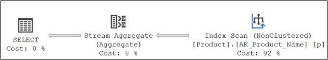
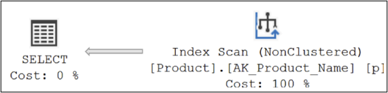
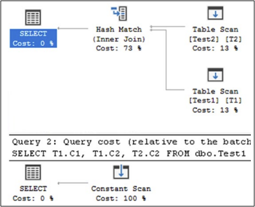

# Sql Server 최적화 체크리스트
이 책의 이전 27개 장을 읽었다면 성능 최적화의 주요 측면을 이해한 것입니다. 당신은 또한 그것이 도전적이고 지속적인 활동이라는 것을 이해합니다. 이 장에서 내가 하고 싶은 일은 데이터베이스 개발자와 DBA가 현장에서 빠른 참고 자료로 사용할 수 있는 성능 모니터링 체크리스트를 제공하는 것입니다. 이 아이디어는 모범 사례의 분리 카드 개념과 유사합니다. 이 장에서는 모든 내용을 다루지는 않지만 SQL Server 시스템 성능에 빠르고 확실한 영향을 미칠 수 있는 주요 조정 활동 중 일부를 한 곳에 요약합니다. 이러한 체크리스트 항목을 다음 섹션으로 분류했습니다.

이번 장에서는 다음과 같은 주제를 다룬다.

    * 데이터베이스 디자인
    * 서버 구성 세팅
    * 데이터베이스 관리
    * 데이터베이스 백업
    * 쿼리 디자인

## <font color='dodgerblue' size="6">1) 데이터베이스 디자인</font>    
데이터베이스 디자인은 광범위한 주제이므로 이 쿼리 튜닝 책의 작은 섹션에서는 적절한 정의를 제공할 수 없습니다. 그럼에도 불구하고 초기 단계부터 데이터베이스 성능에 주의를 기울일 수 있도록 다음과 같은 설계 측면에 주의를 기울이는 것이 좋습니다.

    * 엔티티 무결성 제약조건 사용
    * 도메인과 참조 무결성 제약조건 유지
    * 인덱스 다자인 베스트 프랙티스 적용
    * 저장프로시저 이름을 sp_ 로 시작하지 않기
    * 트리거 사용 최소화
    * 테이블을 메모리안의 저장공간으로 옮기기
    * 컬럼스토어 인덱스 사용

- ### a. 엔티티 무결성 사용
    데이터 무결성은 데이터베이스의 데이터 품질을 보장하는 데 필수적입니다. 데이터 무결성의 필수 구성 요소는 행을 특정 테이블에 대한 고유한 엔터티로 정의하는 엔터티 무결성입니다. 즉, 테이블의 모든 행은 고유하게 식별 가능해야 합니다. 테이블의 고유 행 식별자 역할을 하는 열은 테이블의 기본 키로 표시되어야 합니다.  
    
    경우에 따라 테이블에 테이블의 행을 고유하게 식별하는 데 사용할 수 있는 추가 열이 포함될 수 있습니다. 예를 들어 Employee 테이블에는 EmployeeID 및 SocialSecurityNumber 열이 있을 수 있습니다. EmployeeID 열은 고유한 행 식별자 역할을 하며 기본 키로 정의될 수 있습니다. 마찬가지로 SocialSecurityNumber 열은 대체 키로 정의될 수 있습니다. SQL Server에서는 본질적으로 기본 키의 동생인 고유 제약 조건을 사용하여 대체 키를 정의할 수 있습니다. 실제로 고유 제약 조건과 기본 키 제약 조건 모두 뒤에서 고유 인덱스를 사용합니다.
    
    자연 키(예: 이전 예의 SocialSecurityNumber 열) 또는 인공 키(예: EmployeeID 열) 사용과 관련하여 솔직한 의견 차이가 있다는 점은 주목할 가치가 있습니다. 저는 두 가지 디자인이 모두 성공하는 것을 보았지만 각 접근 방식에는 장점과 단점이 있습니다. 둘 중 하나를 제안하는 대신, 둘 다 사용하고 각각과 관련된 비용의 일부를 사용하여 종교적 논쟁을 피해야 하는 몇 가지 이유를 제공하겠습니다. ID 열은 일반적으로 INT 또는 BIGINT이므로 범위를 좁히고 쉽게 색인화할 수 있어 성능이 향상됩니다. 또한 일부 비즈니스 지식에서 기본 키의 값을 분리하는 것은 좋은 설계로 간주됩니다. 때로는 GUID(Globally Unique Identifier)가 기본 키로 사용될 수 있습니다. 제대로 작동하지만 읽기 어렵기 때문에 문제 해결에 영향을 미치고 인덱스 조각화가 더 커질 수 있습니다. 키의 폭은 성능에 부정적인 영향을 미칠 수도 있습니다. 인공 키의 단점 중 하나는 숫자가 때때로 비즈니스 의미를 획득한다는 것인데, 이는 결코 발생해서는 안 됩니다. 명심해야 할 또 다른 사항은 존재하지 않아야 하는 여러 행이 생성되는 것을 방지하기 위해 대체 키에 대한 고유 제약 조건을 생성해야 한다는 것입니다. 이로 인해 저장하고 유지해야 하는 정보의 양이 늘어납니다. 자연 키는 진정한 비즈니스 의미를 지닌 명확하고 사람이 읽을 수 있는 기본 키를 제공합니다. 필드가 더 넓은 경향이 있으며 때로는 매우 넓어서 인덱스 내에서 효율성이 떨어집니다. 또한 때로는 데이터가 변경될 수 있는데, 이는 인공 키가 있는 한 위치만 업데이트하는 것이 아니라 키 값이 사용 중인 모든 단일 위치를 업데이트해야 하기 때문에 데이터베이스 내에서 심각한 낙수 효과를 갖습니다. 유럽 연합의 GDPR(일반 데이터 보호 규정)과 같은 규정 준수가 도입됨에 따라 데이터를 제거하지 않고 수정할 수 있는지 걱정할 때 자연 키가 더욱 문제가 됩니다. 두 가지 접근 방식 모두 잘 작동할 수 있으며 각 접근 방식은 튜닝을 위한 많은 기회를 제공한다는 점을 다시 한번 강조하겠습니다. 어느 접근 방식이든 적절하게 적용하고 유지 관리하면 데이터 무결성이 보호됩니다. 데이터 무결성을 유지하는 것 외에도 엔터티 무결성 제약 조건의 기본 수단인 고유 인덱스는 최적화 프로그램이 효율적인 실행 계획을 생성하는 데 도움이 됩니다. SQL Server는 고유하지 않은 인덱스를 검색하는 것보다 더 빠르게 고유 인덱스를 검색할 수 있는 경우가 많습니다. 이는 고유 인덱스의 각 행이 고유하기 때문입니다. 그리고 일단 행이 발견되면 SQL Server는 일치하는 다른 행을 더 이상 찾을 필요가 없습니다(최적화 프로그램은 이 사실을 알고 있습니다). 열이 정렬(또는 GROUP BY 또는 DISTINCT) 작업에 사용되는 경우 고유 제약 조건이 있는 열은 일반적으로 고유 제약 조건이 없는 열보다 빠르게 정렬되므로 고유 인덱스를 사용하여 열에 고유 제약 조건을 정의하는 것이 좋습니다. 또한 고유 제약 조건은 최적화 프로그램의 카디널리티 추정에 대한 추가 정보를 추가합니다. "미사용" 또는 "사용되지 않는" 인덱스도 카디널리티 추정에 미치는 영향으로 인해 최적화에 여전히 도움이 될 수 있습니다.

    엔터티 무결성 또는 고유 제약 조건의 성능 이점을 이해하려면 예를 고려하십시오. Production.Product 테이블의 기존 고유 인덱스를 수정한다고 가정합니다.
    ```sql
    CREATE NONCLUSTERED INDEX AK_Product_Name
    ON Production.Product
    (
        Name ASC
    )
    WITH (DROP_EXISTING = ON)
    ON [PRIMARY];
    GO
    ```

    비클러스터형 인덱스에는 UNIQUE 제약 조건이 포함되지 않습니다. 따라서 [이름] 열에 고유한 값이 포함되어 있더라도 비클러스터형 인덱스에 UNIQUE 제약 조건이 없으면 이 정보가 최적화 프로그램에 미리 제공되지 않습니다. 이제 다음 SELECT 문에 대한 UNIQUE 제약 조건(또는 누락된 UNIQUE 제약 조건)이 성능에 미치는 영향을 고려해 보겠습니다.

    ```sql
    SELECT DISTINCT
        (p.Name)
    FROM Production.Product AS p;
    ```

      
    그림 30-1. Name컬럼에 Unique제약조건 없는 실행계획

    위 실행 계획을 보면, 넌클러스터형 AK_ProductName 인덱스를 사용하여 데이터를 검색한 다음, 해당 데이터에 대해 Stream Aggregate 작업을 수행하여 중복된 [Name] 값이 생성될 수 있도록 [Name] 열의 데이터를 그룹화하는 것을 볼 수 있습니다. 최종 결과 세트에서 제거됩니다. 최적화 프로그램에 [Name] 열의 고유성에 대해 미리 알려주었다면 Stream Aggregate 작업이 필요하지 않았을 것입니다. 다음과 같이 UNIQUE 제약 조건을 사용하여 비클러스터형 인덱스를 정의하여 이를 수행할 수 있습니다.

    ```sql
    CREATE UNIQUE NONCLUSTERED INDEX [AK_Product_Name]
    ON [Production].[Product]([Name] ASC)
        WITH
        (
            DROP_EXISTING = ON
        )
    ON [PRIMARY];
    ```
      
    그림 30-2. Name컬럼에 unique 제약조건 있는 실행계획
    
    일반적으로 엔터티 무결성 제약 조건(즉, 기본 키 및 고유 제약 조건)은 옵티마이저에게 예상 결과에 대한 유용한 정보를 제공하여 옵티마이저가 효율적인 실행 계획을 생성하는 데 도움을 줍니다. 주목할 만한 점은 고유 제약 조건을 정의하는 인덱스에 대해 제약 조건 검사가 실행될 때 sys.dm_db_index_usage_stats가 표시되지 않는다는 사실입니다.

- ### b. 도메인/참조 무결성 제약조건 유지
    데이터 무결성의 다른 두 가지 중요한 구성 요소는 도메인 무결성과 참조 무결성입니다. 열의 데이터 유형을 제한하고, 입력 데이터의 형식을 정의하고, 열에 허용되는 값의 범위를 제한하여 열의 도메인 무결성을 적용할 수 있습니다. 참조 무결성은 테이블 간에 정의된 외래 키 제약 조건을 사용하여 적용됩니다. SQL Server는 도메인 및 참조 무결성을 구현하기 위해 데이터 형식, FOREIGN KEY 제약 조건, CHECK 제약 조건, DEFAULT 정의 및 NOT NULL 정의와 같은 기능을 제공합니다. 애플리케이션에서 데이터 열의 값을 값 범위로 제한해야 하는 경우 이 비즈니스 규칙은 애플리케이션 코드 또는 데이터베이스 스키마에서 구현될 수 있습니다. 도메인 제약 조건(예: CHECK 제약 조건)을 사용하여 데이터베이스에 이러한 비즈니스 규칙을 구현하면 최적화 프로그램이 효율적인 실행 계획을 생성하는 데 도움이 될 수 있습니다.  
    도메인 무결성의 성능상 이점을 이해하기 위해서 다음 샘플을 고려해보자.

    ```sql    
    CREATE TABLE dbo.Test1 
    (
        C1 INT,
        C2 INT CHECK (C2 BETWEEN 10 AND 20)
    ) ;
    INSERT INTO dbo.Test1    VALUES (11, 12);
    GO
    
    CREATE TABLE dbo.Test2 
    (
        C1 INT,
        C2 INT
    );
    INSERT INTO dbo.Test2 VALUES (101, 102);
    GO

    -- 이제 다음 2개의 SELECT절을 실행
    SELECT T1.C1,
        T1.C2,
        T2.C2
    FROM dbo.Test1 AS T1
        JOIN dbo.Test2 AS T2    ON T1.C1 = T2.C2
                                    AND T1.C2 = 20;
    GO
    SELECT T1.C1,
        T1.C2,
        T2.C2
    FROM dbo.Test1 AS T1
        JOIN dbo.Test2 AS T2    ON T1.C1 = T2.C2
                                    AND T1.C2 = 30;
    GO
    ```

    두 개의 SELECT 문은 조건자 값(첫 번째 문에서는 20, 두 번째 문에서는 30)을 제외하고 동일한 것으로 보입니다. 두 개의 SELECT 문의 형식은 동일하지만 아래 그림의 실행 계획에 표시된 것처럼 Tl.C2 열의 CHECK 제약 조건으로 인해 최적화 프로그램이 이를 다르게 처리합니다.

      
    그림 30-3. CHECK제약조건 경계안팎에 예측값을 가진 실행계획

    실행 계획에서 첫 번째 쿼리(T1.C2 = 20)에 대해 최적화 프로그램이 두 테이블의 데이터에 액세스하는 것을 볼 수 있습니다. 두 번째 쿼리(Tl.C2 = 30)의 경우 최적화 프로그램은 Tl.C2 열에 대한 해당 CHECK 제약 조건을 통해 해당 열이 10~20 범위를 벗어나는 값을 포함할 수 없다는 것을 이해합니다. 두 테이블 모두에서 데이터에 액세스할 수도 없습니다. 결과적으로 두 번째 쿼리의 상대적 예상 비용과 거의 아무것도 하지 않는 실제 성능 측정은 0%입니다.

    이전 21장의 "선언적 참조무결성" 섹션에서도 참조무결성의 성능상 이점을 설명했다.

    따라서 데이터 무결성을 구현하는 것뿐만 아니라 최적화 프로그램이 효율적인 쿼리 계획을 생성하는 데에도 도움이 되도록 도메인 및 참조 제약 조건을 사용해야 합니다. WITH CHECK 옵션을 사용하여 외래 키 제약 조건이 생성되었는지 확인하세요. 그렇지 않으면 최적화 프로그램이 이를 무시합니다. 도메인 및 참조 무결성의 기타 성능 이점을 이해하려면 21장의 "도메인 및 참조 무결성 사용" 섹션을 참조하십시오.