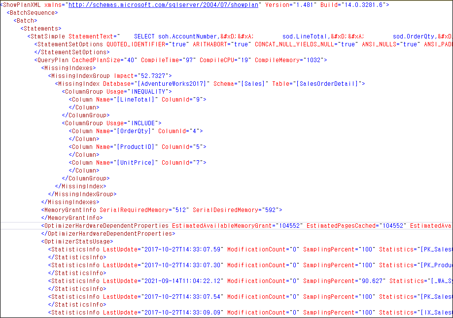
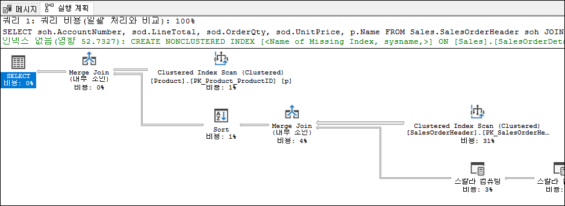
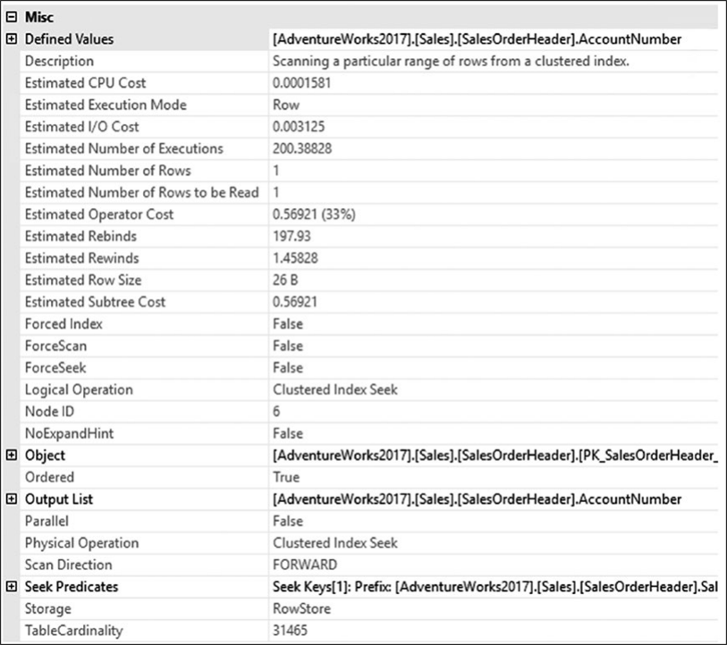
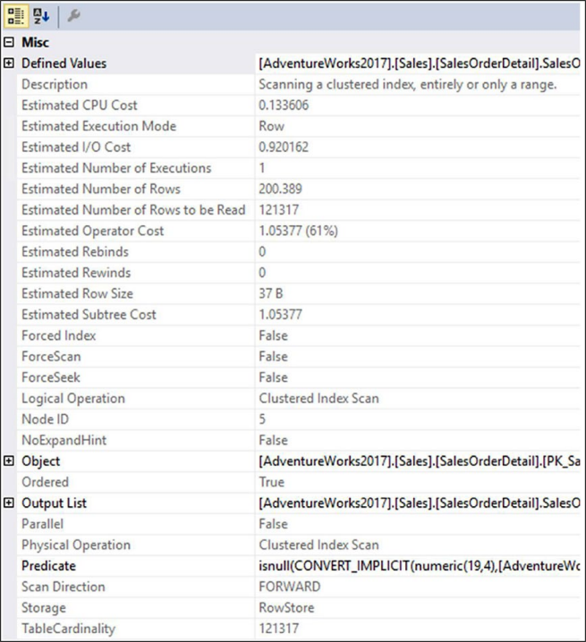

# Query 성능 분석

이전장에서 쿼리 성능 데이터 수집하는 방법을 설명했다. 이번에는 수집한 데이터에서 문제되는 쿼리(장기간 실행되거나 빈번히 호출되는 쿼리)를 찾아내는 방법을 설명할 것이다. 우리는 SSMS에 내장된 도구를 이용하여 쿼리가 실행되는 방법을 이해할 수 있을 것이다. 이번 장 대부분의 시간동안  실행계획에 설명할 것이며 이는 쿼리 옵티마이저에 의해 만들어지는 최상의 계획이다.

다음과 같은 것을 설명한다.

    - SQL 쿼리의 비용 처리 전략을 SSMS를 이용하여 분석하는 방법
    - 쿼리 옵티마이저가 SQL 쿼리를 분석한 방법을 분석하기
    - T-SQL 명령어를 사용하여 SQL 쿼리의 비용을 측정하는 방법

## <font color='dodgerblue' size="6">1) 고비용 쿼리</font>

여태까지 우리는 쿼리 성능데이터를 수집하기 위해 두가지 다른 방법을 사용해 왔다. SQL Server의 성능은 언제 나빠질까? 몇가지 경우가 가장 빈번하게 발생한다.
    - 첫째, 어떤 쿼리들은 시스템 리소스에 큰 스트레스를 생성한다. 이런 쿼리들은 서버가 감당할수 없을 정도의 부하를 주게되어 전체 시스템의 성능에 영향을 미친다.
    - 둘째, 고비용 쿼리는 같은 데이터베이스 자원을 요청하는 다른 쿼리들을 블로킹하기도 하여 이런 쿼리들의 성능을 저하시킨다. 고비용 쿼리들을 최적화하면 자기 스스로도 빨라지지만 데이터베이스 블로킹을 줄여주고 SQL Server 리소스 압박도 감소시킨다.
    - 쿼리에게 전달되는 데이터나 값의 변화는 쿼리의 활동 변화를 발생시키며 성능을 저하시킬수 있다.
    - 마지막으로 그 자체로 비용이 많이 들지 않는 쿼리는 1분에 수천 번 호출될 수 있으며, 이는 단순히 최적 코드 미만의 누적으로 인해 주요 리소스 병목 현상으로 이어질 수 있습니다.

가장 비용이 많이 소모되는 쿼리를 확정하려면 지금까지 설명한 것들을 사용해야 합니다. 예를 들어 쿼리가 캐시에 있다고 가정할 경우, DMO를 사용하여 의미 있는 데이터를 모으고 그중에서 가장 비용이 소모되는 쿼리를 결정할 수 있습니다. 또는 확장 이벤트를 사용하여 쿼리를 캡처했기 때문에 가장 비용이 많이 드는 쿼리를 식별하는 수단으로 해당 데이터에 액세스할 수 있습니다. SQL Server 2016에서 소개된 다른 하나의 옵션인 쿼리 저장소 역시 가능하다. 뒷장에서 자세히 메카니즘을 소개할 것이다.

여기서는 확장 이벤트를 시작할 것이다. 쿼리데이터를 캡처하기위한 단일의 가장쉽고 가장 직접적인 방법은 현재 캐시에 있는 쿼리를 DMO를 통해서이다. 불행하게도 이것은 집계된 데이터이고 완전하게 캐시안에 있는 데이터에 의존한다. 뒷장에서 캐시에 대해 얘기할 것이다. 그래서 계층적 레코드를 가지지 않고 저장 프로시저의 각각의 실행 데이터와 그에 따른 파라메터를 얻지 못한다. 쿼리 데이터를 조사하는 두번째 쉽고 직접적인 방법은 쿼리 저장소를 이용하는 것이며 DMO보다 더 완전한 기록을 제공한다. 그러나 집계된 형태는 동일하다. 우리는 세가지 모두를 살펴볼것이며 정확도를 위해 확장 이벤트를 시작할 것이다.

확장 이벤트에서 하나의 작은 주의사항은 파일로 수집된다면 수집완료후 테이블로 수집 데이터를 로드할 필요하다 또는 바로 쿼리로 실행하거나. 시스템 함수를 사용하여 쿼리를 함으로써 확장이벤트 결과 파일에서 바로 읽을 수있다.

```sql
SELECT module_guid,
    package_guid,
    object_name,
    event_data,
    file_name,
    file_offset,
    timestamp_utc
FROM sys.fn_xe_file_target_read_file('C:\Sessions\QueryPerformanceMetrics*.xel',
    NULL, NULL, NULL);
```

 함수의 첫번째 파라메터는 확장이벤트결과파일(.xel)의 경로이다. *를 통해 여러개의 파일을 한번에 로드할 수 있다. 두번째 파라메터는 2008R2까지는 사용되었지만 그 이후 버전에서는 사용되지 않는다. 세번째 파라메터는 초기파일명이다. NULL일 경우 경로에 있는 모든 파일을 읽는다. 마지막 파라메터는 오프셋이며 유일한 숫자값이다. 이전에 읽은 마지막 파일의 오프셋이다. 이 값이 지정되면 그 이후번째의 파일부터 읽는다.

 쿼리는 각각의 이벤트를 한개의 로우로 리턴한다. 이벤트에 대한 데이터는 event_data란 XML 컬럼에 저장된다. XQuery를 사용하여 바로 데이터를 읽을 수 있다. 일단 한번 실행하면 조회하거나 정렬또는 집계할 수 있다. 이제부터 완전한 예제를 보여줄 것이다.

- ### a. 고비용 쿼리 식별

    SQL Server의 목적은 가장 짧은시간에 결과셋을 리턴하는 것이다. 이렇게 하기 위해서는 SQL Server는 쿼리 최적화기라고 불리우는 비용기반 최적화기가 내장되어 있다. 쿼리실행계획이라 부르는 비용효율 전략을 생성한다. 쿼리 최적화 프로그램은 쿼리를 실행하는 데 필요한 CPU, 메모리 및 디스크 I/O 사용량을 포함하여(이에 국한되지 않음) 많은 요인에 가중치를 둡니다. 이런 모든 요소들은 인덱스에 의해 유지되는 데이터 또는 실실간으로 생성되는 통계, 데이터의 제약조건, 몇가지 시스템의 지식등에 대한 통계와 같은 다양한 소스들로부터 유발되는데 다중CPU와 대량의 메모리와 같은 상황에서 실행된다. 이런 모든 요소들에서 옵티마이저는 비용 효율적 실행계획을 생성한다.

    세션에서 리턴되는 데이터에서 cpu_time과 logical_reads, physical_reads 필드는 역시 쿼리의 어느부분에서 비용이 발생하는지 보여준다. cpu_time필드는 쿼리를 실행하기 위해서 사용되는 CPU시간을 대표한다. logical_reads와 physical_reads 필드들은 페이지(8KB크기)의 숫자를 나타내는데 쿼리에의해 발생하는 메모리 I/O 스트레스의 양을 지칭한다. 그들은 역시 디스크 스트레스를 지칭하는데 작업 쿼리의 경우 메모리 페이지를 백업하기 하거나 첫번째 데이터 접근의 경우 디스크에서 메모리로 데이터가 채워지는 경우 또는 메모리 병목동안 디스크로 옮겨져야 하므로 디스크 스트레스를 나타낸다. 쿼리의 논리적 읽기가 많아질수록 디스크의 스트레스가 더 높아질수 있다. 과도한 수의 논리적 페이지들은 CPU가 관리하는 비용도 증가시키기 CPU로드도 증가시킨다. 이것은 자동 상관관계가 아니다. 가장큰수의 읽기 쿼리가 가장 큰 부하를 발생시키는 쿼리가 항상은 아니다. 그러나 일반적으로 좋은 첫번째 대상이기는 하다. I/O의 수를 최소화시키는것이 비용효율계획의 필요조건은 아니지만 I/O연산은 비용이 많이 드는 작업이기 때문에 가장 적은 비용의 실행계획이 가장 적은 I/O를 가지는 경우가 많다.

    대량의 논리적 읽기를 유발하는 쿼리들은 항상 대량의 데이터 셋때문에 많은 잠금을 보유하게 된다. 읽기 연산은 데이터에 공유잠금을 얻지만 격리레벨에 따라 달라진다. 이런 쿼리들은 데이터를 수정하는 쿼리들을 차단하는 블로킹을 자주 유발한다. 또한 고비용이 되며 장기간 실행쿼리가 되기에 장기간 다른 쿼리들을 차단한다. 차단되는 쿼리들은 또한 다른 쿼리들을 차단할수 있는데 뒤에서 블로킹 체인에 대해 소개할 것이다.

    결과적으로 비용이 많이 드는 쿼리를 식별하고 먼저 최적화하여 다음을 수행하는 것이 합리적입니다.

        * 고비용 쿼리의 성능을 향상시키기
        * 시스템 자원에서 모든 스트레스 줄이기
        * 데이터베이스 블로킹 줄이기

    고비용 쿼리는 아래의 두가지 타입으로 분류할 수 있다.

        * 단일 실행 : 각각의 실행이 고비용일 경우
        * 다중 실행 : 각각의 쿼리는 고비용이 아니지만 해당 쿼리의 반복적인 실행이 결국 시스템 자원에 압박을 유발할 때

    우리는 다른 접근 방식을 사용하여 이런 두가지 종류의 고비용 쿼리를     식별할 수 있다.

- ### b. 단일 실행에서 고비용 쿼리

    세션의 결과파일과 쿼리 저장소 또는 sys.dm_exec_query_stats을 분석하여 고비용 쿼리를 식별해 낼수 있다. 예를 들면 대량의 논리적 읽기를 유발하는 쿼리를 식별해려면 logical_reads 순으로 정렬하여 ㅏㅎㄹ수 있다. duration이나 CPU 또는 이런 요소들을 결합하여 사용할 수도 있다. 다음 스템으로 세션 정보에 접근할 수 있다.

    1. 워크로드 포함한 세션 캡처
    2. 파일로 세션결과 저장
    3. .xel파일을 SSMS로 열기
    4. 또는 logical_reads 순으로 정렬하기

        ```sql
        WITH xEvents
        AS
        (
            SELECT object_name AS xEventName,
                CAST(event_data AS XML) AS xEventData
            FROM sys.fn_xe_file_target_read_file('C:\Sessions\QueryPerformanceMetrics*.xel',NULL, NULL, NULL)
        )
        SELECT xEventName,
            xEventData.value('(/event/data[@name="duration"]/value)[1]',    'bigint') Duration,
            xEventData.value('(/event/data[@name="physical_reads"]/value)[1]', 'bigint') PhysicalReads,
            xEventData.value('(/event/data[@name="logical_reads"]/value)[1]', 'bigint') LogicalReads,
            xEventData.value('(/event/data[@name="cpu_time"]/value)[1]', 'bigint') CpuTime,
            CASE xEventName
                WHEN 'sql_batch_completed'  THEN xEventData.value('(/event/data[@name="batch_text"]/value)[1]', 'varchar(max)')
                WHEN 'rpc_completed'        THEN xEventData.value('(/event/data[@name="statement"]/value)[1]', 'varchar(max)')
            END AS SQLText,
            xEventData.value('(/event/data[@name="query_hash"]/value)[1]', 'binary(8)') QueryHash
        INTO Session_Table
        FROM xEvents;
        SELECT st.xEventName,
            st.Duration,
            st.PhysicalReads,
            st.LogicalReads,
            st.CpuTime,
            st.SQLText,
            st.QueryHash
        FROM Session_Table AS st
        ORDER BY st.LogicalReads DESC;
        ```

        위에서부터 살펴보자, 첫째로 CTE로 xevent결과를 만들었고 event_data라는 컬럼을 XML로 변경시켰다. 그다음 CTE결과를 XQuery로 좀더 직관적이게 다듬었다.
        CTE를 만들때 xel파일 경로에 * 를 사용하여 해당 위치에 해당하는 모든 파일을 읽도록 하였다. 그 이후 논리적 읽기가 많은 쿼리 순으로 정렬하여 테이블 Session_Table에 저장하였다.

        수집된 양에 따라 xel파일을 매번 읽고 변환하는 작업이 오래 걸릴 것이다. 그런 경우 sys.fn_xe_file_target_read_file의 결과를 테이블로 저장해 놓으면 그 다음부터는 좀더 효율적으로 조회를 할 수 있다. 결과테이블에
        인덱스를 걸수도 있다고 다양한 T-SQL 함수를 적용할 수도 있다.

        몇가지 경우 시스템모니터 결과에 CPU상에 큰 스트레스를 볼수 있다. 이런 종류의 작업은 저장프로시저 재컴파일, 집계함수, 데이터 정렬, 해시조인등가 비슷한 CPU위주의 작업들이다. 그런 경우 cpu_time 필드로 정렬하여 가장 큰 cpu부하가 발생하는 쿼리를 실벽할수 있다.

- ### c. 다중 실행에서 고비용 쿼리

    이전에 언급한것처럼 때때로 1개의 쿼리 자체는 고비용 쿼리가 아니지만 같은 쿼리가 여러번 자주 실행됨으로써 누적상황으로 보면 시스템 자원에 대한 압박으로 될수 있을 수도 있다. 이런 상황에서 logical_reads필드순으로 정렬하는것은 식별에 전혀 도움이 안된다. 이런 경우 대신에 해당 쿼리가 여러번 실행될때의 전체 CPU 시간 또는 누적 duration으로 판단해야 한다.

        * 세션 결과 쿼리와 관련있는 몇몇 값들을 그룹핑
        * 쿼리 저장소안의 정보 쿼리하기
        * 프로덕션 서버에서 정보를 얻기위해 sys.dm_exec_query_stats DMO 사용하기. 이것은 이 데이터가 현재 프로시저 캐시에
          있는 것이므로 알려진 기록에 의존하지 않거나 최근에 발생한 문제를 다루고 있다고 가정합니다.

    만약 정확한 데이터의 기록 보기를 찾고 있다면 확장이벤트 수집 데이터 또는 해당 데이터를 얼마나 자주 삭제하는것에 의존하는 쿼리저장소를 이용해야 한다. 쿼리 저장소는 집계된 데이터이기 때문에 이런 경우에 사용할 수 있다. 그러나 오로지 집계된 데이터이다. 각각의 실행에 대해 상세하게 원한다면 확장이벤트로 다시 돌아가야 한다.

    일단 xevent 수집데이터를 테이블로 저장하면 SELECT 쿼리를 통해 같은 쿼리가 여러번 실행된 총 읽기 수를 알수 있다.

    ```sql
    SELECT COUNT(*) AS TotalExecutions,
        st.xEventName,
        st.SQLText,
        SUM(st.Duration) AS DurationTotal,
        SUM(st.CpuTime) AS CpuTotal,
        SUM(st.LogicalReads) AS LogicalReadTotal,
        SUM(st.PhysicalReads) AS PhysicalReadTotal
    FROM Session_Table AS st
    GROUP BY st.xEventName, st.SQLText
    ORDER BY LogicalReadTotal DESC;
    ```

    TotalExecutions 컬럼은 실행횟수이다. LogicalReadTotal 컬럼은 쿼리의 다중실행에 따른 총 누적 reads수이다.

    이런 방법으로 식별한 고비용 쿼리는 단일실행에서 고비용 쿼리보다 전체 워크로드 관점으로 보면 더 좋은 정보이다. 예를 들면 50읽기가 필요한 쿼리가 1000번 실행될 경우 각각의 실행은 매우 부담없다. 그러나 전체 읽기수 입장으로 보면 싸지 않을 수 있다. 읽기수를 줄이기 위해 이런 쿼리를 10만큼 줄이면 10 x 1000 = 10,000만큼 줄인게 되므로 단일 쿼리에서 5,000 reads를 줄이는 것보다 효율적이다.

    이 접근 방식의 문제는 대부분의 쿼리가 WHERE 절에 다양한 기준 세트를 갖거나 프로시저 호출에 매번 다른 값이 전달된다는 것입니다. 이는 파라메터를 가지는 쿼리나 프로시저 기준으로 간단한 그룹핑도 불가능하다. 다양한 방법을 통해 이문제를 해결할 수 있다. 확장이벤트를 사용하기 때문에 실제로 작동할 수 있다. 예를 들면 rpc_completed 이벤트는 프로시저명을 필드로 캡처할 수 있기에 이 컬럼 기준으로 그룹핑하면 된다. 배치에서는 query_hash 필드를 항상 리턴하므로 그 기준으로 그룹핑하면 된다. 다른 방법은 파라메터를 제거하는것과 같은 방법(Microsoft Developers Network : <http://bit.ly/1e1I38f>)으로 데이터를 정제하는것이다. 비록 원래는 SQL Server 2005에서 작성되었지만 기본 컨셉은 최신 SQL Server에서도 잘 작동할 것이다.

    ```sql
    SELECT s.TotalExecutionCount,
        t.text,
        s.TotalExecutionCount,
        s.TotalElapsedTime,
        s.TotalLogicalReads,
        s.TotalPhysicalReads
    FROM
    (
        SELECT deqs.plan_handle,
        SUM(deqs.execution_count) AS TotalExecutionCount,
        SUM(deqs.total_elapsed_time) AS TotalElapsedTime,
        SUM(deqs.total_logical_reads) AS TotalLogicalReads,
        SUM(deqs.total_physical_reads) AS TotalPhysicalReads
        FROM sys.dm_exec_query_stats AS deqs
        GROUP BY deqs.plan_handle
    ) AS s
        CROSS APPLY sys.dm_exec_sql_text(s.plan_handle) AS t
    ORDER BY s.TotalLogicalReads DESC;
    ```

    DMO 실행으로부터 가능한 이점의 다른 방법은 집계된 메카니즘으로써 query_hash 와 query_plan_hash를 사용하는 것이다. 저장프로시저나 파라메터화된 쿼리가 다른 값이 전달되지만 query_hash와 query_plan_hash는 대부분의 시간동안 유일하다. 즉, 해시 값에 대해 집계하여 다른 방법으로는 볼 수 없는 일반적인 계획 또는 일반적인 쿼리 패턴을 식별할 수 있습니다. 아래 쿼리는 이전 쿼리를 살짝 수정한것이다.

    ```sql
    SELECT s.TotalExecutionCount,
        t.text,
        s.TotalExecutionCount,
        s.TotalElapsedTime,
        s.TotalLogicalReads,
        s.TotalPhysicalReads
    FROM
    (
        SELECT deqs.query_plan_hash,
            SUM(deqs.execution_count) AS TotalExecutionCount,
            SUM(deqs.total_elapsed_time) AS TotalElapsedTime,
            SUM(deqs.total_logical_reads) AS TotalLogicalReads,
            SUM(deqs.total_physical_reads) AS TotalPhysicalReads
        FROM sys.dm_exec_query_stats AS deqs
        GROUP BY deqs.query_plan_hash
    ) AS s
        CROSS APPLY
        (
            SELECT plan_handle
            FROM sys.dm_exec_query_stats AS deqs
            WHERE s.query_plan_hash = deqs.query_plan_hash
        ) AS p
        CROSS APPLY sys.dm_exec_sql_text(p.plan_handle) AS t
    ORDER BY TotalLogicalReads DESC;        
    ```

    이것은 세션 데이터를 수집하는 데 필요한 모든 작업보다 훨씬 쉬워서 왜 확장 이벤트를 계속 사용했었는지 의문이 들정도로 쉽다. 주된 이유는 이번장의 시작부분에서 언급한 것처럼 정확도 때문이다. sys.dm_exec_quer_stats 뷰는 해당 플랜이 메모리상에 존재하는 동안만의 집계데이터이다.반면에 확장이벤트 세션은 그것을 사용했던 시간동안의 추적 기록이다. 확장이벤트 결과를 데이터베이스에 테이블로 저장할 수도 있다. 특정시점이 아닌 일정 기간동안 이벤트의 기록을 생성할수도 있다. 그러나 성능 문제의 많은 문제 해결은 최근 서버에서 발생한 일에 초점을 맞추고 있으며 sys.dm_exec_query_stats는 캐시를 기반으로 하기 때문에 DMV는 일반적으로 시스템의 최근 그림을 나타내므로 sys.dm_exec_query_stats는 매우 중요한. 그러나 지금 실행 속도가 느린 훨씬 더 전술적인 상황을 다루고 있다면 sys.dm_exec_requests를 사용할 것입니다.

    쿼리 저장소는 사용 편의성에서는 DMO와 동일합니다. 그러나 그 안에 있는 정보는 캐시에 종속되지 않으므로 DMO 데이터보다 유용할 수 있습니다. 그러나 DMO와 마찬가지로 쿼리 저장소에는 확장 이벤트 세션에 대한 자세한 기록이 없습니다.

- ### c. 느린 쿼리 식별

    사용자 경험은 요청의 응답 시간에 크게 영향을 받기 때문에 들어오는 SQL 쿼리의 실행 시간을 정기적으로 모니터링하고 느리게 실행되는 쿼리의 응답 시간을 찾아 쿼리 성능 기준을 생성해야 합니다. 느리게 실행되는 쿼리의 응답 시간(또는 지속 시간)이 허용할 수 없게 되면 성능 저하의 원인을 분석해야 합니다. 그러나 성능이 느린 모든 쿼리가 리소스 문제로 인해 발생하는 것은 아닙니다.  차단과 같은 다른 문제로 인해 쿼리 성능이 저하될 수도 있습니다. 차단은 12장에서 자세히 다룹니다.

    느리게 실행되는 쿼리를 식별하려면 다음과 같이 세션 데이터에 대한 쿼리를 변경하여 주문 대상을 변경하십시오.

    ```sql
    WITH xEvents
    AS  (   
            SELECT object_name AS xEventName,
                CAST(event_data AS XML) AS xEventData
            FROM sys.fn_xe_file_target_read_file('Q:\Sessions\QueryPerformanceMetrics*.xel', NULL, NULL, NULL)
        )
    SELECT xEventName,
        xEventData.value('(/event/data[@name="duration"]/value)[1]', 'bigint') Duration,
        xEventData.value('(/event/data[@name="physical_reads"]/value)[1]', 'bigint') PhysicalReads,
        xEventData.value('(/event/data[@name="logical_reads"]/value)[1]', 'bigint') LogicalReads,
        xEventData.value('(/event/data[@name="cpu_time"]/value)[1]', 'bigint') CpuTime,
        xEventData.value('(/event/data[@name="batch_text"]/value)[1]', 'varchar(max)') BatchText,
        xEventData.value('(/event/data[@name="statement"]/value)[1]', 'varchar(max)') StatementText,
        xEventData.value('(/event/data[@name="query_plan_hash"]/value)[1]', 'binary(8)') QueryPlanHash
    FROM xEvents
    ORDER BY Duration DESC;
    ```

    느리게 실행되는 시스템의 경우 최적화 프로세스 전후에 느리게 실행되는 쿼리의 기간을 기록해야 합니다. 최적화 기술을 적용한 후에는 시스템에 대한 전반적인 영향을 계산해야 합니다. 최적화 단계가 다른 쿼리에 부정적인 영향을 주어 쿼리를 느리게 만들 수 있습니다.

## <font color='dodgerblue' size="6">2) 실행 계획</font>

고비용 쿼리를 식별해냈다면 왜 쿼리의 비용이 높은지 알아내야 한다. 확장이벤트, 쿼리 저장소, sys.dm_exec_procedure_statsy등등을 사용해서 고비용 쿼리를 식별할 수 있고 해당 쿼리를 SSMS에서 실행해본 후 쿼리 최적화기가 사용하는 실행계획을 얻을수 있다. 실행계획은 쿼리 최적화기가 쿼리를 실행하기 위해 사용하는 실행전략을 보여준다.

실행계획을 생성하기 위해 쿼리 옵티마이저는 다양한 인덱스, 통계, 제약조건, 조인 전략들을 평가한다. 다양한 경우의 잠잭적인 계획들이 존재하기 때문에 그 중에서 가장 비용 효율적인 실행계획을 만들기 위해서는 최적화 과정에 긴 시간이 소요할 수도 있다. 실행계획의 과도한 최적화를 피하기 위해서 최적화과정은 다중 단계로 쪼개진다. 각단계는 최적화 과정에 직접적으로 연관된 다양한 데이터베이스 오브젝트와 세팅상황을 평가하는 변형 규칙의 세트이다. 완벽한 계획이 아닌 이정도면 충분히 좋은 계획을 찾기 위한 과정이다. "충분히 좋은"과 완벽한의 차이는 부정확하게 최적화된 실행계획때문에 나쁜 성능으로 발생할수 있다는 것이 있을수도 있다는 것의 차이다. 쿼리 최적화 프로그램은 현재 가장 비용이 적게 드는 계획을 사용하기 전에 제한된 수의 최적화만 시도합니다. (이는 타임아웃이라고도 알려짐).

각 단계를 지나친 후 쿼리 옵티마이저는 결과플랜이 측정된 비용을 조사한다. 플랜 비용이 충분히 적다면 남아있는 최적화 단계를 사용하지 않고 그냥 이 플랜을 사용한다. 그러나 해당 플랜이 충분히 싸지 않다면 옵티마이저는 다음 최적화 단계로 진행한다. 뒷장에서 좀더 자세히 설명할 것이다.

SQL Server는 다양한 형태로 쿼리 실행계획을 보여준다. SQL Server 2017에서 가장 일반적으로 사용되는 형태는 그래픽 실행계획과 XML 실행계ㅇ획이다. 실제적으로 그래픽 실행계획이 XML실행계획을 파싱하여 그래픽으로 간단하게 보여주는 것이다. 이런 두가지 실행계획 형태는 예상계획과 실제 계획이 있다. 예상 계획은 쿼리 옵티마이저에서 오는 결과를 표현한것이고 실제 계획은 동일 계획에 몇가지 실행단계에서 측정한 데이터를 포함한것이다. 예상계획의 아름다움은 쿼리가 실제 실행되지 않아도 된다는것이다. 하지만 실행중에 스테이트먼터 수준 재컴파일이 발생한다면 이런 두가지 형태의 계획은 다를수 있다. 대부분 양측의 계획은 동일하다. 주요 차이점은 실제 계획에서는 몇가지 실행 통계가 포함된다는 것이다.

그래픽 실행계획은 쿼리의 처리전략을 표시하기 위해 아이콘을 사용한다. 그래픽 예상실행계획을 얻기위해서는 SSMS에서  쿼리 / 예상 실행계획 표시 를 누르면된다. XML 실행계획은 그래픽 계획에 포함된 같은 데이터를 담지만 프로그래밍적으로 접근이 가능한 포맷이다. 게다가 SQL Server의 XQuery 기능과 함께라면 XML 실행계획에서도 테이블처럼 쿼리를 할수 있다. XML 실행계획을 만들기 위해서는 예상실행계획일때는 SET SHOWPLAN_XML의 구문으로, 실제 실행계획에서는 SET STATISTICS XML 구문으로 생성할 수있다.  역시 그래픽 실행계획을 오른클릭하고 "실행계획 XML표시" 하면 XML로도 볼수있다. 또한 DMO sys.dm_exec_query_plan을 사용해서 플랜캐시 밖으로 플랜을 뽑을 수 있다. 캐시에 저장된 플랜은 어떤 실행시 정보도 가지고 있지 않는다. 그렇기에 기술적으로는 예상실행계획이라 할수 있다. 쿼리 저장소에 저장된 플랜들도 동일하다.

```note
SQL Server 2017에서 정확한 데이터를 얻기 위해서는 데이터베이스 호환 모드가 140이어야 한다. 
```

다음은 XML 실행계획을 얻는 방법이다.

```sql
USE AdventureWorks2017;
GO
SET SHOWPLAN_XML ON;
GO
SELECT soh.AccountNumber,
    sod.LineTotal,
    sod.OrderQty,
    sod.UnitPrice,
    p.Name
FROM Sales.SalesOrderHeader soh
    JOIN Sales.SalesOrderDetail sod
        ON soh.SalesOrderID = sod.SalesOrderID
    JOIN Production.Product p
        ON sod.ProductID = p.ProductID
WHERE sod.LineTotal > 20000;
GO
SET SHOWPLAN_XML OFF;
GO
```



- ### a. 쿼리 실행계획 분석

    쿼리를 선택하고 Ctrl + L 을 누르면 예상실행계획이 나온다.
      

    위 실행계획은 두개의 다른 정보의 흐름을 보여준다.  
    왼쪽방향에서 부터 읽을때 SELECT 연산자로 시작하며 각각의 실행단계를 진행하는 논리적 흐름을 볼 수 있다. 반대로 오른쪽 방향에서부터 읽으면 클러스터드 인덱스 스캔같은 물리적 연산을 사용하는 흐름을 알 수 있다. 대부분의 경우 데이터의 물리적 흐름 방향으로 읽는 것이 실행 계획에서 발생하는 상황을 이해하는 데 더 적합하지만 항상 그런 것은 아니다. 때론 실행 계획에서 일어나는 일을 이해하는 유일한 방법은 왼쪽에서 오른쪽으로 논리적 처리 순서로 읽는 것이다. 각 단계는 쿼리의 최종 출력를 얻기위해 수행되는 연산을 나타낸다. 실행계획의 한가지 중요한 점은 표시되는 값이다. 이 값은 비용(코스트)인데 실제 예상되는 비율을 보여주는 비용이다. 위의 실행계획에서도 볼 수 있다. 가장 왼쪽의 SELECT 연산은 비용이 0%이다. 그리고 가장 오른쪽 클러스터드 인덱스 스캔은 31%이다. 이때의 비용은 단순히 비용 단위로 생각해야 한다. 어떤 종류의 성능을 문자 그래도 측정한 것이 아니다. 쿼리 최적화기가 할당하거나 계산한 값이다. 사람인 우리에게 친숙한 단위가 아니다. 명목상 I/O 및 CPU 사용의 수학적 구성을 나타냅니다. 그러나 리터럴 I/O 및 CPU 사용을 나타내지는 않습니다. 이러한 값은 항상 예상 값이며 단위는 단순히 비용 단위입니다. 그것은 우리가 미리 이해해야 할 중요한 사항이다.
    
    실행 계획이 나타내는 쿼리 실행의 일부 측면은 다음과 같습니다.

        * 쿼리가 여러 쿼리(스테이트먼트)의 배치로 구성된 경우 각 쿼리에 대한 실행 계획이 실행 순서대로 표시됩니다. 
          배치의 각 실행 계획에는 전체 배치의 총 비용이 100%인 상대적 예상 비용이 있습니다.
        * 실행 계획의 모든 아이콘은 연산자를 나타냅니다. 각각의 아이콘은 하나의 노드이며 실행 계획에 있는 모든 노드의
          총 비용(100%)의 상대적 예상 비용 비율이 표시된다.
          (통계의 부정확성 또는 SQL Server의 버그로 인해 비용이 100% 이상 발생하는 상황이 발생할 수 있지만
          이러한 상황은 대부분 이전 버전의 SQL Server에서 볼 수 있다.)
        * 일반적으로 실행의 첫 번째 물리적 연산자는 데이터베이스 개체(테이블 또는 인덱스)에서 데이터 검색 메커니즘을 나타낸다.
          예를 들어 위 그림의 실행 계획에서 3개의 시작점은 SalesOrderHeader, SalesOrderDetail 및 Product 테이블의 검색을 나타낸다.
        * 데이터 검색은 일반적으로 테이블 또는 인덱스에서의 검색 작업이다.
          예를 들어 위 그림의 실행 계획에서 세 가지 데이터 검색 단계는 모두 인덱스 단계의 작업입니다.
        * 인덱스에 대한 데이터 검색은 인덱스 스캔(Index Scan) 또는 인덱스 검색(Index Seek)입니다.
          예를 들어 위 그림에서 클러스터드 인덱스 스캔, 클러스터형 인덱스 검색 및 인덱스 스캔을 볼 수 있습니다.
        * 인덱스를 검색하는 연산의 명명 규칙은 [Table Name].[Index Name] 형태이다.
        * 계획의 논리적 흐름은 영어로 된 책을 읽는 것처럼 왼쪽에서 오른쪽입니다.
          데이터는 연산자 사이에서 오른쪽에서 왼쪽으로 흐르고 연산자 사이의 연결 화살표로 표시됩니다.
        * 연산자 사이의 연결 화살표의 두께는 전송된 행 수의 그래픽 표현을 나타냅니다. 굵으면 많은, 얋으면 적은 데이터를 나타낸다.
          마우스로 화살표 위에 가져다 대면 건수도 보인다.
        * 동일한 열에 있는 두 연산자 간의 조인 메커니즘은 중첩 루프 조인, 해시 일치 조인, 병합 조인 
          또는 적응 조인(SQL Server 2017 및 Azure SQL Database에 추가됨)이다. 
          예를 들어 위그림에 표시된 실행 계획에는 2개의 병합조인(머지조인)이 보인다.
        * 연산자 아이콘에 마우스를 대면 세부 정보가 보이는 팝업창이 뜬다.
          <그림 추가 필요 >
        *  팝업창만으로는 좀더 상세한 정보를 알수 있지만 모든 정보가 보이지는 않는다.
          그때는 마우스 오른쪽 누르고 속성을 누르면 SSMS에서 속성창이 따로 뜨면서 모든 정보를 살펴 볼수 있다.
        * 연산자 세부 정보는 상단에 물리적 및 논리적 작업 유형을 모두 보여줍니다. 물리적 작업은 스토리지 엔진에서
          실제로 사용되는 작업을 나타내고 논리적 작업은 옵티마이저가 예상 실행 계획을 작성하는 데 사용하는 구성입니다.
          논리적 작업과 물리적 작업이 동일한 경우 물리적 작업만 표시됩니다.
          또한 행 수, I/O 비용, CPU 비용 등등..
        * 해당 쿼리를 조정하는 방법을 더 잘 알기 위해 SQL Server 내에서 쿼리가 실행되는 방식을 이해하려면
          많은 연산자의 속성을 읽어야 할 수 있습니다.
          <그림 추가 필요>
        * SQL Server 2017 Management Studio에서 생성된 실제 실행 계획에서 쿼리 계획의 일부로 쿼리에 대한 실행 시간 통계를 볼 수도 있다. 
          QueryTimeStats 섹션의 위그림에서 볼 수 있습니다. 이는 쿼리 성능을 측정하기 위한 추가 메커니즘을 제공합니다. 
          해당 통계가 1ms를 초과하면 실행 계획 내에서 대기 통계를 볼 수도 있습니다. 그보다 적은 대기 시간은 실행 계획에 표시되지 않다.

- ### b. 실행계획에서 고비용 단계를 식별하기
    실행 계획에서 가장 즉각적인 접근 방식은 상대적으로 비용이 많이 드는 단계를 찾는 것이다. 이 단계는 쿼리 최적화의 시작점이며 아래의 기술을 사용하여 시작 단계를 선택할 수 있다.

        * 실행 계획의 각 노드는 전체 계획의 총 비용(100%) 비해 상대적인 예상 비용을 보여준다. 따라서 상대 비용이 가장 높은 
          노드를 먼저 조사해야 한다. 예를 들어 그림 7-2의 실행 계획에는 예상 비용이 59%인 한 단계가 있다.
        * 하나의 배치를 실행하면 포함된 여러 스테이트먼트에서 있을 경우 함께 실행계획이 나온다. 가장 비용이 많이 드는 예상
          스테이트먼트를 찾아야 한다. 그림 7-2에서 계획 상단에 '쿼리 1'이라는 텍스트가 표시됩니다.
          배치 상황에서는 여러 계획이 있으며 배치 내에서 발생한 순서대로 번호가 지정됩니다.
        * 노드 사이의 연결 화살표의 두께가 두꺼울수록 해당 노드 간에 많은 수의 행이 전송되고 있음을 나타낸다. 
          화살표 왼쪽에 있는 노드를 분석하여 왜 그렇게 많은 행이 필요한지 이해하십시오. 화살표의 속성도 확인하십시오.
          예상 행과 실제 행이 다른 것을 볼 수 있다. 이것은 무엇보다도 오래된 통계로 인해 발생할 수 있다. 계획의 많은 부분에
          굵은 화살표가 표시되고 끝에 가는 화살표가 표시되면 쿼리 또는 인덱스를 수정하여 계획의 초기에 필터링을 수행할 수 있습니다.
        * 해시 조인 작업을 찾는다. 작은 결과 집합의 경우 일반적으로 중첩 루프 조인이 선호되는 조인 기술이다. 
          이 장의 뒷부분에서 중첩 루프 조인과 비교한해시 조인에 대해 자세히 알아볼 것입니다. 해시 조인이 반드시 나쁜 것은 아니며 
          루프 조인이 반드시 좋은 것도 아니라는 점을 기억하십시오. 쿼리에서 반환되는 데이터의 양에 따라 다릅니다.
        * 키 조회(Key lookup) 작업을 찾습니다. 큰 결과 집합에 대한 조회 작업으로 인해 많은 수의 임의 읽기가 발생할 수 있습니다. 
          키 조회에 대해서는 11장에서 더 자세히 다루겠습니다.
        * 연산자 중 하나에게 느낌표로 표시된 경고가 있을 수 있으며 이는 즉각적인 우려 사항입니다. 이는 조인 기준이 없는 조인이나
          통계가 누락된 인덱스 또는 테이블을 포함하여 다양한 문제로 인해 발생할 수 있습니다.
          일반적으로 경고 상황을 해결하면 성능에 도움이 됩니다.
        * 정렬 작업을 수행하는 단계를 찾습니다. 이는 데이터가 올바른 정렬 순서로 검색되지 않았음을 나타냅니다.
          다시 말하지만 이것은 문제가아닐 수 있지만 잠재적인 문제의 지표이며 누락되거나 잘못된 인덱스가 있을 수 있습니다.
          ORDER BY를 사용하여 데이터가 지정된 방식으로 정렬되었는지 확인하는 것이 성능이 저하될 수 있습니다.
        * 테이블 스풀과 같이 시스템에 추가 부하를 가할 수 있는 작업자를 주의. 쿼리 작업에 필요할 수도 있고 부적절하게 작성된 쿼리
          또는 잘못 설계된 인덱스를 나타낼 수도 있습니다.
        * 병렬 쿼리 실행에 대한 기본 비용 임계값은 예상 비용 5이며 매우 낮습니다. 보증되지 않는 병렬 작업에 주의하십시오.
          예상 비용은 CPU 및 I/O의 수학적 모델을 나타내는 쿼리최적화 프로그램에서 할당한 숫자이지만 실제 측정값이 아님을 기억하자.

- ### c. 인덱스 효율성 분석
    실행 계획에서 비용이 많이 드는 단계를 더 조사하려면 관련 테이블 또는 인덱스에 대한 데이터 검색 메커니즘을 분석해야 합니다.  
    먼저 인덱스 작업이 검색(seek)인지 스캔(scan)인지 확인해야 하며 일반적으로 최상의 성능을 얻으려면 테이블에서 가능한 한 적은 수의 행을 검색해야 한다. 인덱스 검색은 종종 적은 수의 행에 액세스하는 가장 효율적인 방법이다. 스캔 작업은 일반적으로 더 많은 수의 행이 액세스되었음을 나타냅니다. 따라서 일반적으로 스캔보다 검색하는 것이 좋다. 그러나 이것이 본질적으로 검색이 좋고 스캔이 나쁘다는 것을 의미하지는 않는다. 데이터 검색 메커니즘은 쿼리 요구 사항을 정확하게 반영해야 하며 테이블에서 모든 행을 검색하는 분석 쿼리 같은 경우 스캔이 보다 효율적일 수 있다. 여기서 핵심은 옵티마이저가 선택을 한 이유를 이해하기 위해 연산자의 속성을 검사하여 작업의 세부 사항을 이해하는 것이다. 다음으로 인덱싱 메커니즘이 제대로 설정되었는지 확인하려고 합니다. 쿼리 최적화 프로그램은 사용 가능한 인덱스를 평가하여 가장 효율적인 방법으로 테이블에서 데이터를 검색할 인덱스를 찾습니다. 원하는 인덱스를 사용할 수 없는 경우 옵티마이저는 차선책 인덱스를 사용합니다. 최상의 성능을 위해서는 데이터 검색 작업에서 항상 최상의 인덱스가 사용되는지 확인해야 합니다.  
    다음에 대한 노드 세부 정보의 인수 섹션을 분석하여 인덱스 효율성(최상의 인덱스 사용 여부)을 판단할 수 있습니다.

        * 데이터 검색 작업
        * 조인 연산자

    예상 실행 계획에서 SalesOrderHeader 테이블에 대한 데이터 검색 메커니즘을 살펴보겠다. 그림 7-5는 연산자 속성을 보여줍니다.  

    
    
    SalesOrderHeader 테이블의 연산자 속성에서 Object 속성은 사용된 인덱스 PK_SalesOrderHeader_SalesOrderID를 지정합니다. 다음 명명 규칙을 사용합니다. [데이터베이스].[소유자].[테이블 이름].[인덱스 이름]. Seek Predicates 속성은 인덱스에서 키를 찾는 데 사용되는 열을 지정합니다. SalesOrderHeader 테이블은 SalesOrderld 열의 SalesOrderDetail 테이블과 조인됩니다. SEEK는 조인 기준인 SalesOrderld가 클러스터형 인덱스와 기본 키인 PK_SalesOrderHeader의 선행 에지라는 사실에서 작동합니다.
    때때로 다른 데이터 검색 메커니즘이 있을 수 있습니다. 그림 7-5에서 본 Seek Predicates 속성 대신 그림 7-6은 데이터 검색을 위한 완전히 다른 메커니즘을 나타내는 간단한 술어를 보여줍니다.
    

    그림 7-6의 속성에는 검색 조건자가 없습니다. 컬럼, ISNULL, CONVERT_IMPLICIT에 대해 수행되는 기능 때문에 전체 테이블에서 Predicate 값이 존재하는지 확인해야 한다.

    ```
    isnull(CONVERT_IMPLICIT(numeric(19,4),[AdventureWorks2017].[Sales].[SalesOrderDetail].[UnitPrice] 
        as [sod].[UnitPrice],0)*((1.0)-CONVERT_IMPLICIT(numeric(19,4),[AdventureWorks2017].[Sales].[SalesOrderDetail].[UnitPriceDiscount]
        as [sod].[UnitPriceDiscount],0))*CONVERT_IMPLICIT(numeric(5,0),[AdventureWorks2017].[Sales].[SalesOrderDetail].[OrderQty]
        as [sod].[OrderQty],0),(0.000000))>(20000.000000)
    ```

    데이터에 대해 계산을 하기 때문에 인덱스는 계산 결과를 저장하지 않기 때문에 단순히 인덱스에 대한 정보를 조회하는 대신 모든 데이터를 스캔하고 계산을 수행한 다음 데이터는 우리가 찾고 있는 값과 일치합니다.

- ### d. 조인 효율성 분석
인덱스 사용 분석에 덧붙여 옵티마이저가 결정하는 조인 전략의 효율성을 조사해야만 한다. SQL Server는 4가지 종류의 조인이 있다.

  * 해시조인
  * 머지 조인
  * 중첩 루프 조인
  * 적응형 조인

작은 행 집합에 영향을 미치는 많은 간단한 쿼리에서 중첩 루프 조인이 해시 및 병합 조인보다 훨씬 우수하다. 조인이 더 복잡해지면 적절한 경우 다른 조인 유형이 사용된다. 어떤 조인 유형도 정의상 나쁘거나 잘못된 것은 아니다. 주로 옵티마이저가 보유한 데이터와 호환되지 않는 유형을 선택한 경우를 찾아야 한다. 이것은 일반적으로 옵티마이저가 사용할 유형을 결정할 때 사용할 수 있는 통계의 불일치로 인해 발생합니다.

  