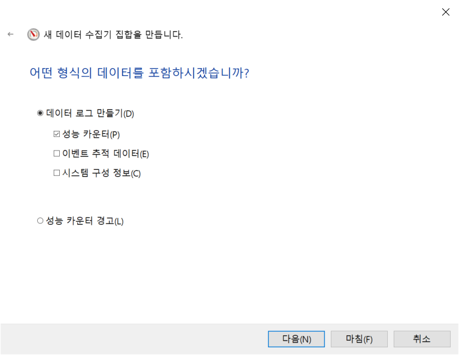
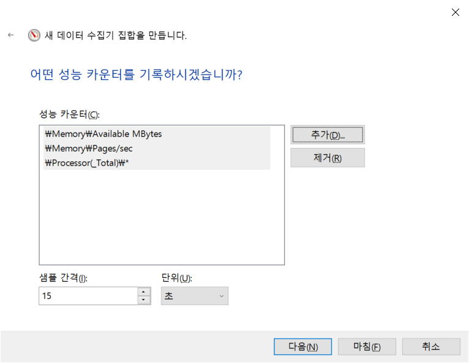
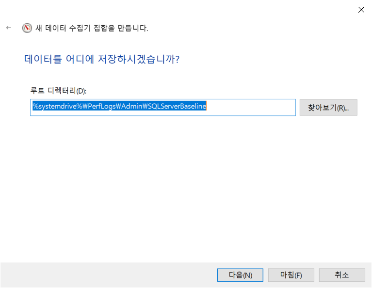
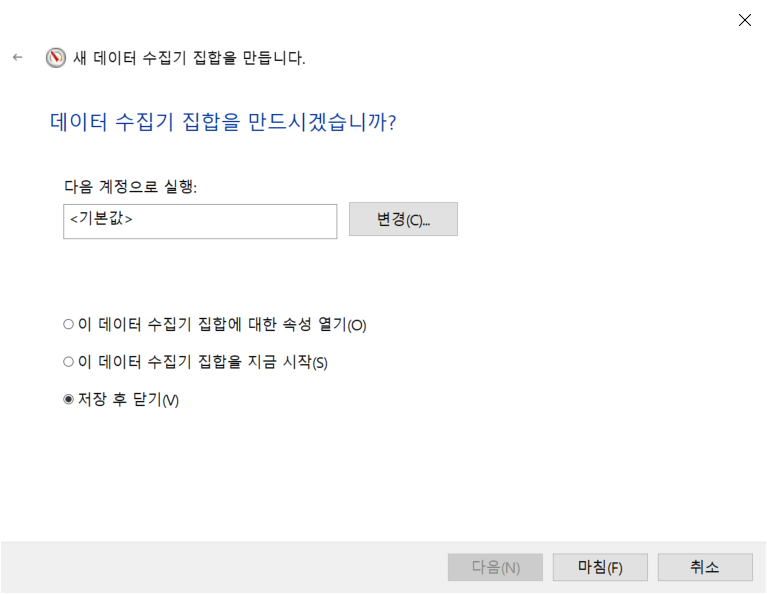
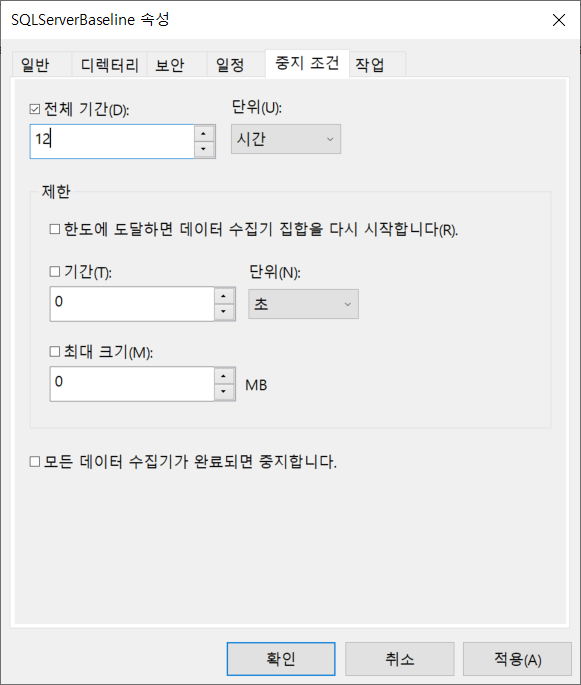

# Baseline 생성
이번에는 나중에 비교할 기준이 될 수 있도록 성능 메트릭을 수집하는 방법과 자동화 된 방법도 설명한다. 베이스라인 데이터는 해당 SQL Server시스템을 이해하는데 기본적인 부분이므로 항상 준비될 수 있어야 한다.

*	가상 또는 실제 머신을 모니터링 할때 고려사항
*	성능 모니터 카운터 데이터 수집하는 자동화된 세팅 방법
*	성능모니터를 사용할때 조심해야 할 점
*	베이스라인 만들기

## 7.1 가상 또는 실제 머신을 모니터링 할때 고려사항
최근에는 가상환경에서 SQL Server를 운용하는 경우가 많아지고 있는 추세.

    * AWS, MS Azure와 같은 퍼플릭 클라우드로 이전하는 회사들이 급격히 증가.
    * 온프레미스에서도 VMWare같은 가상서버에서 SQL Server를 운용하는것을 꺼려하지 않는다.

가상 서버 환경에서 SQL Server를 운용하게 되면 많은 물리적 성능 카운터들이 무의미 해질 수 있다.  그렇기에 VM환경이라면 추가적인 정보를 모니터링해야 한다. 그나마 디스크 및 네트워크 항목들은 물리적인 측정치와 비슷한 값을 가지지만 CPU나 메모리는 전혀 다른 값이 될 수 있기 때문에 주의해야 한다. 이는 CPU,메모리는 가상서버에서 공유되기 때문이며 CPU, 메모리 구성이 한번 세팅되면 왠만하면 변하지 않는 물리적 환경과 달리 VM에서는 쉽게 추가되거나 줄어든다. 다행이도 주요 VM 공급업체들이 시스템과 SQL Server에 대한 모니터링 방법을 제공한다.  
가장 일반적인 두가지 하이퍼바이저안 VMWare와 Hyper-V에 대한 참고 문서는 다음과 같다.

    * VMWare 성능 모니터링 안내(http://bit.ly/1f37tEh)
    * Hyper-V 성능 모니터링 안내(http://bit.ly/2y2U6Iw)

processor queue length와 같은 queue 카운터들은 VM에서도 그대로 적용된다. 이는 VM 자체에서 리소스가 부족하여 SQL Server 리소스도 부족하게 되고 가상CPU에 대한 대기를 한다는것을 뜻한다. 기억해야 할 것은 VM관리가 시스템 리소스를 방해하기 때문에 VM에서 CPU와 메모리가 잠잭적으로 느려질수 있다는 것이다. 또한 호스팅된 리소스의 공유 특성 때문에 I/O가 느려질 수도 있다.

또한 Azure SQL Database 및 SQL Server 2016 이상의 모든 인스턴스 (쿼리 저장소라고 함) 내에 기본 제공 자동화 된 기본 메커니즘이 있습니다. 11 장에서 쿼리 저장소에 대해 자세히 다룰 것입니다.

시스템이 어떻게 작동하는지 이해하는 데 사용할 수있는 또 다른 메커니즘은 DMV입니다. 캐시, 재부팅, 장애 조치 및 기타 메커니즘에 따라 너무 많이 변경되므로 기준선과 동일한 것으로 간주하기는 어렵습니다. 그러나 쿼리 성능의 집계보기를 볼 수있는 방법을 제공합니다. 6 장과 책의 나머지 부분에서 더 자세히 다룰 것입니다.

## 7.2 Baseline 생성
몇가지 주요 성능 카운터를 살펴 보고 이것들을 모아서 시스템의 베이스라인 데이터를 만들어 보자.
   1. 재사용 가능한 성능 카운터 리스트 만들기
   2. 성능카운터 리스트를 사용한 카운터 로그 만들기
   3. 성능 모니터 오버헤드 최소화

### A. 재사용 가능한 성능 카운터 리스트 만들기
    성능모니터 도구를 이용하여 성능 카운터들 수집
    <성능모니터 캡처그림>

    예) SQLServer:Latches:Total Latch Wait Time(ms) 수집 예
        1. Select the option Select Counters from Computer and specify the 
        computer name running SQL Server in the corresponding entry 
        field, or, when running Performance Monitor locally, you’ll see 
        “<Local Computer>” like in Figure 5-1.
        2. Click the arrow next to the performance object 
        SQLServer:Latches.
        3. Choose the Total Latch Wait Time(ms) counter from the list of 
        performance counters.
        4. Click the Add button to add this performance counter to the list of 
        counters to be added.
        5. Continue as needed with other counters. When finished, click the 
        OK button.

    재사용가능한 항목의 베이스라인을 만들때 아래와 같은 리스트를 반복해서 지정
    ```
    Object(Instance)                    Counter
    ----------------------------------  ----------------------------------------------------
    Memory                              Available MBytes
                                        Pages/sec
    PhysicalDisk(Data-disk, Logdisk)   % Disk Time
                                        Current Disk Queue Length
                                        Disk Transfers/sec
                                        Disk Bytes/sec     
    Processor(_Total)                   % Processor Time
                                        % Privileged Time
    System                              Processor Queue Length
                                        Context Switches/sec
    Network Interface(Network card)     Bytes Total/sec
    Network Segment                     % Net Utilization
    SQLServer:Access Methods            FreeSpace Scans/sec
                                        Full Scans/sec
    SQLServer:Buffer Manager            Buffer cache hit ratio
    SQLServer:Latches                   Total Latch Wait Time (ms)
    SQLServer:Locks(_Total)             Lock Timeouts/sec
                                        Lock Wait Time (ms)
                                        Number of Deadlocks/sec
    SQLServer:Memory Manager            Memory Grants Pending
                                        Target Server Memory (KB)
                                        Total Server Memory (KB)
    SQLServer:SQL Statistics            Batch Requests/sec
                                        SQL Re-Compilations/sec
    SQLServer:General Statistics        User Connections
    ```

    모든 성능 카운터를 추가했으면 확인을 클릭하여 카운터 추가 대화 상자를 닫습니다. 카운터 목록을 .htm 파일로 저장하려면 성능 모니터의 오른쪽 프레임을 마우스 오른쪽 단추로 클릭하고 다른 이름으로 설정 저장 메뉴 항목을 선택합니다.

    .htm 파일에는 카운터 로그를 만들거나 동일한 SQL Server 컴퓨터에 대한 성능 모니터 그래프를 대화 형으로보기 위해 기본 카운터 집합으로 사용할 수있는 모든 성능 카운터가 나열됩니다. 다른 SQL Server 컴퓨터에 대해이 카운터 목록을 사용하려면 메모장과 같은 편집기에서 .htm 파일을 열고 \\ SQLServerMachineName의 모든 인스턴스를 아무 것도없이 (빈 문자열 만) 바꿉니다.

    이 모든 것에 대한 지름길은 Erin Stellato가 "성능 모니터에 대한 기본 카운터 사용자 지정"(http://bit.ly/1brQKeZ) 기사에서 설명합니다. 또한 Microsoft에서 제공하는 도구 인 PAL (Performance Analysis of Logs) (https://bit.ly/2KeJJmy)을 사용하여 이러한 데이터 중 일부를보다 쉽게 처리 할 수 있습니다.

    또한이 카운터 목록 파일을 사용하여 그림 5-2와 같이 인터넷 브라우저에서 대화 형으로 성능 모니터 그래프를 볼 수 있습니다.
    <성능카운터 캡처>

### B. 성능카운터 리스트를 사용한 카운터 로그 만들기
성능 모니터는 일정 기간 동안 여러 카운터의 성능 데이터를 저장하는 카운터 로그 기능을 제공합니다. 성능 모니터를 사용하여 저장된 카운터 로그를 보고 성능 데이터를 분석 할 수 있습니다. 일반적으로 정의 된 성능 카운터 목록에서 카운터 로그를 만드는 것이 편리합니다. GUI를 통해 데이터를 보는 것보다 단순히 데이터를 수집하는 것이 서버 성능 문제 해결을 준비하거나 기준을 설정하는 데 선호되는 자동화 방법입니다.

성능모니터 > 데이터 수집기 집합 > 사용자 정의 > 오른쪽 마우스 클릭 > 새로 만들기 > 데이터 수집기 집합  
이름을 지정하고 "수동으로 만들기(고급)" 을 선택하고 다음을 누른다.  


    어떤 형식의 데이터를 선택하는 화면이 뜨는데 "성능 카운터" 선택하고 다음을 누른다


    원하는 성능 카운터들을 추가하고 데이터를 수집할 샘플 간격을 초단위로 입력하고 다음을 누른다
    

    데이터를 저장할 폴더를 지정하고 다음을 누른다
    

    실행할 계정을 선택하거나(보통은 기본값) 기타 동작을 선택하고 마침을 누른다
        

    만들어진 데이터 수집기 집합인 SQLServerBaseline 을 오른쪽 클릭하고 속성 > 일정을 선택한다.  
    다음과 같이 시작일정을 추가할수 있다.


    중지조건도 지정해 얼마만큼만 실행될지 정할수 있다.
     

    결과가 이진파일이면서 파일명이 DataCollector01.blg 로 나오는데 다음과 같이 조정할 수 있다.  
    만들어진 데이터 수집기 집합인 SQLServerBaseline을 선택하고 오른쪽 DataCollector01을 오른쪽 클릭 > 속성에서 로그형식을 "쉼표로 구분" 선택하면 csv의 텍스트 포맷으로 저장된다.
     

    파일명 DataCollector01을 바꿀수 있다.
     


    추가적인 성능 모니터 사용 지침을 사용해 좀더 자세한 내용을 살펴 볼수 있다.
 [Windows Server 2022의 성능 튜닝 지침](https://docs.microsoft.com/ko-kr/windows-server/administration/performance-tuning/)

### C. 성능 모니터 오버헤드 최소화
성능 모니터는 오버헤드를 최소화하도록 만들어졌지만 그래도 시스템 영향을 적게 받게 하지 위해서 다음과 같은 고려사항이 있다.

    * 카운터 수를 제한. 정말로 1차적으로 필요한 것만 지정
    * 성능 모니터 그래프 기능보다는 카운터 로그 사용하여 데이터 수집
    * 그래프 기능 사용할 경우에는 원격으로 성능 모니터 접근
    * 물리적으로 별도의 디스크에 카운터 로그 저장
    * 샘플링 간격을 증가

### * 카운터 수 제한
짧은 간격으로 많은 수의 카운터들을 수집하는 것은 약간이지만 시스템에 오버헤드를 발생 시킬 수 있다. 이로 인하여 수집해야 할 카운터 데이터에 영향을 줄 수 있기 때문에 제한하는 것은 중요하다. 