# Baseline 생성
Baseline 데이터란 해당 서버의 평소 성능 수치를 수집/측정 해 두는 것을 말한다. 나중에 이 수치와 비교하여 차이가 많이 나면 문제 부분을 바로 알 수 있는 장점이 있기 때문에 모든 SQL Server는 베이스라인 데이터가 1개는 존재해야 한다.
 
이번 장에서는 주로 베이스라인 데이터를 만들기 위해 주기적으로 성능 데이터를 수집하고 이를 자동화 하는 방법도 같이 소개한다.  

성능모니터에서 특정 기간동안 성능데이터를 수집하여 파일로 저장하는 기능을 "데이터 수집기 집합"이라고 하는데 예전에는 이를 "카운터 로그" 라고 불렀다. 이 책에서도 많은 부분에서 카운터 로그라는 명칭을 사용하는데 우리는 "데이터 수집기 집합"이라고 찰떡같이 이해하자.  

이번 장에서는 다음과 같은 내용을 설명한다.

    * 가상 머신 혹은 실제 머신을 모니터링 할때 고려사항
    * 성능 모니터 수치를 수집하여 카운터로그로 만드는 자동화된 방법
    * 성능모니터를 사용할때 주의점
    * Azure SQL Database를 사용할때의 Baseline
    * 베이스라인 만들기

## <font color='dodgerblue' size="6">1) 가상 머신 혹은 실제 머신을 모니터링 할때 고려사항</font>
최근에는 가상환경에서 SQL Server를 운용하는 경우가 많아지는 추세인데 이유는 다음과 같다.

    * AWS, MS Azure와 같은 퍼플릭 클라우드의 가상서버인 EC2, Azure VM들을 많이 사용.
    * 온프레미스에서도 VMWare같은 가상서버에서 SQL Server를 운용하는 데 거부감이 적어졌다.

가상 서버 환경에서 SQL Server를 운용하게 되면 많은 표준 성능 카운터들이 무의미 해질 수 있기 때문에 정확한 정보를 얻으려면 추가적인 지표를 모니터링해야 한다.  
그나마 디스크 및 네트워크 항목들은 물리적인 측정치와 비슷한 값을 가져서 큰 문제가 안되지만 CPU나 메모리는 전혀 다른 값이 표시되기에 주의해야 한다. CPU와 메모리는 여러 VM들과 공유되는게 일반적이라 전통적인 측정방법이 무의해 지기 때문이다. 또 다른 큰 차이는 물리서버에서는 CPU,메모리의 구성이 한번 세팅되면 왠만하면 변경되지 않는데 반해 가상서버에서는 쉽게 추가되거나 제거될수 있다는 것이다.

다행히도 주요 VM공급업체들이 시스템과 SQL Server에 대한 추가 모니터링 방법을 제공한다. 가장 일반적인 두가지 하이퍼바이저인 VMWare와 Hyper-V에 대한 참고 문서는 다음과 같다.

    * VMWare 성능 모니터링 안내(http://bit.ly/1f37tEh)
    * Hyper-V 성능 모니터링 안내(http://bit.ly/2y2U6Iw)

"processor queue length" 와 같은 queue 종류의 카운터들은 VM환경에서도 유효하다. 왜냐하면 물리적인 머신의 성능 부족이든, 가상서버의 성능 부족이든 어쨌든 그 위에서 돌아가는 SQL Server 입장에서는 리소스 부족으로 인하여 대기하여야 하기 때문이다.

또한 Azure SQL Database 및 SQL Server 2016 이상에는 쿼리 저장소라고 하는 기본으로 내장된 자동화 된 베이스라인 메커니즘이 있다. 뒤에서 쿼리 저장소에 대해 자세히 다룰 것이다.

시스템이 어떻게 작동하는지 이해하는 데 사용할 수있는 또 다른 메커니즘은 DMV이다. 캐시, 재부팅, 장애 조치 및 기타 메커니즘과 같은 다양한 요인 때문에 항상 베이스라인 데이터와 동일한 값이 나올수 없다. 그렇기에 대략적인 성능 데이터를 집계된 형태로 보여주는 DMV를 사용하는 경우가 많다. 뒤에서 보다 자세히 설명한다.

## <font color="dodgerblue" size="6">2) Baseline 생성</font>
몇가지 성능 카운터 수집하는 방법을 살펴 보고 이후 시스템의 베이스라인 데이터를 만들어 보자.

    a. 그래픽UI로 성능 카운터 수집
    b. 그래픽UI없이 성능 카운터 수집위해 카운터 로그 설정
    c. 성능 모니터 오버헤드 최소화

- ### a. 그래픽UI로 성능 카운터 수집

    - 성능모니터 도구를 열면 그래픽 형태로 열린다.  
    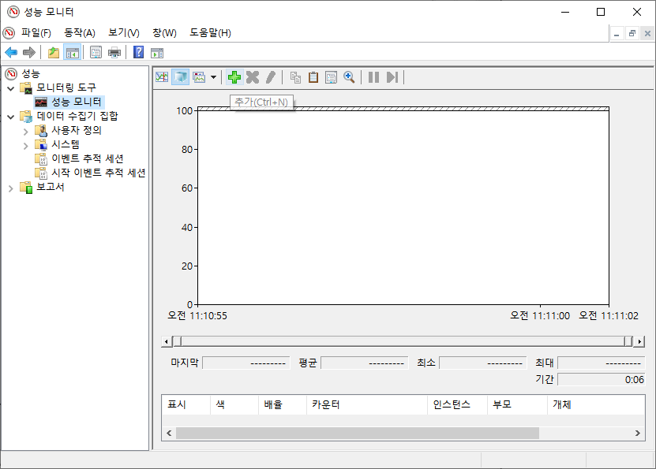  

    - 성능카운터 추가
        ```
        -> 툴바에서 + 버튼을 누르거나 단축키 ctrl + N을 눌러 카운터를 추가할 수 있는 창 오픈.  
        -> "다음 컴퓨터에서 카운터 선택" 부분은 기본적으로 "로컬 컴퓨터"로 선택되어 있다.  
        ```
    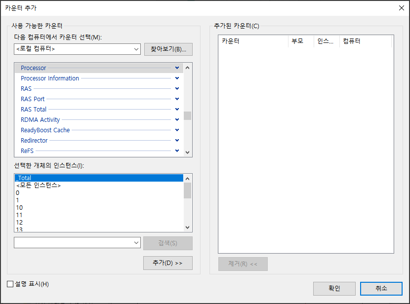

    - 샘플로 SQLServer:Latches:Total Latch Wait Time(ms) 수집해보자

        ```
        -> 카운터에서 SQLServer:Latches 카운터를 선택
        -> 아래 화살표를 누르면 하위 카운터들이 나열되는데 "Total Latch Wait Time(ms)"를 선택.        
        -> 하단의 Add 버튼을 눌러 추가한다.
        -> "확인" 버튼을 눌러 최종 완료.    
        ```
        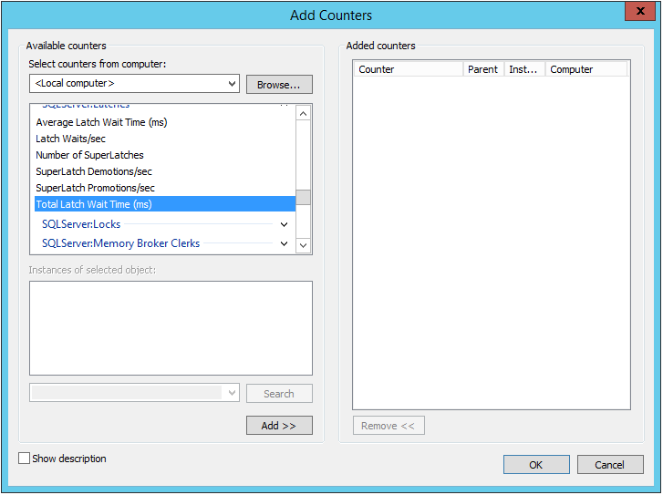
    
    - 베이스라인을 만들기 위해 카운터 로그를 수집할때는 보통 아래 카운터를 수집하는게 일반적.

        ```
        Object(Instance)                    Counter
        ----------------------------------  ----------------------------------------------------
        Memory                              Available MBytes
                                            Pages/sec
        PhysicalDisk(Data-disk, Log-disk)   % Disk Time
                                            Current Disk Queue Length
                                            Disk Transfers/sec
                                            Disk Bytes/sec     
        Processor(_Total)                   % Processor Time
                                            % Privileged Time
        System                              Processor Queue Length
                                            Context Switches/sec
        Network Interface(Network card)     Bytes Total/sec
        Network Segment                     % Net Utilization
        SQLServer:Access Methods            FreeSpace Scans/sec
                                            Full Scans/sec
        SQLServer:Buffer Manager            Buffer cache hit ratio
        SQLServer:Latches                   Total Latch Wait Time (ms)
        SQLServer:Locks(_Total)             Lock Timeouts/sec
                                            Lock Wait Time (ms)
                                            Number of Deadlocks/sec
        SQLServer:Memory Manager            Memory Grants Pending
                                            Target Server Memory (KB)
                                            Total Server Memory (KB)
        SQLServer:SQL Statistics            Batch Requests/sec
                                            SQL Re-Compilations/sec
        SQLServer:General Statistics        User Connections
        ```

    - 모든 성능 카운터를 추가했으면 확인을 클릭하여 카운터 추가 대화 상자를 닫습니다.  
      
    그래픽 차트형태로 실시간 데이터가 보여지고 있다.

    - **카운터 항목 정보 설정파일로 저장**  
      그래픽 UI화면에서 매번 성능 카운터를 추가하는 것은 매우 피곤한 작업이다. 우리는 최초에만 추가하고 나중에는 리스트를 어디엔가 저장하고 불러와서 바로 사용하길 원한다.
      
        - **첫번째 : htm 세팅 정보**
            - htm파일로 세팅 저장
            ```
            성능 모니터의 오른쪽 프레임을 마우스 오른쪽 단추로 클릭하고 "설정을 다른 이름으로 저장" 메뉴 항목을 선택.
            그러면 .htm로 리스트를 저장하게 된다.
            저장된 htm파일은 뒤에서 설명하는 카운터로그 만들기에도 사용가능 
            ```
            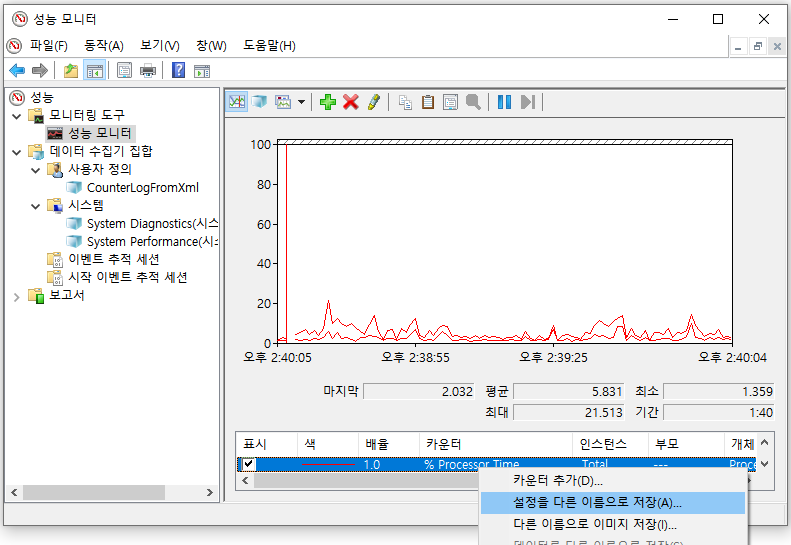  
            ```tip
            htm 파일이기 때문에 Internet Explorer 브라우저에서 열면 ActiveX를 통해 성능 모니터 화면을 캡처한 것처럼 다시 볼수 있다.
            다른 브라우저 안됨.          
            {: width="80%"}  
            Internet Explorer에서 열린 것에 주의하자.
            ```
            - htm 세팅 불러오기
            ```
            1. htm파일을 텍스트에디터로 열고 전체내용 복사.
            2. 성능모니터의 오른쪽 화면에서 "카운터 목록 붙여넣기" 버튼 클릭
            ```
              
            모든 카운터가 다시 보인다
      
        - **두번째 : PerfmonCfg 세팅 정보**  
        독립실행형 모드로 성능모니터를 실행하여 .PerfmonCfg 파일로 세팅 저장하면 된다.  
        Erin Stellato가 "성능 모니터에 대한 기본 카운터 사용자 지정"(http://bit.ly/1brQKeZ) 기사에서 설명하는 방법. 

            독립 실행모드로 성능 모니터 실행.  
            ```
            명령어로 perfmon /sys 로 치면 성능 모니터가 단촐하게 열린다. 
            카운터를 추가한 후 이 화면을 닫고 다시 실행해도 추가된 카운터들이 그대로 보인다. 즉 어딘가에 설정이 자동 저장되는 것이다.
            PerfmonCfg 파일로..  
            우리는 파일 / 다른 이름으로 세팅 저장 메뉴를 통해 여러개의 설정 파일을 저장해 놓을 수 있다.
            그리고 저장된 설정 파일을 더블클릭해서 열면 마지막 실행되었던 성능 모니터가 그대로 열린다.  
            꼼수로 .blg 파일 클릭했을때도 독립실행모드로 열리니 더미 .blg 하나 만들어 놓으면 명령어 칠필요 없음.
            ```
            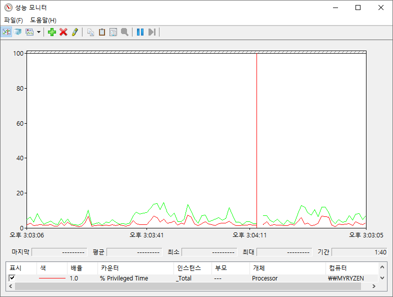  
        


- ### b. 그래픽UI없이 성능 카운터 수집위해 카운터 로그 설정
    나중에 분석하기 위해 UI없이 일정 기간동안의 성능 데이터를 수집/저장하는 카운터 로그 기능은 필수이다. 또한 그래픽 UI에서 발생하는 오버헤드를 줄일수 있어서 더욱 편리하고 자동화하기에도 좋은 방법이다.

    - <b>b.1 카운터 로그 만들기 첫걸음 (일일이 수동 추가)</b>  
        일일이 필요 카운터를 추가하여 카운터 로그 만들어 보자

        * 성능모니터 > 데이터 수집기 집합 > 사용자 정의 > 오른쪽 마우스 클릭 > 새로 만들기 > 데이터 수집기 집합  
        이름을 지정하고 "수동으로 만들기(고급)" 을 선택하고 다음을 누른다.  
        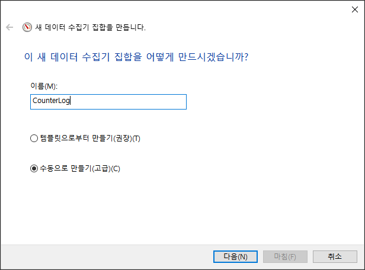

        * 어떤 형식의 데이터를 선택할것인지 화면이 뜨는데 "성능 카운터" 선택하고 다음을 누른다.  
        

        * 원하는 성능 카운터들을 추가하고 데이터를 수집할 샘플 간격을 초단위로 입력하고 다음을 누른다.  
        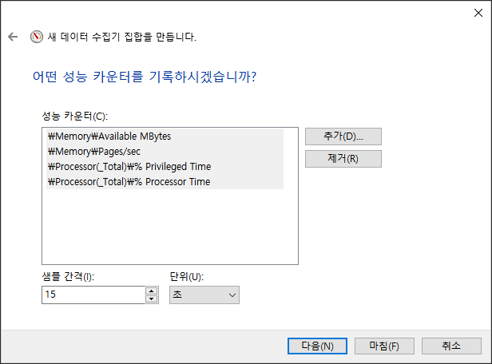    

        * 데이터를 저장할 폴더를 지정하고 다음을 누른다.  
            

        * 실행할 계정을 선택하거나(보통은 기본값) 기타 동작을 선택하고 마침을 누른다.  
        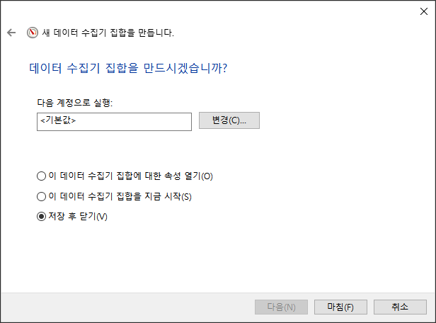        

        * 만들어진 데이터 수집기 집합인 CounterLog 을 오른쪽 클릭하고 속성 > 일정을 선택한다.  
        다음과 같이 시작일정을 추가할수 있다.  
        
        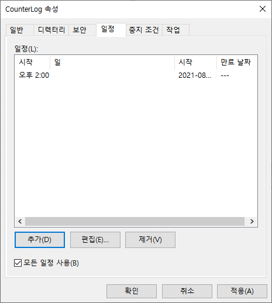

        * 중지조건도 지정해 얼마만큼만 실행될지 정할수 있다.  
        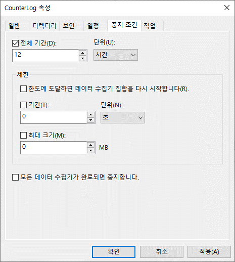     

        * 결과가 .blg 이진파일형태로 저장되는데 csv로 바꿀수 있다.
        ```
        -> 만들어진 데이터 수집기 집합인 CounterLog을 선택
        -> 오른쪽 DataCollector01을 오른쪽 클릭 > 속성
        -> 로그형식을 "쉼표로 구분" 선택하면 csv의 텍스트 포맷으로 저장  
        ```        
        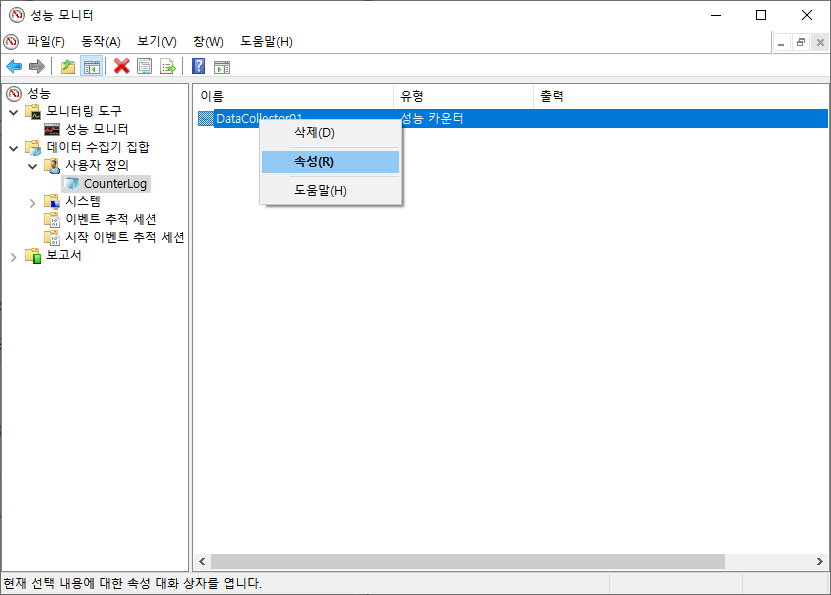 
         

        * 저장되는 파일명을 DataCollector01에서 다른 것으로 바꿀수 있다.  
             

    - <b>b.2 템플릿(.htm)을 사용하여 카운터 로그 만들기</b>  
        이전에 저장해 놓은 .htm 파일을 이용해 좀더 쉽게 카운터 로그 만들기

        * 성능모니터 > 데이터 수집기 집합 > 사용자 정의 > 오른쪽 마우스 클릭 > 새로 만들기 > 데이터 수집기 집합  
          이름 지정 후 "템플릿으로부터 만들기(권장)" 선택하고 다음.  
          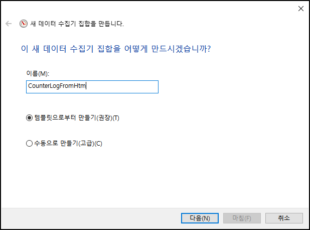

        * 템플릿 지정할수 있는 화면에서 "찾아보기"를 눌러 위에서 저장해 놓은 htm 파일을 지정.           
        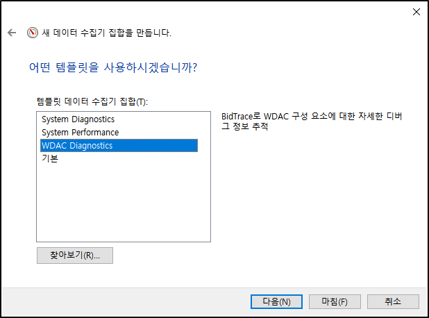
        ```tip
        기본적으로 xml만 선택할 수 있지만 "모든파일"로 바꿔서 htm 파일을 찾기
        ```
          
        위와 같은 화면으로 바뀜. "마침"을 눌러 설정완료

        * 성능모니터의 다음과 같은 카운터 로그가 만들어진다.  
        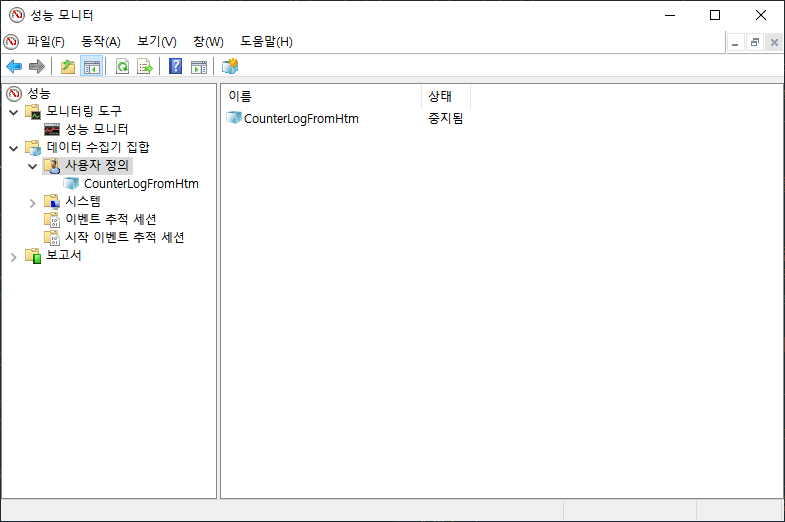  
        오른쪽영역의 DataCollector01을 오른쪽 마우스 속성을 보면 카운터항목들만 추가되어 있고 다른 설정들은 아무것도 안되어 있다.  
        이것이 .htm 설정 파일을 이용의 단점이다. xml설정파일을 모든 설정들이 저장되어 있기 때문에 훨씬 편리.  
        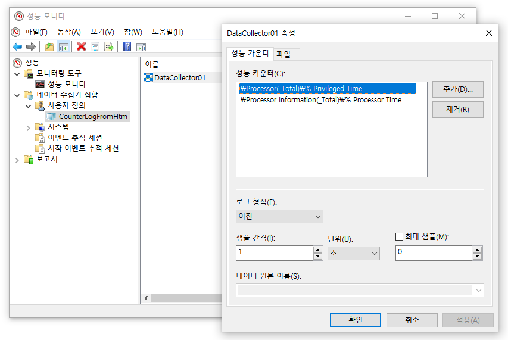  
        
    - <b>b.3 템플릿(.xml)을 사용하여 카운터 로그 만들기</b> 
        * 위 b.1에서 만들어 놓은 CounterLog 카운터로그를 오른 클릭-> 템플릿 저장 선택  
        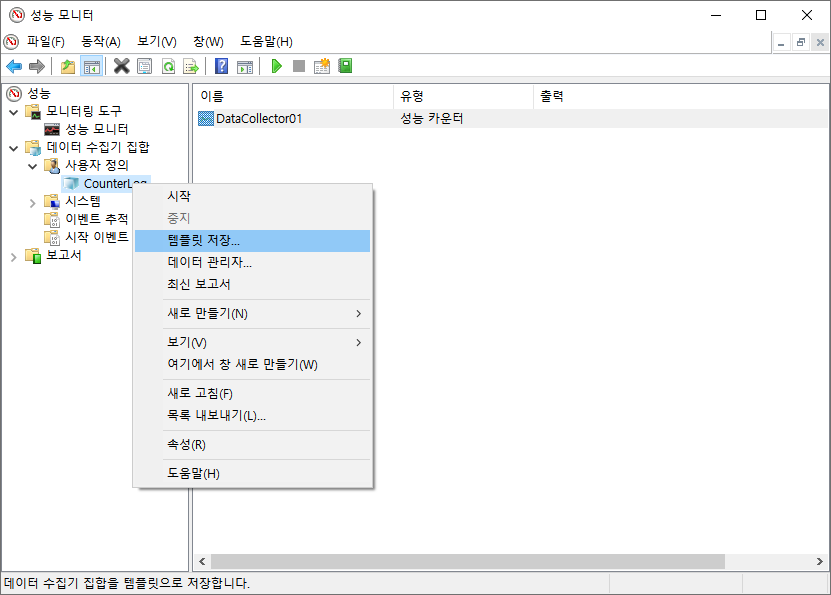  
        xml파일로 설정을 저장할수 있다.
        
        * 설정을 저장했으면 테스트를 위해 CounterLog 카운터로그 자체를 삭제  
        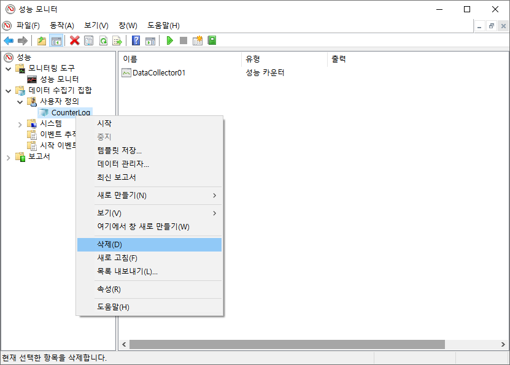  

        * 신규 카운터 로그를 만들기  
        성능모니터 > 데이터 수집기 집합 > 사용자 정의 > 오른쪽 마우스 클릭 > 새로 만들기 > 데이터 수집기 집합  
        "템플릿으로부터 만들기(권장)" 선택하고 다음 클릭
         

        * 어떤 템플릿을 선택할 수 있는 화면이 나오는 "찾아보기" 눌러 저장해 놓은 xml 파일 선택
                  
        아래와 같이 xml의 설정파일을 불러왔다. 마침 클릭  
        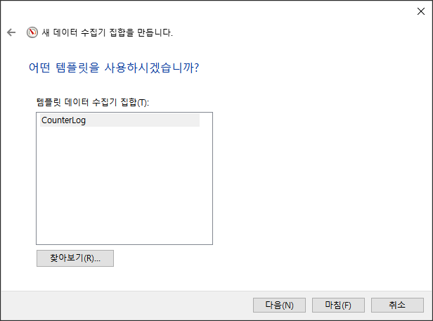  

        * 성능 모니터에서 만들어진 카운터로그를 살펴보자
        htm설정파일로는 카운터항목들만 가져왔는데 xml설정파일은 일정, 중지조건 등 모든 설정을 다 가져올 수 있다.  
        
        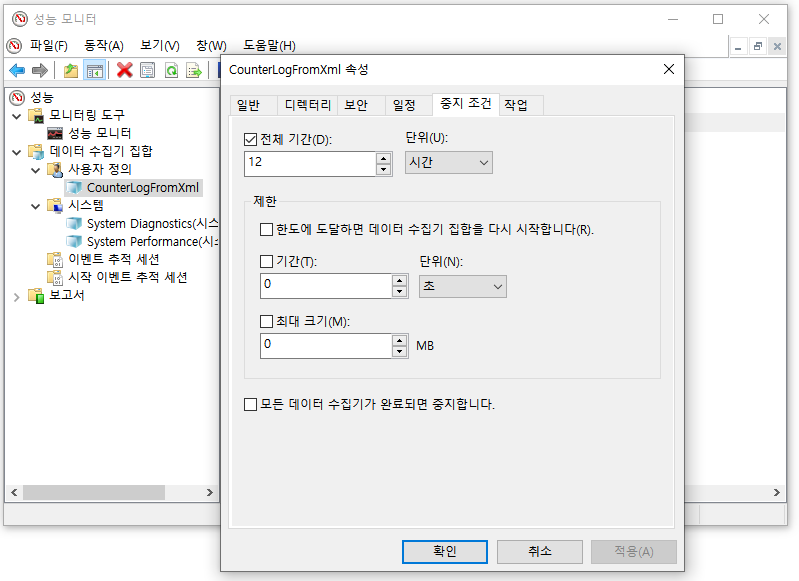
        
        

    ```note
    이진 파일인 .blg은 파일을 더블클릭만 해도 독립 실행형 성능 모니터 화면이 열려 바로 그래픽 UI로 분석할 수 있다.  
    하지만 크기가 csv보다 몇배나 크기 때문에 실서버에서 측정하고 테스트서버로 옮기는 등의 일반적인 경우때문에 권장하지 않는다.  
    대부분 csv로 저장하는 편.
    나중에 blg를 csv로 변환할 수도 있다.
    ```

    ```note
    **PAL 사용**

    또한 Microsoft에서 제공하는 도구 인 PAL( [`Performance Analysis of Logs`](https://bit.ly/2KeJJmy) )을 사용하면 이러한 데이터 중 일부를 보다 쉽게 분석 할 있다. 성능모니터의 카운터 로그 데이터를 이용해 분석을 쉽게 해주는 툴이다.         
    ```

    추가적인 성능 모니터 사용 지침을 사용해 좀더 자세한 내용을 살펴 볼수 있다.
    [Windows Server 2022의 성능 튜닝 지침](https://docs.microsoft.com/ko-kr/windows-server/administration/performance-tuning/)

- ### c. 성능 모니터 오버헤드 최소화
    성능 모니터는 오버헤드를 최소화하도록 만들어졌지만 그래도 시스템 영향을 적게 받게 하기 위해서는 다음 사항을 고려해야 한다.

        - 카운터 수를 제한. 정말로 1차적으로 필요한 것만 지정
        - 성능 모니터 그래프 기능보다는 카운터 로그 사용하여 데이터 수집
        - 그래프 기능 사용할 경우에는 원격으로 성능 모니터 접근
        - 물리적으로 별도의 디스크에 카운터 로그 저장
        - 샘플링 간격 늘리기

    - 카운터 수 제한  
    짧은 간격으로 많은 수의 카운터들을 수집하는 것은 시스템에 약간이나마 오버헤드가 추가될 수 있다. 이 오버헤드의 대부분은 추가한 성능 카운터 갯수에 의해 발생하므로 선택한 카운터들에 대해 자세히 알 필요가 있다. 
     따라서 모니터링하려는 개체와 그 이유를 아는 것이 중요하다.

    - 카운터 로그 형태로 성능 데이터를 수집하고 원본 서버에 저장  
    성능 모니터의 그래프를 사용하여 실시간 성능 데이터를 그래프 형태로 보면 해당 시스템에 상당한 오버 헤드가 발생한다. 그렇기에 원본 서버에서는 카운터 로그형태로 수집 된 성능파일을 만들며 이때 모니터링되는 디스크가 아닌 별도의 로컬 디스크에 저장하는것이 좋다. 그 후 이를 원격 컴퓨터에서 열어서 그 후 그래프로 보는 방식으로 사용해야 한다.


    - 샘플링 간격 늘리기  
    기본 모니터링 중 리소스 사용 패턴에 주로 관심이 있기 때문에 성능 데이터 샘플링 간격을 60 초 이상으로 쉽게 늘려 로그 파일 크기를 줄이고 디스크 I/O에 대한 수요를 줄일 수 있다. 또한 짧은 샘플링 간격을 사용하여 민감한 타이밍 문제를 감지하고 진단 할 수도 있다. 보는 동안에도
    성능 모니터는 대화식으로 그래프를 작성하고 샘플 당 기본값 인 1 초에서 샘플링 간격을 늘립니다.

## <font color="dodgerblue" size="6">3) Baseline 데이터를 바탕으로 시스템 활동 분석</font>
데이터베이스 애플리케이션의 기본 동작은 다음과 같은 다양한 요인으로 인해 시간이 지남에 따라 시시각각 변화한다.

    * 데이터 볼륨과 배포 변화
    * 사용자 기반 증가
    * 어플리케이션 사용 패턴의 변화
    * 응용 프로그램 동작의 추가 또는 변경
    * 새 서비스 팩 또는 소프트웨어 업그레이드 설치
    * 하드웨어 변경

이러한 변경으로 베이스라인 데이터가 오래되면 될 수록 현재와 차이가 많이 발생하게 된다. 따라서 정기적으로 새로운 베이스라인을 만들어 두는 것이 중요하며 필요한 경우에는 나중에 참조 할 수 있도록 이전 기준 로그를 아카이브해 두는 것도 좋다.

예) 베이스라인을 월별로 비교해 보면 시스템의 패턴과 장기적인 추세 예측하는데 도움이 된다.

다음 단계에 따라 성능 모니터 도구를 사용하여 이전에 만들어놓았던 베이스라인 또는 카운터 로그 데이터를 분석 할 수 있다.

- a. 카운터 로그를 엽니다.  
    성능 모니터의 도구 모음 > 로그 데이터보기 > 로그 파일의 이름을 선택. 또는 단축키 (ctrl + L)  

    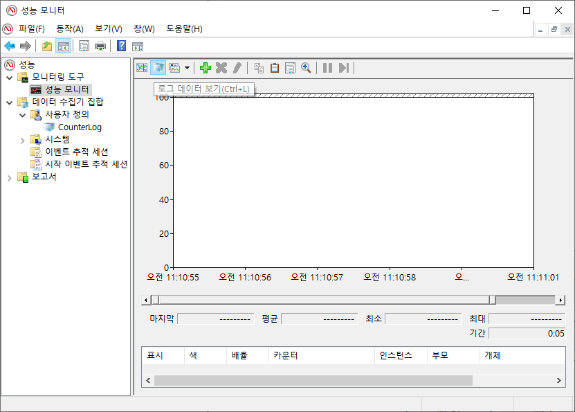     
    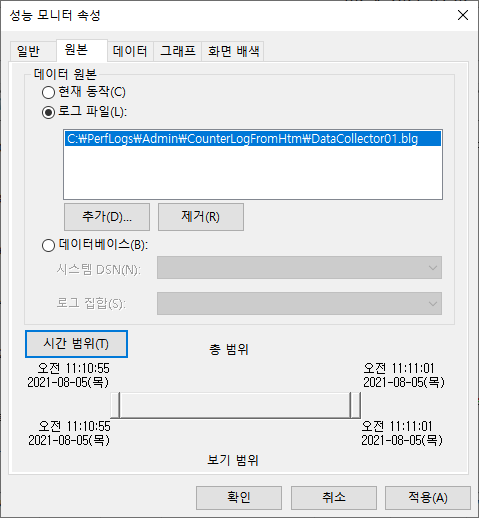     


- b. 원하는 카운터만 추가  
    데이터 탭을 눌러 화면에 보여주고 싶은 성능 카운터를 추가.  
    주의할 것은 카운터 로그를 생성하는 동안 수집한 성능 개체, 카운터 및 인스턴스만 추가할 수 있다는 것.

    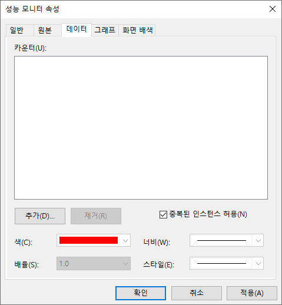  
    필요한 카운터들만 추가한다.  

    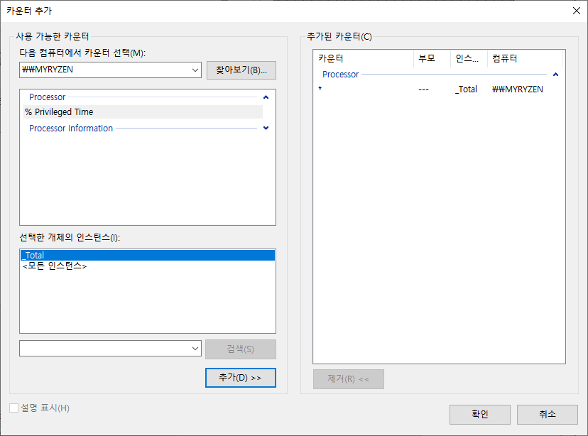         
    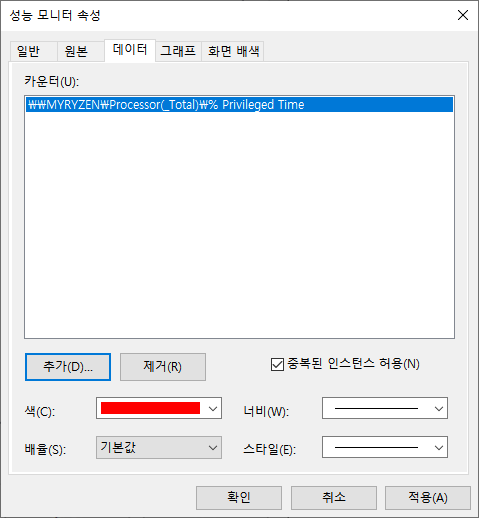  
    보고 싶은 카운터들만 추가된 화면  

       

- c. 아래 그림과 같이 시간 범위를 적절히 조정하면 원하는 시간대 데이터만 볼수도 있다.
    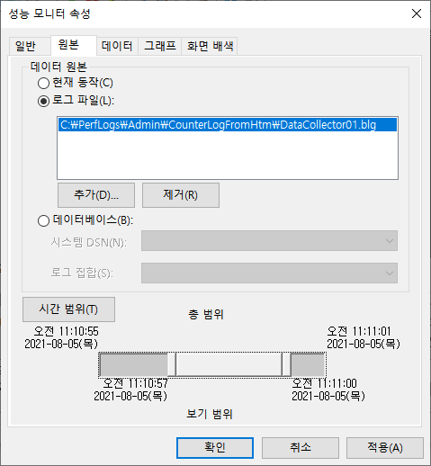     

성능 검토 중에 성능 카운터의 현재 값을 최신 베이스라인과 비교하여 데이터베이스의 시스템 수준 동작을 분석 할 수 있다. 성능 데이터를 비교할 때 다음 사항을 고려.

    * 두 경우 모두 동일한 성능 카운터 집합을 사용.
    * 개별 카운터에 적용 할 수있는 카운터의 최소, 최대 및 평균 값을 비교.
    * 일부 카운터에는 권장 수치가 없다.
      그 값은 응용 프로그램에 따라 다르기 때문에 해당 기준 카운터와의 상대적 비교는 필수. 
      예) SQL Server에 대한 User Connections 카운터의 현재 값은 응용 프로그램의 좋고 나쁨을 나타내지 않는다.
      그러나 해당 기준 값과 비교하면 사용자 연결 수가 크게 증가하여 워크로드가 증가 함을 알 수 있다.
    * 현재 카운터 로그와 베이스라인 카운터 로그에서 카운터 값 범위를 비교. 카운터의 개별 값의 변동은 값 범위에 의해 정규화된다.
    * 같은 날의 로그를 비교 권장.
      대부분의 애플리케이션에서 사용 패턴은 하루 중 다른 부분에 따라 다르다 특정 시간 동안 카운터의 최소, 최대 및 평균 값을 얻으려면
      이전에 표시된대로 카운터 로그의 시간 범위를 조정한다.

시스템 수준 병목 현상이 확인되면 응용 프로그램의 내부 동작을 분석하여 병목 현상의 원인을 확인해야 한다. 병목 현상의 원인을 식별하고 최적화하면 시스템 리소스를 효율적으로 사용하는 데 도움이 됩니다.

## <font color="dodgerblue" size="6">4) Azure SQL Database의 베이스라인</font>
물리 머신이든 가상 머신이든 모든 SQL Server 인스턴스에서 베이스라인이 필요하다. 또한 Azure SQL Database에서도  성능 베이스라인 데이터를 만들어야 한다.
하지만 PaaS(서비스로서의 데이터베이스) 제품이기 때문에 OS가 설치된 가상 머신 또는 물리적 서버가 존재하지 않는다. 당연하게도 성능 모니터같은 기존 툴을 사용할 수 없기 않기 때문에 다른 방법을 사용해야 한다.

하지만 실제 물리적인 CPU 또는 디스크의 사용량을 측정하지 못하는 대신 Microsoft에서 정의한 DTU(데이터베이스 트랜잭션 단위)라는 성능 측정 단위를 사용해야 한다. Azure Portal같은 도구를 통해 시간이 지남에 따라 데이터베이스의 DTU 동작 활동을 관찰 할 수 있다.

DTU는 I/O, CPU 및 메모리등의 자원을 묶어서 특정 성능치로 구현하는 서비스 레벨이며 Azure에서만 존재하는 개념이다. 예를 들면 50 DTU면 250GB스토리지와 1200개의 동시세션까지 가능한 것이다. 그 이상의 스펙을 원한다면 DTU도 상위것을 선택해야 한다.  

<font size="5"><b>DTU 모니터링 방법</b></font>  
Azure SQL Database에서는 "성능 모니터" 같은 기존 툴을 사용 하지 못하기 때문에 이를 대신해 사용할 수 있는 몇 가지 방법이 몇 가지 있다.

    - sys.resource_stats를 쿼리하는 방법.
      14 일 실행 기록을 유지하고 5 분 간격으로 데이터를 집계하여 저장된다.

    - Azure Portal을 사용
      DTU 사용을 모니터링하기 위한 메커니즘을 제공하지만 베이스라인을 설정하는 메커니즘은 제공하지 않는다.
      그럴때는 Azure SQL Database 관련 DMV인 sys.dm_db_resource_stats를 사용해야 한다.
      이 DMV는 지정된 Azure SQL Database의 DTU 사용량에 대한 정보를 유지한다. 15 분 단위로 1 시간 분량의 정보를 포함한다.
      SQL Server 인스턴스에서와 같이 베이스라인을 설정하려면 시간이 지남에 따라 변화하는 이 데이터를 캡처해야 한다. 
      sys.dm_db_resource_stats에 표시된 정보를 테이블로 수집한 후 Azure SQL Database의 성능 메트릭에 대한 베이스라인을 설정할 수 있다.

Azure SQL Database에는 기본적으로 쿼리 저장소가 활성화되어 있으므로 이를 사용하여 시스템에서 일어나는 일을 이해할 수 있다.

## <font color="dodgerblue" size="6">5) 요약</font>
이 장에서는 성능 모니터 도구를 사용하여 SQL Server의 전반적인 동작과 성능이 느린 데이터베이스 응용 프로그램이 시스템 리소스에 미치는 영향을 분석하는 방법을 배웠고 또한 서버 및 데이터베이스 모니터링의 일부로 베이스라인 설정에 대해서도 배웠다. 이러한 도구를 사용하면 베이스라인을 벗어나는 평소와 다른 이상 동작이 발생할 때를 보다 빠르게 알아챌 수 있게 된다. 또한 데이터가 부실하지 않도록 정기적으로 베이스라인을 갱신하는 것이 좋다.

다음 장에서는 성능 튜닝을 위해 데이터베이스 애플리케이션의 워크로드를 분석하는 방법을 배워 본다.