# Baseline 생성
Baseline 데이터란 해당 서버의 평소 상태의 성능 수치를 수집/측정 해 두는 것을 말한다. 나중에 문제발생시 이와 비교하여 차이가 많이 나면 문제 부분을 바로 알 수 있는 장점이 있으며 모든 서버는 베이스라인 데이터가 1개는 존재해야 한다.
 
이번 장에서는 주로 베이스라인 데이터를 만들기 위해 주기적으로 성능 데이터를 수집하고 이를 자동화 하는 방법을 같이 소개한다.  

성능모니터에서 성능데이터를 수집하여 파일로 저장하는 기능을 "데이터 수집기 집합"이라고 하는데 예전에는 이를 "카운터 로그" 라고 불렀다. 이 책에서의 많은 부분에서 카운터 로그라는 명칭으로 설명하는데 우리는 "데이터 수집기 집합"이라고 찰떡같이 이해하자.  

이번 장에서는 다음과 같은 내용을 설명한다.

    * 가상 또는 실제 머신을 모니터링 할때 고려사항
    * 성능 모니터의 성능 수치를 수집하는 자동화된 세팅 방법
    * 성능모니터를 사용할때 조심해야 할 점
    * Azure SQL Database를 사용할때의 Baseline
    * 베이스라인 만들기

## 1) 가상 또는 실제 머신을 모니터링 할때 고려사항
최근에는 가상환경에서 SQL Server를 운용하는 경우가 많아지는 추세인데 이유는 다음과 같다.

    * AWS, MS Azure와 같은 퍼플릭 클라우드로 이전하는 회사들이 급격히 증가.
    * 온프레미스에서도 VMWare같은 가상서버에서 SQL Server를 운용하는 데 거부감이 적어졌다.

가상 서버 환경에서 SQL Server를 운용하게 되면 많은 표준 성능 카운터들이 무의미 해질 수 있기 때문에 정확한 정보를 얻으려면 추가적인 지표를 모니터링해야 한다.  
그나마 디스크 및 네트워크 항목들은 물리적인 측정치와 비슷한 값을 가져서 큰 문제가 안되지만 CPU나 메모리는 전혀 다른 값이 표시되기에 주의해야 한다. CPU와 메모리는 여러 VM들과 공유되는게 일반적이라 전통적인 측정방법이 무의해 지기 때문이다. 또 다른 큰 차이는 물리서버에서는 CPU,메모리의 구성이 한번 세팅되면 왠만하면 변경되지 않는데 반해 가상서버에서는 쉽게 추가되거나 제거될수 있다는 것이다.

다행히도 주요 VM공급업체들이 시스템과 SQL Server에 대한 추가 모니터링 방법을 제공한다. 가장 일반적인 두가지 하이퍼바이저인 VMWare와 Hyper-V에 대한 참고 문서는 다음과 같다.

    * VMWare 성능 모니터링 안내(http://bit.ly/1f37tEh)
    * Hyper-V 성능 모니터링 안내(http://bit.ly/2y2U6Iw)

"processor queue length" 와 같은 queue 종류의 카운터들은 VM환경에서도 유효하다. 왜냐하면 물리적인 성능 부족이든, 가상의 성능 부족이든 어쨌든 그 위에서 돌아가는 SQL Server 입장에서는 리소스 부족으로 인하여 대기하여야 하기 때문이다.

또한 Azure SQL Database 및 SQL Server 2016 이상에는 쿼리 저장소라고 하는 기본으로 내장된 자동화 된 베이스라인 메커니즘이 있다. 11 장에서 쿼리 저장소에 대해 자세히 다룰 것이다.

시스템이 어떻게 작동하는지 이해하는 데 사용할 수있는 또 다른 메커니즘은 DMV이다. 캐시, 재부팅, 장애 조치 및 기타 메커니즘과 같은 다양한 요인 때문에 항상 베이스라인 데이터와 동일한 값이 나울수 없다. 그렇기에 대략적인 성능 데이터를 집계된 형태로 보여주는 DMV를 사용해서 알수 있는 것이다. 6장에서 보다 자세히 설명한다.

## 2) Baseline 생성
몇가지 주요 성능 카운터를 살펴 보고 이것들을 모아서 시스템의 베이스라인 데이터를 만들어 보자.

    a. 재사용 가능한 성능 카운터 리스트 만들기
    b. 성능카운터 리스트를 사용한 카운터 로그 만들기
    c. 성능 모니터 오버헤드 최소화

- ### a. 재사용 가능한 성능 카운터 리스트 만들기

    - 성능모니터 도구를 열면 그래픽 차트 보는게 기본값이다.
    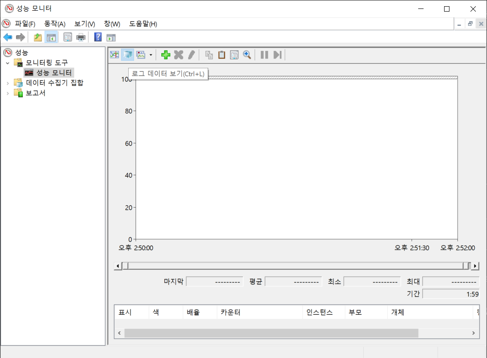  

    - 성능 모니터 도구를 열고 그래프 화면이 기본적으로 나오는데 툴바에서 + 버튼을 눌러 카운터를 추가할 수 있는 창 오픈.
    단축키 ctrl + N 을 눌러도 됨. "다음 컴퓨터에서 카운터 선택" 부분은 기본적으로 "로컬 컴퓨터"로 선택되어 있다.  
    

    예제) SQLServer:Latches:Total Latch Wait Time(ms) 수집해보자

    - 카운터에서 SQLServer:Latches 카운터를 선택한다.

    - 아래 화살표를 누르면 하위 카운터들이 나열되는데 "Total Latch Wait Time(ms)"를 선택.

    - "선택한 개체의 인스턴스"에서 _Total이 기본적으로 선택되어 있고 "추가" 버튼을 누르면 오른쪽 영역(추가된 카운터)에 추가된다.

    - "확인" 버튼을 눌러 최종 완료.    
  
재사용가능한 항목의 베이스라인을 만들때 아래와 같은 리스트를 반복해서 지정

    Object(Instance)                    Counter
    ----------------------------------  ----------------------------------------------------
    Memory                              Available MBytes
                                        Pages/sec
    PhysicalDisk(Data-disk, Log-disk)   % Disk Time
                                        Current Disk Queue Length
                                        Disk Transfers/sec
                                        Disk Bytes/sec     
    Processor(_Total)                   % Processor Time
                                        % Privileged Time
    System                              Processor Queue Length
                                        Context Switches/sec
    Network Interface(Network card)     Bytes Total/sec
    Network Segment                     % Net Utilization
    SQLServer:Access Methods            FreeSpace Scans/sec
                                        Full Scans/sec
    SQLServer:Buffer Manager            Buffer cache hit ratio
    SQLServer:Latches                   Total Latch Wait Time (ms)
    SQLServer:Locks(_Total)             Lock Timeouts/sec
                                        Lock Wait Time (ms)
                                        Number of Deadlocks/sec
    SQLServer:Memory Manager            Memory Grants Pending
                                        Target Server Memory (KB)
                                        Total Server Memory (KB)
    SQLServer:SQL Statistics            Batch Requests/sec
                                        SQL Re-Compilations/sec
    SQLServer:General Statistics        User Connections

모든 성능 카운터를 추가했으면 확인을 클릭하여 카운터 추가 대화 상자를 닫습니다.  
<캡처 화면

그래픽 UI로 볼때마다 성능 카운터를 매번 추가하는 것은 매우 피곤한 작업이기 때문에 이 리스트를 저장해 놓고 다음부터는 불러오기만 하면 되는것이다. 카운터 목록을 .htm 파일로 저장하기위해 성능 모니터의 오른쪽 프레임을 마우스 오른쪽 단추로 클릭하고 다른 이름으로 설정 저장 메뉴 항목을 선택합니다.

.htm 파일에는 카운터 로그를 만들거나 동일한 SQL Server 컴퓨터에 대한 성능 모니터 그래프를 대화 형으로보기 위해 기본 카운터 집합으로 사용할 수있는 모든 성능 카운터가 나열됩니다. 다른 SQL Server 컴퓨터에 대해이 카운터 목록을 사용하려면 메모장과 같은 편집기에서 .htm 파일을 열고 \\ SQLServerMachineName의 모든 인스턴스를 아무 것도없이 (빈 문자열 만) 바꿉니다.

이 모든 것에 대한 지름길은 Erin Stellato가 "성능 모니터에 대한 기본 카운터 사용자 지정"(http://bit.ly/1brQKeZ) 기사에서 설명합니다. 또한 Microsoft에서 제공하는 도구 인 PAL (Performance Analysis of Logs) (https://bit.ly/2KeJJmy)을 사용하여 이러한 데이터 중 일부를보다 쉽게 처리 할 수 있습니다.

또한 이 카운터 목록 .htm 파일을 인터넷 브라우저에서 열면 아래 그림과 같이 그래픽적으로 성능 모니터 그래프를 볼 수 있습니다.  
성능카운터 캡처필요

- ### b. 성능카운터 리스트를 사용한 카운터 로그 만들기
    성능 모니터는 일정 기간 동안 여러 카운터의 성능 데이터를 저장하는 카운터 로그 기능을 제공합니다. 성능 모니터를 사용하여 저장된 카운터 로그를 보고 성능 데이터를 분석 할 수 있습니다. 일반적으로 정의 된 성능 카운터 목록에서 카운터 로그를 만드는 것이 편리합니다. GUI를 통해 데이터를 보는 것보다 단순히 데이터를 수집하는 것이 서버 성능 문제 해결을 준비하거나 기준을 설정하는 데 선호되는 자동화 방법입니다.

    - 성능모니터 > 데이터 수집기 집합 > 사용자 정의 > 오른쪽 마우스 클릭 > 새로 만들기 > 데이터 수집기 집합  
    이름을 지정하고 "수동으로 만들기(고급)" 을 선택하고 다음을 누른다.  
    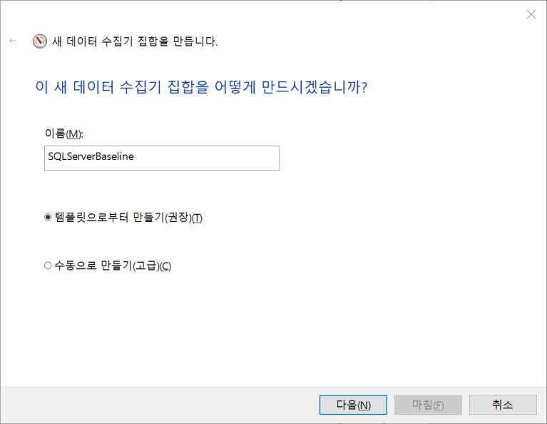

    - 어떤 형식의 데이터를 선택하는 화면이 뜨는데 "성능 카운터" 선택하고 다음을 누른다.  
    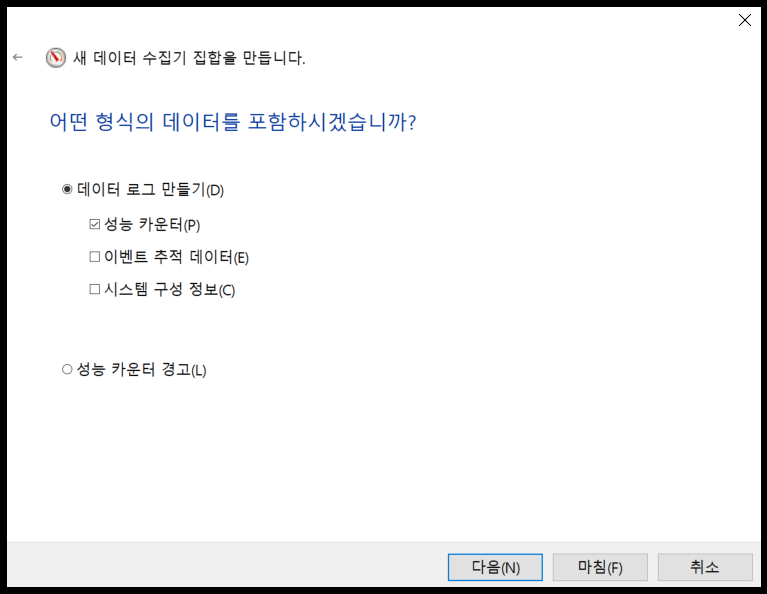

    - 원하는 성능 카운터들을 추가하고 데이터를 수집할 샘플 간격을 초단위로 입력하고 다음을 누른다.  
    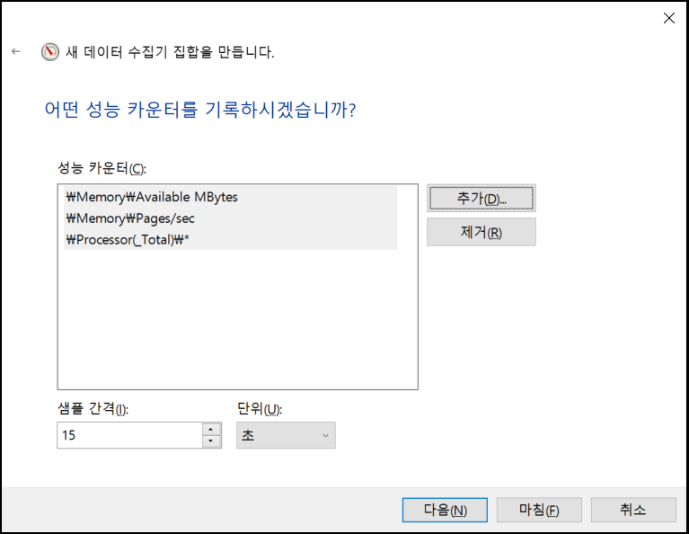    

    - 데이터를 저장할 폴더를 지정하고 다음을 누른다.  
    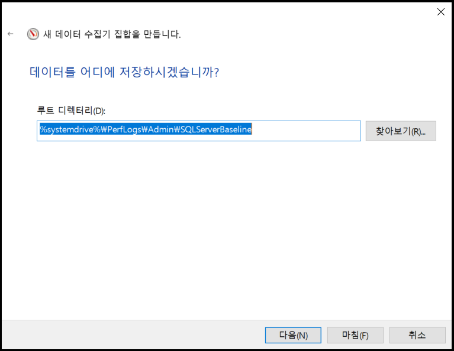    

    - 실행할 계정을 선택하거나(보통은 기본값) 기타 동작을 선택하고 마침을 누른다.  
    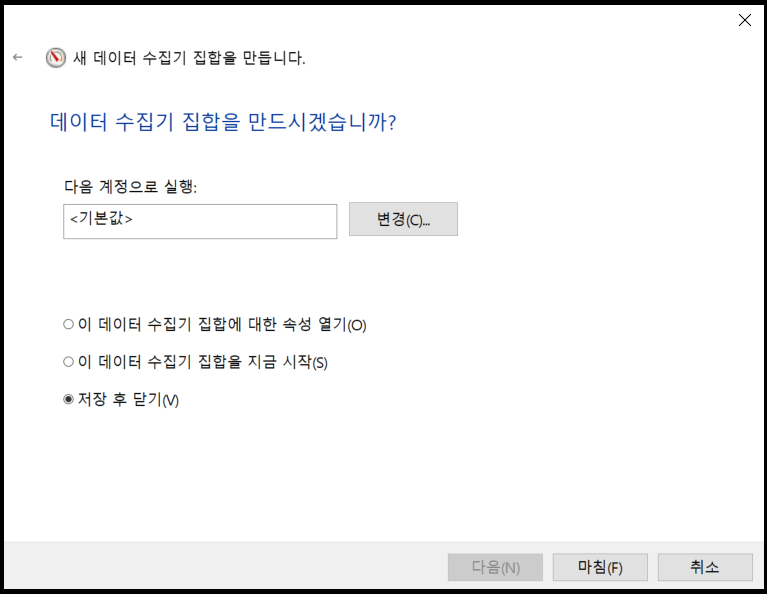        

    - 만들어진 데이터 수집기 집합인 SQLServerBaseline 을 오른쪽 클릭하고 속성 > 일정을 선택한다.  
    다음과 같이 시작일정을 추가할수 있다.  
    

    - 중지조건도 지정해 얼마만큼만 실행될지 정할수 있다.  
         

    - 결과가 이진파일이면서 파일명이 DataCollector01.blg 로 나오는데 다음과 같이 조정할 수 있다.  
    만들어진 데이터 수집기 집합인 SQLServerBaseline을 선택하고 오른쪽 DataCollector01을 오른쪽 클릭 > 속성에서 로그형식을 "쉼표로 구분" 선택하면 csv의 텍스트 포맷으로 저장된다.  
    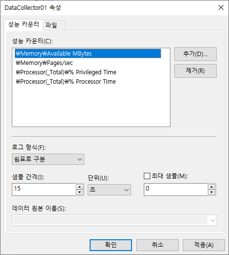 

    - 로그 파일명 DataCollector01을 바꿀수 있다.  
    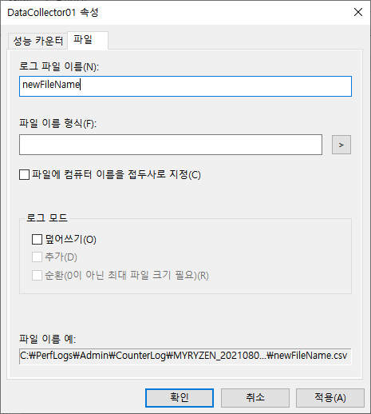     

추가적인 성능 모니터 사용 지침을 사용해 좀더 자세한 내용을 살펴 볼수 있다.
[Windows Server 2022의 성능 튜닝 지침](https://docs.microsoft.com/ko-kr/windows-server/administration/performance-tuning/)

- ### c. 성능 모니터 오버헤드 최소화
    성능 모니터는 오버헤드를 최소화하도록 만들어졌지만 그래도 시스템 영향을 적게 받게 하지 위해서는 다음 사항을 고려해야 한다.

        - 카운터 수를 제한. 정말로 1차적으로 필요한 것만 지정
        - 성능 모니터 그래프 기능보다는 카운터 로그 사용하여 데이터 수집
        - 그래프 기능 사용할 경우에는 원격으로 성능 모니터 접근
        - 물리적으로 별도의 디스크에 카운터 로그 저장
        - 샘플링 간격 늘리기

    - 카운터 수 제한  
    짧은 간격으로 많은 수의 카운터들을 수집하는 것은 시스템에 약간의 오버헤드가 추가될 수 있다. 이 오버헤드의 대부분은 추가한 성능 카운터 갯수에 의해 발생하므로 당신이 선택한 카운터들에 대해 자세히 알 필요가 있다. 
    선택한 성능 개체에 대한 카운터 수는 개체 자체의 특성 만 제공하므로 오버 헤드를 많이 추가하지 않습니다. 따라서 모니터링하려는 개체와 그 이유를 아는 것이 중요합니다.

    - 카운터 로그 형태로 성능 데이터를 수집하고 원본 서버에 저장  
    성능 모니터의 그래프를 사용하여 실시간 성능 데이터를 그래프 형태로 보면 해당 시스템에 상당한 오버 헤드가 발생한다. 그렇기에 원본 서버에서는 카운터 로그형태로 수집 된 성능파일을 만들며 이때 모니터링되는 디스크가 아닌 별도의 로컬 디스크에 저장하는것이 좋다. 그 후 이를 원격 컴퓨터에서 열어서 그 후 그래프로 보는 방식으로 사용해야 한다.

    - 샘플링 간격 늘리기  
    기본 모니터링 중 리소스 사용 패턴에 주로 관심이 있기 때문에 성능 데이터 샘플링 간격을 60 초 이상으로 쉽게 늘려 로그 파일 크기를 줄이고 디스크 I / O에 대한 수요를 줄일 수 있습니다. 짧은 샘플링 간격을 사용하여 타이밍 문제를 감지하고 진단 할 수 있습니다. 보는 동안에도
    성능 모니터는 대화식으로 그래프를 작성하고 샘플 당 기본값 인 1 초에서 샘플링 간격을 늘립니다. 샘플링 크기를 위 또는 아래로 변경하면 데이터의 세분성과 수량에 영향을 미칠 수 있습니다. 당신은 무게를 신중하게 선택하십시오.

## 3) Baseline 데이터를 바탕으로 시스템 활동 분석
데이터베이스 애플리케이션의 기본 동작은 다음과 같은 다양한 요인으로 인해 시간이 지남에 따라 시시각각 변화한다.

    * 데이터 볼륨과 배포 변화
    * 사용자 기반 증가
    * 어플리케이션 사용 패턴의 변화
    * 응용 프로그램 동작의 추가 또는 변경
    * 새 서비스 팩 또는 소프트웨어 업그레이드 설치
    * 하드웨어 변경

이러한 변경으로 인해 데이터베이스 서버에 대해 생성 된 기준선의 중요성이 서서히 손실됩니다. 시스템의 현재 동작을 이전 기준과 비교하는 것이 항상 정확한 것은 아닙니다. 따라서 정기적 인 시간 간격으로 새 기준선을 만들어 기준선을 최신 상태로 유지하는 것이 중요합니다. 필요한 경우 나중에 참조 할 수 있도록 이전 기준 로그를 아카이브하는 것도 유용합니다. 예, 예전 기준은 일상적인 작업에 적용 할 수 없지만 패턴과 장기적인 추세를 설정하는 데 도움이됩니다.

다음 단계에 따라 성능 모니터 도구를 사용하여 기준 또는 시스템의 현재 동작에 대한 카운터 로그를 분석 할 수 있습니다.

- a. 카운터 로그를 엽니다.
       성능 모니터의 도구 모음 > 로그 데이터보기 > 로그 파일의 이름을 선택합니다. 또는 단축키 (ctrl + L)  

         
    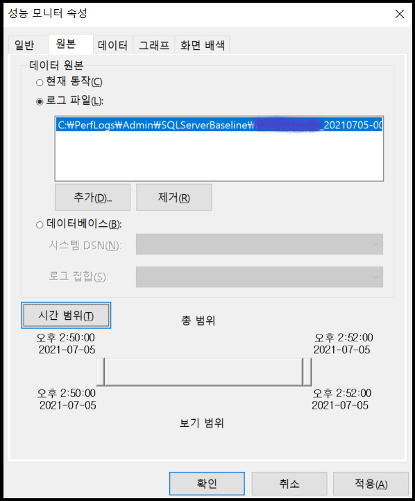     

- b. 데이터 탭을 눌러 화면에 보여주고 싶은 성능 데이터를 추가하여 분석합니다. 카운터 로그를 생성하는 동안 수집한 성능 개체, 카운터 및 인스턴스 만 선택 목록에 표시됩니다.

    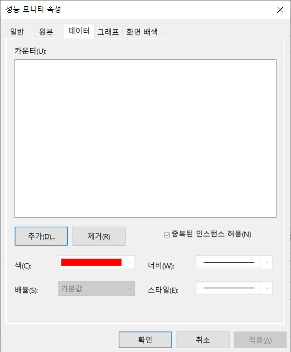         
             
    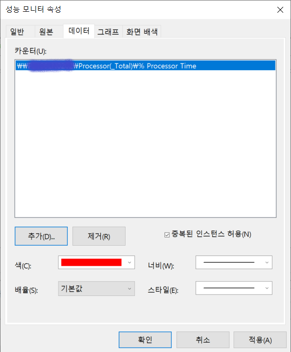
    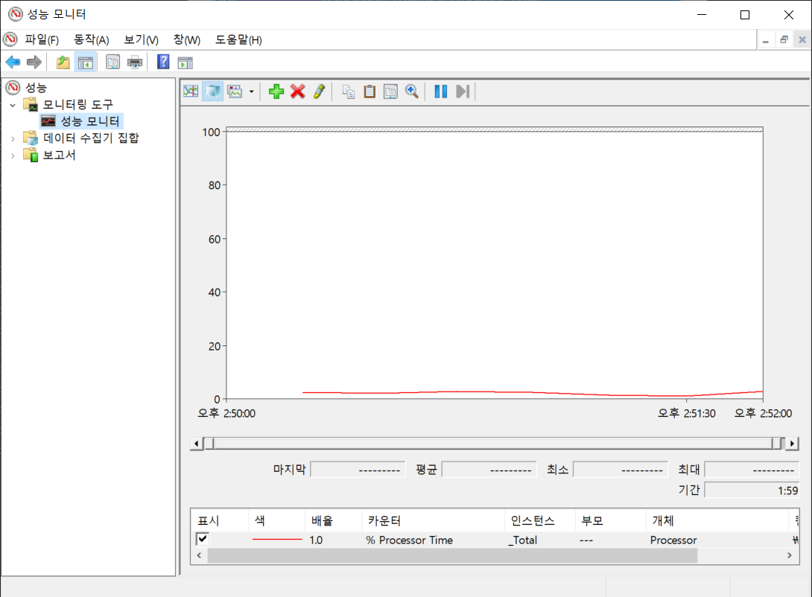   

- c. 아래 그림과 같이 시간 범위를 적절히 조정하여 하루 중 다른 부분의 시스템 동작을 분석합니다.

    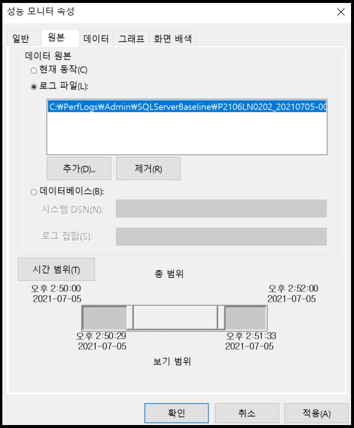     

성능 검토 중에 성능 카운터의 현재 값을 최신 기준과 비교하여 데이터베이스의 시스템 수준 동작을 분석 할 수 있습니다. 성능 데이터를 비교할 때 다음 사항을 고려하십시오.

    * 두 경우 모두 동일한 성능 카운터 집합을 사용하십시오.
    * 개별 카운터에 적용 할 수있는 카운터의 최소, 최대 및 평균 값을 비교합니다. 카운터의 특정 값을 앞서 설명했습니다.
    * 일부 카운터에는 확실한 좋은 / 나쁜 값이 없습니다. 그 값은 응용 프로그램에 따라 다르기 때문에 해당 기준 카운터와의 상대적 비교는 필수입니다. 
      예를 들어 SQL Server에 대한 User Connections 카운터의 현재 값은 응용 프로그램의 좋은 점이나 나쁜 점을 나타내지 않습니다.
      그러나 해당 기준 값과 비교하면 사용자 연결 수가 크게 증가하여 워크로드가 증가 함을 알 수 있습니다.
    * 현재 카운터 로그와 기준 카운터 로그에서 카운터 값 범위를 비교합니다. 카운터의 개별 값의 변동은 값 범위에 의해 정규화됩니다.
    * 같은 날의 로그를 비교합니다. 대부분의 애플리케이션에서 사용 패턴은 하루 중 다른 부분에 따라 다릅니다. 특정 시간 동안 카운터의 최소, 최대 및
      평균 값을 얻으려면 이전에 표시된대로 카운터 로그의 시간 범위를 조정하십시오.

시스템 수준 병목 현상이 확인되면 응용 프로그램의 내부 동작을 분석하여 병목 현상의 원인을 확인해야합니다. 병목 현상의 원인을 식별하고 최적화하면 시스템 리소스를 효율적으로 사용하는 데 도움이됩니다.

## 4) Azure SQL Database의 베이스라인
물리 머신이든 가상 머신이든 모든 SQL Server 인스턴스의 베이스라인이 필요한 것처럼 Azure SQL Database 역시 성능 베이스라인을 만들어야 한다.
하지만 PaaS(서비스로서의 데이터베이스) 제품이기 때문에 OS가 설치된 가상 머신 또는 물리적 서버가 존재하지 않는다. 당연하게도 성능 모니터같은 기존 툴을 사용할 수 없기 않기 때문에 기존방법 대체한 방법을 찾아야 한다.

하지만 실제 물리적인 CPU 또는 디스크의 사용량을 측정하지 못하는 대신 Microsoft에서 정의한 DTU(데이터베이스 트랜잭션 단위)라는 성능 측정 단위를 사용해야 한다. Azure Portal같은 도구를 통해 시간이 지남에 따라 데이터베이스의 DTU 동작 활동을 관찰 할 수 있다.

DTU는 I/O, CPU 및 메모리를 묶어서 특정 성능치로 구현하는 서비스 레벨이며 Azure에서만 존재하는 개념이다. 예를 들면 50 DTU면 250GB스토리지와 1200개의 동시세션까지 가능한 것이다. 그 이상의 스펙을 원한다면 DTU도 상위것을 선택해야 한다.  

 DTU 모니터링 방법  
Azure SQL Database에서는 "성능 모니터" 같은 기존 툴을 사용 하지 못하기 때문에 이를 대신해 사용할 수 있는 몇 가지 방법이 몇 가지 있다.

    - sys.resource_stats를 쿼리하는 방법.
      14 일 실행 기록을 유지하고 5 분 간격으로 데이터를 집계하여 저장된다.

    - Azure Portal을 사용
      DTU 사용을 모니터링하기 위한 메커니즘을 제공하지만 베이스라인을 설정하는 메커니즘은 제공하지 않는다.
      그럴때는 Azure SQL Database 관련 DMV인 sys.dm_db_resource_stats를 사용해야 한다. 이 DMV는 지정된 Azure SQL Database의 
      DTU 사용량에 대한 정보를 유지한다. 15 분 단위로 1 시간 분량의 정보를 포함한다. SQL Server 인스턴스에서와 같이 베이스라인을
      설정하려면 시간이 지남에 따라 변화하는 이 데이터를 캡처해야 한다. sys.dm_db_resource_stats에 표시된 정보를 테이블로 수집한 후 
      Azure SQL Database의 성능 메트릭에 대한 베이스라인을 설정할 수 있다.

Azure SQL Database에는 기본적으로 쿼리 저장소가 활성화되어 있으므로 이를 사용하여 시스템에서 일어나는 일을 이해할 수 있다.

## 5) 요약
이 장에서는 성능 모니터 도구를 사용하여 SQL Server의 전반적인 동작과 성능이 느린 데이터베이스 응용 프로그램이 시스템 리소스에 미치는 영향을 분석하는 방법을 배웠습니다. 또한 서버 및 데이터베이스 모니터링의 일부로 기준선 설정에 대해서도 배웠습니다. 이러한 도구를 사용하면 표준 동작에서 벗어나는시기를 이해할 수 있습니다. 데이터가 부실하지 않도록 정기적으로 기준을 수집하는 것이 좋습니다.

다음 장에서는 성능 튜닝을 위해 데이터베이스 애플리케이션의 워크로드를 분석하는 방법을 배웁니다.