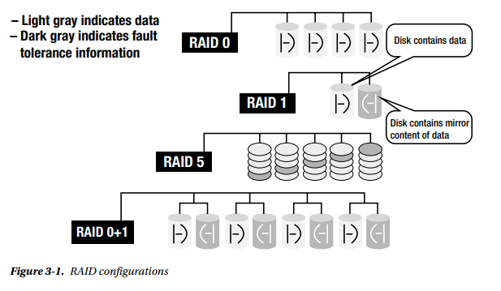

# Disk 성능 분석

디스크, 컨트롤러와 커넥터 의 디스크 시스템은 모든 컴퓨팅 시스템에서 가장 느린 부분이다. 수년에 걸쳐 메모리와 CPU는  급격히 빨라졌지만 최근에 SSD(Solid-State Disk)와 같은  일부 개선 사항을 제외하곤 디스크 쪽 변화는 크지 않다.  
디스크는 여전히 가장 느린 부분 중 하나이기 때문에 디스크의 동작을 이해하기 위해 디스크를 모니터링 할 수 있어야 한다.

* 디스크 성능 수치를 측정하기 위한 시스템 카운터 사용
* 디스크 활동을 수집하는 다른 메카니즘 활용
* 디스크 성능 이슈 해결

## 3.1 디스크 병목 분석    
디스크 속도는 메모리와 CPU에 비해 상대적으로 매우 느리다. 디스크 자원 경합은 SQL Server의 성능을 심각하게 다운 시킬수 있기에 디스크쪽 병목을 분석하고 해결하면 SQL Server의 성능을 급격히 향상 시킬수 있다.

### 디스크 카운터

```
Object(Instance)  Counter                   Description                                     Value
----------------  --------------            ---------------------------------------------   ---------------------------------------
PhysicalDisk      %Disk Time                디스크가 바쁜 비율                              평균 85% 이하여야 하지만 베이스라인 참고
                  Current Disk Queue Length 성능 데이터를 수집 할 때 미해결 디스크 요청 수    베이스라인과 비교
                  Avg. Disk Queue Length    샘플 간격동안 대기중인 디스크 요청 평균 개수      베이스라인과 비교
                  Disk Transfers/sec        디스크 연산중 읽기 쓰기 비율                     I/O 서브시스템의 최대값
                  Disk Bytes/sec            초당 디스크에 접근하는 데이터 전송량             I/O 서브시스템의 최대값
                  Avg.Disk Sec/Read         디스크에서 읽는 평균 시간(ms)                   평균 값 10ms 보다 작아야. 베이스라인 참고
                  Avg.Disk sec/Write        디스크에 쓰는 평균 시간(ms)                     평균 값 10ms 보다 작아야. 베이스라인 참고
```

PhysicalDisk 카운터는 물리 디스크를 말하고 LogicalDisk는 드라이브 파티션(C: D: E:) 과 같은 논리하드디스크를 말한다. 디스크 병목은 물리적 디스크에서 일어나므로 PhysialDisk 카운터를 주로 사용하게 된다.

RAID와 SAN과 같은 디스크 지원 시스템에서는 내부적으로 여러개의 하드디스크가 모여 있지만 모두 1개의 물리적 디스크로 집계되기 때문에 실제 각 물리 디스크의 속도와는 틀린 데이터가 측정된다.  각 서브시스템에 맞게 수치를 곱하거나 나누어서 실제 물리적 수치를 보정해줘야 한다.  
또한 SSD같은 좀더 빠른 디스크의 가격이 시간이 지나면서 점점 싸지고 있기 때문에 적극 이용해야 하며 최소한 iSCSI같은 것으로 바꿔야 한다. 기존의 플래터를 가지는 일반 하드디스크를 DB Server의 저장소로 쓰는 경우는 점차 줄어들고 있으며 백업 장치나 이런것으로만 주로 사용되는 패턴으로 변하고 있다.

### * % Disk Time
% Disk Time은 해당 디스크의 활동(read/write)의 퍼센트이다. 디스크가 바쁘게 사용되는지 알 수 있는 가장 직관적인 카운터이지만 실제 병목을 알기 위해서는 적합치 않다. 80%, 90%의 수치가 병목없이 계속 이어진다면 바쁘기만 할 뿐인 디스크이다. 이 때는 아무 조치도 하지 않아도 되기에 그렇다. 다만 디스크 베이스라인 데이터와 비교할때는 유용하다. 전 달에서 바뻐지면 사용량이 늘고 앞으로 언제 증설이 필요한지 앝 수 있기 때문이다.  
또한 이 수치가 100% 를 넘는 경우도 빈번한데 내부적으로 여러개의 RAID 또는 SAN 디스크가 1개로 묶여져 있기 때문에 실제 물리 디스크 개수로 나누어야 한다.

### * Current Disk Queue Length
해당 시점에 디스크가 바뻐 처리하지 못하고 대기하고 있는 개수, 즉 대기순번 갯수라고 생각하면 된다. 하지만 최근에는 SAN, RAID와 같은 디스크 어레이 시스템들이 실제 큐에 있는 작업들을 뒤에서 나눠서 처리하기 때문에 시간이 지날수록 이 수치에 대한 기준이 낮아지고 있다. 그럼에도 불구하고 바쁜 DB에서는 큐 길이가 증가할 수 있기 때문에 가장 직관적으로 디스크 I/O 병목 문제를 알아 챌수 있는 카운터이기도 하다. 예전에는 이 수치가 4를 넘으면 그때부터 병목이라는 기준이 있기도 하였으나 최근에는 RAID, SAN과 같은 어레이 시스템이 일반적이기 때문에 4보다 적은 숫자가 기준이다. 절대적으로 고정된 수치는 없기에 베이스라인 데이터를 참고해 시스템별 기준을 만들어야 한다.  

IBM기준으로는 여전히 4이상이면 병목이고 2이상이면 문제가 있다고 함.

### * Disk Transfer/Sec
이 카운터는 디스크의 읽기 및 쓰기 작업 속도를 모니터링합니다. 오늘날의 일반 하드 디스크는 순차 I/O (IOPS)의 경우 초당 약 180 번, 랜덤 I/O의 경우는 그보다 떨어지는 초당 100회 정도의 전송 속도를 가진다. 하드디스크의 랜덤I/O 액세스는 디스크 암과 헤드를 움직이는데 많은 시간을 잡아먹기 때문에 더 낮을 수밖에 없다. SQL Server의 데이터파일과 같은 랜덤액세스 OLTP 환경에서는 이런 구조적인 제약 때문에 1000MB/sec의 처리량을 가지는 디스크이라 해도 초당 100회 정도의 디스크 전송 횟수만 수행 할 수 있다.

또한 IOPS의 입출력 단위는 일반적으로 4K 단위로 측정하기 때문에 64K 단위인 SQL Server와는 다르다. 50,000 IOPS라고 스토리지 업체가 얘기한다면 우리는  16로 나눈 3,125(64K기준) 정도라고 바꾸어 생각해야 한다.  
그리고 AWS에서 SSD는 7,000 IOPS가 16KB 단위이기 때문 실제로는 4로 나눈 1,750 IOPS(64K기준)가 맞다.

Note
    SSD는 일반 하드디스크의 50 ~ 100배의 IOPS 수치를 가지며 약 5,000부터 500,000 IOPS의 하이엔드까지 다양하다. 그렇기에 Disk Transfer/sec 수치를 디스크 종류에 따라 적절하게 스케일링해서 판단해야 한다.

성능 측정데이터는 디스크의 느린 전송속도때문에 가능한 낮게 판단해야 한다.    

### * Disk Bytes/Sec
읽기/쓰기 작업으로 인하여 디스크로 전송되는 초당 바이트. 7200RPM의 전통적인 디스크는 약 초당1000MB을 전송할수 있다. 일반적으로 작은 양을 데이터를 읽고 쓰는 OLTP에서는 대부분 이 대역폭을 넘길 일이 잘 없다. 만약 이를 초과하는 경우가 생긴다 하더라도 Disk Queue Length와 같은 카운터 값이 증가하기 때문에 병목이 생김을 알 수 있다.  
 SSD는 하드 디스크와 같은 지연시간(암과 헤드가 위치를 찾아가는 시간)이 거의 없기 때문에 훨씬 많은 데이터를 전송한다.

### * Avg. Disk Sec/read, Avg. Disk Sec/Write
디스크로 읽고 쓰는데 소요되는 밀리세턴드 단위의 시간. I/O에 문제가 있는지 판단하는 가장 명확한 지표. 10ms 이상이라면 하드웨어나 구성정보가 제대로 세팅되었는지 확인해야 한다. 트랜잭션 로그가 잘 작동하는지에 대한 정확한 시간을 얻을 필요가 있다.

## 3.2 추가적인 I/O 모니터링 도구

### * sys.dm_io_virtual_file_stats
데이터 및 로그 파일에 대한 I/O 통계를 반환하는 DMF.  
stall data들을 봐야 하며 다른 I/O 작업을 대기하는 시간의 총 합이다. 단위는 ms이고 서버가 기동한 후의 데이터들.  

첫째로 io_stall_read_ms은 읽기 총 대기 시간이며 io_stall_write_ms는 쓰기 총 대기 시간.  
또한 전체 i/o를 대기하는 io_stall 도 있다.  
이 숫자들은 서버가 기동한 이후의 합산 데이터이기 때문에 마찬가지로 서버가 기동한 후의 총 ms인 sample_ms와 stall data들을 비교하여 나누어야만 I/O 문제가 시스템에 문제를 일으키는지 수치를 파악할 수 있다. 어떤 로그파일 또는 데이터 파일에서 속도를 저하시키는지 범위를 좁혀가면서 찾아 낼 수 있다. 이것은 I/O 병목의 존재만을 확인하는 데 매우 좋은 측정방법이지만 병목의 종류를 파악하는 데는 그다지 도움이되지 않는다.

```sql
SELECT file_id
    , sample_ms, num_of_bytes_read, io_stall_read_ms
    , io_stall_read_ms / sample_ms ReadWait_ms
    , num_of_bytes_written, io_stall_write_ms, io_stall    
    , io_stall_write_ms / sample_ms WriteWait_ms
FROM sys.dm_io_virtual_file_stats(DB_ID('MemberDB'), NULL) AS divfs
ORDER BY io_stall_read_ms desc

/*    
  file_id  sample_ms  num_of_bytes_read io_stall_read_ms ReadWait_ms num_of_bytes_written io_stall_write_ms io_stall    WriteWait_ms
  -------  ---------  ----------------- ---------------- ----------- -------------------- ----------------- ----------- ------------
  1        771527487  90132529274880    5046885577       6           25389803593728       53533716474       58580602051 69
  4        771527487  383154882199552   4221191163       5           85669898698752       70174055125       74395246288 90
  124      771527487  35376300834816    1488460578       1           33114379141120       66340402447       67828863025 85
  5        771527487  76607142281216    726599361        0           6579059138560        8919686088        9646285449  11
  39       771527487  12743186497536    516798864        0           7619623796736        12216171672       12732970536 15
  2        771527487  35920934462976    379717729        0           113794634384896      3178572288        3558290017  4
  40       771527487  4317579722752     268489573        0           6424399806464        7542018819        7810508392  9

*/  
```
    여기서 1번 파일의 읽기 대기가 ReadWait_ms 가 6이고 WriteWait_ms가 69이니 읽기도 대기가 걸리지만 쓰기도 심하게 걸림을 알수있다.
    
    해결방법
    ------------------------------------------------------------------------------------------------------------------
    1. 문제의 원인을 제거
        (악성쿼리나 배치작업을 튜닝하는등 읽기 쓰기 작업을 아예 줄이기)
    2. 디스크 I/O 분산
        - 더 빠른 디스크로 바꾸거나
        - 상위 10개의 I/O 나쁜 데이터파일을 별도의 물리디스크로 서로 분산 전략 (현재 이 DB는 한군데에 몰려있다.)


sample_ms는 정수형값이기에 SQL Server 최근 기동시간이 아주 오래 전이라면 이 값이 음수가 나올 수 있다. 대략 10개월정도. 현재 나의 SQL Server은 2014.

### * sys.dm_os_wait_stats
SQL Server에서 모든 대기현상을 알아내는데 일반적으로 사용하는 DMO. I/O 병목을 식별하는데도 유용하며 다음과 같이 사용한다.
값은 모두 합계나 시간의 총합, 최대값등이 표시된다.

```sql
SELECT *
FROM sys.dm_os_wait_stats AS dows
WHERE wait_type LIKE 'PAGEIOLATCH%';
```
위 쿼리는 대기를 발생시키는 다양한 I/O 래치를 찾을 수 있다. sys.dm_io_virtual_file_stats와 마찬가지로 이 DMO에서 I/O문제를 발생시키는 특정한 쿼리를 얻을수는 없다. 또한 성능카운터처럼 문제의 수치를 직관적으로 얻을 수 없고 현재 값을 기존 베이스라인 데이터와 비교하여 판단하여야 한다.

PAGEIOLATCH% 와 같이 IO와 관련된 조건(WRITELOG, LOGBUFFER, ASYCN_IO_COMPLETION)을 검색해서 다른 I/O 대기도 조사할 수 있다.   
이 DMV는 총 시간과 합계를 나타나기 때문에 가장 긴 대기시간이 무엇인지 알 수 있다.

## 3.3 디스크 병목 해결방법

    * 어플리케이션 워크로드 최적화
    * 더 빠른 I/O 경로 사용
    * RAID 어레이 사용
    * SAN 시스템 사용
    * SSD 사용
    * 적절한 디스크 배열
    * 배터리 대비 컨트롤러 캐시
    * 시스템 메모리 추가
    * 파일과 파일그룹 다중으로 만들기
    * 로그 파일을 별도의 물리 디스크로 이동
    * 파티션 테이블 사용

### * 어클리케이션 워크로드 최적화
성능 문제를 해결하는데에 어플리케이션 워크로드 최적화가 얼마나 중요한지 아무리 강조해도 지나치지 않을 것이다. 매우 높은 읽기/쓰기를 발생시키는 쿼리는 엄청난 디스크 I/O 문제를 일으키는 원인 중 하나이다. 

### * 더 빠른 I/O 경로 사용
가장 효과적인 해결방법 이자 언제든지 채택 할 수 있는 방법중 하나는 드라이브, 컨트롤러 등을 더빠른 초당 디스크 전송 능력을 가지는 것으로 교체하는 것이다. 그러나 충분한 조사없이 디스크 업그레이드를 하면 안되며 디스크 스트레스를 유발하는 원인을 먼저 찾을 필요가 있다.

### * RAID 어레이 사용
디스크 I/O 병렬 처리를 하는 한가지 방법은 모든 SQL Server 데이터파일을 하나의 단일 드라이브 묶음에 저장 하는것이다. 단 트랜잭션 로그 파일 제외.
이 묶음은 하나의 RAID 어레이가 될수 있고 Winwos OS에서는 단일 물리 디스크로 보인다. 드라이브 풀의 효율성은 RAID 디스크 구성에 따라 다르다.  
가장 일반적으로 널리 사용되는 RAID 구성은 다음과 같다

    * RAID 0 : 내결함성이 없는 스트라이프 셋
    * RAID 1 : 미러링
    * RAID 5 : 패러티 있는 스트라이프 셋
    * RAID 1 + 0 : 미러링 있는 스트라이프 셋. RAID 10(ten) 이라고 보통 부름.



<b>RAID 0</b>  
    stripe set without parity. 내결함성이 없는 구성이므로 데이터 안정성이 중요하지 않은 상황에서만 사용한다. 어레이 상의 한 디스크가 실패하면 데이터가 완전히 유실된다.
    따라서 tempdb와 같은 임시 데이터베이스를 제외하곤 실제의 데이터파일이나 트랜잭션 로그 파일용으로 사용하면 안된다.  
    RAID 0에서 디스크 당 I/O 수치는 아래와 같이 계산 된다.

    => 디스크당 I/O 필요 개수 = (Reads + Writes) / 어레이의 디스크수

<b>RAID 1</b>  
    데이터를 별도의 디스크에 똑같이 복제하기때문에 높은 수준의 내결함성을 제공한다. 물리적으로 한 디스크에 전체 데이터를 유지하려 할때 사용될 수 있다. 예를 들면 트랜잭션 로그 파일, OS 시스템 파일, SQL Server 시스템 데이터베이스(master, msdb)의 경우가 그러하며 RAID 1으로 사용하기 위하여 충분히 작은 경우가 대부분. 디스크를 두배로 사야 하기 때문에 비용도 두배여서 작은 용량의 데이터에 적합.
    
    => 디스크당 I/O 필요 개수 = (Reads + 2 x Writes) / 2
       미러링 디스크이기 때문에 쓰기는 2번 해야 한다.

RAID 5  
    RAID 5는 여러 경우에 좋은 옵션이다. RAID 0의 구조를 기반으로 단지 디스크 하나만 추가하여 효율적인 내결함성을 제공합니다. 
    5개의 디스크이 있다면 다음과 같이 데이터를 저장하는 구조이다
    
    data        data        data        data        [parity]
    data        data        data        [parity]    data
    data        data        [parity]    data        data
    data        [parity]    data        data        data
    [parity]    data        data        data        data
    
    그렇기 때문에 사실 데이터는 4개의 디스크만큼만 저장되고 디스크 1개만큼의 용량은 내결함성을 위한 패러티 저장용이다.  
    RAID 5 구성에서 디스크 오류가 발생하면 시스템이 작동하는 동안 계속 사용할 수 있지만 실패한 디스크때문에 I/O 성능이 매우 저하된다.

    쓰기가 총 디스크 작업의 10% 이상을 차지하는 경우라면 RAID 5는 적합한 방법은 아니다.
    따라서 읽기 전용 볼륨이나 디스크 쓰기 비율이 낮은 상황에 RAID5를 사용해야 한다. 

    => 디스크당 I/O 필요 개수 = (Reads + 4 x Writes) / 디스크 개수

    이 식에서처럼 RAID5에서 쓰기 작업은 4번 수행되며 아래와 같은 추가 작업이 이뤄진다

        * 내용을 수정할 데이터 디스크에서 기존 데이터를 읽기위한 읽기 I/O 1 개
        * 해당 패리티 디스크에서 기존 패리티 정보를 읽기위한 읽기 I/O 1 개
        * 내용을 수정할 데이터 디스크에 새 데이터를 쓰기위한 쓰기 I/O 1 개
        * 새 패리티 정보를 해당 패리티 디스크에 쓰기위한 쓰기 I/O 1 개

    1개의 쓰기 요청은 4개의 I/O가 발생하는데 각각 2개의 읽기I/O, 2개의 쓰기 I/O로 구성된다.

    OLTP 데이터베이스에서 모든 데이터 수정작업은 하드디스크의 트랜잭션 로그 파일에 먼저 기록되어 진 후 메모리에만 수정된다.
    이를 메모리의 더티페이지라고 부르며 데이터 파일에는 체크포인트라는 내부 배치 작업에 의해 의해서 주기적 비동기 작업으로 하드디스크에 기록된다.

    이런 이유로 디스크에 끊임없는 쓰기 작업을 하는 트랜잭션 로그같은 경우 RAID 5에 두면 성능 저하가 발생할 수 있다.
    반면 데이터 파일은 쓰기 작업이 간헐적으로 이루어지고 쓰기 효율을 위해 일괄 처리 되기 때문에 RAID5에 배치 될 수도 있다.

<b>RAID 6</b>  
    써본적이 없다

<b>RAID 1 + 0 (RAID 10)</b>  
    일반적으로 RAID 10(ten) 이라 부르며 미러링을 탑재하고 있기에 높은 수준의 내결함성을 제공해준다. 내결함성을 제공하기 위해 디스크를 두배로 필요로 하기에 RAID5보다 훨씬 비싼 방법이며 이 구성은 데이터 저장공간이 큰 경우와 쓰기 작업이 10% 이상일때 선택해야 한다. RAID 1 + 0는 분할검색(split seek, 데이터들이 분산되어 있어서 전체 데이터를 디스크별로 나누어서 검색하면 시간 절약)을 지원하기에 읽기 성능은 매우 좋다. 읽기가 쓰기보다 많은 일반적인 OLTP 시스템에 적합하다. 하지만 비싼 비용이 문제.

    디스크당 I/O 필요 개수 = (Reads + 2 X Writes) / 디스크 개수

### * SAN 시스템 사용
예전보다 비용이 많이 저렴해 지긴 했지만 SAN 시스템은 여전히 대규모 엔터프라이즈 시스템의 영역으로 남아있다. SAN은 단순히 더 많은 스핀들과 디스크 드라이브를 제공하기 때문에 읽기/쓰기같은 스토리지쪽의 시스템의 성능을 높이는 데 사용할 수 있다.  
하지만 사이즈, 복잡함, 비용때문에 항상 최적의 솔루션이 아닐 수 있다. 또한 데이터 양에 따라서는 DAS(direct attached storage)가 더 빠를수도 있다. 
SAN 시스템의 주요 강점은 성능이 아닌 확장성, 가용성 및 유지 관리 쪽에 있다.

SAN을 제거하고 로컬 디스크로 이동하는 것이 성능 향상일 수 있다. SAN 시스템은 설계 상 극도로 중복되며 특히 SQL Server같이 일반적으로 작은양을 데이터를 많이 읽기 쓰기하는 곳에 빠르게 수행됩니다. 단일 로컬 디스크에서 SAN으로 이동하는 것이 성능 개선 될 수 있지만 반면에 로컬 디스크가 SAN보다 빠를 수 있다.

### * SSD 사용    
SSD는 기존 하드디스크를 빠르게 대체하고 있고 디스크를 회전작업이 아닌 메모리 검색을 사용한다. 조용하고 저전력인데다 매우 빠르지만 일반 하드디스크보다는 여전히 비싸다. 

그러나 이 비용은 초당 약 100 개 작업에서 초당 5,000 개 이상의 작업으로 속도가 증가하였기 때문에 서로 상쇄된다. 또한 SAN 또는 RAID를 통해 SSD를 어레이에 배치하여 성능 이점을 더욱 높일 수 있습니다. 

다양한 가격대와 성능 지표를 가진 하이브리드 솔루션도 있는데 이에 대한
하드웨어 전용 솔루션 인 경우 SSD를 장착하는 것이 I/O 바운드 시스템에 대해 수행 할 수있는 최상의 작업 일 것이다.

### * 적절한 디스크 정렬
디스크 파티션을 만들때 기본으로 만들면 SQL Server에 적절하지 않은 디스크 정렬로 만들어진다. Windows OS의 기본 파티션 섹터 크기는 4K이고 SQL Server는 64K가 되어야 한다. 자세한것은 내용이 너무 많아지므로 다음 링크로 대체.  
[https://purumae.tistory.com/167](https://purumae.tistory.com/167)  
[Disk Partition Alignment Best Practices for SQL Server](https://download.microsoft.com/download/C/E/7/CE7DA506-CEDF-43DB-8179-D73DA13668C5/DiskPartitionAlignment.docx)

위 가이드는 2008버전으로 쓰여진 것이지만 여전히 유용하다. 상황에 따라 SQL Server에서 최대 30%의 I/O 성능 향상이 있다고 하니 정말 중요한 내용이라 말할 수 있다.

### * 시스템 메모리 추가
물리 메모리가 부족할 경우 페이징이라는 디스크 작업이 더 많이 발생한다. 충분한 여유 메모리는 디스크 작업을 감소시키기 때문에 즉각적으로 효과를 얻을수 있는 좋은 방법이다.

### * 파일과 파일그룹 다중으로 만들기
사용자 데이터베이스는 1개 이상의 데이터파일과 1개의 트랜잭션 로그파일로 이루어진다. 데이터파일들은 관리를 위해 또 1개 이상의 파일그룹으로 이루이진다. 
여러 파일그룹과 다중 데이터파일로 분산하는 것은 다중I/O를 일으켜 디스크 I/O를 여러 물리적 하드디스크에 분산시키는 역할을 수행할 수 있어 큰 성능상 이익이 있다.  
또한 다중 파일 그룹은 데이터 복원에도 유리하다. 

### * 로그 파일을 별도의 물리 디스크로 이동
SQL Server 트랜잭션 로그 파일은 가능한 다른 모든 SQL Server 데이터베이스 파일과는 분리하여 별도의 하드 디스크 드라이브에 놓아야 한다. 데이터 파일은 랜덤 I/O 패턴이고  트랜잭션 로그 파일은 순차적 I/O이다. 트랜잭션 로그 활동을 다른 비 순차적 디스크 I/O 활동과 분리하면 로그 파일이 포함 된 하드 디스크 드라이브가 순차적 I/O에 집중할 수 있으므로 성능이 향상 될 수 있다.  

하드 디스크에서 데이터에 액세스하는 데 필요한 대부분의 시간은 데이터를 찾기 위해 디스크 스핀들 헤드를 물리적으로 이동하는 데 소비된다. 데이터를 찾으면 데이터를 전기적으로 읽습니다. 이것은 헤드의 물리적 움직임보다 훨씬 빠릅니다.
로그 디스크는 순차 I/O 작업만 수행하면 되기 때문에 디스크의 스핀들 헤드가 최소한의 물리적 이동으로 로그 디스크에 쓸 수 있습니다. 그러나 데이터 파일에 동일한 디스크를 사용하는 경우 로그 파일에 쓰기 전에 스핀들 헤드를 올바른 위치로 이동해야합니다. 이를 지연 시간이라고 하고 로그 파일에 쓰는 데 필요한 시간이 늘어나 성능이 저하된다.

SSD 디스크를 사용하더라도 트랜잭션 로그에서 데이터를 분리하면 작업이 여러 위치로 분산되어 성능이 향상된다.
또한 여러 데이터베이스가있는 SQL Server의 경우 성능 향상을 위해 트랜잭션 로그 파일을 서로 다른 물리적 드라이브에서 물리적으로 분리해야합니다.

    만약 Apple, Tomato 라는 두개의 데이터 베이스가 단일 SQL Server에 있다면
    Apple의 트랜잭션 로그파일     ===>  F:드라이브에
    Tomato의 트랜잭션 로그 파일은 ===>  G:드라이브에 

이 요구 사항의 예외는 읽기 전용 데이터베이스 또는 데이터베이스 변경이 거의없는 데이터베이스입니다. 읽기 전용에 대한 온라인 변경 사항이 없기 때문에
로그 파일에서 쓰기 작업이 수행되지 않습니다. 따라서 읽기 전용 데이터베이스의 경우 별도의 디스크에 로그 파일을 보관할 필요가 없습니다.  

일반적으로 가능한 경우 I/O가 가장 높은 파일들은 다른 파일과 분리해야합니다. 이렇게하면 디스크 경합이 줄어들고 성능이 향상 될 수 있습니다. 
I/O를 가장 많이 사용하는 파일을 식별하려면 sys.dm_io_virtual_file_stats를 참조하십시오.

    예) 만약 같은 데이터베이스의 데이터파일이 여러개 있을 경우
    sys.dm_io_virtual_file_stats 보면 상위 I/O를 발생하는 데이터파일들이 어느것인지 알수 있는데 보고
    별도의 물리적 하드디스크에 분산하는것이 좋은 방법이다.

여기서부터는 나의 개인적인 사견.  

    위 내용은 지금에 안 맞는 부분이 상당부분 있다.
    대부분의 엔터프라이즈 환경에서 SAN을 많이 쓰고 있고 예전과 다르게 엄청 복잡한 내부 구조가 있어서 실제 머신에 할당되어 있는
    별도의 물리적 하드디스크처럼 보이더라도 SAN영역에서는 같은 영역 있을 수가 있다는 것이다.

    또한 클라우드 환경이라면 차이가 더 심하다.
    클라우드에서 할당받는 디스크들은 거의 다 로컬디스크가 아니고 원격 어디인가에 마치 SAN과 같은 대량의 스토리지 시스템들이 있고
    그걸 네트워크상 VM에 로컬처럼 보이기 해준다는 것이다. 서비스 종류에 따라서도 다르고 할당받는 용량에 따라서도 다르다.
    같은 서비스 레벨이라도 더큰 용량을 사용하면 IOPS가 휠씬 높다. 결론은 우리같은 일반 사용자가 매우 예측하기 힘들다는 것이다.  

    그래서 지금 시대에서는 트랜잭션로그파일, 데이터파일, tempdb 파일만이라도 별도의 하드디스크 분산에 신경을 쓰고 
    나머지는 쿼리 튜닝이나 다른 튜닝파트에 촛점을 맞추는게 훨씬 효율적인 계획이라고 조언 한다.  

    하지만 시간이 여유롭다면 저 위의 내용처럼 세분하는것도 좋다.


### * 파티션 테이블 사용
단순히 파일 그룹에 파일을 추가하여 데이터를 분산 하는 것 이외에도 테이블 데이터를 수평으로 나누고 별도의 파일에 나누어 저장하도록 하는 파티션 기능이 있다.  
가로로 필터링 된 데이터 세트는 기준은 세그먼트이고 예를 들어 파티션이 월별 인 경우 데이터 세그먼트는 주어진 월입니다. 세그먼트 기준으로 나누어진 데이터는 여러 파일들로 나누어서 분산되며 조건에 맞는 특정 파일 그룹과 해당 파일 그룹으로만 데이터가 배치된다.  
파티셔닝은 주로 데이터 관리를 더 쉽게 만드는 도구이지만, 잘 정의 된 파티션에 대해 쿼리 할 때는 특성 파티션만 데이터를 조회하는 "파티션 제거"가 발생하기 때문에 실제 쿼리 성능도 향상 될 수 있다. 잠시 데이터가 월별로 분할되었다고 가정하면 매월이 끝날 때 각 월의 데이터 파일을 읽기 전용으로 설정할 수 있습니다.
이 읽기 전용 상태는 시스템을 더 빨리 복구하고 스토리지를 압축하여 성능을 향상시킬 수 있음을 의미합니다. 파티션은 주로 관리 기능이라는 점을 기억하십시오. 특정 상황에서 성능상의 이점을 확인할 수 있지만 데이터 분할의 일부로 간주해서는 안됩니다.  

파티션을 사용할 때 가장 중요한 것은 미파티션 테이블을 나중에 파티션 테이블로 바꾸는것은 매우 적합하지 않다는 것이다. 파티션 테이블은 처음 생성될때부터 사용할 쿼리도 파티션 지원하는 종류로 만들어야 하기 때문이다. 파티션이 만능이라고 생각하는 사람이 매우 많은데 사실은 계획단계부터 이런 제약을 꼭 이해해야지만 효과가 나지, 그렇지 않다면 오히려 큰 문제가 발생할 것이다.

SQL Server 2014는 최대 15,000 개의 파티션을 지원합니다.

### * 요약
이 챕터는 디스크 활동에 대한 수치를 모으고 해석하는데 집중했다. 모든 하드웨어의 사양은 기본적으로 각각 달라서 한가지 기준을 따라 냅따 적용하는 것은 문제가 될 수 있다. 이제 성능 모니터 카운터나 T-SQL 명령어를 사용하여 디스크 성능 수치를 얻을수 있게 되었다. 디스크 병목의 해결책은 매우 넗은 분야 이지만 이런 도구들을 잘 사용하면 충분히 해결할 수 있을 것이다.

