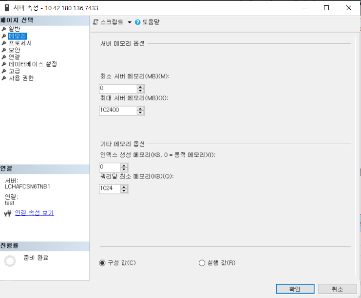

# Memory Performance Analysis
쿼리는 처리되기 전에 메모리에 데이터를 올려놓는다. 데이터를 수정하는 어떤 변경점도 해당 데이터가 맨 처음 메모리에 로드된다.  
그래서 많은 다른 연산 작업들은 메모리를 주로 이용하기 때문에 속도 상 유리한 점이 있다.  
이 때문에 메모리에 대한 이해가 필요하다.

이번장에서 다룰 주제

* 성능 모니터의 기본
* 몇몇 시스템 활동상황을 관찰하기 위해 사용되어지는 동적 관리 오브젝트
* 어떻게, 왜 하드웨어 리소스는 병목을 발생시키는지
* SQL Server 와 윈도우 OS에서 사용되어지는 메모리를 관찰하고 측정하는 방법
* 메모리 병목의 가능한 해결책

***
## 성능 모니터
CPU, Memory, Disk, Network의 자세한 활동 데이터 측정 가능.  
또는 SQL Server 2014에서는 추가적인 기능을 성능 모니터를 통해 사용 가능.  
단 VM에서 측정하는 값은 논리적인 VM 각각의 데이터이기 때문에 물리적 서버의 데이터가 아니다. 정확한 데이터가 아니기 때문에 주의.

시스템 실시간 활동데이터를 그래프로 바로 볼 수도 있고, data collector set 이라는 파일로 저장할 수도 있다.  
실서버에서는 파일로 저장하는게 오버헤드가 더 적기 때문에 보다 선호. 

명령도구(cmd.exe)에서 perfmon 이라고 치면 성능 모니터가 실행됨.

* 동적 관리 오브젝트
내부적으로 동적관리오브젝트(DMO)를 사용하는 동적관리뷰(DMV)와 동적 관리함수(DMF)라는 형태로 SQL Server에서도 성능모니터에서와 같이 실시간 스냅샷 데이터를 제공한다.

sys.dm_os_performance_counters dmv는 쿼리로 SQL Server의 카운터를 쿼리로 볼수 있게 해준다. 아래는 Login/sec 예제
```sql
SELECT cntr_value
    , cntr_type
FROM sys.dm_os_performance_counters
WHERE object_name = 'SQLServer:General Statistics'
    AND counter_name = 'Logins/sec';
```        
이때 cntr_value 는 현재까지 누적치이고 cntr_type은 각각의 카운터를 가르키는 정수값이다. 여기서 참조가능
[여기](https://docs.microsoft.com/ko-kr/windows/win32/wmisdk/wmi-performance-counter-types?redirectedfrom=MSDN) 서 참조 가능

sys.dm_os_wait_stats 는 다양한 대기 상태의 누적치. 대기상태를 아는 것은 병목의 원인을 알수있는 가장 쉬운 방법이다.
```sql
SELECT TOP (10) dows.*
FROM sys.dm_os_wait_stats AS dows
ORDER BY dows.wait_time_ms DESC;
```
다양한 대기 상태를 알수 있다.  
Microsoft에서 [대기상태](http://bit.ly/1e1I38f) 찾기.


## 하드웨어 리소스 병목
일반적으로 다음 4개의 하드웨어 리소스에 영향을 받는다.
* 메모리
* Disk I/O
* CPU
* Network

### 병목 알아내기
리소스간의 병목에는 서로 밀접한 관계가 있다. 예를 들면 CPU병목은 과도한 페이징(메모리 병목)이나 디스크 속도 저하(디스크병목)같은 증상이 발생한다.
또한 시스템에 메모리가 부족하면 과도한 페이징을 유발하고 느린 디스크가 된다. 이때 CPU를 더 빠른 것으로 교체하는것은 약간 좋은 해결책이 될ㅅ ㅜ있지만 최적의 솔루션이 아니다. 이 경우 메모리 증설이 디스크/CPU의 압박을 줄여주기 때문에 좀더 적절한 해결방법이다.
    
    병목 식별 방법
    - 가장좋은 방법 : 처리를 완료하기 위해 한 리소스가 다른 리소스를 기다리는지 알아내는 법
    - 두번째 방법 : 응답시간과 용량을 조사해 알아내기
         예를 들면 벤더가 제시한 대역폭과 용량을 알ㅁ기 disk sec/transfer.  그 이상을 넘으면 과도한 로드라고 할수 있다. 

    모든 리소스가 쿼리레벨에서 조회 가능한 특별한 카운터를 가지고 있는건 아니지만 리소스의 과도한 사용을 표시하는 카운터는 대부분 존재.

    예) 메모리는 그러한 카운터는 없지만 큰 숫자의 하드 페이지 폴트는 물리적 메모리의 한계가 부족하다는 것을 의미. (pages/sec, page faults/sec) 

    CPU나 디스크과 같은 다른 리소스들도 대부분 queuing 수치 카운터가 존재한다.
    예) SQL Server의 Page Life Expectancy는 디스크의 데이터를 메모리의 버퍼캐시로 올려놓고 유지하는 시간(단위:초)을 말하는데 이 값이 작다면 SQL Server의 메모리를 적절하게 이용하지 못한다는 얘기이고 메모리 병목이라고 판단할수 있는 것이다.

* 병목 해결 방법
일단 병목을 발견하면 다음 두가지 방법중 하나를 선택할 수 있다.
    - 하드웨어 리소스를 증설
    - 리소스를 사용하는 방법을 교정(쿼리 튜닝과 같은)


## 메모리 병목 분석
메모리 병목 현상은 시스템의 다른 리소스에도 문제를 발생.  
예) SQL Server가 버퍼 캐시가 부족하게 되면
    - SQL Server의 프로세스(lazy writer같은)는 충분한 여유 내부 메모리페이지를 유지하기 위하여 과도하게 작동한다.
    - 이는 과도한 CPU 사용률
    - 메모리 페이지를 디스크에 쓰려하는 추가적인 물리적 disk I/O를 발생

* SQL Server 메모리 관리
SQL Server의 메모리 구성
    - 데이터베이스용 메모리
    - 데이터용 메모리 요구사항
    - 쿼리 실행계획
    - 버퍼풀이라고 불리는 대량의 메모리 풀

메모리 풀은 8KB 버퍼들의 컬렉션.
데이터 페이지, 플랜 캐시 페이지, 프리 페이지와 같은 다양한 페이지 존재
SQL server는 동적으로 메모리 풀 크기를 늘리거나 줄임.

SSMS에서 세팅방법 서버등록정보/메모리 에서


동적 메모리 범위는 두개의 구성 정보. Minimum server Memory(MB), Maximum server memory(MB)
    - Minimum(MB) : "min server memory"은 메모리 풀의 가장 낮은 값. 일단 메모리 풀이 최소값과 같은 크기에 도달하면 SQL Server는 메모리 풀의 페이지를 계속 커밋 할 수 있지만 최소값보다 작게는 축소 할수 없다. SQL Server는 min server memory 값으로 시작하지 않고 필요에 따라 덩적으로 메모리 커밋. 

    - Maximum(MB) : "max sserver memory" 메모리 풀의 최대 증가를 제한하는 상한 값 역할. 이러한 구성 설정은 즉시 적용되며 다시 시작할 필요가 없습니다. 

Microsoft는 동적 메모리 권장을 사용ㅏ도록 권장. min server memory는 0. Max server memory는 OS에 약간의 memory 허용치를 놔두게.
8~16GB 메모리 일 경우 OS메모리는 2~4GB 놔두게. 일반적으로는 os메모리가 16GB 늘때마다 4GB는 OS에 여유로 남긴다.

최소 서버 메모리가 0 인 SQL Server에 동적 메모리 구성을 사용하는 것이 좋습니다.
최대 서버 메모리는 시스템의 단일 인스턴스를 가정하여 운영 체제에 일부 메모리를 허용하도록 설정됩니다.
운영 체제의 메모리 양은 시스템 자체에 따라 다릅니다. 8GB –16GB의 대부분의 시스템
메모리의 경우 약 2GB-4GB를 OS에 남겨 두어야합니다. 서버의 메모리 양이 증가함에 따라
OS에 더 많은 메모리를 할당합니다. 일반적인 권장 사항은 전체 시스템의 32GB를 초과하는 16GB마다 4GB입니다.
기억. 시스템의 요구 사항과 메모리 할당에 따라이를 조정해야합니다. 당신은 실행해서는 안됩니다
SQL Server와 동일한 서버에있는 다른 메모리 집약적 응용 프로그램, 그러나 필요한 경우 먼저 예상치를 얻는 것이 좋습니다.
다른 응용 프로그램에 필요한 메모리 양을 확인한 다음 최대 서버 메모리 값을 설정하여 SQL Server를 구성하여 다른 응용 프로그램이 SQL Server의 메모리를 고갈시키지 않도록합니다. SQL Server가 실행중인 시스템
자신의 경우 최소 서버 메모리를 최대 값과 동일하게 설정하고 동적 관리로 간단히 발송하는 것을 선호합니다.
여러 SQL Server 인스턴스가있는 서버에서는 각 인스턴스에 다음과 같은 메모리 설정이 있는지 확인해야합니다.
적절한 가치. 운영 체제 및 외부 프로세스를위한 충분한 메모리가 남아 있는지 확인하십시오.

SQL Server 의 메모리는 크게 데이터페이지와 프리페이지가 있는 버퍼풀 메모리와 쓰레드, DLL들, 연결된 서버들 등등이 있는 비버퍼 메모리로 나눠진다.
대부분은 버퍼풀이 차지한다. 그러나 버퍼풀 그 너머 영역(private bytes라고 알려진)까지 얻을 수 있긴 하지만 일반적으로 버퍼풀 모니터링하는 정상적인 절차에 걸리지 않기 때문에 메모리 압박을 유발 할수도 있다.
이런 상황이 의심스럽다면 Process:sqlserver:Private Bytes 와 SQL Server: Buffer Manager: Total pages 를 비교해보자

sp_configure 를 이용해 min server memory와 max server memory를 설ㅓㅈㅇ할 수 있다. 
```sql
EXEC sp_configure 'show advanced options', 1;
GO
RECONFIGURE;
GO
EXEC sp_configure 'min server memory';
EXEC sp_configure 'max server memory';
```
| name                   | minimum  | maximum       |config_value   |run_value  |
|:---:                   |:----:    |:----          |:----          |:----      |
| min server memory (MB) | 0        | 2147483647    | 0             | 16        |

| name                  | minimum   | maximum       |config_value   |run_value  |
|:---:                  |:----:     |:----          |:----          |:----      |
| max server memory (MB)| 128       | 2147483647    | 102400        | 102400    |

min server memory의 값이 0MB 이고 max server memory가 2147483647MB인것에 주의
max server memory를 10GB, min server memory를 5GB 로 세팅하는 예제
```sql
USE master;
EXEC sp_configure 'show advanced option', 1;
RECONFIGURE;
exec sp_configure 'min server memory (MB)', 5120;
exec sp_configure 'max server memory (MB)', 10240;
RECONFIGURE WITH OVERRIDE;
```
show_advanced option을 1로 킨 다음에 세팅해야 정상적으로 완료됨.
sys.configuration 뷰를 통해서도 메모리 세팅 값을 조회할수 디다.


메모리를 분석할수 있는 성능 모니터 카운터  


| 오브젝트                  | Counter                   | 설명                                          |값                                     |
|:---                       |:----                      |:----                                          |:----                                  |
| Memory                    | Availble Bytes            | 물리적 메모리의 여유 용량                     | 102400                                |
|                           | Pages/sec                 | 초당 하드 페이지 폴트 수                      | 보통 평균 < 50. 베이스라인 참고       |
|                           | Page Faults/sec           | 총 페이지 폴트(소프트 + 하드)                 | 베이스라인 참고                       |
|                           | Page Faults/sec           | 총 페이지 폴트(소프트 + 하드)                 | 베이스라인 참고                       |
|                           | Page Input/sec            | input page faults(디스크에서 읽기)            |                                       |
|                           | Page Output/sec           | output page faults(디스크에 쓰기)             |                                       |
| Paging File               | Paging File %Usage Peak   | 메모리 페이징 파일 사용률   최대 수치         |                                       |
|                           | Paging File: %Usage       | 메모리 페이징 파일 사용률                     |                                       |
| SQLServer:Buffer Manager  | Buffer cache hit ratio    | 버퍼 캐시의 데이터를 쓰는 비율                |                                       |
|                           | Page Life Expectancy      | 버퍼캐시에 머무루는 시간(초)                  | 베이스라인  비교                      |
|                           | Checkpoint Pages/sec      | 체크포인트로 초당 디스크 쓰기 페이지수        | 평균 < 30. 단 베이스라인과 비교필요   |
|                           | Lazy writes/sec           | 버퍼에서 날라간 더티 페이지수                 | 평균 < 20. 단 베이스라인과 비교필요   |
| SQLServer:Memory Manager  | Memory Grants Pending     | 메모리 그랜트를 기다리는 프로세스 수          | 평균 0                                |
|                           | Target Server Memory (KB) | SQL Server 가질수있는 최대 물리메모리 용량    | 물리적 메모리 크기에 근접해야         |
|                           | Total Server Memory (KB)  | SQL Server의 현재 물리 메모리 용량            | Target Server Memory (KB)에 근접해야  |
| Process                   | Private Bytes             | 다른 프로세스와 공유하지 않는 이 프로세스만의 메모리 사이즈 |                         |


메모리와 디스크 I/O 간에는 밀접한 관계가 있다. 메모리 문제라고 생각했던게 사실 디스크 I/O때문 일수도 있음. 

* Available Bytes  
    OS 메모리의 여유 용량. "Available Kbyte", "Available MByte" 도 사용가능. 이 카운터 수치가 너무 낮으면 안됨. 
    SQL Server가 동적 메모리 관리를 사용하도록 구성되어 있다면 이 값은 Windows API에 의해 조절된다.

* Pages/Sec, Page Faults/Sec    
    페이지 폴트 : 프로그램(윈도우 프로세스)이 필요한 데이터가 자기만의 물리적 메모리상의 공간인 Working Set에 없을 경우 발생.
    - 소프트 페이지 폴트 : 필요한 데이터가 물리적 메모리의 다른 공간에 있어서 거기서 찾을 수 있으면 소프트 페이지 폴트
    - 하드 페이지 폴트: 디스크에서 찾아야 한 다면 하드 페이지 폴트라고 한다.

    하드 페이지 폴트의 성능 향상을 위해 SSD를 쓰긴 하지만 그래도 밀리세컨트 단위인데 메모리는 나노세컨드, 비교 불가

    - Pages/sec : 하드페이지 폴트를 해결하기 위해 디스크에 읽고 쓰는 초당 페이지 수이다. (x86,x64에서 페이지는 4KB 단위).
    - Page Faults/sec : 소프트 페이지 폴트 + 하드 페이지 폴트 = 전체 폴트 초당 총 페이지 수. 총 페이지 폴트는 데이터 로드의 주된 요소이고 성능 이슈의 직접적인 지표는 아니다.

    Pages/sec으로 표시되는 "하드 페이지 폴트"는 꾸준하게 보통보다 낮아야 한다. 디스크와 메모리의 종류, 속도, 용량 등등 시스템의 다양한 변수가 있기 때문에 얼마가 보통이고 얼마가 문제인지 판단 할수 있는 절대적인 기준 수치는 없다. 
    
    Pages/sec 수치가 높다면 "Pages Input/sec"과 "Pages Output/sec" 으로 나눠 좀 더 세부적으로 조사해야 한다.

    - Pages Input/sec : 디스크에서 읽기. input page 동안만 어플리케이션이 대기.
    - Pages Output/sec : 디스크에 쓰기. 항상 부하가 되는 건 아니고 Page output은 보통 어플리케이션의 더티 페이지(디스크에 다시 쓰여지는)로 표현된다. 디스크 로딩 이슈가 발생할 때만 문제의 원인이 된다.

    Process:Pages Faults/sec 을 통해 어떤 프로세스가 높은 Pages/sec의 원인인지 최종 범인을 확정. Process 오브젝트는 프로세스 별로 성능 데이터 수치 측정.
    SQL Server의 기본 프로세스 명은 "sqlservr".  Memory:Pages/sec 수치가 높지 않다면 Process(sqlservr):Pages Faults/sec 은 높아도 크게 의미있지 않다. 소프트페이지 폴트만 발생하는 것이기 때문에.  
    Pages/sec은 일반적으로 0에서 10000 까지 볼수 있기 때문에 매우 넓은 범위에 걸쳐 있다. 그렇기 때문에 보통상태의 수치가 얼마인지 베이스라인 측정 작업을 평소에 해 놓아야 한다.

    정리하자면
    - os 단위
    >> page fault --- soft page fault
    >>            |
    >>            --- hard page fault(pages/sec) --- Pages Input/sec
    >>                                           |
    >>                                           --- Pages Output/sec

    - process 단위
    > Process(sqlservr) -- Pages Faults/sec

* Paging File %Usage, Page File %Usage
윈도우의 모든 메모리는 물리적 메모리만이 아니다. 가상메모리(페이징파일)도 존재하는데 필요할때 물리적 메모리와 데이터를 스왑한다. 이 카운터로 얼마나 자주 스와핑이 발생하는지 이해할 수 있다. 보통은 SQL Server가 아니고 Windows OS에서 수행된다. 하지만 충분하지 않은 가상메모리는 SQL Server까지 영향을 미친다. 이 수치는 SQL Server상의 메모리 압박이 내부적 또는 외부적인지 이해하기 위해 수집된다. 외부의 메모리 압박이라면 SQL Server 이외의 어떤 요소가 문제인지 OS 단에서 확인할 필요가 있다.

* Buffer Cache Hit Ratio
버퍼 캐시는 메모리상에서 존재하는 데이터의 버퍼 풀이다.  
종종 SQL Server 메모리 구조에서 가장 큰 부분을 차지하며 이 카운터는 OLTP 시스템에서는 가능한 높아야 한다. 대부분의 프로덕션 서버에서는 99%.
낮은 Buffer Cache Hit Ratio은 필요한 데이터가 버퍼 캐시 밖(하드디스크)에 존재함을 의미.
낮은 경우는 SQL Server에 처음에 워밍업할, 메모리 부족일 경우만 발생

버퍼 캐시 적중률이 계속 낮은 수치일 경우
    - 물리적 메모리 증설
    - 적절한 인덱스 추가 or 쿼리 튜닝

만약 리포팅 시스템, DW같은 OLAP성 작업이라면 쿼리 하나하나가 매우 대량의 데이터를 메모리에 올리고 사라지고 하는게 일반적이기 때문에 이 때문에 낮은 수치를 보여지는게 정상.
또한 얼마만큼의 권장 수치 존재치 않지만 대부분 OLTP는 99% 근처.

* Page Life Expectancy(PLE)
    메모리가 부족한지 아닌지 판단해야 하는 경우 가장 먼저 Page Life Expectancy. 

    SQL Server 데이터 페이지(8K)를 메모리에 적재한 후 삭제되지 않는 평균 시간(초 단위). 이 수치가 놎은 경우 OLTP 시스템에서 유리. 이 수치가 낮다면 메모리 압박 상태.

    OLAP은 낮을 수도 있다. 다음에 해당 페이지를 조회하는 쿼리가 있으면 메모리에 존재하니까 읽고 쓰기를 모두 메모리에서 할수 있다.

    OLAP성에서는 낮은게 정상.

    권장하는 절대적 수치는 없다. 하지만 과거 MS에서 300초(5분)이상이어야 권고했었던 적은 있지만 그게 20년전이었고 일부 MS문서에는 아직도 300으로 되어 있다. 그렇기에 최근까지 300이라고 알고 있는 사람이 많다.
    결론부터 말하지만 현재 300은 너무 작은 값이다. 최근 몇년간의 하드웨어/메모리의 사양/용량이 급격하게 증가했기 때문에 좀 더 증가된 기준이 필요하다.
    외국 유명 SQL Server 엔지니어는 1200(20분) 이라는 사람도 있던데 개인적으로 정답은 아니지만 정답에 가까운 답은 된다고 개인적으로 생각된다.
    베이스라인 작성 필요.
    NUMA 잘 지원. 
    
    - 해당 SQL Server의 인스턴스의 PLE가 알고 싶다면
        Buffer Manager: Page Life Expecany
    - 각 NUMA 노트의 PLE 알고 싶다면
        Buffer Node: Page Life Expecany

    의 전체 PLENUMA 노드별로 PLE가 알고 싶다면 Buffer Node:Page Life Expecancy

* Checkpoint Pages/Sec  
    SQL Server 엔진은 성능상의 이유로 변경 내용이 있을 때마다 메모리(버퍼캐시)에서 데이터베이스 페이지를 수정하며 이러한 페이지를 바로 디스크에 기록하지는 않는다. 메모리상에서만 변경되고 디스크에 기록되기 전의 데이터베이스 페이지를 "더티 페이지" 라고 한다.
    Checkpoint Pages/Sec 카운터는 체크포인트로 인해 메모리에서 디스크로 이동하는 더티 페이지들의 초당 숫자.
    대부분의 경우 30보다 낮아야 한다. 이보다 높은 수치는 메모리 버퍼에 더티 페이지로 표시된 페이지들이 많다는 것을 의미한다.
    
    이 수치가 높으면 시스템에 쓰기 작업이 많고 I/O 문제 발생할 가능성 많음.
    ```sql
    SELECT *
    FROM sys.configurations
    where name like 'recovery interval%'
    GO
    /*
        configuration_id  name                     value  minimum  maximum  value_in_use  description                           is_dynamic  is_advanced
        ----------------  -----------------------  -----  -------  -------  ------------  ------------------------------------  ----------  -----------
        101               recovery interval (min)  0      0        32767    0             Maximum recovery interval in minutes  1           1
    */
    ```
    "recovery intervals" SQL 서버 범위의 체크포인트 주기를 결정하는 값이다. 기본값은 0이고 60초 단위로 체크포인트를 수행한다는 뜻이다. 이 때를 자동 체크포인트라고 부른다.

    SQL Server 2012부터는 데이터베이스 단위로 체크포인트를 결정할 수 있다.    
    ```sql
    SELECT database_id, name AS DBName, target_recovery_time_in_seconds
    FROM sys.databases
    WHERE name = 'AdventureTime'
    GO
    /*
        database_id  DBName            target_recovery_time_in_seconds
        -----------  ----------------  -------------------------------
        6            AdventureTime     0
    */
    ```    
    "target_recovery_in_seconds" 값으로 데이터베이스 단위로 체크포인트 주기를 결정할 수 있게 된다. 기본값은 0이고 이 때는 서버 구성을 따른다는 의미.  만약 이 값이 0이 아니라면 서버 설정은 무시하고 데이터베이스 쪽 설정이 우선된다.  이를 간접 체크포인트라고 부름.
    2016버전부터는 데이터베이스 설정이 우선이고 기본값은 60초이다. 단 지금 예제 서버는 2014 버전이기 때문에 0으로 표시돤다.
    

      
    수치를 보면 알 수 있듯이 이 SQL Server는 쓰기 작업이 매우 많은 서버이다.  
    여기서 SQL 서버의 "recovery interval" 도 0이고 Database의  target_recovery_time_in_seconds 값도 0이니  서버쪽 옵션을 따라 60초마다 체크포인트가 발생하는 것을 알 수 있다.  
    "Checkpoint Pages/Sec" 가 30을 넘기 때문에 메모리상의 더티 페이지가 많이 발생하고 메모리와 디스크I/O의 성능 이슈가 발생할 가능성이 높다.  
    잘 안보이지만 파란색 선이 디스크의 평균 write 카운터이다. 정확히 1분마다 체크포인트 발생과 동시에 I/O가 치솟는 것을 알 수 있다.  
    1분마다 발생하는 과도한 I/O를 60초에 나누어 고르게 분산되도록 조정해야 한다. 
    target_recovery_in_seconds값을 60보다 차츰 줄여 가면서 I/O가 고르게 분포하게 되는 수치를 정하는게 목적이다.

    참고      
    [Database checkpoints – Enhancements in SQL Server 2016](https://www.sqlshack.com/database-checkpoints-enhancements-sql-server-2016/)