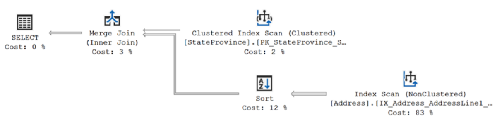
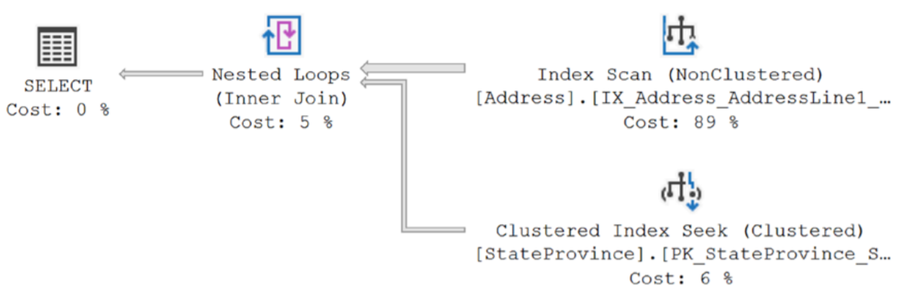
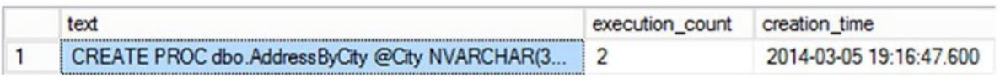
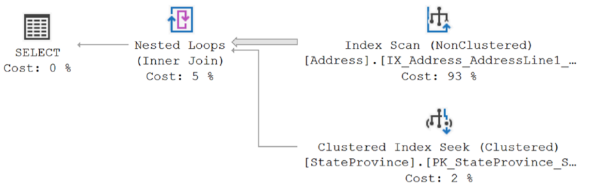
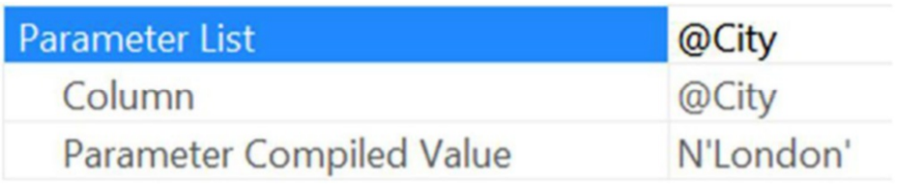
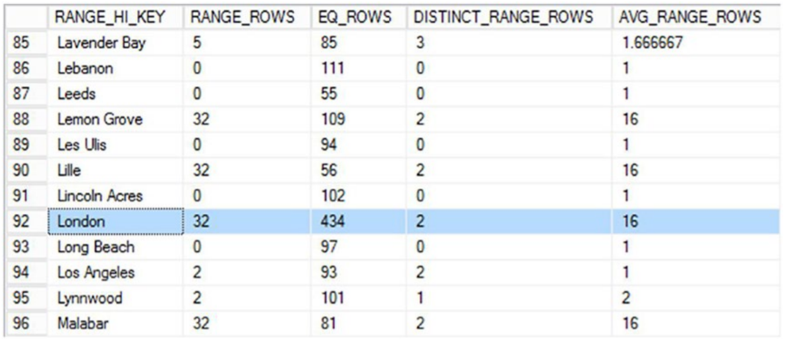
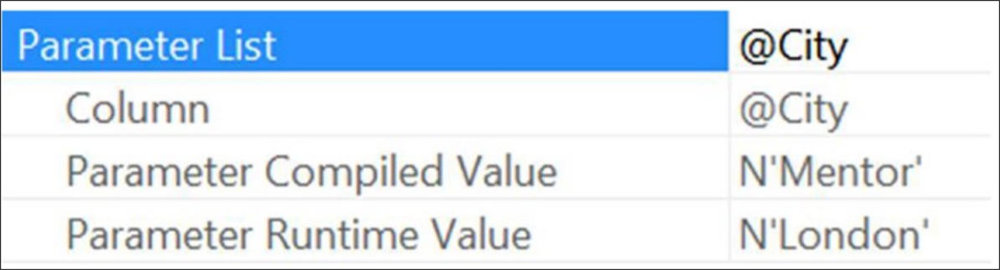
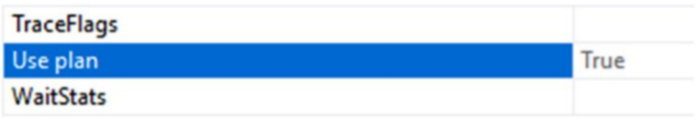
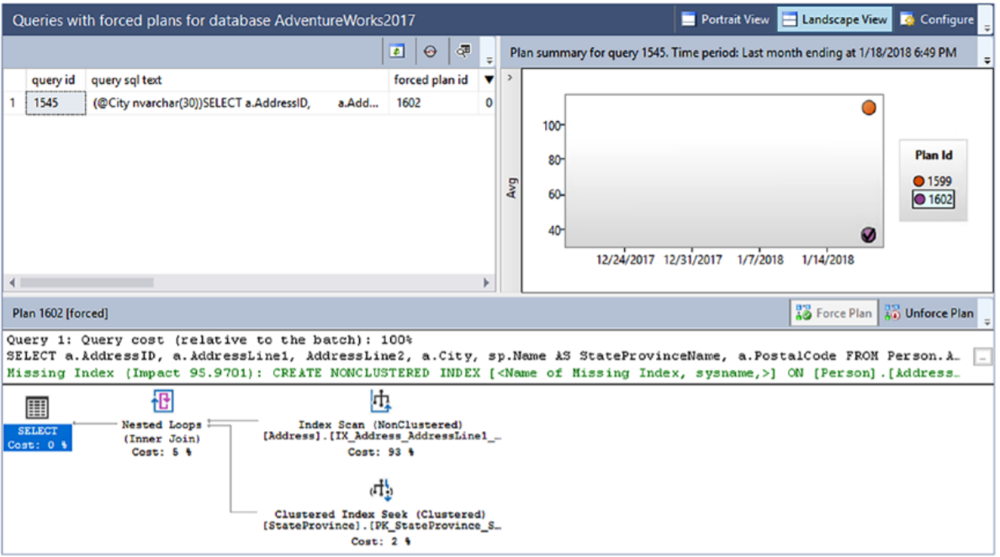

# 파라메터 스니핑
이전장에서 실행 계획을 캐시로 가져오는 방법과 캐시에서 재사용하는 방법에 대해 논의했다. 이는 칭찬할 만한 목표이며 시스템의 전반적인 성능을 향상시키는 여러 가지 방법 중 하나이다. 실행계획 재사용을 보장하는 가장 좋은 메커니즘 중 하나는 저장 프로시저, 준비된 구문 또는 sp_executesql을 통해 쿼리를 매개 변수화하는 것이다. 이러한 모든 메커니즘은 계획을 생성할 때 하드 코딩된 값 대신 사용되는 매개변수를 생성합니다. 실행 계획을 생성할 때 포함된 값을 사용하기 위해 최적화 프로그램에서 이러한 매개변수를 샘플링하거나 스니핑할 수 있다. 대부분의 경우와 마찬가지로 이것이 잘 작동하면 보다 정확한 계획의 이점을 얻을 수 있지만 잘못된 매개변수 스니핑이 되면 심각한 성능 문제를 야기 할 수 있다.

이번 장에서는 다음과 같은 주제를 다룬다.

    * 파라메터 스니핑 뒤의 유용한 메카니즘
    * 어떻게 파라메터 스니핑이 문제를 발생시키는지
    * 나쁜 파라메터 스니핑을 발생시키는 메카니즘

## <font color='dodgerblue' size="6">1) 파라메터 스니핑</font>    
매개변수화된 쿼리가 옵티마이저로 전송되고 캐시에 기존 계획이 없으면 옵티마이저는 T-SQL 문에서 요청한 대로 데이터를 조작하기 위한 실행 계획을 생성한다. 이 매개변수화된 쿼리가 호출되면 매개변수 값은 프로그램을 통해 또는 매개변수 정의의 기본값을 통해 설정된다. 어느 쪽이든 거기에는 가치가 있습니다. 옵티마이저는 이것을 알고 있습니다. 그래서 그 사실을 이용하여 매개변수의 값을 읽습니다. 이것은 매개변수 스니핑으로 알려진 프로세스의 "스니핑" 측면입니다. 이러한 값을 사용할 수 있는 경우 옵티마이저는 해당 특정 값을 사용하여 매개변수가 참조하는 데이터의 통계를 확인합니다. 특정 값과 정확한 통계 세트를 사용하면 더 나은 실행 계획을 얻을 수 있습니다. 매개변수 스니핑의 이 유익한 프로세스는 기본값이 변경되지 않는다고 가정하고 매개변수가 있는 모든 쿼리에 대해 출처에 관계없이 항상 자동으로 실행됩니다.  
지역 변수를 스니핑할 수도 있습니다. 그러나 진행하기 전에 T-SQL 문 내에서 동일하게 보일 수 있으므로 지역 변수와 매개변수를 구분해 보겠습니다. 이 예에서는 지역 변수와 매개변수를 모두 보여줍니다.

```sql
CREATE PROCEDURE dbo.ProductDetails (@ProductID INT)
AS
DECLARE @CurrentDate DATETIME = GETDATE();
SELECT p.Name,
    p.Color,
    p.DaysToManufacture,
    pm.CatalogDescription
FROM Production.Product AS p
    JOIN Production.ProductModel AS pm
        ON pm.ProductModelID = p.ProductModelID
WHERE p.ProductID = @ProductID
    AND pm.ModifiedDate < @CurrentDate;
GO
```

이전 쿼리의 매개변수는 @ProductID입니다. 지역 변수는 @CurrentDate입니다. 매개변수는 저장 프로시저(또는 이 경우 준비된 명령문)로 정의됩니다. 지역 변수는 코드의 일부입니다. WHERE 절에 도달하면 완전히 동일하게 보이기 때문에 이들을 구별하는 것이 중요합니다.

지역 변수를 사용하는 명령문을 다시 컴파일하면 매개변수를 스니핑하는 것과 동일한 방식으로 최적화 프로그램에서 해당 변수를 스니핑할 수 있습니다. 이것만 알아두세요. 재컴파일과 관련된 이러한 고유한 상황을 제외하고 로컬 변수는 계획을 컴파일할 때 옵티마이저가 알 수 없는 양입니다. 일반적으로 매개변수만 스니핑할 수 있습니다.

매개변수 스니핑이 작동하는지 확인하고 유용하다는 것을 보여주기 위해 다른 절차부터 시작하겠습니다.
```sql
CREATE OR ALTER PROC dbo.AddressByCity @City NVARCHAR(30)
AS
SELECT a.AddressID,
    a.AddressLine1,
    AddressLine2,
    a.City,
    sp.Name AS StateProvinceName,
    a.PostalCode
FROM Person.Address AS a
    JOIN Person.StateProvince AS sp
        ON a.StateProvinceID = sp.StateProvinceID
WHERE a.City = @City;
GO
```
프로시저를 생성한 후 파라메터를 사용해 실행했다.
```sql
EXEC dbo.AddressByCity @City = N'London';
```
이것은 다음과 같은 결과를 초래할 것입니다.  
   
 

옵티마이저는 런던 값을 스니핑하고 주소 테이블의 통계 내에서 런던 시가 나타내는 데이터 분포를 기반으로 계획에 도달했습니다. 해당 쿼리 또는 테이블의 인덱스에 다른 조정 기회가 있을 수 있지만 계획은 런던 값 및 기존 데이터 구조에 최적입니다. 이와 같이 로컬 변수를 사용하여 동일한 쿼리를 작성할 수 있습니다.
```sql
DECLARE @City NVARCHAR(30) = N'London';

SELECT a.AddressID,
    a.AddressLine1,
    AddressLine2,
    a.City,
    sp.[Name] AS StateProvinceName,
    a.PostalCode
FROM Person.Address AS a
    JOIN Person.StateProvince AS sp
        ON a.StateProvinceID = sp.StateProvinceID
WHERE a.City = @City;
```
이 쿼리를 실행하면 I/O와 실행시간이 다르다.  
   
 
실행 시간이 증가했고 총 219개의 읽기에서 1084개로 이동했습니다. 이것은 그림에 표시된 새 실행 계획을 살펴봄으로써 다소 설명됩니다.
그림 추가> 
옵티마이저가 지역 변수 값을 샘플링하거나 스니핑할 수 없었기 때문에 통계에서 평균 행 수를 사용해야 했습니다. Index Scan 연산자의 속성에서 예상 행 수를 보면 알 수 있습니다. 34.113을 보여줍니다. 그러나 반환된 데이터를 보면 실제로 London 값에 대해 434개의 행이 있습니다. 간단히 말해서 옵티마이저는 434개의 행을 검색해야 한다고 생각하면 병합 조인을 사용하여 계획을 만들고 219개만 읽습니다. 그러나 약 34개 행만 반환한다고 생각하는 경우 중첩 루프 조인이 있는 계획을 사용합니다. 중첩 루프의 특성에 따라 상위 데이터 집합의 각 값에 대해 하위 값을 한 번씩 찾는 중첩 루프의 특성으로 인해 1,084개의 읽기 및 느린 성능.

즉 매개변수 스니핑이 실행되어 성능이 향상됩니다. 이제 매개변수 스니핑이 나빠지면 어떻게 되는지 봅시다.

## <font color='dodgerblue' size="6">2) 악성 파라메터 스니핑</font>  
매개변수 스니핑은 통계에 문제가 있을 때 문제를 만듭니다. 매개변수에 전달된 값은 통계 내의 데이터 및 데이터 분포를 나타낼 수 있습니다. 이 경우 좋은 실행 계획을 볼 수 있습니다. 그러나 전달된 매개변수가 테이블의 나머지 데이터를 나타내지 않으면 어떻게 될까요? 이 상황은 데이터가 평균이 아닌 방식으로 배포되기 때문에 발생할 수 있습니다. 예를 들어, 통계에 있는 대부분의 값은 몇 개의 행(예: 6)만 반환하지만 일부 값은 수백 개의 행을 반환합니다. 많은 양의 데이터가 공통적으로 분포되어 있고 흔하지 않은 작은 값 집합이 있는 것과 같은 방식으로 작동합니다. 이 경우 대표성이 없는 데이터를 기반으로 실행 계획이 생성되지만 대부분의 쿼리에는 유용하지 않습니다. 이 상황은 가장 자주 갑자기, 때로는 매우 심각한 성능 저하를 통해 스스로를 드러냅니다. 재컴파일 이벤트가 매개변수에 전달되는 더 나은 대표 데이터 값을 허용할 때 겉보기에 무작위로 보일 수도 있습니다.

통계가 최신이 아니거나, 스캔되는 대신 샘플링되기 때문에 정확하지 않거나(일반적인 통계에 대한 자세한 내용은 13장 참조), 완벽하게 구성되어 매우 들쭉날쭉한 경우( 데이터의 이상한 분포). 그럼에도 불구하고 상황은 유용하지 않은 계획을 만들어 캐시에 저장합니다. 예를 들어 다음 저장 프로시저를 사용합니다.
```sql
CREATE OR ALTER PROC dbo.AddressByCity @City NVARCHAR(30)
AS
SELECT a.AddressID,
    a.AddressLine1,
    AddressLine2,
    a.City,
    sp.Name AS StateProvinceName,
    a.PostalCode
FROM Person.Address AS a
    JOIN Person.StateProvince AS sp
        ON a.StateProvinceID = sp.StateProvinceID
WHERE a.City = @City;
GO
```
이전에 생성된 저장 프로시저인 dbo.AddressByCity가 이번에는 다른 매개변수로 다시 실행되면 다른 I 집합으로 반환됩니다.
```sql
EXEC dbo.AddressByCity @City = N'Mentor';
Reads: 218
Duration: 2.8ms
```
동일한 실행 계획이 재사용되기 때문에 I/O는 거의 동일합니다. 더 적은 수의 행이 반환되기 때문에 실행 시간이 더 빠릅니다. sys.dm_exec_query_stats의 출력을 보면 계획이 재사용되었는지 확인할 수 있습니다(그림 17-3 참조).
```sql
SELECT dest.text,
    deqs.execution_count,
    deqs.creation_time
FROM sys.dm_exec_query_stats AS deqs
    CROSS APPLY sys.dm_exec_sql_text(deqs.sql_handle) AS dest
WHERE dest.text LIKE 'CREATE PROC dbo.AddressByCity%';
```
   

얼마나 나쁜 매개변수 스니핑이 발생할 수 있는지 보여주기 위해 프로시저 실행 순서를 반대로 할 수 있습니다. 먼저 DBCC FREEPROCCACHE를 실행하여 버퍼 캐시를 플러시합니다. 이 작업은 캐시에서 단일 실행 계획만 제거하는 여기에 표시된 작업을 주의 깊게 수행하지 않는 한 프로덕션 시스템에 대해 실행해서는 안 됩니다.

```sql
DECLARE @PlanHandle VARBINARY(64);

SELECT @PlanHandle = deps.plan_handle
FROM sys.dm_exec_procedure_stats AS deps
WHERE deps.object_id = OBJECT_ID('dbo.AddressByCity');

IF @PlanHandle IS NOT NULL
BEGIN
    DBCC FREEPROCCACHE(@PlanHandle);
END
GO
```
여기서 또 다른 옵션은 ALTER DATABASE SCOPED CONFIGURATION CLEAR PROCEDURE CACHE를 통해 지정된 데이터베이스에 대한 계획만 플러시하는 것입니다.
이제 역순으로 쿼리를 다시 실행합니다. 매개변수 값 Mentor를 사용하는 첫 번째 쿼리의 결과는 다음과 같습니다.  
  

그림 17-4는 그림 17-2와 같은 실행 계획이 아닙니다. 읽기 횟수는 약간 줄어들지만 실행 시간은 거의 동일하게 유지됩니다. 런던을 매개변수 값으로 사용하는 두 번째 실행은 다음과 같은 결과를 가져옵니다.
```
Reads:1084
Duration:97.7ms
```
이번에는 지역 변수를 사용했을 때와 달리 읽기가 훨씬 더 빨라지고 실행 시간이 늘어났습니다. 런던 매개변수를 사용하여 프로시저를 처음 실행할 때 생성된 계획은 데이터베이스에서 해당 기준과 일치하는 434개 행을 검색하는 데 가장 적합한 계획을 생성합니다. 그런 다음 매개변수 값 Mentor를 사용하는 프로시저의 다음 실행은 첫 번째 실행에서 생성된 동일한 계획을 사용하여 충분히 잘 수행되었습니다. 순서가 바뀌면 Mentor 값에 대해 새로운 실행 계획이 생성되었지만 London 값에는 전혀 효과가 없었습니다. 이 예에서 나는 실제로 약간의 속임수를 썼습니다. 해당 통계의 데이터 분포를 살펴보면 반환되는 평균 행 수가 약 34개인 반면 런던의 434개는 이상값임을 알 수 있습니다. 절차가 런던에 대해 컴파일되었을 때 보았던 약간 더 나은 성능은 다른 계획이 필요했다는 사실을 반영합니다. 그러나 Mentor와 같은 가치에 대한 성능은 런던에 대한 계획으로 약간 감소했습니다. 그러나 Mentor의 개선된 계획은 런던과 같은 가치에 절대적으로 비참했습니다. 이제 어려운 부분이 나옵니다. 시스템 부하에 맞는 계획을 결정해야 합니다. 한 계획은 평균 값에 대해 약간 더 나쁩니다. 반면 다른 계획은 평균 값에 더 낫지만 이상값에 심각한 피해를 줍니다. 문제는 가능한 모든 데이터 세트에 대해 다소 느린 성능을 갖고 이상값의 더 나은 성능을 지원하는 것이 더 낫습니까? 아니면 더 자주 호출될 수 있기 때문에 더 큰 데이터 단면을 지원하기 위해 이상값이 고통을 받도록 하는 것입니까? 이것은 자신의 시스템에서 파악해야 합니다.

- ### a. 악성 파라메터 스니핑 식별하기
잘못된 매개변수 스니핑은 일반적으로 간헐적인 문제입니다. 당신은 때때로 충분히 잘 작동하고 아무도 불평하지 않는 하나의 계획을 얻게 될 것이고, 때로는 다른 계획을 얻게 될 것이고, 갑자기 시스템 속도에 대한 불만과 함께 전화 벨이 울리게 될 것입니다. 따라서 문제를 추적하기가 어렵습니다. 트릭은 주어진 매개변수화된 쿼리에 대해 두 개(또는 그 이상)의 실행 계획을 얻고 있음을 식별하는 것입니다. 이러한 간헐적인 성능 변경이 시작되면 관련된 쿼리 계획을 캡처해야 합니다. 이를 수행하는 한 가지 방법은 이와 같이 sys.dm_exec_query_plan DMO를 사용하여 예상 계획을 캐시에서 직접 가져오는 것입니다.
```sql
SELECT deps.execution_count,
    deps.total_elapsed_time,
    deps.total_logical_reads,
    deps.total_logical_writes,
    deqp.query_plan
FROM sys.dm_exec_procedure_stats AS deps
    CROSS APPLY sys.dm_exec_query_plan(deps.plan_handle) AS deqp
WHERE deps.object_id = OBJECT_ID('AdventureWorks2012.dbo.AddressByCity');
```
이 쿼리는 sys.dm_exec_procedure_stats DMO를 사용하여 캐시 및 쿼리 계획의 프로시저에 대한 정보를 검색합니다.

쿼리 저장소를 활성화한 경우 다른 접근 방식은 거기에서 계획을 검색하는 것입니다.

```sql
SELECT SUM(qsrs.count_executions) AS ExecutionCount,
    AVG(qsrs.avg_duration) AS AvgDuration,
    AVG(qsrs.avg_logical_io_reads) AS AvgReads,
    AVG(qsrs.avg_logical_io_writes) AS AvgWrites,
    CAST(qsp.query_plan AS XML) AS Query_Plan,
    qsp.query_id,
    qsp.plan_id
FROM sys.query_store_query AS qsq
    JOIN sys.query_store_plan AS qsp
        ON qsp.query_id = qsq.query_id
    JOIN sys.query_store_runtime_stats AS qsrs
        ON qsrs.plan_id = qsp.plan_id
WHERE qsq.object_id = OBJECT_ID('dbo.AddressByCity')
GROUP BY qsp.query_plan,
 qsp.query_id,
 qsp.plan_id;
 ```

이 쿼리는 다른 쿼리와 달리 둘 이상의 실행 계획을 반환할 수 있습니다. SSMS 내에서 실행할 때 두 쿼리의 결과에는 클릭할 수 있는 query_plan에 대한 열이 포함됩니다. 검색된 내용이 XML인 경우에도 이를 클릭하면 그래픽 계획이 열립니다. 캐시에서 단일 계획을 처리하는 경우 계획 자체를 마우스 오른쪽 버튼으로 클릭하고 상황에 맞는 메뉴에서 다른 이름으로 실행 계획 저장을 선택합니다. 그런 다음 이 계획을 유지하여 이후 계획과 비교할 수 있습니다. 쿼리 저장소 외부에서 작업하는 경우 잘못된 매개 변수 스니핑 상황에서 여러 계획을 사용할 수 있습니다. 당신이 보려고 하는 것은 첫 번째 연산자(이 경우 SELECT 연산자)의 속성입니다. 거기에서 그림 17-5와 같이 최적화 프로그램이 계획을 컴파일할 때 사용된 값을 표시하는 매개변수 목록 항목을 찾을 수 있습니다.  
  

그런 다음 이 값을 사용하여 통계를 보고 예상과 다른 계획이 표시되는 이유를 이해할 수 있습니다. 이 경우 다음 쿼리를 실행하면 히스토그램을 확인하여 London과 같은 값이 저장될 가능성이 있는 위치와 예상할 수 있는 행 수를 확인할 수 있습니다.

```sql
DBCC SHOW_STATISTICS('Person.Address','_WA_Sys_00000004_164452B1');
```
  

London 값은 AVG_RANGE_ROWS에 표시된 평균 행보다 훨씬 많은 행을 반환하고 EQ_ROWS에 저장된 다른 많은 RANG_HI_ KEY 단계보다 높은 값임을 알 수 있습니다. 요컨대, 런던의 값은 나머지 데이터와 치우쳐 있습니다. 그렇기 때문에 그곳의 계획은 다른 사람들과 다릅니다. 잘못된 매개변수 스니핑이 어디에서 오는지 이해하려면 통계 및 컴파일 타임 매개변수 값에 대한 동일한 종류의 평가를 거쳐야 합니다. 그러나 잘못된 매개변수 스니핑으로 고통받는 매개변수화된 쿼리가 있는 경우 여러 가지 방법으로 제어하여 문제를 줄일 수 있습니다.

- ### b. 악성 파라메터 스니핑 이전하기
한 가지 경우에 잘못된 매개변수 스니핑을 경험하고 있음을 확인했다면 그 문제로 고통받을 필요가 없습니다. 그것에 대해 무엇이든 할 수 있지만 결정을 내려야 합니다. 잘못된 매개변수 스니핑의 동작을 완화하기 위한 몇 가지 선택 사항이 있습니다.

    * 실행하기 전에 프로시저에 대해 sp_recompile을 실행하여 실행 시 계획을 강제로 다시 컴파일할 수 있습니다.
    * 재컴파일을 강제하는 또 다른 방법은 EXEC <프로시저 이름> WITH RECOMPILE을 사용하는 것입니다.
    * 실행할 때마다 강제로 재컴파일하는 또 다른 메커니즘은 WITH RECOMPILE을 프로시저 정의의 일부로 사용하여 프로시저를 만드는 것입니다.
    * 또한 개별 명령문에 OPTION(RECOMPILE)을 사용하여 전체 프로시저를 다시 컴파일하는 대신 해당 명령문만 가질 수 있습니다. 이것은 강제로 재컴파일하려는 경우 가장 좋은 방법인 경우가 많습니다. 이것은 실행 시간과 컴파일 시간 사이의 절충점이라는 점만 알아두십시오. 이 쿼리가 자주 호출되고 매번 다시 컴파일되면 심각한 문제가 발생할 수 있습니다.
    * 입력 매개변수를 지역 변수에 재할당할 수 있습니다. 이 인기 있는 수정 사항은 옵티마이저가 참조되는 데이터의 통계를 보고 사용할 가능성이 있는 값을 가장 잘 추측하도록 하여 고려 중인 값을 제거할 수 있고 제거합니다. 이것은 예전 방식이며 OPTIMIZE FOR UNKNOWN을 사용하여 대체되었습니다. 이 방법은 또한 재컴파일 중 변수 스니핑의 가능성이 있습니다.
    * 프로시저를 생성하고 대부분의 쿼리에 대해 잘 작동하는 계획을 생성할 알려진 양호한 매개변수를 제공할 때 쿼리 힌트 OPTIMIZE FOR를 사용할 수 있습니다. 특정 계획을 생성하는 값을 지정하거나 UNKNOWN을 지정하여 통계의 평균을 기반으로 일반 계획을 얻을 수 있습니다.
    * 프로시저를 수정하지 않고 쿼리가 특정 방식으로 작동하도록 하는 메커니즘인 계획 지침을 사용할 수 있습니다. 이에 대해서는 18장에서 자세히 다룰 것이다.
    * 쿼리 저장소를 활성화하여 선호하는 계획을 선택하는 경우 계획 강제를 사용할 수 있습니다. 구현하기 위해 코드를 변경할 필요가 없기 때문에 이것은 우아한 솔루션입니다.
    * 추적 플래그 4136을 켜기로 설정하여 서버에 대한 매개변수 스니핑을 비활성화할 수 있습니다. 이 유익한 동작은 하나의 문제가 있는 쿼리가 아니라 전체 서버에 대해 해제됩니다. 이것은 잠재적으로 시스템에 매우 위험한 선택입니다.
    * 이제 DATABASE SCOPED CONFIGURATION을 사용하여 데이터베이스 수준에서 매개변수 스니핑을 비활성화하여 데이터베이스 수준에서 매개변수 스니핑을 끌 수 있습니다. 이것은 앞에서 설명한 추적 플래그를 사용하는 것보다 훨씬 안전한 작업입니다. 대부분의 데이터베이스가 매개변수 스니핑의 이점을 누리고 있기 때문에 여전히 잠재적인 문제가 있습니다.
    * 잘못된 매개변수 스니핑으로 이어지는 특정 쿼리 패턴이 있는 경우 호출할 항목을 결정하기 위해 래퍼 프로시저를 사용하여 둘 이상의 서로 다른 프로시저를 설정하여 기능을 격리할 수 있습니다. 이렇게 하면 동시에 여러 가지 접근 방식을 사용할 수 있습니다. 동적 문자열 실행을 사용하여 이 문제를 해결할 수도 있습니다. SQL 인젝션에 주의하십시오.

이러한 각각의 가능한 솔루션에는 반드시 고려해야 하는 절충점이 있습니다. 쿼리가 호출될 때마다 쿼리를 다시 컴파일하기로 결정했다면 쿼리를 다시 컴파일하는 데 필요한 추가 CPU 비용을 지불해야 합니다. 이것은 매개변수화된 쿼리를 사용하여 계획을 재사용하려는 전체 아이디어에 어긋나지만 상황에 따라 최상의 솔루션이 될 수 있습니다. 매개변수를 지역 변수에 재할당하는 것은 구식 접근 방식입니다. 코드가 매우 어리석게 보일 수 있습니다.

```sql
CREATE OR ALTER PROC dbo.AddressByCity @City NVARCHAR(30)
AS
DECLARE @LocalCity NVARCHAR(30) = @City;
SELECT a.AddressID,
    a.AddressLine1,
    AddressLine2,
    a.City,
    sp.Name AS StateProvinceName,
    a.PostalCode
FROM Person.Address AS a
    JOIN Person.StateProvince AS sp
        ON a.StateProvinceID = sp.StateProvinceID
WHERE a.City = @LocalCity;
```

이 접근 방식을 사용하여 최적화 프로그램은 히스토그램을 사용하지 않고 해당 열의 밀도를 기반으로 카디널리티를 추정합니다. 그러나 쿼리에서는 이상하게 보입니다. 사실, 이 접근 방식을 취하는 경우 변수 선언 앞에 주석을 추가하여 왜 이 작업을 수행하는지 명확하게 하는 것이 좋습니다. 다음은 예입니다.

```sql
-- This allows the query to bypass bad parameter sniffing
```

그러나 이 접근 방식을 사용하면 이제 변수 스니핑의 가능성이 있으므로 2008년보다 오래된 SQL Server 인스턴스를 사용하지 않는 한 실제로 권장하지 않습니다. SQL Server 2008 이상에서는 다음을 사용하는 것이 좋습니다. OPTIMIZE FOR UNKOWN 쿼리 힌트를 사용하면 변수 스니핑 문제가 발생하지 않고 동일한 결과를 얻을 수 있습니다.

OPTIMIZE FOR 쿼리 힌트를 사용하여 특정 값을 전달할 수 있습니다. 따라서 예를 들어 Mentor 값에 의해 생성된 계획이 항상 사용되는지 확인하려면 쿼리에 다음을 수행할 수 있습니다.
```sql
CREATE OR ALTER PROC dbo.AddressByCity @City NVARCHAR(30)
AS
SELECT a.AddressID,
    a.AddressLine1,
    AddressLine2,
    a.City,
    sp.Name AS StateProvinceName,
    a.PostalCode
FROM Person.Address AS a
    JOIN Person.StateProvince AS sp
        ON a.StateProvinceID = sp.StateProvinceID
WHERE a.City = @City
OPTION (OPTIMIZE FOR (@City = 'Mentor'));
```

이제 옵티마이저는 @City에 전달된 모든 값을 무시하고 항상 Mentor 값을 사용합니다. 표시된 대로 쿼리를 수정하면 캐시에서 쿼리가 제거되고 London의 매개변수 값을 사용하여 실행하면 실제로 작동하는 것을 볼 수도 있습니다. 그러면 캐시에 새 계획이 생성됩니다. 해당 계획을 열고 SELECT 속성을 보면 그림 17-7에서 힌트의 증거를 볼 수 있습니다.  
  


보시다시피 옵티마이저는 사용자가 지정한 대로 정확하게 수행했고 값 London을 사용하여 쿼리를 실행한 것도 볼 수 있지만 Mentor 값을 사용하여 계획을 컴파일했습니다. 이 접근 방식의 문제는 시간이 지남에 따라 데이터가 변경되고 해당 시점에서 데이터에 대한 최적의 계획이 더 이상 존재하지 않는다는 것입니다. OPTIMIZE FOR 힌트를 사용하기로 선택한 경우 정기적으로 재평가할 계획을 세워야 합니다.

추적 플래그 또는 DATABASE SCOPED CONFIGURATION을 사용하여 매개변수 스니핑을 완전히 비활성화하도록 선택한 경우 전체 서버 또는 데이터베이스에서 비활성화된다는 점을 이해하십시오. 대부분의 경우 매개변수 스니핑이 절대적으로 도움이 되기 때문에 이로부터 아무런 이점도 얻지 못하고 이를 처리할 수 있는 유일한 희망은 스니핑을 끄는 것뿐입니다. 서버를 재부팅할 필요도 없으므로 즉시 수행됩니다. 생성된 계획은 사용 가능한 통계의 평균을 기반으로 하므로 데이터에 따라 계획이 심각하게 최적화되지 않을 수 있습니다. 이 작업을 수행하기 전에 가장 문제가 많은 쿼리에 RECOMPILE 힌트를 사용할 가능성을 살펴보십시오. 계획을 재사용하지 않더라도 더 나은 계획을 얻을 가능성이 더 큽니다. 매개 변수 스니핑을 처리하는 가장 간단한 방법은 특정 계획이 가장 유용한 상황에 있다고 가정하고 쿼리 저장소를 통해 강제 계획을 사용하는 것입니다. GUI에서 보고서를 사용하거나 시스템 보기에서 직접 정보를 검색할 수 있습니다.

```sql
SELECT CAST(qsp.query_plan AS XML) AS query_plan,
    qsp.plan_id,
    qsq.query_id
FROM sys.query_store_plan AS qsp
    JOIN sys.query_store_query AS qsq
    ON qsq.query_id = qsp.query_id
WHERE qsq.object_id = OBJECT_ID('dbo.AddressByCity');
```
시스템 요구 사항에 가장 적합한 실행 계획을 결정하는 데 필요한 모든 것이 있습니다. 일단 결정되면 옵티마이저에서 계획 선택을 강제하는 것은 간단한 문제입니다. 이를 실행하기 위해 멘토의 가치에 더 적합한 계획을 강제 실행해 봅시다. 쿼리 저장소가 활성화된 상태에서 실행했다고 가정하면 이전 쿼리를 사용하여 데이터를 검색하고 해당 계획을 선택할 수 있어야 합니다. 그렇지 않은 경우 쿼리 저장소를 활성화한 다음(자세한 내용은 11장 참조) 두 쿼리를 모두 실행하고 이전 스크립트를 사용하여 실행 사이에 캐시에서 계획을 지우십시오. 이 작업을 완료한 후에는 sys.sp_query_store_force_plan 함수와 함께 query_id 및 plan_id에 대한 값을 사용해야 합니다.

```sql
EXEC sys.sp_query_store_force_plan 1545, 1602;
```


캐시에서 계획을 제거하고 London 값으로 다시 실행할 수 있습니다. 그러나 옵티마이저가 이제 계획을 강제 실행하기 때문에 이 시점에서 수행하는 아무 작업도 실행 계획을 되돌릴 수 없습니다. 확장 이벤트를 사용하여 계획 강제를 모니터링할 수 있습니다. 쿼리 저장소 보기를 쿼리하여 강제 실행되는 계획을 확인할 수도 있습니다. 마지막으로 계획 자체는 강제 계획임을 알려주기 위해 약간의 정보를 저장합니다. 첫 번째 연산자인 이 경우 SELECT 연산자를 보면 그림 17-9와 같은 속성을 볼 수 있습니다.  
  

이것은 실행 계획 내에서 강제 실행되었음을 알 수 있는 하나의 표시입니다. 소스에 대한 표시가 없으므로 SSMS 내의 보고서를 보거나 테이블을 쿼리하여 정보를 직접 추적해야 합니다. 그림 17-10에는 전용 보고서가 있습니다.

  

쿼리에 대해 두 가지 다른 계획이 있음을 알 수 있습니다. 그림 17-10에서 계획에 체크 표시(1602)가 표시되어 강제 계획임을 나타냅니다. 계속하기 전에 GUI 또는 다음 명령을 사용하여 강제 계획을 제거하십시오.

```sql
EXEC sys.sp_query_store_unforce_plan 1545, 1602;
```

이러한 모든 가능한 완화 접근 방식을 사용하여 접근 방식을 결정하기 전에 시스템에서 신중하게 테스트하십시오. 이러한 접근 방식은 각각 효과가 있지만 상황에 따라 더 나을 수 있는 방식으로 작동하므로 다양한 방법을 아는 것이 좋으며 상황에 따라 모두 실험할 수 있습니다. 마지막으로, 이것은 통계에 의해 구동되므로 통계가 정확하지 않거나 오래된 경우 잘못된 매개변수 스니핑을 받을 가능성이 더 높다는 점을 기억하십시오. 통계 유지 관리 루틴을 재검토하여 효율성을 확인하는 것이 단일 최상의 솔루션인 경우가 많습니다.

## <font color='dodgerblue' size="6">3) 요약</font>  
이 장에서는 매개변수 스니핑이 무엇이며 대부분의 경우 매개변수화된 쿼리에 어떤 이점이 있는지 정확히 설명했습니다. 잘못된 매개변수 스니핑에 빠지면 매개변수 스니핑이 가치 있는 것보다 더 위험한 것처럼 보일 수 있기 때문에 명심하는 것이 중요합니다. 통계 및 데이터 배포가 데이터의 다른 부분에 대해서는 최적임에도 불구하고 일부 데이터 세트에 대해서는 차선책을 만드는 계획을 생성할 수 있는 방법에 대해 논의했습니다. 이것은 직장에서 잘못된 매개변수 스니핑입니다. 잘못된 매개변수 스니핑을 완화하는 방법에는 여러 가지가 있지만 각 방법은 장단점이 있으므로 신중하게 검토하여 시스템에 가장 적합한 방법을 확인하십시오. 다음 장에서는 쿼리가 재컴파일되는 원인과 이에 대해 수행할 수 있는 작업에 대해 설명하겠습니다.