# Query 성능 수집
SQL Server 성능 저하의 대부분은 데이터베이스 응용 프로그램이 과도한 워크로드를 발생시키기 때문이다. 그러기 때문에 문제를 해결하기 위해  가장 먼저 해야 할 일은 과도한 워크로드를 발생시키는 SQL 쿼리를 식별해 내는 것이다.  
이번 장에서는 쿼리 식별을 하기 위한 도구인 **확장 이벤트**와 **여러가지 SSMS(매니지먼트 스튜디오) 툴**을 살펴 보게 된다.

    * 확장 이벤트 기본
    * 확장 이벤트를 이용하여 SQL Server 워크로드를 분석하고 비용이 높은 SQL 식별하는 방법
    * 동적관리오브젝트(DMO)로 쿼리 성능 추적하는 방법

## <font color='dodgerblue' size="6">1) 확장 이벤트(XE)</font>
확장이벤트는 SQL Server 2008에서 처음 소개되었는데 GUI는 없었고 세팅하기도 매우 복잡했었다. 그런 이유로 성능 데이터를 수집하기 위한 도구로는 거의 사용되지 않았다. 2012가 되어서야 확장이벤트를 위한 편리한 GUI가 소개되었으며 가볍기도 하여 성능데이터를 수집하기 위한 첫번째 선택지가 되었다.  
이전에 프로파일러와 같은 툴로 쉽게 수집할 수 있었던 추적 이벤트는 점점 추천하지 않게 되었고 개발도 더이상 진행되지 않았다. 몇년동안 어떤 추적 이벤트 기능도 추가되지 않았다. 프로파일러는 운영서버에서 적절하지 않게 사용될 경우 성능상 많은 오버헤드가 발생할 수 있다.  
결과적으로 이 책의 예제들은 첫번째로는 확장 이벤트를, 두번째로는 쿼리 저장소를 사용할 것이다.

    확장 이벤트의 주요 기능

    * SQL Server 쿼리를 GUI로 모니터링
    * 백그라운드에서 쿼리 정보 수집
    * 성능 분석
    * 데드락 같은 문제 진단
    * Transact-SQL(T-SQL) 디버깅

확장 이벤트를 사용하여 SQL Server 인스턴스에서 발생하는 여러가지 활동들을 추적할 수 있다. 설정은 그래픽UI 또는 쿼리 명령문를 이용해 가능하다. 확장 이벤트 세션을 만드는 가장 효과적인 방법은 T-SQL 명령문을 이용하는 것이지만 처음 접할때는 GUI를 통해 세션에 차근차근 배워나가는 것도 좋은 방법이다.


- ### a. 확장 이벤트 세션 만들기
    SSMS GUI에는 확장 이벤트 도구가 내장되어 있는데 오브젝트 탐색기에서 내려가다 보면 확장 이벤트 폴더에서 찾을 수 있다. 이미 만들어져 있는 시스템 세션들이 있고 새로운 세션을 만들수도 있다. 새로 만들려면 세션 폴더를 오른쪽 마우스 클릭하고 새 세션 클릭.  
    마법사를 이용해 새 세션을 만들수도 있지만 마법사 GUI는 사용이 쉽다는 장점이 있는 반면 설정이 불가능한 옵션들도 있어서 여기서는 일반 "새 세션" 기능을 통해 시작해 보자.

    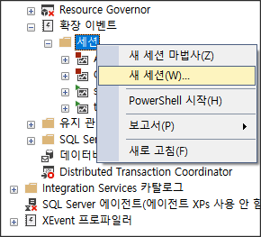  

    - 첫번째 :  새 세션의 일반 옵션
        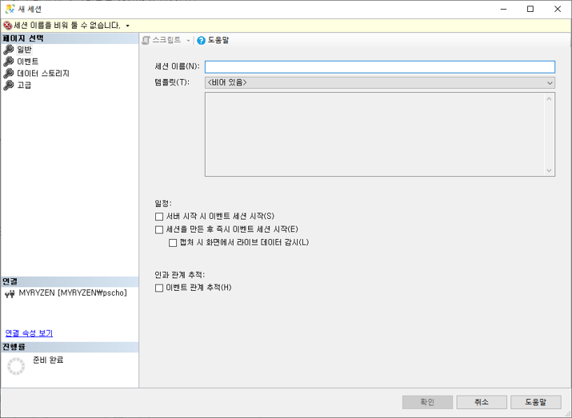
    
        이 화면에서 세션이름을 지정해 준다.  
        나중에 세션의 기능을 명확하게 알 수 있게 의미있는 짧은 이름을 지정하도록 하자.  
        또한 프로파일러의 경우처럼 미리 설정된 템플릿이 있는데 최소의 노력으로 세션을 만들 수 있다.          
        템플릿의 "쿼리 실행" 카테고리안에는 쿼리 튜닝과 연관된 5개가 템플릿이 이미 존재한다.

            a. 쿼리 일괄 처리 샘플링    : 활성 세션의 20%의  쿼리와 프로시저 이벤트 수집
                                         error_reported
                                         rpc_completed
                                         sql_batch_completed

            b. 쿼리 일괄 처리 추적      : 활성 세션 전체의 쿼리와 프로시저 이벤트 수집
                                         수집 이벤트는 위와 동일.

            c. 쿼리 정보 샘플링         : 활성 세션의 20%의 쿼리와 프로시저의 자세한 이벤트 수집. 스테이트먼트까지
                                         rpc_completed             (sp등 완료시)
                                         sql_batch_completed       (일반 쿼리 완료시)
                                         sp_statement_completed    (sp안의 각각의 스테이트먼트 완료시)
                                         sql_statement_completed   (sql 배치안에 각각의 스테이트먼트 완료시)
                                         module_end                (모듈 실행 끝)
                                         error_reported            (오류가 보고된 경우)

            d. 쿼리 정보 추적           : 활성 세션의 20%의 쿼리와 프로시저의 자세한 이벤트 수집. 스테이트먼트까지
                                         수집 이벤트는 위와 동일.

            f. 쿼리 대기 통계           : 활성 세션의 20%에 해당하는 
                                         쿼리, 프로시저의 starting과 completed,
                                         스테이트먼트의 completed, 
                                         대기 정보 수집.
                                         귀찮..

            c와 d는 스테이트먼트까지 수집하기 때문에 갯수가 몇배로 늘어났수 있다. XEvent가 오버헤드가 적다고 하지만
            cpu등 기타 수치 조심할 필요 있음.
            다행히 위의 템플릿 모두 데이터 스토리지를 ringbuffer로 해서 약간만 조심하면 될듯.

        프로파일러에서 자주 사용하는 항목들을 가져온 템플릿도 있다.  

        또한 2017에서 처음 소개되었지만 최소의 노력으로 빠르게 쿼리성능을 알 수 있는 방법이 하나 있다. 개체 탐색기의 아래부분에 XEvent 프로파일러라는 새로운 폴더가 있다. 폴더를 확장해보면 프로파일러에서 주로 보았던 것과 비슷하게 쿼리 모니터링을 정의한 두개의 확장 이벤트 세션(표준, TSQL)을 발견할 수 있다. 이번 장 뒤에서 라이브 데이터 감시라는 기능을 통해 함께 설명하겠다.  

        ```note
        세상에 공짜이면서 위험이 없는 일은 없다. 확장이벤트는 예전 프로파일러나 추적이벤트보다 시스템 정보를 수집하는 더 효과적인 메카니즘이긴 하나 소요 비용이나 위험이 전혀 없을 수는 없다. 이번 장의 뒤에서 좀더 자세히 설명하겠지만 이벤트나 몇몇 전역 필드들에 따라 확장 이벤트 운영에 영향을 줄수 있다. 그렇기 때문에 운영 시스템에 네거티브 영향을 주지 않게 하기 위해 충분히 신중하게 사전 테스트한 후 적용하자.  
        다른 장에서 설명할 쿼리 저장소는 2016부터 지원하는데, 시스템에 훨씬 적은 영향을 주면서 DMO들을 통해 많은 정보를 제공해 주는 좋은 친구이다. 이런 대체 방법은 몇가지 상황에서 유용 할수 있다.
        ```

        세션 만들기의 첫번째 화면에서 이름을 적는 이외에 몇가지 다른 옵션들이 있다.  
        - 서버 시작할때 자동으로 시작되도록 결정할 수도 있고  
        - 생성과 동시에 시작하고 라이브 데이터 감시를 바로 할수도 있다. 
        - 마지막으로 이벤트 관계 추적을 설정할 수도 있다.  

        이에 대한 자세한 설명은 뒤에서 한다.  


    - 두번째 : 이벤트 추가  
        다음 버튼을 눌러 두번째 화면인 이벤트 추가하는 창으로 넘어가자. 이벤트 라이브러리에는 원하는 이벤트의 일부만 쳐도 like 검색이 되어 편리하다.  
        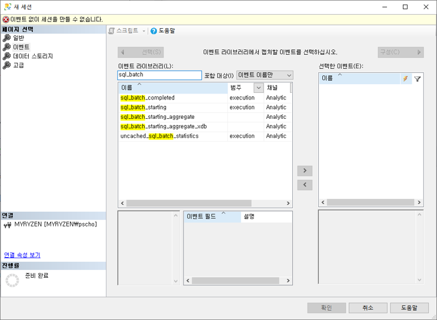{: width="85%"}  

        여기에는 **이벤트 대상, 이벤트 패키지, 이벤트 세션**등으로 구성되어 있는 이벤트 아키텍처가 존재한다. 하지만 GUI사용은 그런 세부사항에 대해 걱정하지 않게 해준다. 뒷부분에서 세션을 스크립팅하는 방법을 보여줄때 일부 아키텍처 부분들도 같이 설명한다.

        성능 분석을 위해서, SQL Server에서 수행되어지는 다양한 활동들이 여러가지 자원들에 얼마나 스트레스를 주는지 판단하는데 도움을 주는 이벤트들에 주로 관심을 가질 것이다. 리소스 스트레스란 다음을 의미한다.

            * 어떤 종류의 CPU 사용이 T-SQL 활동에 포함되나?
            * 얼마나 많은 메모리가 사용되나?
            * 얼마나 많은 I/O가 포함되나?
            * 얼마나 오래 SQL이 실행되나?
            * 얼마나 빈번하게 특정 쿼리가 실행되나?
            * 어떤 종류의 에러나 경고가 쿼리에서 발생하는지?

        우리는 이벤트가 종료해야 SQL에 의한 리소스 스트레스를 계산할 수 있다. 그래서 성능 분석에 사용하는 주된 이벤트들은 SQL 활동의 완료를 대표하는 것이다. 리스트는 다음과 같다.

        ```
        Event Category  Event                       설명
        --------------- --------------------------  --------------------------------------
        Execution       rpc_completed               원격 프로시저 호출 완료시. 주로 sp완료
                        sp_statement_completed      sp안의 sql 구문 1개 종료시
                        sql_batch_completed         T-SQL 일반 쿼리가 종료시
                        sql_statement_completed     T-SQL 일반 쿼리의 1개 sql 구문 종료시
        ```

        RPC 이벤트는 OLEDB명령어 통하여 원격 프로시저 호출(Remote Procedure Call) 메카니즘을 사용할때 발생한다. 데이터베이스 어플리케이션이 T-SQL의 Execute 구문을 통해 sp를 실행시킬 경우에는 RPC보다는 sql_batch로 해석된다.  
        (예: execute sp_who)

        T-SQL 배치는 SQL서버에 함께 보내지는 SQL쿼리들의 묶음이며 보통 GO 구문으로 나누어진다.
        ```sql
        UPDATE table1
        SET COL1 = 123
        WHERE tName = 'acpaa'

        SELECT *
        FROM table1
        GO
        ```
        2개의 T-SQL구문(statement)로 구성된 1개의 배치이다.

        GO 구문은 T-SQL 구문이 아니다. 대신에 GO구문으로 sqlcmd 유틸리티를 사용할때 1개의 배치로 인식하도록 해준다. 또한 ssms에서도 사용되며 1개의 단일 배치로 묶는다. 1개의 배치에 있는 각각의 SQL 쿼리는 T-SQL 구문(스테이트먼트)라고 부른다. 그러기에 T-SQL 배치는 1개 이상의 T-SQL 구문으로 구성된다. 구문 또는 T-SQL 구문은 각각 별개의 명령문이다. ***sp***_statement_completed와 ***sql***_statement_completed 이벤트는 1개 배치안의 개별 스테이트먼트가 많으면 많을 수록 더 많이 발생한다.  
        위 배치 예제는 다음과 같은 순서로 이벤트가 발생한다
        ```
        sql_statement_completed         <-- update 스테이트먼트
        sql_statement_completed         <-- select 스테이트먼트
        sql_batch_completed             <-- sql 배치 
        ```

        XEvent 세션 활동은 쿼리를 수집하는 행위와 수집완료한 쿼리 정보를 별도의 저장소(주로 로컬 하드디스크)에 저장하는 두가지 측면을 고려해야 한다. 프로시저안에 여러개의 sql구문이 있고 그 sql구문이 또 다른 프로시저를 호출하는 등의 경우가 있는 경우에는 시스템에서 분명하게 인식할 수 있을정도의 로드가 된다. 스테이트먼트를 완전하게 수집하는 행동의 영향은 크기와 수집하려하는 sql구문의 갯수에 의존한다. statement_completed  이벤트 수집은 특히 운영 시스템에서는 신중해야 한다. 그러기에 이런 이벤트들의 수집 개수를 제한하기 위해 필터를 사용해야 한다. 필터는 뒤에서 다룬다.

        세션에 이벤트를 추가하기 위해서 이벤트 라이브러리를 찾는다. 간단하다. 원하는 이벤트를 치면 like 검색이 되어 나타난다. 위의 그림에서 sql_batch를 치니까 결과가 여러개 나왔다. 원하는 이벤트를 더블클릭하거나 오른쪽 화살표를 누르면 오른쪽의 "선택한 이벤트" 영역으로 이동한다. 역시나 제거할 경우에도 더블클릭하거나 왼쪽 화살표를 누르면 "선택한 이벤트" 영역에서 제거된다. 

        표에 있는 이벤트 리스트들이 성능 수집할때 가장 많이 사용하는 이벤트들이지만 다른 측정항목을 수집하기 위해서 다양한 이벤트들을 추가할 수 있다. 예를 들면 1장에서 다루었던 반복되는 sp 재컴파일을 추적하기 위해 sql_statement_recompile을 추가하는 것처럼. 이벤트 라이브러리는 데이터베이스 워크로드와 같은 기타 성능 관련 이슈들을 수집하기 위한 추가적인 이벤트를 포함한다.  
        아래 표는 이런 종류의 몇가지 이벤트들이며 프로파일러에서 많이 본 익숙한 것들이다.

        ```
        Event Category  Event                           설명
        --------------  ------------------------------  -----------------------------------------------------------------
        Session         login                           SQL Server에 연결 또는 연결종료할때 발생
                        logout  
                        exisiting_connection            세션이벤트를 만들기 전에 이미 만들어져있는 연결 정보
        Erros           attention                       클라이언트에 의한 쿼리 취소 또는 시간 초과때문에 끊어진
                                                        데이터베이스 연결과 같이 요청의 중간 종료
                        error_reported                  에러가 보고될때 발생
                        execution_warning               sql구문에 대한 메모리 할당 대기가 1초이상 지속되거나
                                                        또는 메모리 할당이 실패하거나
                        hash_warning                    해시 연산에서 충분하지 않은 메모리 발생시. 어떤 연산이 에러 났는지
                                                        이해하기 위해서는 실행계획 캡처와 함께 수행해야
        Warning         missing_column_statistics       옵티마이저가 프로세싱 전략을 결정하기 위해 필요한 컬럼의 통계정보가 없을경우
                        missing_join_predicate          쿼리가 두개의 테이블간에 조인 예측전략 없이 실행되는 경우
                        sort_warning                    SELECT와 같은 쿼리에서 수행되는 정렬 연산할때 메모리가 부족할 경우
        Lock            lock_deadlock                   deadlock이 발생할때
                        lock_deadlock_chain             데드락을 만드는 쿼리 체인 추적을 보여준다.
                        lock_timeout                    SET LOCK_TIMEOUT (ms)가 세팅되었을때 그 시간 초과하는 경우
        Execution       sql_statement_recompile         sql구문 실행계획이 재컴파일되는 경우.          
                                                        1. 존재하지 않거나
                                                        2. 강제로 재컴파일
                                                        3. 이미 있지만 재사용되지 할수 없어
                                                        sql구문 레벨의 재컴파일. 배치레벨도 아닌 ad-hoc쿼리, sp, prepared sql구문
                                                        모두 아님.
                        rpc_starting                    sp 실행시. sp가 실행은 했지만 오래 걸려 종료되지 않았을 경우 시작시점을
                                                        알고 싶을때 사용.
                        query_post_comilation_showplan  SQL구문이 컴파일된 후 실행계획 보여줌
                        query_post_execution_showplan   SQL구문이 실행된 후 실행계획 보여줌. 실행통계 포함.
                                                        주의) 이 이벤트는 높은 비용이 될 수 있기에 적절한 필터를 설정해서 짧은기간
                                                        측정해야 한다.
        Transactions    sql_transaction                 데이터베이스 트랜잭션 정보 제공. 트랜잭션 시작, 종료, 롤백 정보포함.
        ```

- ### b. 전역 필드
    위에서 이벤트들을 다 선택했으면 구성 버튼을 눌러 각 이벤트의 세부 정보를 조절할 수 있다.
    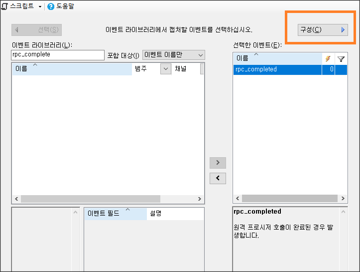{: width="70%"}    

    선택한 이벤트를 더블클릭하면 원하는 필드를 선택할 수 있다. 그 중 전역필드는 모든 이벤트에서 공통적으로 포함하는 속성을 선택하는 것이다.  
    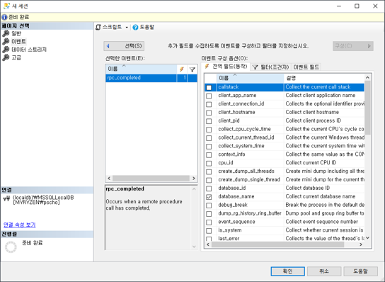  

    T-SQL에서 동작(액션)으로 불렸던 전역 필드는 이벤트에 주로 관련된 사용자, 실행계획, 추가 리소스 비용 그리고 소스 같은 이벤트의 여러가지 속성들이다. 프로파일러보다는 덜하지만 여러개를 추가할수록 이벤트 수집작업에 오버헤드가 추가된다. 

    수집할 속성을 추가하기 위해서 위의 그림처럼 전역 필드 항목중에서 선택하면 된다. 
    
    때때로 나쁜 성능의 원인을 진단하기 위해서 추가적인 항목들을 사용할 수 있다. 예를 들면 저장 프로시저 재컴파일의 경우 recompile_cause 이벤트를 통하여 문제를 일으키는 원인을 찾는다. 뒤에서 보다 자세히 설명(18장). 
    몇가지 일반적으로 사용되어지는 아래 항목들이 있다.

        * plan_handle
        * query_hash
        * query_plan_hash
        * database_id 또는 database_name
        * client_app_name
        * transation_id
        * session_id
        * sql_text
        * user_name

    전역필드는 이벤트 종류에 상관없이 공통적으로 존재하는 항목이기 때문에 각 이벤트마다 다르게 존재하는 속성들은 이벤트 필드의 부분에서 선택 가능하다. 예를 들면 binary_data 와 integer_data 이벤트 필드는 SQL Server 액티비티에 대해 추가적인 정보를 제공한다.
    또 예를 들면 커서의 경우에서 커서 요청의 타입과 커서 생성의 타입을 지정한다. 이럼 추가적인 필드들의 이름들은 더 큰 확장의 목적으로 지정되지만 뒷 장에서 이런 글로벌 필드들의 쓸데없음을 설명할 것이다. 

- ### c. 필터

    확장 이벤트 세션에서 이벤트와 동작들을 더 명확히 수집하기 위해서 다양한 필터 조건들을 설정하며 결과 갯수를 제한한다. 전역 필드(공통 속성)와 이벤트 필드(커스텀 속성)와 관하여 조건을 설정할수 있고 원하는 조건만 AND나 OR 연산자로 지정할 수 있다.  
    아래의 설정화면은 조금 헷갈리게 나오는데  그럴때는 스크립트로 출력해서 보다 명확하게 식별 가능하다. 연산자를 지정할때는 보다 적은, 같은, 보다 큰 연산자들을 사용할 수 있다.
    이 모든 조건들은 캡처되는 이벤트에 필터를 거는 것처럼 작동하며 나중에 수집된 결과물의 크기를 줄여주고 또한 분석할때도 보다 명확한 범위의 데이터만 하기 때문에 많은 시간을 줄여준다.
    
    아래 표는 성능 분석을 위해 일반적으로 사용되는 필터 조건들의 예제이다.

    ```
    Events                  Filter Sample   UseCategory  
    ----------------------  --------------  -----------------------------------------------  
    sqlserver.username      = user_apple    단일 사용자나 로그인으로 제한
    sqlserver.database_id   = 7             sp_helpdb에 나오는 데이터베이스id로 단일 데이터베이스 제한
    duration                >= 2000         많이 사용. 2000마이크로초(0.002) 이상 소요되는 것만 캡처되게 제한. 
                                            나는 보통 3000000(3초)처럼 초를 지정함.
    physical_reads          >=2             물리적 읽기가 2 이상인것만
    sqlserver.session_id    205             sp_who에서 나오는 세션id만
    ```

    아래 그림은 duration이 3초 이상이고 논리적 읽기가 50,000 이상이면서 세션id가 342것만 필터링  
    
    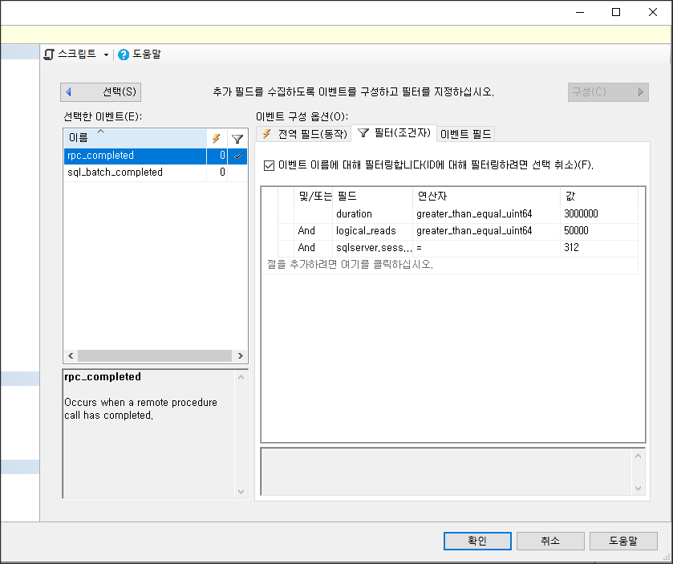{: width="85%"}  

    일반 비교연산자(>=)와 greater_than_equal_unit64가 따로 있다.  
    하나는 32bit int이고 하나는 부호없는 64비트 int인듯하여 본인은 항상 unit64를 쓴다.
  
- ### d. 이벤트 필드
    전역필드는 모든 이벤트들에서 선택할 수 있는 공통적인 속성들이지만 이벤트 필드는 특정 이벤트에서만 선택 가능한 커스텀 속성이다. 몇몇 이벤트 필드들은 선택여부를 결정해야 하지만 대부분은 자동으로 포함되어 있다. 아래는 우리가 선택할 수 있는 리스트.

    ```
    Data Column     설명
    --------------  ---------------------------------------------  
    statement       rpc_completed 이벤트에서만 있는 SQL 텍스트
    Batch_text      sql_batch 이벤트만 있는 SQL 텍스트
    cpu_time        마이크로세컨드 단위의 CPU 비용.
    logical_reads   논리적 읽기 갯수. 8K단위의 페이지 갯수
    Physical_reads  물리적 읽기 갯수. 8K단위의 페이지 갯수
    writes          논리적 쓰기 갯수. 8K단위의 페이지 갯수
    duration        마이크로초단위의 소요시간.
    ```

    각각의 논리적 읽기나 쓰기는 메모리에서 발생하는 페이지(8KB) 갯수이며 0 또는 그 이상의 물리적 I/O 연산과 함께 발생한다.  

    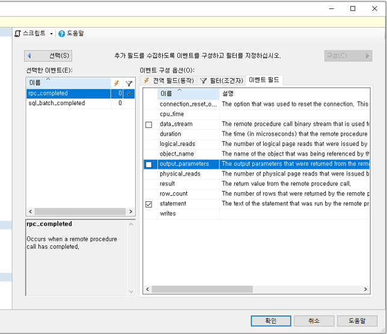{: width="85%"}  
    
    위 그림에서는 이벤트 필드중에서 선택할 수 있는 statement 가 체크되어 있다.

- ### e. 데이터 스토리지
    데이터 스토리지는 확장 이벤트 세션에 의해 수집되는 데이터들을 어디에 저장할지를 결정하는 화면이다. 출력 메카니즘은 출력 대상에 따라 다르다.  
    일반적으로 두가지 기본 선택지가 있다.   

        * 파일로 저장
        * 메모리 버퍼에 임시 저장

    7가지의 출력 형태가 있지만 대부분은 이책의 영역에서 벗어난다. 성능 정보를 수집하려는 목적으로는 두가지 기본 선택지인 event_file과 ring_buffer만으로도 충분하다. ring_buffer는 메모리를 소모하기 때문에 작은 출력 결과가 예상될때 선택해야 한다. 메모리상에서만 작동하기 때문에 버퍼는 시스템 메모리에 부담을 주지 않을 정도로 작게 유지 관리 되며 때문에 많은 용량의 출력이 예상되는 경우라면 버퍼의 데이터를 유실할 가능성이 높다. 쿼리 성능을 모니터링 하는 대부분의 경우 파일 출력(event_file)을 더 선호한다.  

    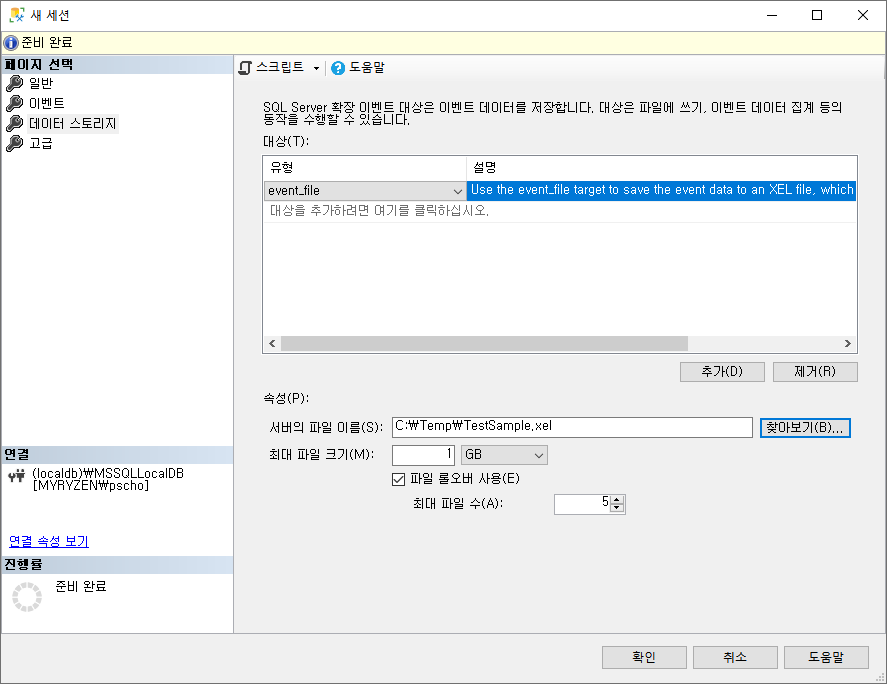{: width="85%"}  

    xel확장자로 저장되는데 그 외 추가적으로 결정해야 하는 옵션은 저장할 최대 파일 크기와 롤 오버 될 경우 최대 파일 수이다. 여기서는 파일 1개가 1GB 크기가 될 것이고 그 이상이면 추가적인 파일이 생성되며 그것도 최대 1GB까지 저장할 것이다. 최대 5개까지 파일 갯수가 되며 또 6번째 파일이 생성될 시점에 첫번째 파일이 삭제되는데 해당 세션이 종료되지 않는한 영원히 이 작동 방식이 유지된다.

- ### f. 세션 완료
    세션을 세팅하는 기본적인 절차는 다 끝났다.  
    고급 항목쪽은 있는데 대부분 수정하지 않고 그대로 사용한다. 완료를 누르면 세션이 만들어 지지만 자동 시작하지 않는다. 만약 첫 화면인 일반 탭에서 "세션을 만든 후 즉시 이벤트 세션 시작"을 선택했다면 생성 즉시 시작된다. 수동으로 시작/종료는 해당 세션이름을 오른쪽 마우스 클릭해서 하면 된다.
    세션이 시작이 되면 서버의 지정된 경로에 xel 파일이 바로 만들어지며 수집을 시작하게 된다. 또한 수집되고 있는 상황을 실시간으로 볼수 있는데 세션을 오른 마우스 클릭 "라이브 데이터 감시"를 선택하면 된다.  
    새 창이 열리며 실시간으로 감시 데이터들이 보여지게 된다. 

    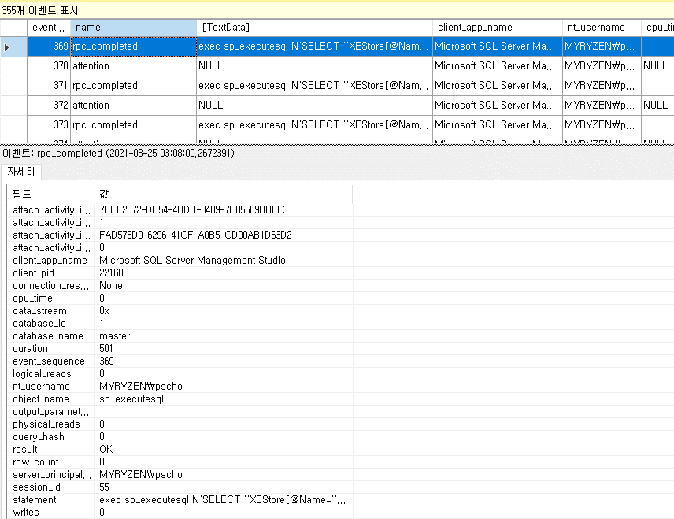{: width="85%"}  

    실시간으로 출력되는 로우중 하나를 선택하면 아래쪽에 좀더 자세한 정보들이 보여진다. 이 추가 정보들은 뒤에서 좀더 자세히 다룰 것이다. 위쪽영역에서 name 이렇게 컬럼 제목이 표시되는 곳에서 오른쪽 마우스 클릭하면 "열 선택" 하면 추가적으로 보여질 컬럼들을 선택하게 된다. 

    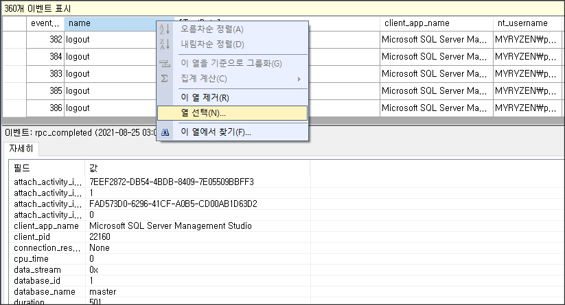{: width="85%"} 

    "라이브 데이터 감시"가 유용한 이유는 실시간으로 보여지는 데이터에서 또 필터를 걸어서 결과 갯수를 조절할 수 있기 때문이다.  
    메뉴 항목에 파일 / 편집 / 보기 옆에 확장 이벤트 라고 새로 생겼을 것이다. 거기서 필터를 선택하면 서버에서 보내오는 정보를 내 컴퓨터에서 한번 더 다양한 조건을 걸어 제한하여 볼수 있다. 도구 모음에도 확장이벤트에 관련된 버튼들이 추가되어 거기서도 필터 버튼을 누를수 있다. 
    이렇게 실시간으로 조사를 한 후 결과를 xel 파일로 저장 할 수도 있다. 메뉴 확장 이벤트의 내보내기 / XEL 파일을 선택하면 된다. 이경우 장점은 보통 세션수집이 완료되려면 몇시간 동안 기다려야 하는데 "라이브 데이터 감시"를 통해서는 바로 수집된 데이터가 보여지기 때문에 보다 능동적으로 대처할 수 있게 된다.

    비주얼 스튜디오나 SSMS 편집기를 많이 써본 사람들은 책갈피의 유용성을 알 것인데 여기서도 책갈피를 지정할 수도 있다. 또한 프로파일러에서 많이 사용했던 그룹화나 집계기능들도 역시 있다.
    화면이 실시간으로 갱신되기 때문에 분석에 불편하다면 잠시 데이터 피드를 중지할 수 있다. 피드를 다시 시작하면 현재 수집된 데이터가 내 화면에서 사라지고 다시 "라이브 데이터 감시"를 하게 되는것이다. 서버에서 수집되는 것은 전혀 영향이 없고 내 SSMS에서만 변한다.

- ### g. 내장 system_health 세션
    SQL Server에 기본으로 내장된 system_health 세션이 있다. SQL Server 작동에 필요한 기본적인 항목들(오류나 몇가지 정보)을 모니터링 하고 있기 때문에 유용하다. 
    예를 들면 데드락의 전체 정보들이 저장된다. 
    system_health 세션은 우리가 데드락같은 기본적인 모니터링 항목을 수집하기 위하여 별도 작업을 할 필요가 없게 해준다.

    또한 15초 이상 래치에서 대기하고 있는 세션들의  session_id와 sql_text도 수집하고 있다. 이 정보들은 튜닝에 필요한 쿼리를 식별하는데 유용하다. 
    또한 lock을 위해 30초 이상 대기하고 있는 session_id와 sql_text도 얻을 수았다. 

    매우 유용한 세션이기 때문에 제거하는것은 추천하지 않는다.

    출력형태는 2가지이고 파일과 링버퍼.

        - 파일 : 최대 크기 5MB, 롤오버 갯수는 4개이다. 파일기본 저장위치는 기본위치. 아래 쿼리로도 확인가능.
            SELECT path
            FROM sys.dm_os_server_diagnostics_log_configurations;
        
        - 링버퍼 : 이벤트 수는 5000개이며 최대 메모리 크기는 4MB

## <font color='dodgerblue' size="6">2) 확장 이벤트 자동화</font>
GUI는 확장 이벤트 세션을 쉽게 만들어 주는 좋은 도구이지만 아쉽게도 서버가 여러개 일때는 추천하는 방법은 아니다. 다중 서버에서 동일한 종류의 확장 이벤트 세션을 만들려면 일일이 각각 접속해서 수행해야 한다. 그렇기 때문에 t-sql 명령문을 통해 수행하면 보다 수월하다.

- ### a. GUI를 통해 세션 스크립트 추출
    GUI의 세션 생성 화면에서 T-SQL스크립트를 추출할 수 있다.

     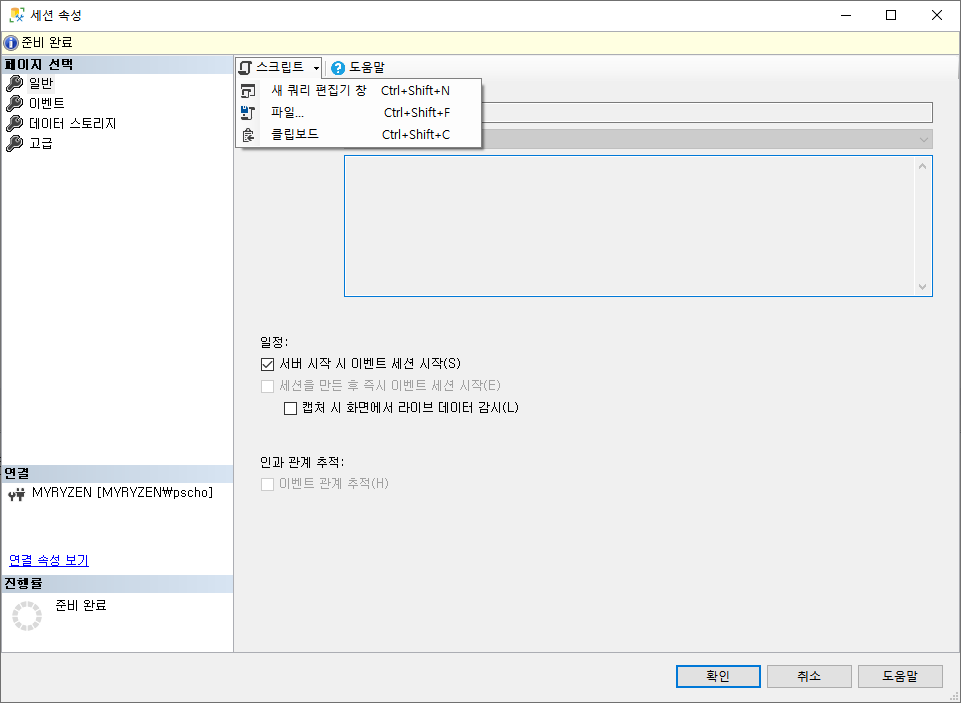{: width="85%"} 

    또한 생성된 세션을 T-SQL로 시작 또는 중지할수 있다  

    ```sql
    -- 생성된 세션 시작
    ALTER EVENT SESSION QueryMetrics    ON SERVER
    STATE = START;
    ```

    SQL Agent 를 통해 이런 작업들을 자동화 할수 있고 또는 sqlcmd.exe를 이용할 수도 있다. 어찌됐든 가장 마지막 작업은 세션을 시작하는 것이다. 중지할때도 위 스크립트에서 START를 STOP으로 바꾸면 된다.

- ### b. T-SQL 로 세션 만들기

    ```sql
    CREATE EVENT SESSION [SessionSample] ON SERVER 
    ADD EVENT sqlserver.rpc_completed(SET collect_statement=(1)
        ACTION(sqlserver.client_hostname,sqlserver.sql_text)
        WHERE ([duration]>(3000000)))
    ADD TARGET package0.event_file(SET filename=N'SessionSample')
    WITH
    (
        MAX_MEMORY = 4096KB
    )
    GO
    
    - CREATE EVENT SESSION  : [SessionSample]라는 이름의 세션 만들기
    - ADD EVENT             : rpc_completed 이벤트 (주로 sp) 추가
    - SET collect_statement : statement는 rpc_completed만 있는 옵션 이벤트 필드인데 1인것 보니 선택됨.
    - WHERE                 : duration이 3000000(3초) 이상인 것만
    - ADD TARGET            : 파일형태의 출력이고 C:\temp\sessionsample_xxxxx.xel 로 만들어질것임
    - WITH                  : 고급 옵션을 지정. 이 세션의 처리할 임시 메모리 MAX_MEMORY = 4096KB
    ```
    
    세션이 시작되면 서버단에서 작동되며 다음 DMV로 확인 가능.

        - sys.dm_xe_sessions        : 활성화된 확장 이벤트 세션들만 보임
        - sys.server_event_sessions : 모든 확장 이벤트 세션들. 활성/비활성 모두

    다음 명령어로 세션 중지하면 sys.dm_xe_sessions에서 사라진다.  
    ```sql
    ALTER EVENT SESSION QueryMetrics ON SERVER
    STATE = STOP;
    ```    

    ```note
    확장 이벤트 세션에서 수집되는 모든 시간 정보는 마이크로세컨드 단위이지 밀리세컨드가 아니다. 필터 설정할때 조심하자.
    ```

- ### c. 인과 관계 추적
    GUI나 T-SQL 명령문에서 세션을 정의하는 것은 간단하다. 하지만 대부분 실무에서 문제점은 단일 배치 명령문이나 단일 SP가 아닐 것이다. 궁극적으로는 그 프로시저나 배치안에서 작동하는 각각의 sql구문들까지 원한다. 재컴파일, 대기, 정렬상황은 단일 프로시저가 아닌 안에 담겨있는 각각의 스테이트먼트로 인하여 영향을 받는다. 그러므로 단일 sp나 스테이트먼트와 연관된 인과관계 추적이 필요한다.

    GUI에서는 "인과 관계 추적"이며 T-SQL에서는 TRACK_CAUSALITY 를 체크하면 된다.

    ```sql
    CREATE EVENT SESSION [SessionSample] ON SERVER 
    ADD EVENT sqlserver.rpc_completed(SET collect_statement=(1)
        ACTION(sqlserver.client_hostname,sqlserver.sql_text)
        WHERE ([duration]>(3000000)))
    ADD TARGET package0.event_file(SET filename=N'c:\temp\SessionSample')
    WITH (TRACK_CAUSALITY=ON)  -- 인과관계 추적 켜기
    GO
    ```

## <font color='dodgerblue' size="6">3. 확장 이벤트 권고사항 </font>
확장 이벤트는 프로그래밍적으로 정보를 수집하는 방법에서는 오버헤드를 걱정해야 했던 기존 프로파일러와 추적 이벤트와 비하면 최고의 솔루션이다. 기존에는 오버헤드를 줄이기 위해 수집하려는 이벤트나 필드의 개수를 제한해야 하는 등의 많은 고민 사항이 있었다. 그러나 이전에도 언급했듯 기존에 비해서 매우 적어지긴 했지만 오버헤드가 전혀 없을 수는 없다. 다음과 같은 주의사항이 있다

    a. 최대 파일 크기를 적절하게 구성
    b. 디버그 이벤트와 조심하자
    c. No_Event_Loss 의 사용 피하기    

- ### a. 최대 파일 크기를 적절하게 구성
    디폴트 파일 사이즈는 1GB이다. 확장이벤트가 수집할수 있는 항목들에 비해서는 매우 적은 크기이다. 이 크기를 더 크게 설정하는 것은 좋은 생각이다. 하지만 너무 크게 설정하면 버퍼가 차는 동안 신규 파일 생성을 기다리는 경우 이벤트 누락이 발생 할 수 있다. 그러나 이는 시스템에 따라 다르다. 좋은 시스템을 가지고 있다면 각각의 환경에 맞게 파일 크기를 적절하게 구성하라.

- ### b. 디버그 이벤트에 주의
    확장 이벤트는 기존의 추적 이벤트에서 가능했던 것에 추가적으로 많은 방법을 제공하여 SQL Server와 내부적 활동을 관찰하는 내부 메카니즘을 제공한다. 또한 Microsoft는 SQL Server를 트러블슈팅할때도 같은 기능을 사용한다. 다수의 이벤트들은 SQL Server의 디버깅과 관련이 있다. 이들은 마법사를 통해서는 기본적으로 사용 불가능하다. 그러나 t-sql 명령어와 세션 편집기 창에서 채널 선택을 통해 접근 가능하다. 

    마이크로소프트의 직접적인 가이드없이는 사용하지 말라. 마이크로소프트 내부적으로만 사용하기 위하여 언급했던 주제들이 있다. 실험정신을 느낀다면 브레이크 액션을 포함하여 어떤 이벤트에 대한 신중한 접급이 필요하다. 이말은 이벤트가 작동되면 해당 코드가 적중되는 라인에 도달할 경우 SQL Server는 정지할 것이다. 이는 서버가 완전히 오프라인이 될것이며 알수없는 상태가 된다는 말이다. 프로덕션 서버에서 이를 행한다면 대규모 중단이 발생할 수 있으며 대규모 데이터 손실과 충돌이 된다.

    그러나 모두 중단 조치로 이어지는 것은 아니며 일부는 사용을 권장하기도 합니다. 한가지 예로 query_thread_profile 이벤트이다. 이것을 실행하면 간단한 방식으로 라이브 실행 계획 이벤트를 캡처할 수 있다. 뒤에서 실행 계획을 다룰때 보다 자세히 설명할 것이다.

- ### c. No_Event_Loss 사용 피하기
    확장 이벤트는 몇몇 이벤트 누락이 될 수도 있게 설정되어 있다. 만약 No_Event_Loss 세팅을 하면 심한 로드가 있는 시스템의 경우 버퍼에서 정보를 유지하기 위해 중요한 추가적인 로드가 생길수도 있다. 정말 필요한 경우가 있기는 하지만 우리들은 대부분 평생 사용하지 않겠지.

## <font color='dodgerblue' size="6">4. 쿼리 성능 측정치를 위한 다른 방법들 </font>
확장 이벤트 세션은 추후 분석을 위하여 다양한 데이터를 수집할 수 있게 해준다. 그러나 수집활동은 품이 많이 드는 작업이다. 또한 결과가 완료되길 기다려야 한며 대량의 데이터를 처리, 분석해야 한다. 이에 비하여 소규모의  또다른 메카니즘이 존재하는데 쿼리 저장소이며 뒷장에서 보다 자세히 다룰 것이다.  
확장이벤트에서 수집완료를 기다리지 않고 즉시 성능을 캡처하는 방법은 DMV sys.dm_exec_query_stats와 sys.dm_exec_procedure_stats 사용하는 것이다. 히스토리 추적과 쿼리 실행 시간, 개별 비용 측정에는 여전히 확장 이벤트가 최고의 도구이지만 지금 이순간 장기 실행 쿼리나 대량의 물리적 읽기발생을 알고 싶다면 이 2개의  DMV를 이용해 정보를 얻을 수 있다. 그러나 이 객체의 데이터는 캐시에 남아 있는 쿼리 플랜에 의존한다. 플랜이 캐시에서 방출되면 데이터도 날라간다. sys.dm_exec_query_stats DMO는 저장프로시저를 포함한 모든 쿼리의 결과를 리턴한다. 그러나 sys.dm_exec_procedure_stats는 오로지 저장 프로시저만 리턴한다. 

이 두개의 DMV는 단순한 뷰이기 때문에 간단하게 서버의 플랜에서 쿼리들의 통계에 대한 정보를 얻는다. 아래 표는 sys.dm_exec_query_stats DMO에서 얻을 수 있는 정보들이다.

    Column                          설명
    ------------------------------  ------------------------
    Plan_handle                     실행계획에서 언급하고 있는 포인터
    Creation_time                   플랜이 만들어진 시간
    Last_execution_time             플랜이 쿼리에서 사용된 최종 시간
    Execution_count                 플랜이 사용된 횟수
    Total_worker_time               생성된 이후 플랜에서 사용된 총 CPU 시간
    Total_logical_reads             플랜이 생성된 이후 읽기 총 횟수
    Total_logical_writes            플랜이 생성된 이후 쓰기 총 횟수
    Query_hash                      같은 로직을 가진 쿼리를 식별하기 위해 사용되어지는 바이너리 해시    
    Query_plan_hash                 같은 로직을 가진 플랜을 식별하기 위해 사용되어지는 바이너리 해시    
    Max_dop                         쿼리에서 사용된 max degree of parallelism
    Max_columnstore_segment_skips   컬러스토어에서 쿼리 동안 스킵된 세그먼트의 개수

sys.dm_exec_query_stats에서 보여지는 정보를 필터하기 위해서 sys.dm_exec_sql_text와 같은 DMF를 조인할 필요가 있다. 이 함수는 플랜과 연관된 쿼리를 보여준다. 또는 쿼리의 실행계획인 sys.dm_query_plan . 일단 이런 DMO와 조인하면 원하는 데이터베이스나 프로시저를 필터링 할수있다. 이런 종류의 다른 DMO들은 뒷장에서 자세히 다룰 것이다. 여기서는 sys.dm_exec_query_stats와 다른 것들의 사용 예제를 섞어서 나머지 부분에서 보여준다. 이런 쿼리들은 캐시에 의존한다는 것에 주의하자. 실행계획이 캐시밖으로 방출되면 이 정보도 사라진다.


## <font color='dodgerblue' size="6">5. 요약 </font>
이번 장에서는 대량의 부하를 발생시키는 쿼리들을 식별하기 위해 확장이벤트를 설명했다.

확장이벤트 세션을 만들고 수집하는 절차는 시스템 저장 프로시저를 사용해 자동화 하는것이 좋다.

실행중인 쿼리에 대한 통계에 즉각적인 접근하기 위해 DMV sys.dm_exec_query_stats를 사용해라

이제 실행된 쿼리에 대한 성능데이터를 수집하는 메커니즘이 있으므로 다음 장에서는 이러한 측정 도구에 의존할 필요가 없도록 쿼리가 실행될 때마다 쿼리에 대한 정보를 수집하는 방법을 탐색할 것이다.